# 如何从头开始生成随机变量(不使用库)

> 原文：<https://towardsdatascience.com/how-to-generate-random-variables-from-scratch-no-library-used-4b71eb3c8dc7?source=collection_archive---------7----------------------->

## 我们将通过一个简单的伪随机生成器算法，展示如何使用它来生成重要的随机变量

[图片来源](https://pixabay.com/photos/cube-roll-the-dice-play-sweepstakes-2031511/) : Pixabay(免费用于商业用途)

# 介绍

[随机变量](https://en.wikipedia.org/wiki/Random_variable)是数据科学、机器学习和统计建模不可或缺的一部分。它们在我们周围采用人工智能或深度神经网络的系统和服务中发挥着越来越重要的作用。

随机变量的概念和性质用于

*   回归技术，
*   像随机森林，梯度推进，
*   深度学习，
*   聚类算法，
*   自然语言处理，
*   强化学习，
*   人工智能和博弈论中的高级搜索算法。

这篇文章不是关于随机变量的属性和效用。为此，鼓励读者参考其他优秀资源。

 [## 理解随机变量

### 随机变量在统计学和概率学中非常重要，如果任何人想要…

towardsdatascience.com](/understanding-random-variable-a618a2e99b93)  [## 深度学习背景下的概率统计解释

### 这篇文章是为希望获得概率和统计知识的深度学习初学者而写的。

towardsdatascience.com](/probability-and-statistics-explained-in-the-context-of-deep-learning-ed1509b2eb3f) 

这篇文章旨在展示如何通过简单的编程从零开始生成随机变量**。**

**注意短语“从零开始*”。意思是**我们不会调用第三方库或者子程序。相反，我们**将编写我们自己的简单函数来生成这样的随机变量。***

*****你能做到以下几点吗？*****

*   ***加法、乘法、除法和模数***
*   ***正弦、余弦和对数运算***

***我们将展示如何使用这些基本的数学运算来生成，***

*   ***均匀随机变量***
*   ***指数分布的随机变量***
*   ***正态分布的随机变量***

***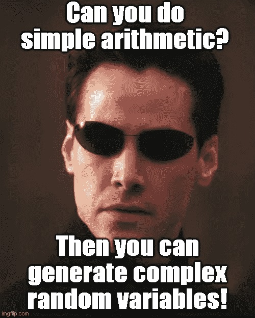***

***图片来源:imgflip.com 作者生成的模因***

***这个练习将让你对我们必须使用的伪随机数的质量有一个直观的了解，并且展示常见的概率分布是如何从一个发展到另一个的。***

***等等，我说的是“**伪**-随机”吗？让我们看看我是什么意思。***

# ***在软件领域，你必须拥抱“伪”***

***大自然母亲提供了许多真实随机过程的例子。核衰变就是这样一个例子。***

***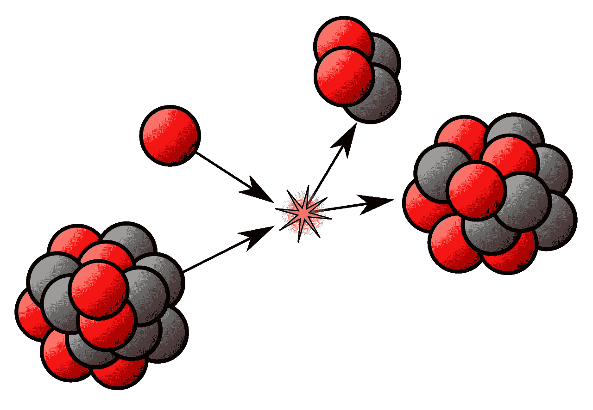***

***[图片来源](https://en.wikipedia.org/wiki/Radioactive_decay#/media/File:NuclearReaction.svg):维基媒体(知识共享许可)***

***原来真正的随机过程只能用所谓的 [**硬件随机发生器**](https://en.wikipedia.org/wiki/Hardware_random_number_generator) **，****一种从物理过程中产生随机数的设备来模拟和建模，而不是通过算法**。这种设备通常基于产生低水平随机“噪声”信号的量子力学现象，例如热噪声、光电效应、光束干涉和其他量子现象。***

***不幸的是，在日常计算系统中，以及在算法设置中，我们只遇到所谓的[’**伪随机数**](https://en.wikipedia.org/wiki/Pseudorandom_number_generator) 。它们不像自然过程那样是真正随机的，在某种程度上，它们是确定的。一个[种子数被提供给一个算法](https://pynative.com/python-random-seed/)，该算法生成一系列这样的数。***

*** [## 随机的。ORG -随机性和随机数介绍

### 本页解释了为什么很难(也很有趣)让计算机产生合适的随机数。

www.random.org](https://www.random.org/randomness/) 

一个非常有名的人对这种方法说了这样的话！

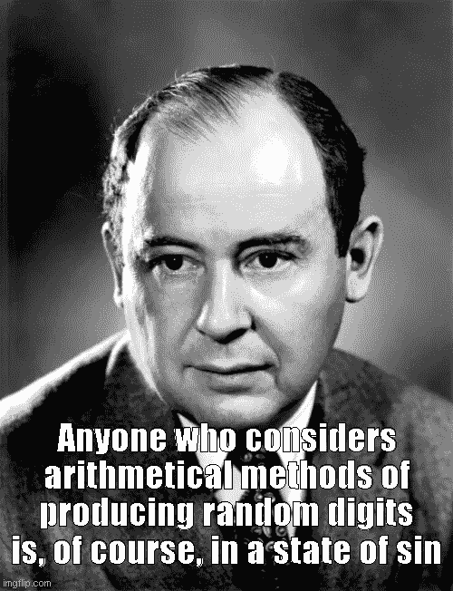

图片来源:作者在 imgflip.com 创作的带有[维基百科图片](https://en.wikipedia.org/wiki/File:JohnvonNeumann-LosAlamos.gif)的模因

然而，对于所有实际的计算目的，如果这些“伪随机数”不表现出明显的重复模式或可预测性，它们就足够了。

所有主要的编程语言中都有复杂而精致的伪随机生成器。在许多情况下，他们使用特殊类型的数学，如 [**模运算**](https://en.wikipedia.org/wiki/Modular_arithmetic) 或 [**马森纽斯特**](https://en.wikipedia.org/wiki/Mersenne_Twister) 。下面以 Python 的`[**random**](https://docs.python.org/3/library/random.html)` [模块的链接为例。](https://docs.python.org/3/library/random.html)

围绕用于加密系统的 [**密码安全伪随机发生器**](https://en.wikipedia.org/wiki/Cryptographically_secure_pseudorandom_number_generator) 还有一个完全独立的研发分支。想象一下，如果有人能猜出或梳理出为您的 Google 密码生成散列密钥的确切算法，会发生什么？

 [## 为什么安全系统需要随机数

### 如果你一直在关注最近关于美国国家安全局和英国政府进行技术间谍活动的新闻…

blog.cloudflare.com](https://blog.cloudflare.com/why-randomness-matters/) 

但是我们不关心如此复杂的事情！

在本文中，我们将借助基本的数学运算编写一个非常简单的程序来构建我们的随机生成器。实际上，我们将使用一种叫做 [**线性同余生成器**](https://en.wikipedia.org/wiki/Linear_congruential_generator) 的方法，这种方法在伪随机生成的旧时代很流行。

我们程序的输出将采取简单的 [**均匀分布**](https://en.wikipedia.org/wiki/Uniform_distribution_(continuous)) 的形式。此后，我们将根据这个随机发生器，使用统计定理和变换来产生对应于其他分布的随机变量。

# 均匀随机发生器

## 线性同余发生器(“坏”版本)

我们将使用如下的线性递归关系，

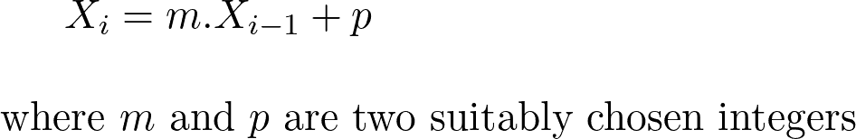

并且，均匀随机变量是在缩放之后获得的，

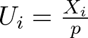

我们还需要一个种子号来开始生成过程。这里有一个简单的 Python 函数来完成这个任务，

到目前为止，我们所做的只是一些乘法、加法、模数和除法。很简单的算术，对吧？

让我们看看这个简单的函数是如何执行的。注意，我们命名为`pseudo_uniform_bad`是因为我们知道乘数和模数的选择相当糟糕。

让我来说明我的意思。让我们用`seed=3`生成 1000 个随机数，并绘制它们的直方图来查看分布。

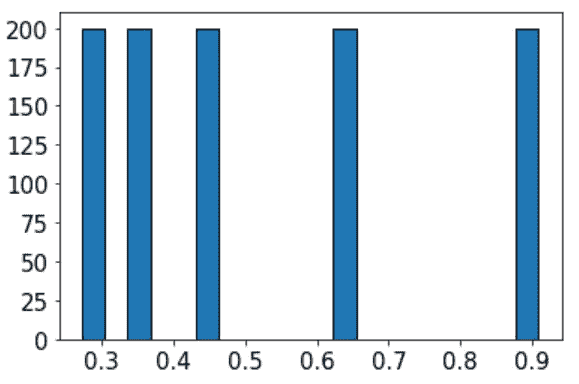

不太好，嗯？我们期望看到 0 和 1 之间的均匀分布，但却得到了一些数字补丁。

事实证明，我们可以很容易地通过改变乘数和模整数来改善它。

## 线性同余发生器(更好的版本)

让我们放大这些整数的大小。

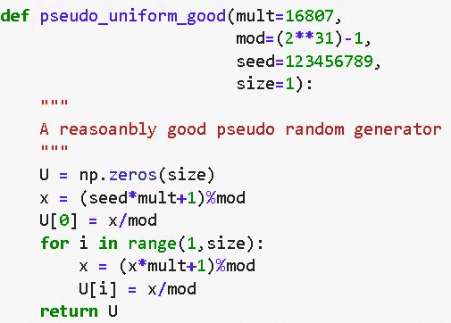

现在，如果我们生成 10，000 个随机数，并绘制它们直方图，看起来如下:

## 广义均匀随机发生器

现在，构造广义均匀随机发生器函数是非常容易的，

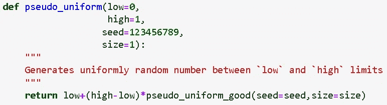

这里有一万个-5 到+7 之间的均匀随机分布的数。

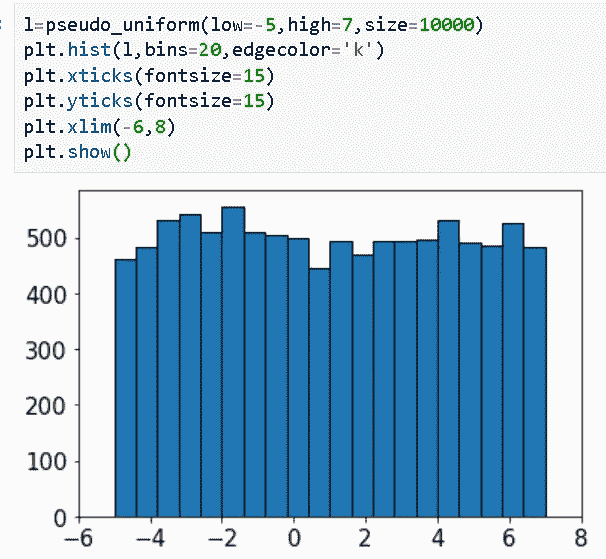

# 其他随机函数和分布

既然我们可以编写一个像样的均匀随机生成器，我们可以很容易地扩展它，为大量的统计分布构造随机变量生成器。

## 样品拾取器

例如，使用 uniform generator，我们可以快速制作一个样本选取器，它将从给定的项目列表中选取一个随机样本(不需要数字，任何类型的对象都可以)。

注意，我们还使用当前系统时钟返回的浮点值的小数部分作为该函数的种子。

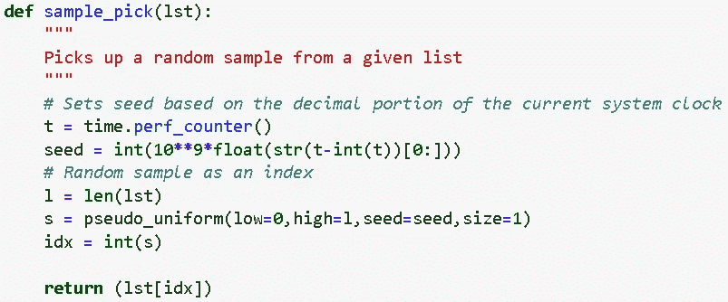

我们可以用一个公平掷骰子的模拟来测试它，掷骰子的六个面作为列表传递给函数，

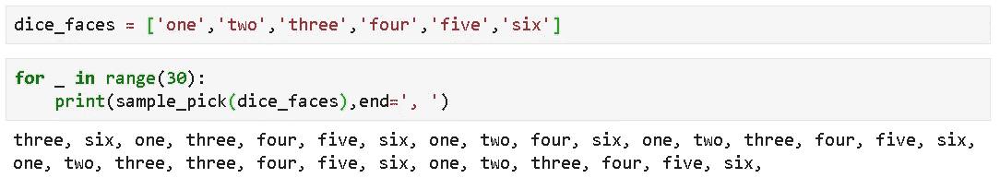

## 伯努利分布

这是一个离散的[概率分布](https://en.wikipedia.org/wiki/Bernoulli_distribution)，它可以被认为是任何一个提出是非问题的实验的一组可能结果的模型。单个参数表示为***p***——成功的概率。

我们的伯努利生成器代码看似简单，

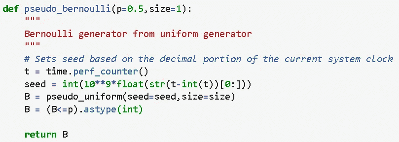

## 二项分布

它是一系列 *n 个*独立实验中特定数量成功的离散[概率分布](https://en.wikipedia.org/wiki/Binomial_distribution)，每个实验都提出一个是非问题，并且每个实验都有自己的布尔值结果:成功概率 ***p*** 或失败概率***q***= 1***p***。

我们可以很容易地从均匀发生器中编码出一个二项随机变量发生器，

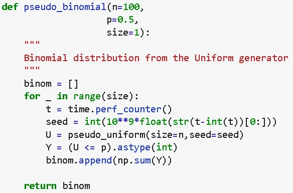

假设翻转 100 个装载的硬币，每个硬币的头部概率为 0.75，这样的尝试/实验重复 15 次。每个实验中的头数由我们的函数给出，

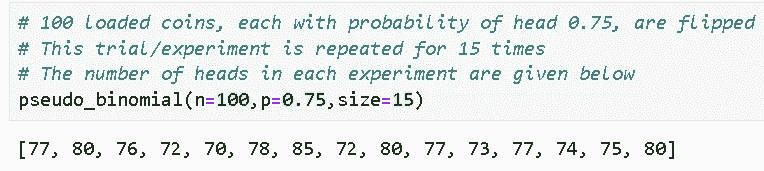

## 泊松分布

它是一个离散的[概率分布](https://en.wikipedia.org/wiki/Poisson_distribution)，表示在固定的时间或空间间隔内发生的给定数量的事件的概率，如果这些事件以已知的恒定平均速率发生，并且独立于自上次事件以来的时间。

我们可以使用我们的统一生成器来编码泊松生成器，如下所示，

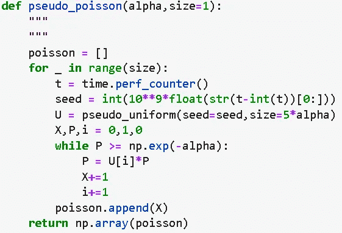

下面显示了三个不同速率参数的模拟结果，其中使用上面的函数产生了 10，000 个随机变量，并且绘制了事件的计数，

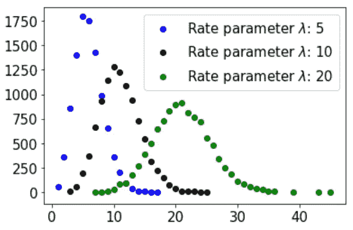

## 指数分布

是一个[泊松点过程](https://en.wikipedia.org/wiki/Poisson_point_process)中事件之间时间的连续[概率分布](https://en.wikipedia.org/wiki/Exponential_distribution)，即事件以恒定的平均速率连续独立发生的过程。

为了从均匀分布生成指数分布，我们可以使用一种称为“ [**逆变换方法**](https://en.wikipedia.org/wiki/Inverse_transform_sampling) ”的强大技术。我们不需要在这里详述理论细节，但最终这种方法通过简单的数学变换将两种类型的分布联系起来。

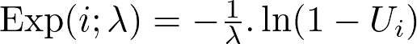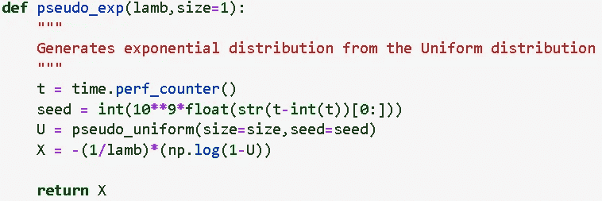

这是一个 10，000 个随机变量的直方图，比率参数为 0.1，

## 正态分布

[正态或高斯分布](https://en.wikipedia.org/wiki/Normal_distribution)毫无疑问是最著名的统计分布(主要是因为它与[中心极限定理](https://en.wikipedia.org/wiki/Central_limit_theorem)的联系)。

事实证明，使用一种叫做 [**Box-Muller 变换**](https://en.wikipedia.org/wiki/Box%E2%80%93Muller_transform) 的特殊方法，我们可以从均匀随机生成器生成正态分布的随机变量。

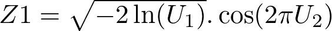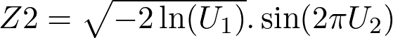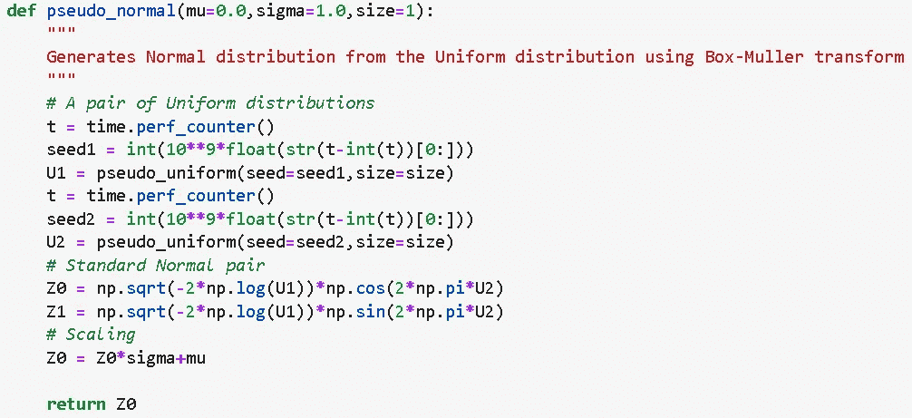

这是三组不同参数的模拟结果，

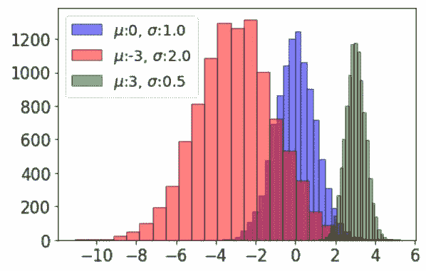

# 摘要

在本文中，我们展示了如何从一个简单的线性同余生成器开始，通过简单的编程来生成均匀分布的随机数。此后，我们展示了如何使用基本的数学运算和转换从这个基础生成器构建一个更复杂的统计分布集。

**我们能够为多种广泛使用的概率分布构建函数，而无需使用任何标准库**，如 NumPy 包的`**np.random**`模块。

如果你已经走到这一步，这里有一个来自 Cloudflare 的有趣视频，它在旧金山的办公室使用一系列熔岩灯，为他们的加密系统产生随机性。

A lso，你可以查看作者的 [**GitHub**](https://github.com/tirthajyoti?tab=repositories) **知识库**获取机器学习和数据科学方面的代码、思想和资源。如果你和我一样，对人工智能/机器学习/数据科学充满热情，请随时[在 LinkedIn 上添加我](https://www.linkedin.com/in/tirthajyoti-sarkar-2127aa7/)或[在 Twitter 上关注我](https://twitter.com/tirthajyotiS)。

 [## Tirthajyoti Sarkar - Sr .首席工程师-半导体、人工智能、机器学习- ON…

### 通过写作使数据科学/ML 概念易于理解:https://medium.com/@tirthajyoti 开源和有趣…

www.linkedin.com](https://www.linkedin.com/in/tirthajyoti-sarkar-2127aa7/)***