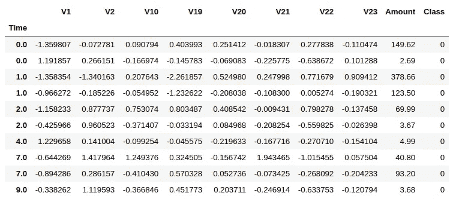
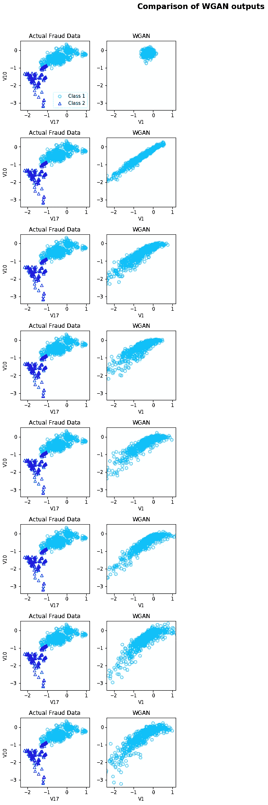
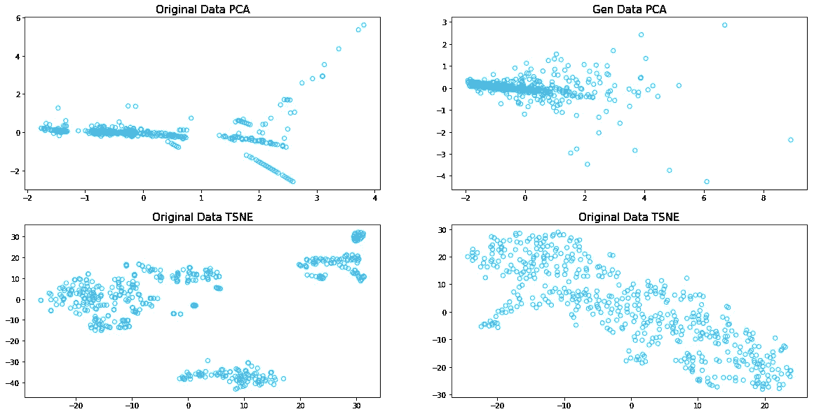
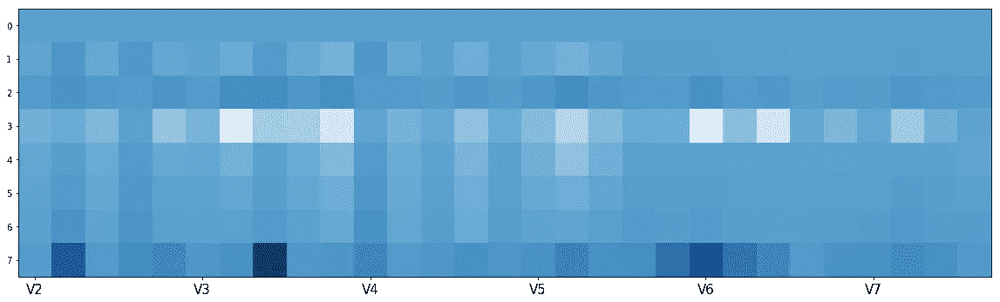

# 如何生成合成表格数据？

> 原文：<https://towardsdatascience.com/how-to-generate-synthetic-tabular-data-bcde7c28038a?source=collection_archive---------20----------------------->

## 生成敌对网络的 Wasserstein 损失

在过去的一篇博客文章中，我已经介绍了什么是生成性对抗网络，以及我们如何使用它们来生成设计为私有的数据，在这篇文章中，我介绍了 T2 的普通 GAN 和条件 GAN。但是，尽管非常有前景，但这些生成性对抗网络的训练非常具有挑战性，并且它们生成的数据没有足够的质量用于 ML 工作负载作为真实数据的替代。还有许多其他有趣的 GAN 架构，其中一些引入了更稳定的训练和更少的模式崩溃倾向的改进，今天我将涵盖 [Wasserstein GAN](https://arxiv.org/pdf/1701.07875.pdf) 。

# 瓦瑟斯坦·甘

Wasserstein GAN 被认为是 Ian good fellow 提出的生成性对抗网络的延伸。WGAN 是由 Martin Arjovsky 在 2017 年推出的，承诺在训练模型时提高稳定性，并引入能够与生成事件的质量相关联的损失函数。*听起来不错吧*？但是和 WGAN 引入的核心区别是什么？

## WGAN 有什么新功能？

GAN 没有使用“鉴别器”的概念来分类或预测某个生成事件的真实或虚假的概率，而是引入了“评论家”的概念，简而言之，该概念对给定事件的真实或虚假进行评分。这种变化主要是由于当训练生成器时，理论上我们应该寻求在训练数据集中观察到的数据分布和在生成的例子中观察到的分布之间的距离的最小化。

我们可以将 WGAN 引入的主要差异总结如下:

1.  使用从 Wasserstein 距离导出的新损失函数。
2.  critic 函数每次梯度更新后，将权重箝位在一个小的固定范围内，[-c，c]。这允许实施 Lipschitz 约束。
3.  向歧视者——批评家提出的替代方案。
4.  使用线性激活函数作为 Critic 网络的输出线性。
5.  生成器和评论家网络的更新次数不同。

## 好处

前面提到的和 WGAN 引入的变化在训练这些网络时带来了一系列好处:

*   与例如最初提出的 GAN 相比，WGAN 的训练更加稳定。
*   它对模型架构的选择不太敏感(生成器和评论家的选择)
*   此外，受超参数选择的影响较小，尽管这对于获得良好结果仍然非常重要。
*   最后，我们能够将批评家的损失与生成事件的整体质量联系起来。

## 使用 Tensorflow 2.0 实施

现在我们已经完成了导入，让我们来看看网络:生成器和评论家。

与生成器类似，我决定为评论家选择一个简单的网络。在这里，我有一个 4 密集层网络，也 Relu 激活。但是，我想在这里强调一下最后一行代码。与普通 GAN 不同，我们通常将它作为网络的最后一层:

```
x = Dense(1, activation=’sigmoid’)(x))
```

它在鉴别器的输出层使用 sigmoid 函数，这意味着它预测给定事件为真实事件的可能性。当谈到 WGAN 时，critic 模型需要线性激活，以便预测给定事件的“真实度”得分。

```
x = Dense(1)(x)
```

或者

```
x = Dense(1, activation=’linear’)(x)
```

正如我提到的，WGAN 模型的主要贡献是使用了一个新的损失函数 Wasserstein 损失。在这种情况下，我们可以在 Keras 中将 Wasserstein 损失实现为一个自定义函数，它计算真实事件和生成事件的平均分数。

分数是真实事件最大化，生成事件最小化。下面实施瓦瑟斯坦损失:

另一个重要的变化是为评论家网络引入了权重裁剪。在这种情况下，我决定用下面的方法定义扩展 Keras 约束类:

现在我们已经介绍了主要的变化，您可以在这个 [open GitHub 存储库中找到 WGAN 的完整实现，由 YData](https://github.com/ydataai/gan-playground) 提供支持。

## WGAN 面临的挑战

尽管 WGAN 为数据生成领域带来了许多好处，但它仍然有一些需要解决的挑战:

*   尽管与其他架构相比更加稳定，但仍然存在训练不稳定的问题
*   权重裁剪后收敛缓慢-当裁剪窗口太大时
*   消失渐变—当剪辑窗口太小时

自其发表以来，基于 WGAN 主要问题与所选权重裁剪方法相关的事实，一些建议的改进是最有前途的改进之一，并使用了梯度惩罚— [WGAN-GP 文章](https://arxiv.org/abs/1704.00028)。

# 表格数据生成

现在，我们已经介绍了 WGAN 及其实现的大部分理论知识，让我们开始使用它来生成合成的表格数据。

出于这个练习的目的，我将使用我之前在这篇博文中提到的存储库中的 WGAN 实现。

我将用于此目的的数据集是数据科学界非常熟悉的一个数据集，即[信用欺诈数据集](https://www.kaggle.com/mlg-ulb/creditcardfraud)。

出于演示的目的，我决定选择这个数据集的一个较小的样本。在这种情况下，我决定只综合欺诈事件。



[信用欺诈数据集](https://www.kaggle.com/mlg-ulb/creditcardfraud)的小样本。

在对数据进行几个[预处理步骤](https://github.com/ydataai/gan-playground/blob/master/preprocessing/credit_fraud.py)之后，我们准备好将数据输入 WGAN。

## 更新批评家的次数要比生成器多

在其他 GAN 架构中，如 [DCGAN](https://www.sciencedirect.com/science/article/pii/S1877050918308019) ，发生器和鉴频器模型必须在相同的时间内更新。但是对于 WGAN 来说，这并不完全正确。在这种情况下，critic 模型必须比 generator 模型更新更多次。

这就是为什么我们有一个输入参数，我称之为*n _ critic*——这个参数控制 critic 从每批生成器获得更新的次数。在这种情况下，我将它设置为 3 次。但是你可以为其他人设置并检查最终结果的影响。

与其他 [GAN 架构](https://medium.com/ydata-ai/generating-synthetic-tabular-data-with-gans-part-2-a0aba150539?source=friends_link&sk=68627fc6289ec0650ad746d17407ed4d)的训练过程相比，在使用相同数据集的情况下，可以看出 WGAN 训练确实不太容易出现不稳定性，产生的结果更接近真实数据集分布，尽管并不完美。



WGAN 在 1000 个时期后为 V1 和 V10 变量生成数据点

我还决定通过利用主成分分析和 TSNE 算法来降低数据集的维度，选择两个分量，以简化数据的可视化。下面你可以找到这些图，我比较了 WGAN 生成的数据和原始数据的 PCA 和 TSNE 结果。很明显，WGAN 未能符合原始数据中捕获的一些行为，尽管如此，结果还是很有希望的。



PCA 和 TSNE 对合成和原始欺诈事件进行了计算，包括两个部分



合成数据集和原始数据集之间的基本统计差异。越轻差别越小。

# 结论

与使用 GANs 生成具有真实价值的合成数据以用于机器学习任务并以保护隐私的方式共享相比，本文中显示的结果仍然非常简单。与其他架构相比，Wasserstein 作为损失函数的引入无疑有助于使训练更加稳定，并且对网络架构和超参数的选择不太敏感。

对于那些对生成合成表格数据感兴趣并想尝试一下的人，可以看看这个 [GitHub 库](https://github.com/ydataai/gan-playground)。我们将使用新的 GAN 架构和新的数据集示例对其进行更新，并邀请您参与合作。

[*法比亚娜*](https://www.linkedin.com/in/fabiana-clemente/) *是 CDO 在* [*YData*](https://ydata.ai/?utm_source=medium&utm_medium=signature&utm_campaign=blog) *。*

**改进了人工智能的数据**

[*YData 为数据科学家提供了一个以数据为中心的开发平台，致力于高质量的合成数据。*](https://ydata.ai/?utm_source=medium&utm_medium=signature&utm_campaign=blog)