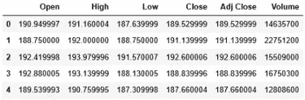
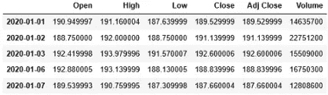

# 如何生成考虑任何国家节假日的熊猫时间序列

> 原文：<https://towardsdatascience.com/how-to-generate-time-series-considering-holidays-of-any-country-in-pandas-32506bc6abb9?source=collection_archive---------26----------------------->


照片由 [Unsplash](https://unsplash.com?utm_source=medium&utm_medium=referral) 上的 [Joost Crop](https://unsplash.com/@smallcamerabigpictures?utm_source=medium&utm_medium=referral) 拍摄

## 如何使用美国假日日历，为任何目的或任何其他国家生成自定义假日日历，如何将日期序列合并到数据集中

在时间序列数据分析中，生成日期在现实生活中的许多场合都是必要的。有时我们有数据，但时间没有记录，有时我们可能不得不使用一个国家的数据进行另一个国家的研究，或者今年使用去年的数据。今年的假期与去年不同，或者这个国家与另一个国家不同。这篇文章显示:

a.如何使用内置的假日日历？

b.生成自定义假日日历。

c.将一系列日期合并到数据集中。

# 考虑假期的时间序列

1.  生成一个考虑所有节假日的时间序列。

熊猫已经内置了美国假日日历。使用“CustomBusinessDay”功能生成自定义频率，传递内置的美国假日日历。使用此自定义工作日作为频率。

```
**from** pandas.tseries.holiday **import** USFederalHolidayCalendar
**from** pandas.tseries.offsets **import** CustomBusinessDayusb **=** CustomBusinessDay(calendar **=** USFederalHolidayCalendar())
pd.date_range('7/1/2018', '7/10/2018', freq=usb)#Output:
DatetimeIndex(['2018-07-02', '2018-07-03', '2018-07-05', '2018-07-06', '2018-07-09', '2018-07-10'],               dtype='datetime64[ns]', freq='C')
```

我用的范围是 7 月 1 日到 7 月 10 日。看输出。7 月 3 日之后是 7 月 5 日。因为 7 月 4 日是假日。

2.现在，我将向你展示如何制作你的定制假日日历。如果你的客户不是美国人，你必须做一个定制的假日日历。因为其他国家的假期和美国不一样。

为了简化本教程，假设我是一家大公司的老板。我宣布我的周年纪念日为公司假日。虽然这不太可能。我这样做只是为了演示如何制作一个自定义的假日日历。

熊猫图书馆让你使用他们的类来修改和制作你自己的。在 [**这一页的最后**](https://github.com/pandas-dev/pandas/blob/master/pandas/tseries/holiday.py) **，**你会发现类‘USFederalHolidayCalendar’是这样的:

```
class USFederalHolidayCalendar(AbstractHolidayCalendar):
    """
    US Federal Government Holiday Calendar based on rules specified by:
    [https://www.opm.gov/policy-data-oversight/](https://www.opm.gov/policy-data-oversight/)
       snow-dismissal-procedures/federal-holidays/
    """
    rules = [
        Holiday("New Years Day", month=1, day=1, observance=nearest_workday),
        USMartinLutherKingJr,
        USPresidentsDay,
        USMemorialDay,
        Holiday("July 4th", month=7, day=4, observance=nearest_workday),
        USLaborDay,
        USColumbusDay,
        Holiday("Veterans Day", month=11, day=11, observance=nearest_workday),
        USThanksgivingDay,
        Holiday("Christmas", month=12, day=25, observance=nearest_workday),
    ]
```

现在，修改名称和规则来制作一个定制的假日日历。我假设我的周年纪念日是 3 月 20 日。使用“遵守”作为“最近工作日”。这意味着如果指定的日期是周末，假日日历将自动将最近的工作日作为假日。“遵守”几乎没有其他选择。分别是:**'周日 _ 至 _ 周一'，'下周 _ 周一 _ 或 _ 周二'，'之前 _ 周五'，'下周 _ 周一'**。请随意自己尝试。

```
from pandas.tseries.holiday import AbstractHolidayCalendar, nearest_workday, Holidayclass MyAnniversaryCalendar(AbstractHolidayCalendar):
    rules = [
        Holiday("MyAnniversary", month=3, day=20, observance = nearest_workday)
    ]
```

在这里，我做了我的周年日历。使用此类“MyAnniversaryCalendar”自定义频率，并将其用作“freq”参数的值。

```
myday = CustomBusinessDay(calendar=MyAnniversaryCalendar())pd.date_range('3/15/2020', periods=12, freq=myday)#Output:
DatetimeIndex(['2020-03-16', '2020-03-17', '2020-03-18', '2020-03-19', '2020-03-23', '2020-03-24', '2020-03-25', '2020-03-26',                '2020-03-27', '2020-03-30', '2020-03-31', '2020-04-01'],               dtype='datetime64[ns]', freq='C')
```

请看一下输出。3 月 19 日之后，是 3 月 23 日。有一个三天的周末！

3.一些国家有不同的工作日。例如，像埃及、卡塔尔这样的国家将星期五和星期六作为周末。所以，他们的假日日历应该是不同的。以下是如何定义和使用每周工作日:

```
b = CustomBusinessDay(weekmask = 'Sun Mon Tue Wed Thu')
pd.date_range('6/20/2020', '6/30/2020', freq=b)#Output:
DatetimeIndex(['2020-06-21', '2020-06-22', '2020-06-23', '2020-06-24', '2020-06-25', '2020-06-28', '2020-06-29', '2020-06-30'],               dtype='datetime64[ns]', freq='C')
```

检查输出中缺少的日期。你会看到它们是星期五和星期六。

# 在数据集中使用日期序列

在本节中，我们将使用由 date_range 函数生成的一系列日期，并在数据集中使用它。在这个练习中，我使用了[脸书股票数据集](https://github.com/rashida048/Datasets/blob/master/FB_data_with_no_date.csv)。首先导入数据集:

```
df = pd.read_csv('FB_data_with_no_date.csv')
df.head()
```



现在，生成时间序列，其中开始日期是 2020 年 1 月 1 日，“周期”是数据集的长度，频率

```
rng = pd.date_range('1/1/2020', periods = len(df), freq='B')
```

将此时间序列设置为脸书股票数据集的索引。

```
df.set_index(rng, inplace=True)
df.head()
```



这是时间序列数据集，可用于时间序列数据分析或预测。

# 结论

在时间序列分析中，处理节假日是正常的。在不同的文化和不同的国家，有不同的时区和不同的节日。所以，如果你处理时间序列数据，你会经常用到这个。希望这篇文章对你有帮助！

## 更多阅读:

[](/an-ultimate-cheat-sheet-for-data-visualization-in-pandas-4010e1b16b5c) [## 熊猫数据可视化的终极备忘单

### 熊猫的所有基本视觉类型和一些非常高级的视觉…

towardsdatascience.com](/an-ultimate-cheat-sheet-for-data-visualization-in-pandas-4010e1b16b5c) [](/an-ultimate-cheat-sheet-for-numpy-bb1112b0488f) [## Numpy 的终极备忘单

### 对学习也有好处

towardsdatascience.com](/an-ultimate-cheat-sheet-for-numpy-bb1112b0488f) [](/introduction-to-the-descriptive-statistics-a050b5ec99fb) [## 描述统计学导论

### 对最基本和广泛使用的描述性统计方法有清晰和详细的理解

towardsdatascience.com](/introduction-to-the-descriptive-statistics-a050b5ec99fb) [](/great-quality-free-courses-to-learn-machine-learning-and-deep-learning-1029048fd0fc) [## 学习机器学习和深度学习的优质免费课程

### 顶级大学高质量免费课程的链接

towardsdatascience.com](/great-quality-free-courses-to-learn-machine-learning-and-deep-learning-1029048fd0fc) [](/all-the-datasets-you-need-to-practice-data-science-skills-and-make-a-great-portfolio-857a348883b5) [## 练习数据科学技能和制作优秀投资组合所需的所有数据集

### 一些有趣的数据集提升你的技能和投资组合

towardsdatascience.com](/all-the-datasets-you-need-to-practice-data-science-skills-and-make-a-great-portfolio-857a348883b5) [](/a-complete-recommender-system-from-scratch-in-python-step-by-step-6fc17a4da054) [## 一个完整的推荐系统从零开始:一步一步

### 基于用户评分的线性回归电影推荐系统

towardsdatascience.com](/a-complete-recommender-system-from-scratch-in-python-step-by-step-6fc17a4da054)