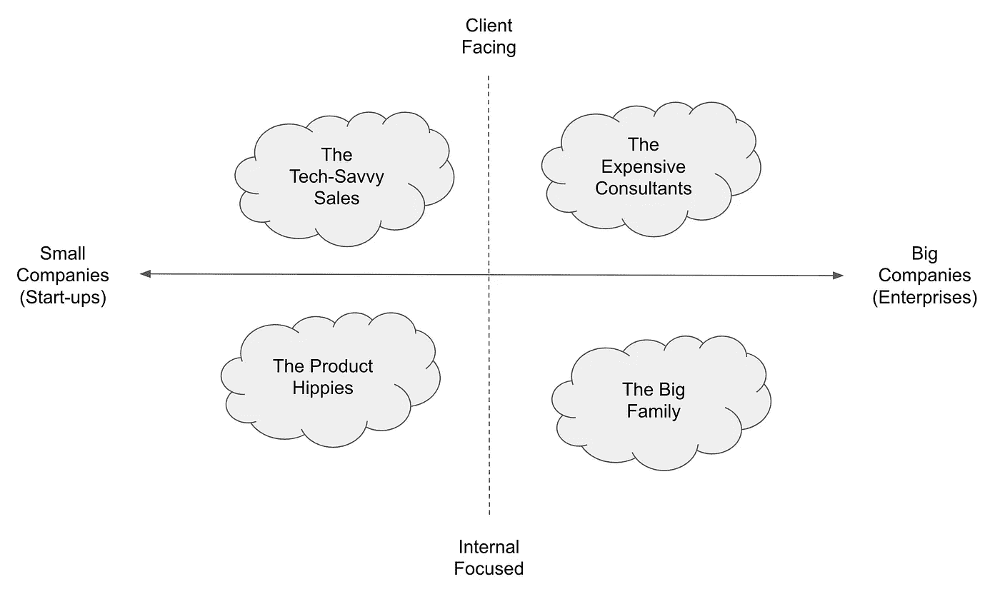
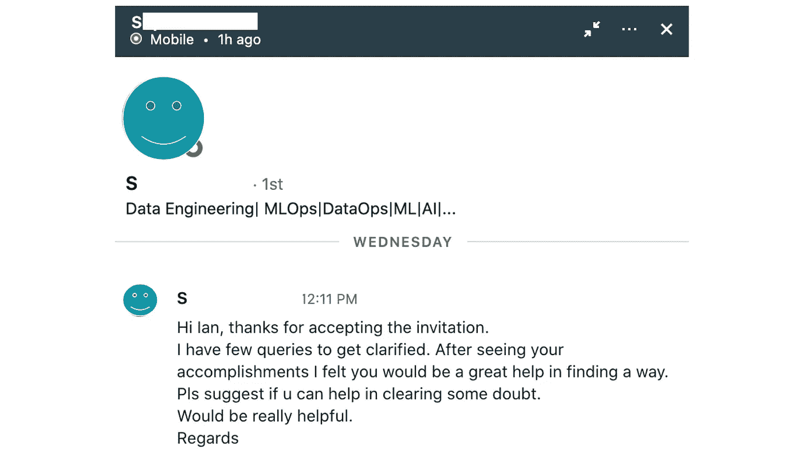

# 作为一名害羞的数据科学家，如何获得工作推荐？

> 原文：<https://towardsdatascience.com/how-to-get-a-data-science-interview-job-referral-5bb9ff2ed8c9?source=collection_archive---------18----------------------->

## [办公时间](https://towardsdatascience.com/tagged/office-hours)

## 技巧、经验教训和 1+1+1 流程

[真诚媒体](https://unsplash.com/@sincerelymedia?utm_source=unsplash&utm_medium=referral&utm_content=creditCopyText)在 [Unsplash](https://unsplash.com/?utm_source=unsplash&utm_medium=referral&utm_content=creditCopyText) 上拍摄的照片

**TL；获得推荐是获得面试分数的最有效方式，但许多有抱负的数据科学家，尤其是内向的数据科学家，很难做到这一点。我正在分享一些经验教训和一个“1+1+1 过程”,它帮助我在最负盛名的公司获得面试(和工作机会)。我还包括了一些小挑战来帮助你开始。**

***免责声明*** *:我把数据科学和 ML 这两个术语互换使用。我的观点完全来自个人经验，不代表我的雇主的官方招聘准则。*

***喜欢读什么？*** *跟我上* [*中*](https://medium.com/@ianxiao)*[*LinkedIn*](https://www.linkedin.com/in/ianxiao/)*，以及*[*Twitter*](https://twitter.com/ian_xxiao)*。查看我的《* [*对机器学习的影响*](https://www.bizanalyticsbootcamp.com/influence-with-ml-digital) *》指南。它帮助数据科学家更好地解决问题、设计和交流。**

*最近，我受邀向一群有抱负的数据科学家发表演讲。一个学生问:**“你怎么让别人推荐你？我没那么外向。”***

*我的简短回答是:如果你提前得到了一些东西，你就不需要请求推荐，尤其是如果你是一个内向的人。*

*回想我自己的旅程，我在顶级咨询公司、大型科技公司、华尔街对冲基金和人工智能初创公司的大多数面试(和工作邀请)都源于冷淡的关系，而不是来自老朋友或投简历。*

*作为一个内向的人，每次我需要发电子邮件、建立关系网和引导对话时，这都是一次极其令人畏惧的经历。但是随着我职业生涯的进展，我开始用不同的方式对待这种互动。在这篇文章中，我将分享一种方法和过程，让它变得更容易和更有效。*

*要设定期望值，您必须了解并准备好以下内容:*

*   ***真正的好奇心。**你必须对对方感到好奇，就像你作为一名数据科学家对数据中的见解感到好奇一样。*
*   ***要有耐心。**建立关系需要时间和互动。不要指望在与第一个人第一次互动后就能获得推荐。并不是每一次互动都会有所收获——这完全没问题。*
*   ***纪律。**有些事情是你控制不了的。你需要坚持不懈的努力。好事会来的。*

*那么，**不求人怎么能得到推荐呢？**我们按步骤分解一下。这里的教训主要适用于建立冷淡的关系(例如，不在你的家庭和现有朋友网络中的人)。*

## *第一步。值得推荐*

*这是没有办法的。你必须花时间发展基本技能和“品牌”,这样人们才会有信心把你带进他们的团队和网络。怎么才能“可参考”？作为有抱负的数据科学家，我认为有几种方法可以脱颖而出:*

*   ***独一无二。**与几年前不同，现在有很多数据科学家。每个人都知道如何建立模型(或者他们是这么说的)。你还能带来什么？(如领域知识、特殊技术诀窍、做别人不想做的事等。)*
*   ***来点激情项目。如果你是一名应届毕业生，参与有激情的项目(而不是学校布置的任务)是展示你的工作并在简历中突出多年工作经验的好方法。最棒的是，你是你工作的主人，你不需要任何人的许可，也不需要一封聘书就可以开始工作。***
*   ***说不清就秀。如果你是一个内向的人，你可能不会大声说出你能做什么(尽管你应该试着这么做)。最好的办法就是展示。展示你的作品是在陌生人之间建立信任的最好方式。所以，在自己的网站或者 Github 上有一个好的作品集。让你的工作为你辩护。这是设计界的标准做法，许多科技公司已经在寻求你的 Github 的链接。***

*[吉菲](https://media.giphy.com/media/pHIufoc16cSdy/giphy.gif)*

***迷你挑战#1:** 拿你最近的学校或激情项目，清理代码，写一个你奶奶能看懂的简单 1 页总结，上传到 Github 或你的个人网站。接下来的 1-2 周，每天给 1-2 个人看。获得反馈，并请他们与可能会觉得有趣和有用的朋友分享。如果你开始有困难，看看我关于 [**12 小时挑战**](/build-full-stack-ml-12-hours-50c310fedd51?source=your_stories_page---------------------------) 的帖子，试试吧。*

## *第二步。从合适的公司找到合适的人*

***谁是“合适的”人？如果你有世界上所有的时间和精力，你应该去认识每一个有趣的人。但是，实际上，你很可能会违背招聘计划或下一份工作的跑道。因此，我的建议是按照以下顺序进行连接:***

*   ***招聘经理**(例如工程经理、团队领导、首席数据科学家等。)—发现和雇佣优秀人才是他们的使命。但是经理们通常忙于在日常工作和招聘之间周旋。所以，让你的互动有影响力(见第 3 步& 4)。*
*   ***入门级**(如数据科学家、分析师等。)—虽然他们可能没有决定权，但初级人员仍然可以为招聘经理做介绍(有些人有一天会成为经理)。*
*   ***高管**(如高管、合伙人、高级/副总裁等。)—如果能从首席执行官那里得到一份自上而下的介绍给招聘团队，那就太好了。这种情况时有发生，但大多数高管都太忙了，没有参与日常的招聘过程。*

***有哪些合适的公司？根据我的经验，从在初创公司和中型公司工作的人那里获得推荐会更有效。大公司通常对入门级职位有标准的校园招聘流程，大多数人会推荐他们更有经验的朋友和熟人去做非入门级的工作。***

*你可以看看这篇文章[我对数据科学角色和公司的类型进行了分类。](/the-most-realistic-data-science-career-guide-d12c4af87cc8)*

**

*[作者自己的作品](/the-most-realistic-data-science-career-guide-d12c4af87cc8)*

*[了解数据科学到底是什么](/data-science-is-boring-1d43473e353e)。找到符合您的个人资料和兴趣的数据科学角色类型。想出一个从小到大的目标公司列表，职位名称，并根据我在第二步中建议的优先级开始在 LinkedIn 上与人联系。*

***小挑战#2:** 写下你想加入的 5 家公司(1-2 家大公司，2-3 家中型公司，3-4 家初创公司)。在这些公司中找到 1-3 个数据科学/分析职位。在 LinkedIn 上找到每家公司的 1-2 名经理级人员。先和同城或者同校的联系，不要一下子和所有人联系。按照下面的第 3 步，给他们发送一条好的介绍信息。*

## *第三步。写一个好的介绍信息*

*不是每个人都会接受并回复你的 LinkedIn 邀请和信息。根据我的经验，接受率为 50–70%，回复率为 20–30%(例如，要让一个人回复，你至少需要联系 8-10 个人)。*

*你真的不能对接受率做任何事情，但你可以根据你如何写你的信息来尝试提高回复率。*

*以我的经验来看，带有明确问题和选项的简短信息效果更好。作为一个内向的人，我曾经认为这样的消息是粗鲁和唐突的。但是更重要的是尊重他人的时间，让他们知道他们如何能帮上忙——并且让事情变得简单。*

*具体来说，这里有一个几天前出现在我收件箱里的**坏例子**。*

**

*LinkedIn 留言的一个不好的例子，作者的作品*

*我知道这个人在寻求帮助，但是我不知道我能帮什么，怎么帮。*

*总的来说，介绍信息的目标应该是让接收者知道为什么以及如何用最少的精神能量来帮助**。***

*以下是我遵循的一些原则:*

*   *对你的问题要明确具体(简短的总结和/或链接)*
*   *提出一个对你合适的时间，然后让对方决定(只需查看日历比发送额外的信息来确定一个对双方都合适的时间更容易)*
*   *提供选项(但不要太多)*
*   *让人们说不，但留下跟进的机会*

*考虑到这些，以下是我重写 LinkedIn 信息的方式:*

> *“嗨，伊恩，谢谢你接受我的邀请。我喜欢你在[媒体](https://medium.com/@ianxiao) ( *上的文章😉*，好吧也许不是眨眼)。我正在探索数据科学的机会，看到贵公司有一个职位空缺(如果有，请附上链接)。你可以在这里查看我的简历和工作(简历和作品集的链接)。您是否有空在本周五或下周五下午 3 点进行一次 15 分钟的简短聊天？如果你认为有一个更好的人可以和我说话，如果你能把我们联系起来，那就太好了。”*

*您可以从该信息中提取一些元素，并根据自己的需要进行调整。网上有很多好的邮件和信息模板。坚持原则，找到自己的风格。*

## *第四步。见面，但不要要求介绍*

*一旦你与来自正确公司和团队的正确的人安排了一次会议，并带着正确的介绍信息，现在到了关键时刻:让那个人把你放在面试过程中。*

*吉菲*

*对于内向的数据科学家来说，不得不与陌生人聊天并寻求帮助可能是最难以承受的过程。不幸的是，我不能提供一个脚本，因为对话可能以多种形式发生，取决于对方的个性、会议前和会议期间每个人的情绪、招聘过程的背景等。*

*好消息是，在这个阶段，你要见的人知道你的意图(例如，在他/她的团队中找到一份工作，或者与其他人取得联系)，能够影响和采取行动，并乐于提供帮助，或者至少倾听你的建议。你获得“推荐”的机会已经比随机与某人交谈或向普通收件箱发送简历高得多。*

*为了让谈话不那么令人畏惧，更有效，这里有一些我认为有用的心理和谈话技巧:*

*   ***不要把它当成面试。**因为这个人会评估他们是否应该帮助你并让你加入，所以这个对话就是一次正式或非正式的面试。尽管如此，告诉自己“这就像和一个多年未见的朋友的对话，我们只是在叙旧。”在心里说这句话通常会让我放松，不会显得太绝望。*
*   ***温和地带头。招聘经理通常也不知道如何与你交谈，或者被他的日常工作所困扰。会有死气沉沉的尴尬。这让我这个内向的人受不了。因此，在感谢您接听电话并抽出时间之后，我通常会建议“为什么我不告诉您更多关于我的数据科学经验，我很想了解更多关于您的团队以及您在该职位上的期望……”要友好、冷静、具体，并准备好您的故事。我还没有遇到反对这个建议的人。***
*   ***献，莫问。**在对话接近尾声时，你们双方都应该知道是否有合适的人选。如果你还想继续，关键时刻到了。不要问“你能推荐我吗？”这可能会很唐突，让每个人都感到尴尬，但要提供两个机会:你的简历和你能帮上忙的事情。你可以这样说:“我很想进一步探索，我可以把我的简历和作品集分享到你的邮箱吗？请看看，如果你觉得合适，请告诉我。我一两周就能跟进。”*

*现在你已经尽力了。让生活来处理剩下的事情。*

*[吉菲](https://media.giphy.com/media/USbYNzaNRPcMbMwgCz/giphy.gif)*

*在会议期间，能够促进对话并讲述关于你自己的好故事是很重要的。和招聘经理一起练习风险太大，成本也太高(你需要在参加会议时做好准备)。*

***小挑战#3** :准备好你想如何解释你的工作，它有什么有趣的地方，以及它为什么重要。自己排练。和你的好朋友喝饮料或咖啡时，不经意地提起这些故事。目的是让他们问问题并跟随对话的流程。当场练习思考和表达，避免预先准备好一切。*

## *1+1+1 流程*

*正如我在开头提到的，建立关系需要时间、耐心和自律。随着我的工作和生活越来越忙，我制定了一个建立新的和维护现有网络的过程(作为一个内向的人，我天生做不好这一点，所以我必须依靠一个过程)。*

*这就是所谓的“1+1+1 过程”:每个月的周五下午(比如 1+1+1)，试着去见**一个**新人，和**一个**老朋友、熟人或者同事**。如果你有更多的时间，想加速，可以调整人数和频率(如每 2 周 3+2)。***

*当你经历求职过程时，你可以采用这个过程来开始并保持建立关系的势头，你现在或将来都可以依靠它。*

*没有捷径可走。准备投入时间、精力，最重要的是，投入你对他人的真正兴趣。好事会来的。直到下一次！*

*[吉菲](https://media.giphy.com/media/xUA7aWoKexEXyXWiqc/giphy.gif)*

****喜欢读什么？*** *跟我上* [*中*](https://medium.com/@ianxiao) *，*[*LinkedIn*](https://www.linkedin.com/in/ianxiao/)*，以及*[*Twitter*](https://twitter.com/ian_xxiao)*。查看我的《* [*用机器学习影响*](https://www.bizanalyticsbootcamp.com/influence-with-ml-digital) *》指南。它帮助数据科学家更好地解决问题、设计和交流。**

## *你可能也喜欢*

* [## 数据科学很无聊

### 我如何应对部署机器学习的无聊日子

towardsdatascience.com](/data-science-is-boring-1d43473e353e)  [## 最有用的 ML 工具 2020

### 每个懒惰的全栈数据科学家都应该使用的 5 套工具

towardsdatascience.com](/the-most-useful-ml-tools-2020-e41b54061c58)  [## 我们应该留在数据科学领域吗？

### 数据科学家的 4 个现实职业选择

towardsdatascience.com](/the-most-realistic-data-science-career-guide-d12c4af87cc8)*