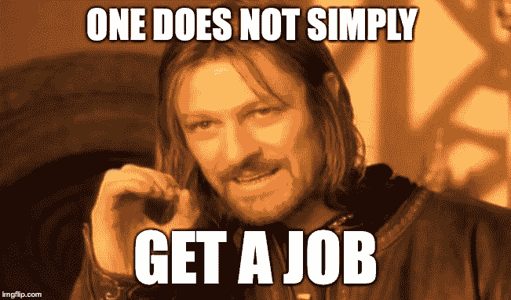

# 没有工作怎么找工作

> 原文：<https://towardsdatascience.com/how-to-get-a-job-when-there-is-no-job-17e5c0d77349?source=collection_archive---------21----------------------->

## 在东京和伦敦做机器学习工程师，没有理科学士学位

越来越多的学生选择攻读包含一年工作实习的学位。这一年让学生将他们的知识融入到环境中，向专业人士学习，并获得现实世界的技能。这是新毕业生区别于其他年轻毕业生的绝佳方式。我强烈建议你去一所有学位课程实习年的大学。

最近参加了母校为金学者(现生)和金学者导师(校友)举办的联谊活动。晚上，学者们表示有兴趣为更小的公司、初创企业甚至慈善机构工作，这与他们的激情和对影响力的渴望非常吻合。我告诉他们，在我实习的那一年，我在东京的一家人工智能(AI)初创公司工作，有一次不可思议的经历。学者们想知道我是如何在一个遥远的地方的一家小型初创企业找到如此令人兴奋的职位的。对于学生来说，很难找到并获得分班机会。在不宣传职位安排或实习项目的公司找到机会就更难了。

大学充当了人才进入大公司的漏斗，而忽视了小公司。在我大学的第一年和第二年，我每周花 1 个小时为我们的实习申请和随后的实习做准备。在这些会议中，高盛、摩根士丹利、普华永道和野村证券等公司将与我们探讨如何在申请过程中取得成功。其中一些公司甚至在我们的校园里举行面试。只有在每周的电子邮件和偶尔的谈话中，我们才会收到其他为学生提供实习机会的小公司的信息。对于不想在大公司工作或找不到合适职位的学生来说，这有什么选择呢？

在这篇文章的结尾，我会和你分享**一些我用来获得多份实习和工作的技巧**。我希望你也能够使用这些技术来获得你理想的就业机会或工作。

> *“机会总是降临到创造机会的人身上”——查理大帝 Tha God*

# 获得职位的策略

寻找非传统的工作机会比通过求职面试更少被讨论，也更困难。以下策略将重点帮助你找到你想要的工作机会。

## 通过永久职位发布申请

忽略你感兴趣的永久职位标志和招聘启事上的大部分要求。人们错误地认为，如果他们不符合几乎所有的要求，他们就不是合适的候选人。不要让这种担心阻止你在一家与你的价值观一致的公司申请你感兴趣的职位。事实是，大多数公司并不期望或要求你符合他们职位描述中的每一项要求。

当你申请一个永久职位时，在你的求职信的开头明确说明你想做为期一年的工作安排。你会惊讶地发现，许多公司都愿意给你提供实习机会。一年的时间框架允许一个实习生学习和做比其他短期实习生多得多的工作，而公司的成本却很低。

## 挖掘你的网络

> “重要的不是你知道什么，而是你认识谁”——无名氏。

作为一名大学生，你的人际网络很可能由其他学生或者一些应届毕业生组成。目的是挖掘你的人脉，找到愿意把你介绍给你需要的人或者愿意把你介绍给有能力的人的人。这尤其适用于没有安置计划的公司。

**朋友和家人**

不要害怕向别人寻求帮助！你网络中的某个人可能已经能帮上忙了，你只需要开口。年龄较大且已经进入行业的朋友和家人可以成为知识和社会资本的财富。他们会认识更多可以介绍给你的业内人士。他们还会知道一些更小、更不知名的公司，以及职业发展和他们所在领域的工作专长。

如果你的家庭不从事工业，你可以向你的大学朋友的父母寻求帮助。很可能他们的父母在想要的公司工作，或者认识在那里工作的人。

**领英**

使用 [LinkedIn](http://linkedin.com) 可以让你搜索人并直接给他们发消息。您可以按公司、教育程度和联系级别过滤结果。联系的程度告诉你你和某人有多亲密。一级关系是你已经认识的人，二级关系意味着你认识某个认识这个人的人，同样的逻辑也适用于更高级别的关系。使用这些过滤器可以把 LinkedIn 变成一个工具，找到愿意帮助你的人，同时最大化他们想要帮助你的机会。

例如，如果你想在 A 公司工作，你可以在 LinkedIn 上搜索 A 公司，根据大学和关系级别过滤结果列表。列表中的其他人将与您共享背景。当你把信息发送给公司 A 的员工时，你可以参考这个共享的背景，并继续寻求任何你需要的帮助。

**社交媒体**

社会企业、非政府组织、慈善机构和广播节目可能没有 LinkedIn，但他们可能有 Instagram 或 Twitter 帐户。如果有特定的行业或组织，你感兴趣的话可以看看他们的账号。从该帐户，您可以找到类似的帐户，让您发现许多组织从一个单一的。

Twitter 和 Instagram 可以用来直接向你所在领域的名人发送信息。如果他们回复了，你可以安排一次咖啡会议，或者向他们寻求建议。他们可能不会雇佣你，但肯定会给你指出一个可以雇佣你的人的方向。

互联网和社交网络的出现意味着我们有幸能够与全球各地的个人和机会保持联系。

**当事人**

参加聚会的好处是，你可能会与那些你在其他情况下从未接触过的人互动。这些互动可以帮助你分散你的思维，让你帮助别人，和/或让别人帮助你。

2017 年，我参加了世界上最大的人工智能会议 NeurIPS。参加完 AI 工坊的 Black，我们开了一个船会。在去船上的班车上，我和一位女士聊了起来，这位女士碰巧是伦敦一家名为 [Selerio](http://www.selerio.io) 的人工智能初创公司的首席技术官(CTO)和联合创始人。我问她是否有实习机会，她给了我一张名片，让我有空的时候给她发邮件。

我一结束在 Cogent 实验室的工作，就回到了伦敦。我给首席技术官发了一封邮件，我们进行了一次面试，然后我加入了。

这个团队由三位联合创始人和我组成。一个超小的、高度集中的团队致力于尖端技术。在 Selerio 工作让我加强了我在计算机视觉和深度学习方面的知识。

**我的安置经历**

在搜索安置机会时，我随机想到了谷歌“AI start-up Tokyo”，因为它结合了我感兴趣的两件事。

通过这次搜索，我找到了 [Cogent Labs](https://www.cogent.co.jp/en/) ，一个新的(大约 10-15 名员工)令人兴奋的世界级 OCR(光学字符识别)技术。他们没有实习生、实习学生或初级工程师的空缺，但我还是申请了。我花时间精心制作了一封非常好的求职信，然后*通过他们的永久职位发布申请了职位。经过几次面试和一次编码测试，我通过了。*

当我到达东京时，我的工作头衔从软件工程师变成了研究工程师，尽管我不知道这个职位是什么。被扔进深水区让我学到了很多关于人工智能和研究领域的知识。这段经历彻底改变了我的职业和兴趣的轨迹。

由于我在 Cogent Labs 的工作，我获得了前往加州长滩参加 NeurIPS 的旅行许可，这是世界上最大的人工智能会议(感谢人工智能团队中的[布莱克)。](https://blackinai.github.io)

当我离开 Cogent 实验室时，已经有 60-70 人了。今年，我亲眼目睹了初创企业是如何成长和壮大的。在那里工作让我认识了一些了不起的人，并生活在一个不可思议的城市。

## 结论

连接每种技术的核心线索是它们都需要你积极主动。你必须走出去，寻求你想要的机会。在任何情况下，你都不应该坐以待毙。也就是说，去发那个 DM，电子邮件，LinkedIn 消息或者 tweet。不要等着别人教你，去学吧。

我希望你能够使用上面介绍的技巧来获得你理想的工作机会、实习或工作。

> “把好奇心和激情作为一种工具，在生活中开拓出自己独特的道路。”——奥马尔·里德

你可以在 [LinkedIn](https://www.linkedin.com/in/oreid52/) 和 [Twitter](https://twitter.com/Reido2012) 上找到我。