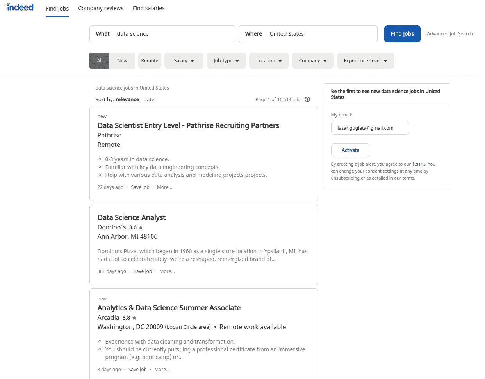
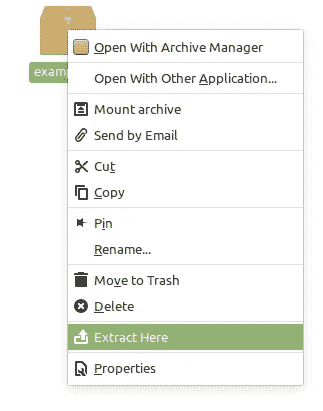
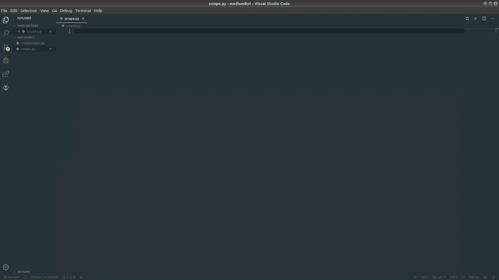
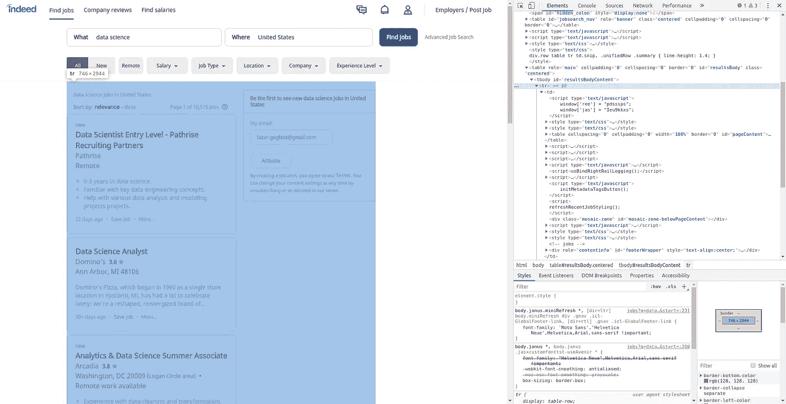
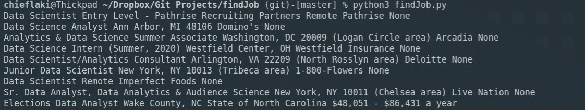

# 如何用 Python 找工作

> 原文：<https://towardsdatascience.com/how-to-get-a-job-with-python-575f1b79fa11?source=collection_archive---------16----------------------->


有这么多网站为不同领域的工作提供工作列表。即使你可能在某个职位上，你也应该**总是** **找工作**，这可能会变得很无聊。但是这里有一个简单的解决方案可以让你轻松通过这么多的工作邀请！

我们将构建一个**简单的 Python 脚本**来获取工作列表，并根据您的喜好过滤它们。

这是一个简单的使用 Python，你不需要任何特定的技能来做这件事。我们将一步一步来，共同建设一切。

让我们直接投入进去吧！


# 编码

## 规划流程

首先，我们必须找到工作列表网站，我们将得到提供。

我选择一个名为[的网站，实际上是](/www.indeed.com)。(这只是本教程的一个例子，但是如果你有一个更喜欢用来找工作的网站，请随意使用！)

我们要做的是:

筛选适合我们的工作标准，并对其进行筛选。

下面是我在美国**搜索**数据科学**后 Indeed 的网站的样子。**

****

**在网站上搜索示例**

**最后，一旦我们有了数据，我们将把它打包成数据帧，得到一个 CSV 文件，可以很容易地用 Excel 或 Libre Office 打开。**

****

# **设置环境**

**你将不得不安装一个 [ChromeDriver](https://chromedriver.chromium.org/) 并与 [Selenium](/top-25-selenium-functions-that-will-make-you-pro-in-web-scraping-5c937e027244) 一起使用，这将使我们能够操纵浏览器并向它发送命令以供测试和使用。**

**打开链接并下载适用于您的操作系统的文件。我推荐**最新稳定版**，除非你已经知道自己在做什么。**

**接下来，您需要解压缩该文件。我建议进入文件，通过右键单击手动操作，然后单击“Extract here”。**

****

**在文件夹里面，有一个名为“chromedriver”的文件，我们必须将它移动到你电脑上的特定文件夹中。**

**打开终端，键入以下命令:**

```
**sudo su** #enter the root mode
**cd**      #go back to base from the current location
**mv /home/*your_pc_name*/Downloads/chromedriver /usr/local/bin** 
#move the file to the right location
```

**请插入您的实际电脑名称，而不是*您的电脑名称*。**

**要做到这一点，还需要几个库:**

**在终端中，您应该安装这些:**

```
*pip3 install pandas*
```

**Pandas 是一个快速、强大、灵活且易于使用的开源数据分析和操作工具，构建于 Python 编程语言之上。**

```
sudo pip3 install beautifulsoup4
```

**[**美汤**](/top-5-beautiful-soup-functions-7bfe5a693482) 是一个 Python 库，用于从 HTML、XML 和其他标记语言中获取数据。**

**完成后，我们打开编辑器。我个人选择的是 [Visual Studio 代号](https://code.visualstudio.com/)。它简单易用，可定制，并且对你的计算机来说很轻。**

**打开一个新项目，创建两个新文件。这是一个我的例子，看起来可以帮助你:**

****

**Visual Studio 代码—项目设置**

**在 VS 代码中，有一个“Terminal”选项卡，您可以使用它打开 VS 代码中的内部终端，这对于将所有内容放在一个地方非常有用。**

**当你打开它时，我们还需要安装一些东西，那就是虚拟环境和用于 web 驱动程序 selenium。在您的终端中键入这些命令。**

```
pip3 install virtualenv
source venv/bin/activate
pip3 install selenium
```

**激活虚拟环境后，我们就完全**准备好**了。**

****

# **创建工具**

**我们已经设置好了一切，现在我们要编码了！**

**首先，如前所述，我们必须导入已安装的**库**。**

```
*from* **selenium** *import* webdriver
*import* **pandas** *as* pd
*from* bs4 *import* **BeautifulSoup**
*from* time *import* **sleep**
```

**用任何名字创建你的工具并启动 Chrome 的驱动程序。**

```
class **FindJob**():
  def __init__(self):
    self.driver = webdriver.Chrome()
```

**这就是我们开始发展所需要的一切。现在转到您的终端并键入:**

```
python -i findJob.py
```

**这个命令让我们把我们的文件作为一个互动的游乐场。浏览器的新选项卡将会打开，我们可以开始向它发出命令。
如果你想试验，你可以使用命令行，而不是直接输入到你的源文件中。只是用**机器人**代替**自身**。**

**对于终端:**

```
**bot** = FindJob()
  **bot**.driver.get('https://www.indeed.com/jobs?q=data+science&l=United+States&start=')
```

**现在来看看源代码:**

```
self.driver.get('https://www.indeed.com/jobs?q=data+science&l=United+States&start=')
```

**创建我们将要使用的数据帧很容易，所以让我们从这里开始吧！**

**对于这个数据框，我们需要有“头衔”、“位置”、“公司”、“薪水”、“描述”都与我们要刮的工作相关。**

```
**dataframe** = pd.DataFrame(
  columns=["Title", "Location", "Company", "Salary", "Description"])
```

**我们将使用这个数据帧作为 CSV 文件的列名。**

**这个网站的问题是，在每一页上都有 10 个工作机会，当你进入下一页时，链接会发生变化。一旦我明白了这一点，我就做了一个 for 循环来检查每一页，并在它完成后转到下一页。看起来是这样的:**

```
*for* **cnt** in range(0, 50, 10):
  self.driver.get("https://www.indeed.com/jobs?q=data+science&l=United+States&start=" + str(cnt))
```

**我设置了一个计数器变量“cnt ”,并将这个数字添加到我的链接中，并转换为字符串。for 循环特别从 0 开始，一直到 50，迭代 10 次，因为这是每页显示的作业数。**

**当我们进入第一页时，我们需要一个接一个地抓取报价表，我们将这样做:**

**在上图中，您可以看到报价，它们被打包在一个表中，我们可以通过按键盘上的 F12 键或右键单击-> Inspect 找到该表。**

**看起来是这样的:**

****

**我们将通过类名找到该表，并输入以下行:**

```
**jobs** = self.driver.find_elements_by_class_name('result')
```

**它保存通过类名结果找到的所有 Web 元素。**

**一旦保存了这些数据，我们就可以创建另一个 for 循环，遍历表中的每个元素，并使用在表中找到的数据。**

**在我向您展示更多收集这些报价的代码之前，我们应该先看几件事情。**

**对于这一部分，我们将使用 [BeautifulSoup](/top-5-beautiful-soup-functions-7bfe5a693482) ，因为我发现它的工作方式更快。**

**我们必须为 BeatifulSoup 设置一些东西，这些是我们给它执行搜索的实际数据，以及我们说它应该使用的解析器:**

```
**result** = job.get_attribute('innerHTML')
**soup** = BeautifulSoup(result, 'html.parser')
```

**一旦我们得到这些，我们只需要找到“汤”定义的变量中的元素，这只是 BeautifulSoup 准备的数据。**

**我们得到我们想要的数据帧的数据:**

```
**title** = soup.find("a", class_="jobtitle").text.replace('\n', '')
**location** = soup.find(class_="location").text
**employer** = soup.find(class_="company").text.replace('\n',   '').strip()
*try*:
  **salary** = soup.find(class_="salary").text.replace(
    '\n', '').strip()
*except*:
  **salary** = 'None'
```

**我用这种方式做了一个薪水部分，因为有时它没有被定义，我们必须为这个特定的单元格设置 None 或 empty。**

**因为我在终端中测试我的代码，所以您也可以打印到目前为止您所发现的内容:**

```
print(title, location, employer, salary)
```

**一旦这个脚本完成，它将看起来像这样:**

****

**数据框中缺少的最后一项是工作描述，之所以省略它，是因为为了获得工作描述的文本，您必须首先单击工作待遇。我是这样做的:**

```
**summ** = job.find_elements_by_class_name("summary")[0]
**summ**.click()
**job_desc** = self.driver.find_element_by_id('vjs-desc').text
```

**在我们得到所有应该放入数据帧的元素后，我们填充它:**

```
**dataframe** = dataframe.append(
  {'Title': title, 'Location': location, 'Employer': employer, 'Description': job_desc}, ignore_index=True)
```

****

****在你开始亲自测试之前，还有一件事**我必须提一下。**

**一旦你进入网站的第二页，会有一个弹出窗口阻止你进一步点击任何东西！**

**我也想到了这一点，并创建了一个 try-expect，它将关闭弹出窗口并继续抓取数据！**

```
**pop_up** = self.driver.find_element_by_xpath('/html/body/table[2]/tbody/tr/td/div[2]/div[2]/div[4]/div[3]/div[2]/a')**pop_up**.click()
```

****

**for 循环完成后，我们将数据帧数据复制到名为“jobs”的 CSV 中:**

```
dataframe.to_csv("jobs.csv", index=False)
```

> **我们完了！**

**完整的代码在我的 GitHub 账户下面:**

**[](https://github.com/lazargugleta/findJob) [## lazargugleta/findJob

### 用于作业抓取的简单 Python 脚本。通过在 GitHub 上创建一个帐户，为 lazargugleta/findJob 开发做出贡献。

github.com](https://github.com/lazargugleta/findJob) 

# 后续步骤

你可以通过实现不同网站之间的比较，将这个脚本带到另一个层次，并在互联网上获得整体的最佳报价。

在此之前， [**关注我**](https://medium.com/@lazar.gugleta) 求更！😎

**感谢阅读！**

[](https://medium.com/@lazar.gugleta)

查看我的**其他文章**并关注我的[媒体](https://medium.com/@lazar.gugleta)

[](https://twitter.com/intent/user?screen_name=LazarGugleta)

当我有新文章发表时，请在 Twitter 上关注我**