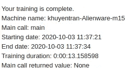
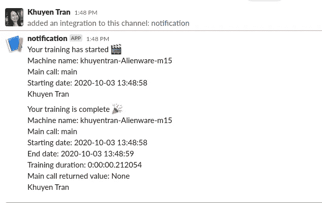

# 使用 Python 获得通知的 3 种方式

> 原文：<https://towardsdatascience.com/how-to-get-a-notification-when-your-training-is-complete-with-python-2d39679d5f0f?source=collection_archive---------10----------------------->

## 现在，您可以在等待培训完成的同时从事其他项目


照片由[布雷特·乔丹](https://unsplash.com/@brett_jordan?utm_source=medium&utm_medium=referral)在 [Unsplash](https://unsplash.com?utm_source=medium&utm_medium=referral) 拍摄

# 动机

作为一名数据科学家或程序员，处理数据和训练模型可能需要花费大量时间。不断地在屏幕上查看培训内容是低效的，尤其是当培训可能需要几个小时或几天的时候。有什么方法可以让你在使用 Python 完成训练后收到通知？

是的，您可以通过以下方式获得通知:

*   噪音
*   电子邮件
*   松弛的

这些方法中的每一种都只需要多 2 到 3 行代码。让我们看看如何使用这些方法创建自己的系统来获得通知。

# 制造噪音

如果你在等待训练结束的时候正在电脑旁边做一些事情，那么简单地在训练结束的时候制造一点噪音就是一个足够好的解决方案。

我在 [StackOverflow](https://stackoverflow.com/questions/16573051/sound-alarm-when-code-finishes) 上找到了这段代码。下面的函数产生具有指定持续时间和频率的蜂鸣声

## 在 Windows 上

## 在 Linux 和 Mac 上

您需要安装`sox`来运行下面的代码

在 Linux 上，运行

```
sudo apt install sox
```

在 Mac 上，运行

```
sudo port install sox
```

只需在你的训练代码底部插入函数`make_noise()`

一旦训练结束运行，功能`make_noise()`将被执行，并会有一个噪音！如果你正在做别的事情，你可以停下你正在做的事情，检查你的训练结果。

# 电子邮件

制造噪音是获得通知的一个很好的方式，但是如果训练结束时你不在电脑旁边怎么办？另外，你可能想让你的队友知道训练何时结束。这就是发送电子邮件派上用场的时候。

有一个叫做 [**knockknock**](https://github.com/huggingface/knockknock#email) 的 Python 库，可以让你在训练完成或者训练过程中崩溃的时候得到通知。得到一个通知只需要增加两行代码。

要安装 knock-knock，请键入

```
pip install knockknock
```

您需要一个 Gmail 电子邮件地址才能使用 knock-knock 发送电子邮件。确保为 knockknock 打开[不太安全的应用](https://devanswers.co/allow-less-secure-apps-access-gmail-account/)功能，以使用您的 Gmail 帐户。为了保护您的主 Gmail 帐户，最好创建另一个 Gmail 帐户来发送通知。

要发送电子邮件，只需在你的培训功能上方插入一个装饰器`@email_sender()`

您可以使用`recipient_emails=[“youremail@gmail.com”, “your_teammate_email@address.com”]`向一个人或一组人发送电子邮件。

如果没有指定`sender_email`，那么`recipient_emails`中的第一封邮件将作为发送者的邮件。

现在当你运行你的脚本时

```
python yourscript.py
```

培训结束后，您将收到一封电子邮件。



在你现有的脚本上试试这个，并检查你的电子邮件！

# 松弛的

Slack 是许多团队讨论工作和分享进展的公共平台。如果您正在使用 Slack，您可能希望将它发送到您公司的一个渠道，例如 channel #developer，以便在培训结束时通知您的开发团队。幸运的是，knock-knock 还允许你在训练结束时发送通知！

要向您的 Slack 发送通知，从[启用并创建一个传入的 webhook](https://api.slack.com/messaging/webhooks#create_a_webhook) 开始。然后简单地用`webhook_url`指定你的空闲房间的网址，用`channel.`指定要通知的频道

如果您想标记您的队友，请将`user_mentions=[“your_slack_id”, “your_teammate_slack_id”]`添加到`@slack_sender`

现在，当您运行您的脚本时，当代码完成执行时，一条消息应该被发送到您的 slack 通道！



# 结论

恭喜你！您刚刚学习了如何通过制造噪音、向您的电子邮件或 Slack 频道发送通知来获得通知。现在，您不再需要经常检查您的计算机来了解培训是否已经完成！您和您的队友可以在等待培训结束的同时从事其他项目。

如果您想使用电报信使、文本消息或其他方式获得通知，请选中 [knock-knock](https://github.com/huggingface/knockknock) 。

本文的源代码可以在这里找到:

[](https://github.com/khuyentran1401/Data-science/tree/master/python/notification) [## khuyentran 1401/数据科学

### 有用的数据科学主题以及代码和文章的集合- khuyentran1401/Data-science

github.com](https://github.com/khuyentran1401/Data-science/tree/master/python/notification) 

我喜欢写一些基本的数据科学概念，并尝试不同的算法和数据科学工具。你可以在 LinkedIn 和 Twitter 上与我联系。

如果你想查看我写的所有文章的代码，请点击这里。在 Medium 上关注我，了解我的最新数据科学文章，例如:

[](/how-to-create-fake-data-with-faker-a835e5b7a9d9) [## 如何用 Faker 创建假数据

### 您可以收集数据或创建自己的数据

towardsdatascience.com](/how-to-create-fake-data-with-faker-a835e5b7a9d9) [](/introduction-to-datapane-a-python-library-to-build-interactive-reports-4593fd3cb9c8) [## Datapane 简介:构建交互式报表的 Python 库

### 创建精美报告并与您的团队分享分析结果的简单框架

towardsdatascience.com](/introduction-to-datapane-a-python-library-to-build-interactive-reports-4593fd3cb9c8) [](/top-4-code-viewers-for-data-scientist-in-vscode-e275e492350d) [## VSCode 中数据科学家的 4 大代码查看器

### 让 YAML、JSON、CSV 和 Jupyter Notebook 为你工作，而不是与你作对

towardsdatascience.com](/top-4-code-viewers-for-data-scientist-in-vscode-e275e492350d) [](/timing-the-performance-to-choose-the-right-python-object-for-your-data-science-project-670db6f11b8e) [## 高效 Python 代码的计时

### 如何比较列表、集合和其他方法的性能

towardsdatascience.com](/timing-the-performance-to-choose-the-right-python-object-for-your-data-science-project-670db6f11b8e) [](/pytest-for-data-scientists-2990319e55e6) [## 数据科学家 Pytest

### 适用于您的数据科学项目的 Pytest 综合指南

towardsdatascience.com](/pytest-for-data-scientists-2990319e55e6)