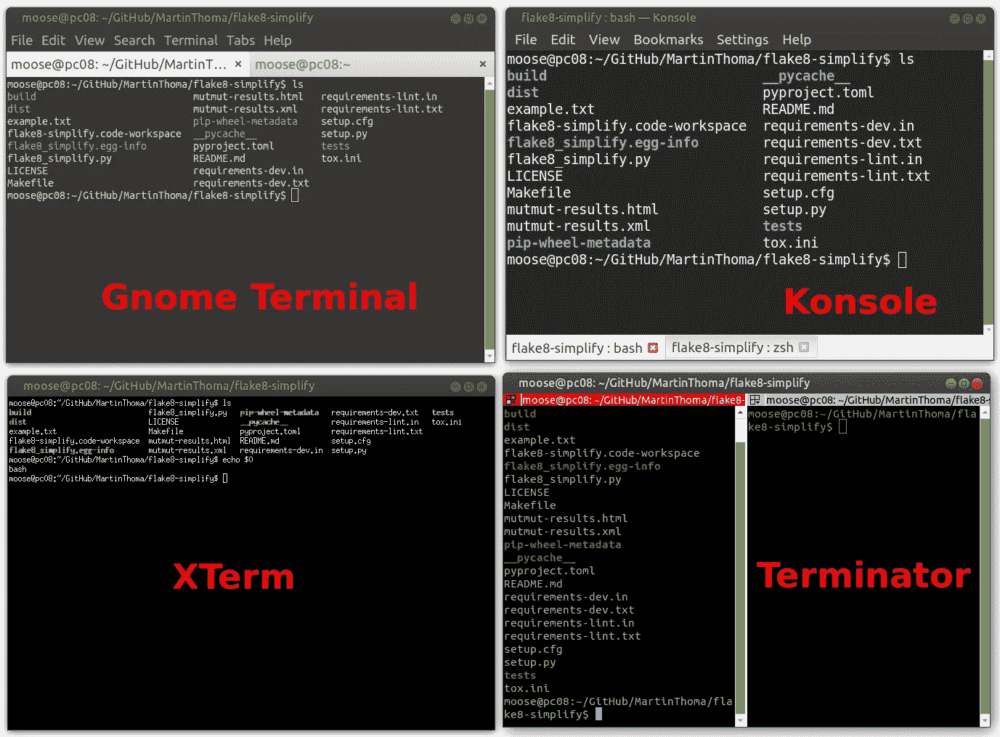
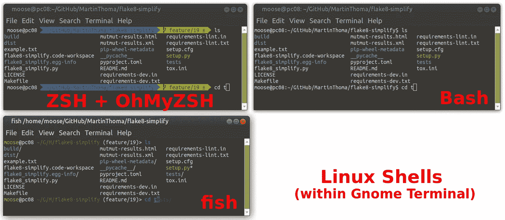
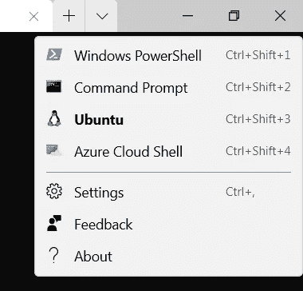
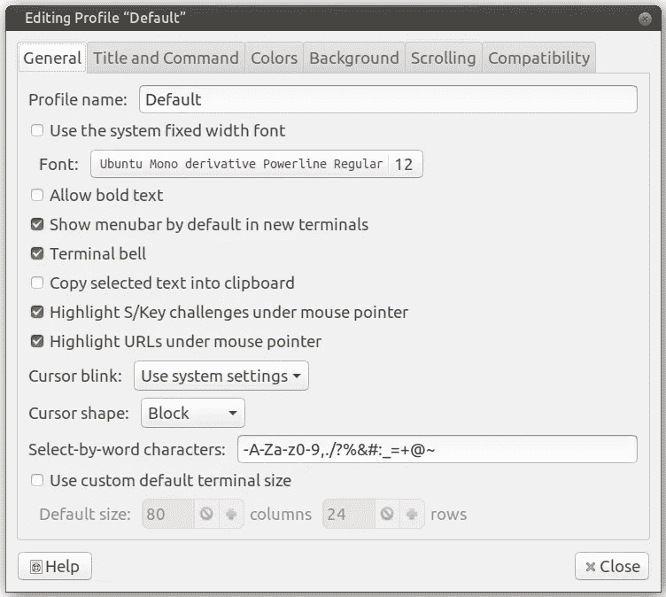
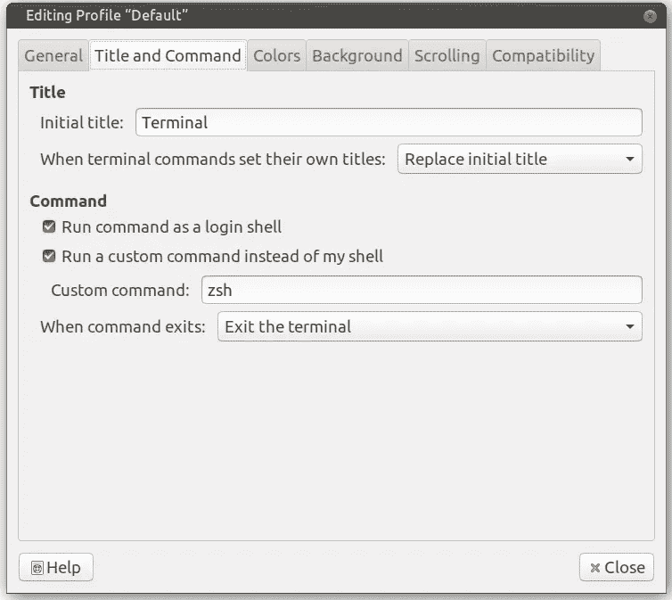
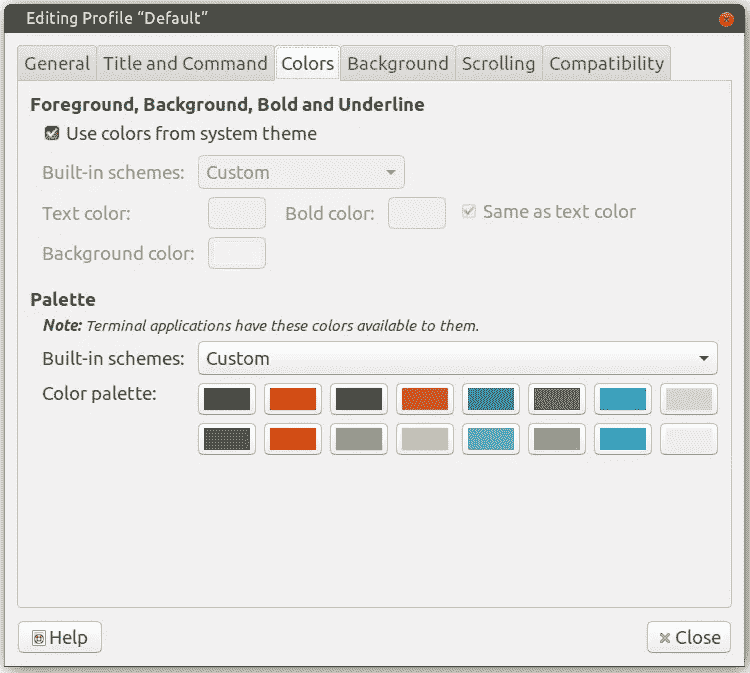

# 如何获得一个令人惊叹的终端

> 原文：<https://towardsdatascience.com/how-to-get-an-amazing-terminal-91619a0beeb7?source=collection_archive---------0----------------------->

## 在 Windows 和 Linux 中；包括提示、字体和颜色


使用 Agnoster 主题的鱼壳示例。它在 Gnome 终端中执行，该终端使用 Ubuntu Mono Powerline 作为字体。这幅图像是由马丁·托马斯创作。

作为一名拥有 10 多年经验的开发人员，我喜欢使用 shell。命令永远不会改变，我可以创建自定义的快捷方式，这是可靠和快速的。不过，默认设置并不太好。看完这篇文章，你就知道如何在你的系统上获得一个牛逼的 shell +终端了。

# 术语

外壳是实际执行命令的部分。终端是一个运行外壳的包装器。

**终端**是你设置字体、字体大小、配色方案、多标签支持的地方。终端模拟器的例子有 KDE 上的 [GNOME 终端](https://en.wikipedia.org/wiki/GNOME_Terminal)、 [Konsole](https://en.wikipedia.org/wiki/Konsole) 、[终结器](https://en.wikipedia.org/wiki/Terminator_(terminal_emulator))和 [XTerm](https://en.wikipedia.org/wiki/Xterm) 。在 Linux 上，我建议保留默认值。在 Windows 上， [Windows 终端](https://www.microsoft.com/en-us/p/windows-terminal/9n0dx20hk701)牛逼。在 Mac 上，我听说过关于 iTerm 2 的好消息。



Linux 上的四个终端模拟器(Gnome 终端、Konsole、XTerm、Terminator)。XTerm 不直接支持制表符。其他有 2 个标签打开。它们都运行 Bash shell。这幅图像是由马丁·托马斯创作。

外壳**存储输入命令的历史，定义如何设置环境变量，如何切换当前目录。Linux 上 shells 的例子有 [ZSH](https://en.wikipedia.org/wiki/Z_shell) 、 [Bash](https://en.wikipedia.org/wiki/Bash_(Unix_shell)) 、 [fish](https://en.wikipedia.org/wiki/Fish_(Unix_shell)) 。在 Windows 上，典型的 Shell 是 [PowerShell](https://en.wikipedia.org/wiki/PowerShell) 。您可以通过执行`echo $0`来查看您正在运行哪个 shell。在 Linux 上，最有可能是 Bash。**



Gnome 终端中的三个 Linux shell(ZSH、Bash、fish)。我大量定制了 ZSH 外壳；Bash 和 fish 显示默认。您可以看到 fish 有一个内嵌的自动建议特性，这是其他两种 shells 所没有的。图片由马丁·托马斯提供。

每个外壳都有一个**提示**。提示是写在光标前的内容。它通知您可以输入命令，并给出有用的上下文信息。在上面的例子中，提示包含用户名`moose`、当前计算机`pc08`、当前工作目录`~/GitHub/MartinThoma/flake8-simplify`、活动 git 分支`feature/19`以及存在修改的事实。

# 字体

不管你拿什么，字体很重要。你可能想有一个等宽字体。你肯定想要一个[电力线字体](https://github.com/powerline/fonts)；相信我。电力线字体使您的 shell 可以使用看起来像图像的字符。它可以使提示方式更好。

我喜欢 [Ubuntu Mono](https://github.com/powerline/fonts/tree/master/UbuntuMono) 和 [Droid Sans Mono](https://github.com/powerline/fonts/tree/master/DroidSansMono) :


上面一行是 Ubuntu Mono，下面的例子是用 Droid Sans Mono 写的。我更喜欢 Ubuntu Mono，但两者都是合理的字体。图片作者:马丁·托马斯

还有像 [Fira Code](https://github.com/tonsky/FiraCode) 或者 [Jetbrains Mono](https://www.jetbrains.com/lp/mono/?ref=betterwebtype) 这样的“编程字体”。我不喜欢它们，因为它们让我更难真正知道写的是什么。不过，它们看起来不错。

# Windows 终端

首先，确保您已经安装了 [Windows 终端](https://www.microsoft.com/en-us/p/windows-terminal/9n0dx20hk701?source=lp&activetab=pivot:overviewtab):

[](https://www.microsoft.com/en-us/p/windows-terminal/9n0dx20hk701?source=lp&activetab=pivot:overviewtab) [## 获取 Windows 终端— Microsoft 商店

### Windows 终端是一个现代的、快速的、高效的、强大的、多产的终端应用程序，适用于…

www.microsoft.com](https://www.microsoft.com/en-us/p/windows-terminal/9n0dx20hk701?source=lp&activetab=pivot:overviewtab) 

启动终端并导航到设置。就是这个向下指的小“箭头”:



点击“设置”。截图由马丁·托马斯拍摄

您应该看到一个 JSON 文件，您可以根据自己的喜好进行更改。我有以下内容:

下载并安装所有 4 种"[DejaVu Sans Mono power line](https://github.com/powerline/fonts/tree/master/DejaVuSansMono)"字体。在我所知道的所有系统上，安装一个字体都是通过双击来完成的。然后一个有“安装”按钮的窗口打开。

# Linux 和 Windows 终端:Aminal

Aminal 是一个用 Go 编写的终端模拟器。它可以在 Linux、Windows 和 Mac 上使用。它允许通过配置文件进行配置，并在其中包含颜色和键盘快捷键。

首先，你需要在你的系统上安装和配置 Go。在 Ubuntu 上，它是这样工作的:

```
$ sudo apt-get install golang libgl1-mesa-dev xorg-dev
$ export GOPATH="$HOME/go"
$ export GOBIN=$(go env GOPATH)/bin
```

然后，您可以安装并运行 aminal:

```
$ go get -u github.com/liamg/aminal
$ aminal
```

# Linux: Gnome 终端

Gnome 终端可以通过编辑配置文件来定制。这里我设置了[Ubuntu Mono derivative power line Regular](https://github.com/powerline/fonts/tree/master/UbuntuMono)的字体大小为 12。



图片作者:马丁·托马斯

该命令被设置为`zsh`，因为这是我最喜欢的 shell。



图片作者:马丁·托马斯

颜色设置为[曝光深色](https://ethanschoonover.com/solarized/)(从左到右，顶线/底线)

*   背景:`#2e3436` / `#555753`
*   深红色:`#cc0000` /浅红色:`ef2929`
*   深绿色:`#4e9a06` /浅绿色:`#8ae234`
*   深黄色:`#c4a000` /浅黄色:`#fce94f`
*   深蓝色:`#3465a4` /浅蓝色:`#729fcf`
*   深紫色:`#75507b` /浅紫色:`#ad7fa8`
*   深青色:`#06989a` /浅青色:`#34e2e2`
*   深灰色:`#d3d7cf` /浅灰色:`#eeeeec`



# Linux Shell: fish

安装**落鱼**外壳；

```
sudo apt-get install fish
```

将终端模拟器中的默认 shell 更改为`fish`。在 Gnome 终端中，它被称为“自定义命令”。

然后安装“ [**哦我的鱼**](https://github.com/oh-my-fish/oh-my-fish) ”:

```
curl -L https://get.oh-my.fish | fish
```

并将主题设置为**未知者**:

```
omf install agnoster
omf theme agnoster
```

关于 fish shell 的酷炫特性，请阅读 Alec Brunelle 的[为什么我使用 Fish Shell 而不是 Bash 和 Zsh](https://medium.com/better-programming/why-i-use-fish-shell-over-bash-and-zsh-407d23293839) 。

# 别名

让终端变得强大的一个核心部分是让常用命令变得简短。为此，您可以为命令创建一个别名，即原始命令的较短版本。最常见的例子是将目录向上更改一级。比如你在`/home/user/foo/bar`，你想去`/home/user/foo`。在大多数 shells 中，您必须输入`cd ..`。我喜欢将其缩写为`..`。所以我有了别名`alias ..='cd ..'`。语法可能会有所不同，这取决于您的 shell。对巴什、ZSH 和费什来说

```
alias short='long'
```

对于巴什，你将它们插入`~/.bashrc`，对于 ZSH，插入`~/.zshrc`。在鱼类中，[则不同](https://stackoverflow.com/a/2763014/562769)。

以下是我喜欢的一些别名:

```
# Shorten things
alias ..='cd ..'
alias ...='cd ../../'
alias ll='ls -alF'
alias la='ls -A'
alias l='ls -CF'
alias c='clear'# If your terminal supports colors, use them!
alias ls='ls --color=auto'
alias grep='grep --color=auto'
alias fgrep='fgrep --color=auto'
alias egrep='egrep --color=auto'
alias diff='colordiff'# Works only if you have notify-send
alias alert='notify-send --urgency=low -i "$([ $? = 0 ] && echo terminal || echo error)" "$(history|tail -n1|sed -e '\''s/^\s*[0-9]\+\s*//;s/[;&|]\s*alert$//'\'')"'
```

# 摘要

*   确保你有一个合理的**终端模拟器**。我建议[Linux 用 Gnome 终端](https://en.wikipedia.org/wiki/GNOME_Terminal)，Mac 用 [iTerm 2](https://www.iterm2.com/) ，Windows 用 [Windows 终端](https://www.microsoft.com/en-us/p/windows-terminal/9n0dx20hk701)。
*   安装一个好的电力线字体像 [**Ubuntu Mono 电力线**](https://github.com/powerline/fonts/tree/master/UbuntuMono) 。
*   根据您的喜好调整终端仿真器的**字体**、**字号**和**配色**。
*   安装好**外壳**。我建议 Linux 用[鱼](https://en.wikipedia.org/wiki/Fish_(Unix_shell))，Windows 用 [PowerShell](https://en.wikipedia.org/wiki/PowerShell) 。
*   根据你的需要调整你的外壳的**提示**。我喜欢**不可知论者主题**。