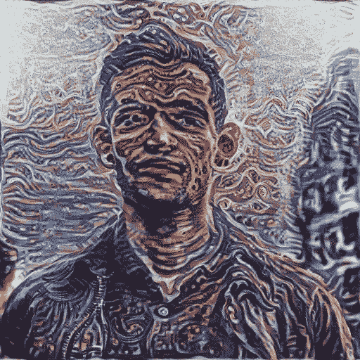
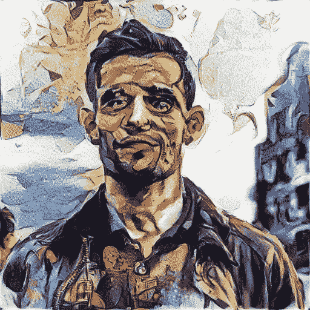
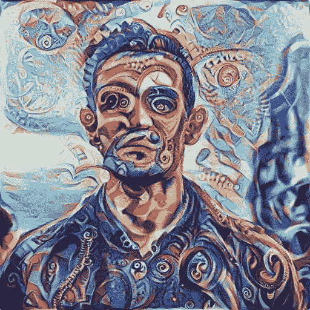
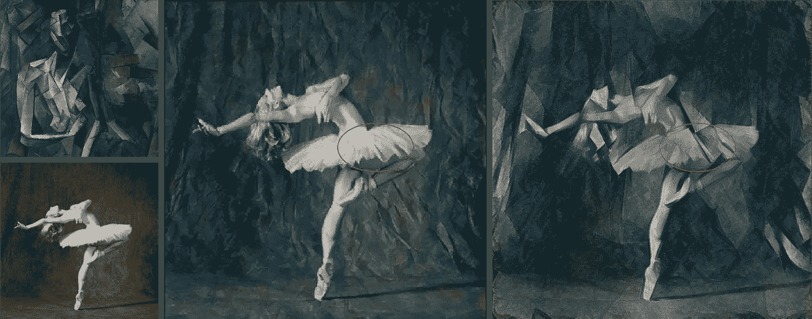
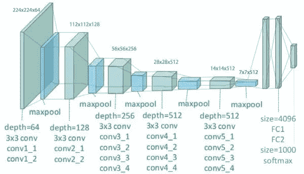
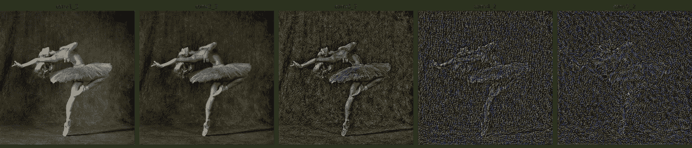
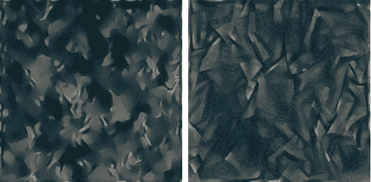
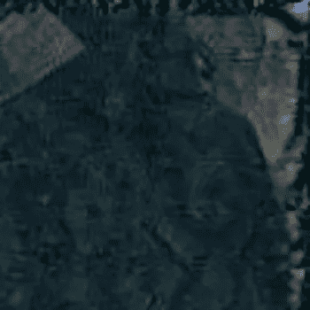

# 如何用神经风格迁移获得漂亮的结果

> 原文：<https://towardsdatascience.com/how-to-get-beautiful-results-with-neural-style-transfer-75d0c05d6489?source=collection_archive---------7----------------------->

## 深入探究使神经类型转移起作用的技巧

我最近对用机器学习生成中等轮廓图片产生了兴趣。这让我深深陷入了神经类型转移的领域。虽然 NST 在概念上很容易理解，但生成高质量的图像却异常困难。有许多错综复杂的细节和未提及的技巧，你必须正确实施，以获得巨大的成果。在本文中，我们将深入探讨神经类型转移，并详细检查这些技巧是什么。

在媒体和其他出版物上有许多关于 NST 的可靠介绍，所以我不会浪费任何时间来复习基础知识。如果你不知道 NST 是什么(或者你想跟随这篇文章),一个很好的开始方式是查看[官方 PyTorch 教程](https://pytorch.org/tutorials/advanced/neural_style_tutorial.html)。不幸的是，与许多其他介绍性文章一样，最终的实现充其量只能产生一般的结果(图 1)。我们将在接下来的几节中更新教程代码，以提高传输质量，但首先我们要谈一个话题。

*本文的所有附带代码都可以在*[*my GitHub*](https://github.com/EugenHotaj/nn-hallucinations)*上找到。*

图 1:两种不同实现的神经风格传输质量的比较。(左下角)我们要匹配其内容的图像。(左上)我们想要匹配其样式的图像。(中间)使用 PyTorch 教程实现的样式传递结果。(右)使用本文中详细介绍的实现的风格转换结果。生成的图像在视觉上具有更高的质量，并且更忠实地匹配风格图像的风格。

# 题外话:为什么克矩阵测量风格？

大多数介绍神经类型转移的 [Gatys 等人的论文](https://arxiv.org/abs/1508.06576)简单易懂。然而，一个没有解决的问题是，为什么 Gram 矩阵是表示风格(即纹理)的自然方式？

在高层次上，Gram 矩阵测量同一层中不同特征地图之间的相关性。特征映射只是卷积层的激活后输出。例如，如果一个卷积层有 64 个滤波器，它将输出 64 个特征图。然后，Gram 矩阵测量图层中每个要素地图和每个其他要素地图之间的相关性(相似性),而不必关心精确的像素位置。为了说明为什么这是一个合理的纹理测量，假设我们有两个过滤器，一个检测蓝色的东西，一个检测螺旋。我们可以将这些滤波器应用于输入图像，以产生 2 个滤波器图，并测量它们的相关性。如果过滤贴图高度相关，那么图像中出现的任何螺旋几乎肯定是蓝色的。这意味着图像的纹理由蓝色螺旋组成，而不是红色、绿色或黄色螺旋。

虽然这个解释仍然让我有点不安，但在纹理合成社区，Gram 矩阵对应于样式似乎是一个被广泛接受的事实，正如[这篇文章](https://ptrrupprecht.wordpress.com/2017/12/05/understanding-style-transfer/)所解释的。此外，我们不能否认，我们使用 Gram 矩阵得到的结果令人印象深刻。

# 修复 PyTorch 实现

提高传输质量的第一步是修复 PyTorch 教程的实现。本教程试图忠实于 Gatys 等人的论文，但在此过程中遗漏了一些东西。首先，论文的作者用一个`AvgPool2d`代替了`MaxPool2d`，因为他们发现它产生了更高质量的结果。另一个细节是，本教程计算卷积输出的`ContentLoss`和`StyleLoss`，而不是 ReLU 激活。这更像是吹毛求疵，因为我没有注意到在我的实验中使用卷积和 ReLUs 之间有很大的区别。

图 VGG19 网络及其层([来源](https://www.researchgate.net/figure/llustration-of-the-network-architecture-of-VGG-19-model-conv-means-convolution-FC-means_fig2_325137356))。

教程和论文之间最惊人的区别是“错误的”层分别用于`ContentLoss`和`StyleLoss`。我在引号里写错了，因为层的选择很大程度上是主观的，很大程度上取决于什么能产生最令人愉快的风格。也就是说，我们可以用一些经验法则来指导我们的决定。当测量内容相似性时，当在`content_img`和生成的`input_img`之间存在像素完美匹配时，较低层倾向于最高度激活。我们越深入网络，这些层就越不关心精确的匹配，相反，当特征通常处于正确的位置时，它们就会高度激活。为了可视化每一层最关心的是什么，我们可以设置`style_weight=0`并使用不同的层作为`content_layer`在随机的`input_img`上运行训练过程。

图 3:可视化 VGG19 网络不同层响应的内容。网络中更靠右的层更深。

本教程使用第四个卷积(图 2 中的`conv2_2`)作为内容层。正如我们在上面的图 3 中看到的，这可能是一个太低的层，不能用于内容，因为网络仍然关心在这个深度匹配像素。Gatys 等人用`conv4_2`代替，它更关心整体的特征排列，而不是单个像素。

就风格而言，较低层对小的重复特征作出反应，而较高层则捕捉更抽象的整体特征。因此，为了传递`style_img`的整体风格——从底层细节到总体主题——我们应该在网络中包含所有深度的层。本教程使用前 5 个卷积层，但这些都是相当低的网络，不太可能捕捉全局特征。Gatys 等人使用了`conv1_1`、`conv2_1`、`conv3_1`、`conv4_1`和`conv5_1`，这是一种跨越整个网络层次的良好分层分布。我们可以使用我们用于内容的相同方法来可视化每一层选择的优化样式。为此，我们设置`content_weight=0`，指定我们想要使用哪个`style_layers`，并随机运行训练过程`input_img`。

图 4:(左)PyTorch 教程中选择的图层产生的样式。(右)在 [Gatys 等人的论文](https://arxiv.org/pdf/1508.06576.pdf)中选择的图层产生的风格。

正如预期的那样，由教程层优化的样式捕获了低级的、重复的特征，但是未能捕获高级的、全局的特征。

# 提高传输质量

到目前为止，我们已经实现的修复应该让我们相当接近 Gatys 等人的论文中看到的质量。从这里，我们将更深入，看看接下来我们可以采取什么措施来生成更好的图像。

我从论文中改变的第一件事是将优化器从`L-BFGS`切换到`Adam`。在论文中，作者声称`L-BFGS`导致更高质量的传输，但我在实验中使用`Adam`时没有注意到差异。此外，`Adam`似乎更稳定，尤其是在训练大量步数或大幅度`style_weight`时。在这些情况下，`L-BFGS`似乎`NaN`出来了，可能是由于爆炸梯度(虽然我没有看得太深)。

另一个小调整是将`mse_loss`(即 L2 损失)切换到`l1_loss`。我想不出一个很好的理由来使用 L2 损失进行风格转换(除了在 0 的可微性)，因为平方项严重惩罚离群值。正如前面提到的，我们并不真正关心像素的精确匹配，可以容忍生成的图像中有一些异常值。事实上，当样式和内容特征融合在一起时，离群值甚至可能会导致视觉上更令人愉悦的结果。最后，[特性可视化](https://distill.pub/2017/feature-visualization/)——相关主题的必读文章——的作者也使用`l1_loss`完成他们的任务，可能是出于类似的原因。

实际上，许多用于生成高质量特征可视化的技巧优雅地转移到了神经风格转移上。事实上，FV 和 NST 在概念上非常相似，只是它们生成`input_img`的方式不同。在 NST 中，`input_img`经过优化，以与`content_img`和`style_img`相同的方式激活网络中的不同层。另一方面，FV 不使用`content_img`和`style_img`，而是生成一个`input_img`，最大限度地激发不同层中的神经元。

图 5:由激进的数据扩充引起的生成图像右上方边缘的旋转伪影。

我从 FV 借鉴的一个技巧是在`input_img`上使用数据增强。这与常规的分类任务完全一样:在每一步，我们对`input_img`应用一些增强(例如，旋转、裁剪、调整大小等。)然后在模型中运行并计算损失。通过在每一步增加`input_img`，我们迫使`input_img`产生对微小扰动具有鲁棒性的特征。这些健壮的特征应该包含较少的高频伪像，并且通常看起来更具视觉吸引力。然而，我发现特性可视化文章中使用的增强非常激进，必须适当地缩小它们。即便如此，在生成的图像边缘仍然会出现一些旋转伪影(图 5)。消除这些伪像的最简单的方法是将图像向下裁剪几个像素🙃。

最后，我做的最后一个修改是将`content_layer`换成`conv3_2`，而不是 Gatys 等人使用的`conv4_2`。我读的大多数文章也推荐`conv4_2`，尽管我发现在`conv4_2`细节会被洗掉，而且风格会压倒生成图像中的内容。另一方面，`conv3_2`仍然保持了这些细节，而没有像下层那样过度牺牲像素的完美性。事实上，我们可以通过再次查看图 3 来确认这一点。

# 进一步提高质量

我们现在已经讨论了我在我的神经风格转换[代码](https://github.com/EugenHotaj/nn-hallucinations)中实现的所有技巧。在这一点上，我们已经大大提高了原始 PyTorch 教程的传输质量。此外，`content_weight`和`style_weight`对于特定的图像选择更加健壮。例如，在 PyTorch 教程中，我发现如果没有适当的调整，一组图像上的好的`style_weight`不容易转移到另一组。

也就是说，通过尝试去除生成图像中的高频噪声，有可能获得更好的结果。我遇到的最有趣的方法来自文章[可微分图像参数化](https://distill.pub/2018/differentiable-parameterizations/#section-styletransfer)——另一篇涉及类似主题的必读文章。在本文中，作者通过首先在(去相关)傅立叶空间而不是(相关)像素空间中对其进行参数化来生成`input_img`。由于`input_img`是通过梯度下降生成的，去相关输入充当预处理程序，通过允许梯度下降更快地找到最小值，使优化更容易(类似于[在监督学习任务中移除相关特征](https://www.quora.com/Why-is-it-important-to-remove-correlated-features-in-machine-learning))。我还不完全清楚为什么会导致更高质量的传输，除此之外，像去相关空间中的最小值这样的手动波动解释更广泛、更可靠。

一种更简单的方法是通过直接或间接抑制高频噪声。通过将`input_img`的[总变化损失](https://en.wikipedia.org/wiki/Total_variation_denoising)加到优化目标上，可以直接惩罚噪声。相反，可以通过在每个梯度下降步骤之后模糊`input_img`，或者在将梯度应用到`input_img`之前模糊梯度，来隐式地惩罚噪声。这两种方法的一个问题是它们也不利于真正的高频特征。这可以通过在训练期间缩小总变化损失或模糊量而得到某种程度的改善。

# 结论

如果你已经做到这一步，你现在应该知道很多关于用神经风格转换生成美丽图像的知识。虽然在概念上很简单，但是获得高质量的结果需要非常小心。我最初的目标是使用机器学习来生成中等轮廓的图片。经过多次反复试验，我想我偶然发现了一些看起来相当惊人的东西。对我来说，整个过程中最令人兴奋的部分是神经网络的端到端可微性。只需很少的努力，我们就能够“反转”一个最初被训练来区分猫和狗的模型，并使用它来生成无数不同风格的图像。尝试在随机森林中这样做。

如果你喜欢这篇文章，请关注我，以便在我发布新内容时得到通知。所有代码都可以在我的 GitHub 上找到。

欧根·霍塔杰，
2020 年 3 月 27 日

# 脚注

1.  稳健的特性也已经[显示](https://reiinakano.com/2019/06/21/robust-neural-style-transfer.html)在非 VGG 架构中产生高质量的传输结果。由于[尚未被理解的原因](https://www.reddit.com/r/MachineLearning/comments/7rrrk3/d_eat_your_vggtables_or_why_does_neural_style/)，非 VGG 架构不能开箱即用地进行神经类型转移。