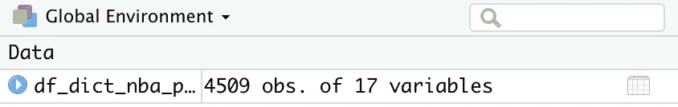
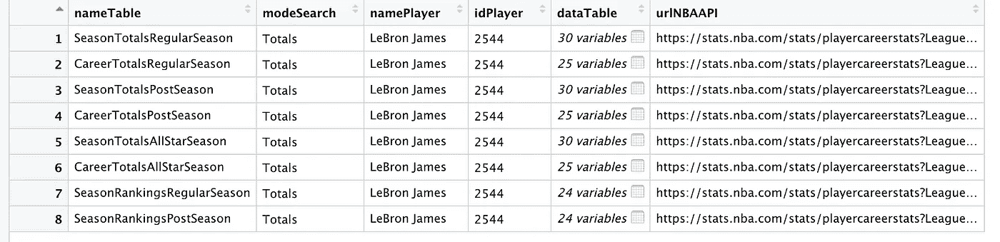
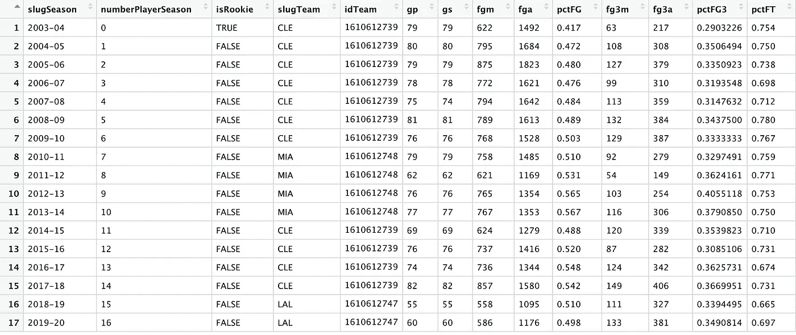
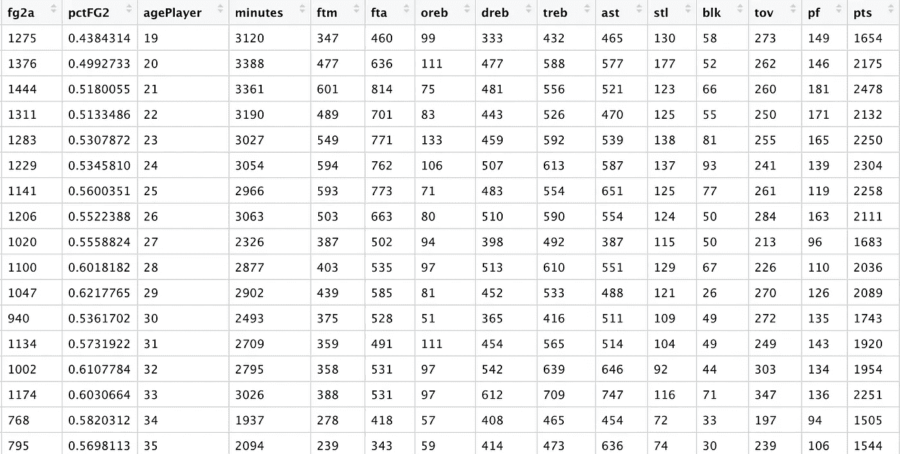

# 如何使用 R 获得每个 NBA 球员的数据

> 原文：<https://towardsdatascience.com/how-to-get-data-on-every-nba-player-using-r-62abcacd65e1?source=collection_archive---------19----------------------->

## 篮球| NBA

## nbastatR 的美丽、简单和快速


照片由 [JC Gellidon](https://unsplash.com/@jcgellidon?utm_source=medium&utm_medium=referral) 在 [Unsplash](https://unsplash.com?utm_source=medium&utm_medium=referral)

```
**In this article you'll learn how to:**
- install and load nbastatR
- get every NBA player loaded into R
- get a player's career statistics
```

NBA 赛季暂停了。你可以把它看成一个负面的东西，然后重复看《最后的舞蹈》。

或者，你可以将此视为一个机会，最终学习如何在 NBA 上做一些数据科学，并真正了解联盟和球员的历史。

# 安装和加载

有几个 R 包可以让你抓取 NBA 数据。我使用名为 nbastatR 的方法，因为在我看来它是实现最好的方法。要安装该软件包，请使用以下命令:

```
devtools::[install_github](https://www.rdocumentation.org/packages/devtools/topics/reexports)("abresler/nbastatR")
```

那么你需要做的就是使用:

```
[library](https://www.rdocumentation.org/packages/base/topics/library)(nbastatR)
```

# 基本功能:获得每个 NBA 球员

nbastatR 中有很多函数，但让我们首先使用以下函数获得每个 NBA 球员的矩阵:

```
[assign_nba_players()](http://asbcllc.com/nbastatR/reference/assign_nba_players.html)
```

这将[为每个 nba 球员加载一个名为“df_dict_nba_players”的 tible](https://medium.com/r-tutorials/r-functions-daily-read-csv-3c418c25cba4)。永远不会。



每个观察都是一个玩家，每个玩家有 17 个变量。直接相关的是:

*   **namePlayer** :玩家的名字(咄)
*   **idPlayer:** 玩家的 id 号(*注:这个其实超级重要*)
*   **isActive:** 表示玩家是否正在玩游戏

您可以在闲暇时探索其他变量。重要的是，你现在知道每个球员的身份证号码。虽然如果使用球员姓名，nbastatR 中的许多功能仍然可以工作，但一些 NBA 球员有类似的姓名，很容易出现拼写错误。如果你使用一个玩家的 id，你永远不会有这些问题。

# 获取玩家数据集

让我们用 nbastatR 的“球员 _ 职业生涯”函数来做一个快速获取勒布朗·詹姆斯数据的例子。

players_career 函数至少只需要一个输入:

*   玩家标识符

您可以在 R 中使用

```
players_careers(players = c("LeBron James"))
```

*注意:你可以使用 players _ careers(players = " LeBron James ")来代替，但我把它作为一个列表，以防我想找到不止一个球员的数据。*

调用此函数将返回 8 个表:

*   dataplayercarertotalsallstarseason
*   dataPlayerCareerTotalsPostSeason 季
*   数据播放目录定期
*   季后赛
*   数据播放季节
*   dataplayersaasontotalsallstarseason
*   数据播放季节总计发布季节
*   数据播放季节总计常规季节

每个 tibbles 中都有大量数据。您应该探索每一个都给了您什么，以便更好地了解 nbastatR 的功能。

或者，您可以调用勒布朗的球员 id，而不是他的名字，使用:

```
players_careers(player_ids = c(2544))
```

这将给出完全相同的结果，但我更喜欢使用 player_ids 方法，因为我知道它不会给我关于其他不如勒布朗出名的球员的错误。

如果需要更具体的东西，您还可以添加另一个名为“mode”的输入，并将数据加载到一个变量中。

例如，要获得勒布朗的职业生涯总成绩，您可以使用:

```
lebron_totals <- players_careers(players = c("LeBron James"),
                modes = c("Totals"))
```

您现在有一个如下所示的 tibble:



nameTable 变量告诉您每个 dataTable 变量中究竟存储了什么数据。如果你点击一个数据表变量，它会打开另一个包含更多数据的表。

例如，点击 SeasonTotalsRegularSeason 的数据表，你会看到一个包含勒布朗在 NBA 每个赛季的常规赛总成绩的表格。(这是两张截图，因为我无法在一个屏幕上显示所有变量):



模式输入需要以下名称之一:

*   总数
*   PerGame
*   Per36

因此，如果你对一个球员的每场比赛或每 36 分钟的数据更感兴趣，可以使用其他模式。您也可以使用以下命令调用所有三种模式:

```
lebron_career <- players_careers(players = c("LeBron James"),
                modes = c("Totals", "PerGame", "Per36"))
```

这将为您提供一个应用了所有三种模式的“表格”。

这只是冰山一角。nbastatR 还有很多其他功能。这只是用 r 获取玩家数据的一个基本方法。

有很多数据要探索，所以尽情享受吧！如果你有具体的问题想让我在以后的帖子中回答，请在下面的评论中告诉我。

# 资源

[http://asbcllc.com/nbastatR/](http://asbcllc.com/nbastatR/)