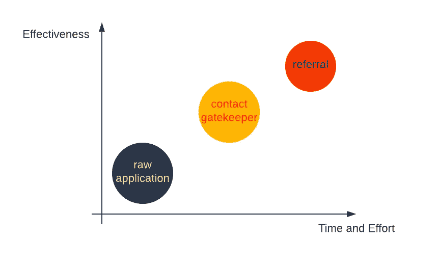
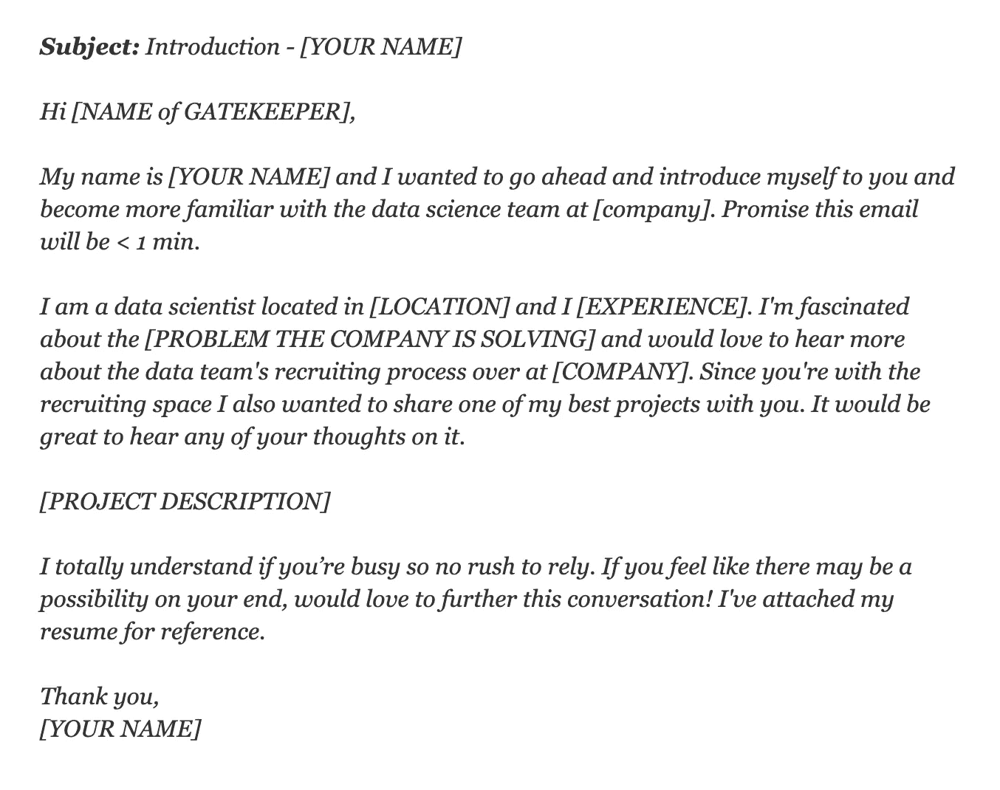
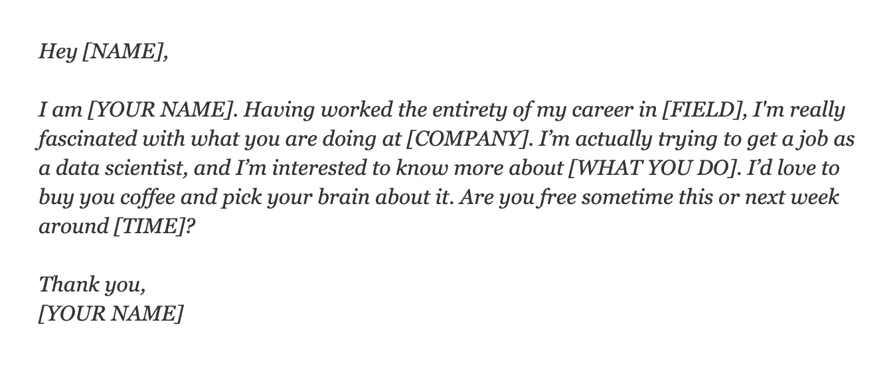
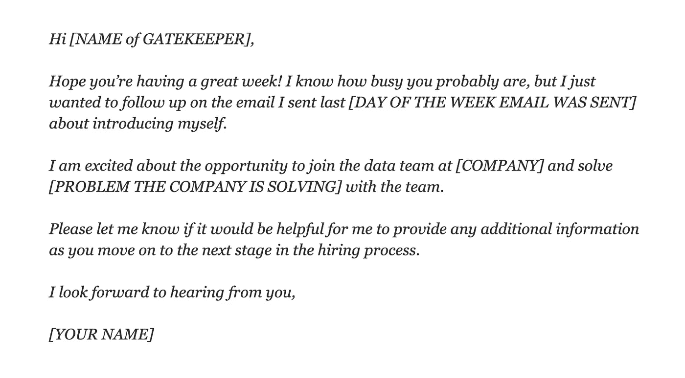

# 如何获得数据科学面试:找工作、联系看门人和获得推荐

> 原文：<https://towardsdatascience.com/how-to-get-data-science-interviews-finding-jobs-reaching-gatekeepers-and-getting-referrals-63a51c0078af?source=collection_archive---------5----------------------->

## [数据科学面试](https://towardsdatascience.com/tagged/data-science-interview)

照片由[布鲁斯·马尔斯](https://unsplash.com/@brucemars?utm_source=medium&utm_medium=referral)在 [Unsplash](https://unsplash.com?utm_source=medium&utm_medium=referral) 上拍摄

对于许多工作来说，获得面试机会自然是必不可少的，数据科学工作也不例外。虽然关于这个主题的资源肯定不缺乏，但实用和可操作的建议却很少。在我的求职过程中，我知道超过 70%的求职者通过某种形式的网络找到了工作。我知道我应该"*联系招聘人员，建立自己的关系网，在这个领域闯出一片天地"*。但即使知道这一点，我仍然有一个重要的问题:**如何**？

我第一次找数据科学工作是在 2017 年 2 月我即将完成研究生学业的时候。我尽我所能去采访，包括…

*   LinkedIn、GlassDoor 上的数百份申请，事实上
*   向所有社交网络上的人(校友、有共同朋友的人)寻求推荐
*   在谷歌上搜索并尝试了所有文章中推荐的方法(除了创建我自己的数据科学工作)，如“*获得数据科学面试的 10 大方法*”、*“获得数据科学工作的 5 个技巧*”和“*如何获得数据科学工作:一个可笑的具体指南*”。
*   我花了很多时间来创建、格式化和精炼我的简历

在以一份全职工作的承诺(即每天至少花 8 小时)找了三个月的工作后，我终于通过 AngelList 获得了第一次面试机会。

我第二次发现自己在寻找数据科学工作是在 2018 年 12 月被我当时的创业公司解雇的时候。这一次，通过 50 份申请和 18 次推荐，我在一个月内获得了 10 次面试机会(总共花了不到 30 个小时)。这种巨大的差异并不是因为我有工作经验。事实上，第二次在就业市场上，我并没有更有竞争力。这种剧烈的变化是因为我第一次就做错了！这并不是因为关于获得数据科学面试的文章是误导性的或不正确的，而是它们只告诉我做什么而不是如何做。

在这篇文章中，我不仅会分享该做什么(只有 3 种方法而不是 10 种)以及如何有效地获得面试。你会在这篇文章中找到策略、脚本和其他免费资源，它们将帮助你有条不紊地寻找工作。具体来说，这篇博客回答了这些问题:

*   我应该去哪里找数据科学的工作？
*   我如何联系看门人？
*   我如何获得推荐？
*   一份好的数据科学简历是由什么构成的？

如果你认为我能以任何方式让你的旅程更轻松，你可以在这里联系我。

在我们开始之前，你更喜欢视频吗？看这个 YouTube 视频而不是阅读。

# **目录**

1.  [三种方法](#c4c7)
2.  原始应用程序:在哪里搜索很重要！
3.  [与看门人接触:向更多的面试问好](#cf57)
4.  [获得推荐:去你梦想中的公司面试的最佳方式](#6861)
5.  [优秀简历的品质](#f345)
6.  [最终想法](#7dba)

# **三种方法**

获得面试机会有三种方式:**原始申请**，**联系把关人**，以及**获得推荐**。原始申请意味着简单地将你的简历提交给空缺职位。虽然这是一个简单的方法，但它的效率也很低。联系看门人可能更有效，但需要更多的努力。获得推荐是最有效的方式，但也最耗费时间和精力(假设你还不知道有谁愿意推荐你)。下图从工作量/时间和有效性方面展示了这三种方法。

图片由[艾玛丁](https://medium.com/@emmading) |获得面试机会的三种方式

# 原始应用程序:在哪里搜索很重要！

当我们在找工作时第一次想到要查看求职信息时，我们通常会立即转向热门的在线求职信息，如 LinkedIn、GlassDoor 或 Indeed。我第一次找工作时，在 LinkedIn 上提交了数百份申请，但没有得到任何回复。事实上，我的一些正在进行职业转型的朋友也发现自己在 LinkedIn 上没有得到回复。当我开始第二次找工作时，我没有在 LinkedIn 上提交一份申请。

为什么？问题是，对于每个职位，数百名申请人在一周内申请。如果你仅仅依靠这些受欢迎的求职网站，你得到回复的机会很小。你在和堆积如山的候选人竞争！

不幸的是，事实是，近年来，LinkedIn 已经成为一个服务于招聘人员的平台，这些招聘人员希望接触到具有确切经验和资格的潜在候选人。它不是一个为缺乏经验的求职者服务的平台，因为你必须与数百(有时数千)名申请人竞争一个职位。

解决这个问题的一个方法是**申请不太受欢迎的网站**。使用尚未成为主流的网站。怀疑？Edouard Harris 在他的[博客](/what-no-one-will-tell-you-about-data-science-job-applications-bff2d4b5e983)中很好地解释了为什么“*公司更关注通过不太为人知的渠道*申请的人。以下是我和我认识的人尝试过的一些网站，它们被证明是有帮助的。有些甚至是专门与数据科学相关的。

*   [Kaggle Jobs](https://www.kaggle.com/jobs)
*   [KDNuggets 乔布斯](https://www.kdnuggets.com/jobs/index.html)
*   [数据科学中心—分析人才](https://www.analytictalent.datasciencecentral.com/)(以美国为中心)
*   [数据作业](https://datajobs.com/)(以美国为中心)
*   [icruncdata](https://icrunchdata.com/jobs/)(以美国为中心)
*   [r/数据科学作业](https://www.reddit.com/r/DataScienceJobs/)
*   [三字节—数据科学](https://triplebyte.com/users/start?track=data)

此外，还有一些规模较小的在线招聘网站的回复率比三大网站更高。

*   AngelList——我通过它获得了我的第一份数据科学工作！
*   [黑客新闻](https://news.ycombinator.com/jobs)
*   [Github 乔布斯](https://jobs.github.com/positions)
*   [录用了](https://hired.com/)
*   [SmartHires](https://www.smarthires.com/)
*   [白松露](https://whitetruffle.com/)
*   [ZipRecruiter](https://www.ziprecruiter.com/)

无论何时申请任何职位，试着给招聘的人发一封个性化的短信。调查这家公司(使用公司网站、谷歌和 Glassdoor ),解释为什么你最适合这个职位。个性化会大大增加你得到回应的机会。

# **向看门人伸出手:向更多的采访问好**

照片由[奥斯丁·迪斯特尔](https://unsplash.com/@austindistel?utm_source=medium&utm_medium=referral)在 [Unsplash](https://unsplash.com?utm_source=medium&utm_medium=referral) 上拍摄

尽管我推荐的网站往往比大型招聘网站的回复率更高，但招聘人员仍然需要几周时间才能回复，因为他们总是有一大堆简历要审阅。现在，您可能想尝试第二种方法——直接联系看门人。使用这种方法，我能够比原始应用程序更快地获得响应。

看门人指的是你感兴趣的公司中的技术招聘人员或数据科学家。大公司通常有专门聘请数据科学家的技术招聘人员，但小公司的数据团队可能更独立。如果你能赢得看门人的信任，这可能会让你在招聘过程中继续前进。

以下是赢得看门人的几个步骤:

*   整理一份你感兴趣的公司的个人名单(即使目前没有空缺)
*   通过访问公司网站或使用 LinkedIn 找到把关者的联系信息(您可能会在同一家公司找到多个把关者)
*   开发一个能吸引看门人注意力的电子邮件推介
*   如果一周左右没有回音，发一封跟进邮件，继续跟进，直到你被拒绝

电子邮件的推介应该**简洁而完整**。你的电子邮件可能会被转发给不同的人，没有人会为你复制和粘贴多封电子邮件，所以营销需要有一切。一份好的电子邮件推介包含两个部分:

*   第一部分是一个简短的介绍(2-3 句话),包括你的意图，你的经历的简要描述，以及你为什么对这家公司感兴趣。再次强调，对公司做一些调查将会非常有助于以一种特定的方式表达你的兴趣。
*   第二部分是关于你最有影响力的项目。确保这是有趣的，可读的，可分享的。

为了使事情更简单，这里有一个模板。

*此电子邮件模板已更新自* [*吸取了惨痛的教训:黑客数据科学访谈*](https://youtu.be/3BRLGRqj8ps) *作者格雷格·卡姆拉德*

如果你在几天内得到回复，那太好了！但是如果你在一周左右没有收到，给看门人发一封**跟进邮件**。根据我自己和我朋友的经验，后续邮件的回复率高于第一封邮件。这是我在后续邮件中使用的模板:

*此电子邮件模板已更新自* [*如何跟进工作申请:电子邮件模板*](https://www.themuse.com/advice/how-to-follow-up-on-a-job-application-an-email-template) *作者 Alex cavulacos*

虽然您当然可以使用这两个模板作为起点，但是不要**而不是**复制它们。如果看门人看到完全一样的邮件模板，会留下负面印象。你可以改变事情。你可以把它变长或变短。请记住，主要的想法是显示您的兴趣，并发送所有必要的东西。

# 获得推荐:去你梦想中的公司面试的最佳方式

照片由[克里斯蒂娜@ wocintechchat.com](https://unsplash.com/@wocintechchat?utm_source=medium&utm_medium=referral)在 [Unsplash](https://unsplash.com?utm_source=medium&utm_medium=referral) 上拍摄

第一次找工作时，我联系校友、有共同朋友的人，甚至是随机的人来获得推荐。然而，我最终什么也没得到。相比之下，我第二次找工作时，我的人际网络中的人告诉我，他们愿意介绍我，甚至在我开口之前。

随着时间的推移，我已经了解了一些关于请求推荐的误解。获得推荐就是让熟悉你工作的人给他们的公司一份热情的推荐。这不是你在 LinkedIn 或其他地方找到的与陌生人争论的问题。况且大多数时候，后一种方法是行不通的。

获得推荐不同于主动联系看门人，因为它始于与在科技公司工作的人建立关系，不管他们的职业是什么。无论是产品经理、软件工程师、产品设计师，还是其他。一段感情要走很长的路。Haseeb Qureshi 有一篇关于进入科技行业的[的博文](https://haseebq.com/how-to-break-into-tech-job-hunting-and-interviews/)。关于网络的部分尤其精彩。库雷希说…

> *…人们* ***讨厌你向他们求职。***
> 
> *给你一份工作？为什么？他们不了解你。他们为什么会给你工作？他们为什么要在你身上浪费时间？*
> 
> *信息面试的力量在于，你可以让他们了解你，而不是让他们了解你。人们喜欢谈论自己。他们喜欢教别人。他们想帮忙。但是他们不想被陌生人纠缠着要好处。*
> 
> 如果你继续这样做，人们会看到你的好奇心和你的真诚。他们会相信你的故事，他们会 ***想要*** *指代你。*

这听起来像是很多工作，尤其是当你以前没有做过的时候，但实际上只有 4 个步骤来正确地建立关系:

*   **给人买咖啡**。在疫情期间这可能不容易做到，所以你可以要求一个简短的缩放聊天。
*   **进行信息面试**。你要表现出对这个人、他们的工作以及他们的公司的兴趣。
*   第二天通过电子邮件感谢他们并跟进。你不想做一次性连接。一段感情是需要维持的。
*   一旦有人愿意推荐你，你要**让它顺利推荐**。与其问“你们公司有空缺吗”，不如自己去看看公司网站，找到最适合你的空缺。然后准备一封电子邮件，附上你的简历、工作链接、对你经历的描述，以及对你为什么非常适合的解释。

正是这些步骤让我在第二次找工作时得到了推荐。如果你遵循所有这些步骤，你会得到强有力的推荐！这不仅有助于你第一次找工作，也有助于未来的求职。

下面是一个冷邮件模板，你可以用来作为第一次外联的参考。这里的要点是要使它个性化，并显示出你真正的兴趣。

此电子邮件模板已由 Haseeb Qureshi 更新为[如何打入科技行业](https://haseebq.com/how-to-break-into-tech-job-hunting-and-interviews/)

还是那句话，世界很小。**不要完全照搬剧本**。花时间定制你的信息，因为从长远来看，这是值得的。

# **优秀简历的特质**

照片由[斯科特·格雷厄姆](https://unsplash.com/@sctgrhm?utm_source=medium&utm_medium=referral)在 [Unsplash](https://unsplash.com?utm_source=medium&utm_medium=referral) 上拍摄

根据你的目标和时间，你可以选择三种方法中的一种或多种来获得面试机会。但是不管你用哪种方法，一份好的简历都是关键。这是能让招聘者扭转局面的东西。

简历是你成就的总结。它应该是简短的，所以它不是一个展示你知道或能做的一切的地方。添加过多的内容只会让人们被不必要的信息淹没。因此，在你的数据科学简历中，你希望突出与数据科学相关的最重要的东西，如工作经验、培训和相关技能。当招聘人员或招聘经理看到你的简历时，他们应该会立即感觉到你在数据科学方面有丰富的经验，并且你是一个合格的候选人。

这里有几条写简历的规则，是我在测试了自己的简历，与许多招聘人员和招聘经理交谈，并审阅了其他人的简历后创建的。

## 避免危险信号:

*   一份好的简历总是一页长。招聘人员和人事经理一天会收到很多简历，他们通常只有不到一分钟的时间浏览简历并做出决定。如果你的简历有多页，他们可能不会看到第二页。
*   **不要有错别字。在发送之前，请朋友进行同行审查，确保没有打字错误或语法错误。**

## 改进你的简历:

*   **有选择性，有策划**。从你最有影响力的经历、项目和技能开始。在“经验”和“项目”部分，确保每个项目不超过 4 个要点。第一个要点应始终是根据业务指标衡量的最有影响力的要点，如用户保留率或转换率的提高、跳出率或成本的降低等。
*   **言简意赅。你的简历展示了你的沟通技巧，为了表明你能有效地沟通，你应该注意去掉多余的短语，重新安排冗长的表达。**

## 让你的简历脱颖而出:

*   **不要讲，展示数字和度量。**在描述你的经历和项目时，展示你通过业务指标衡量的贡献。展示所处理数据的大小和类型，并引用您使用的确切技术。具体一点会让你的简历更值得信赖。
*   **不要给所有的职位都发一份简历。**为每个应用添加定制的调整总是值得的。至少，如果你注意到工作描述中提到的重要关键词和技能，就在简历中使用它们，突出你在这些领域的技能。编造事情是不可以的，但是重组你的技能和经历以适应工作描述的背景是完全可以的。

# **最后的想法**

在一天结束时，获得数据科学面试是困难的，尤其是对初学者来说。即使你已经努力工作了几个月，但没有得到任何回应，这可能会令人沮丧。希望这篇文章能让那些正在找工作的有抱负的数据科学家明白一些事情。如果你想要更多的建议，请随时联系我[这里](https://www.datainterviewpro.com/contact-us)，我很乐意帮忙！

# 感谢阅读！

如果你喜欢这个帖子，想支持我…

*   *订阅我的* [*YouTube 频道*](https://www.youtube.com/channel/UCAWsBMQY4KSuOuGODki-l7A)
*   **跟我上* [*中*](https://medium.com/@emmading) *！**
*   **连接上*[*Linkedin*](https://www.linkedin.com/in/emmading001/)*！**
*   *前往[emmading.com/resources](https://www.emmading.com/resources)获取更多关于数据科学面试技巧和策略的免费资源！*

* [## 我是如何获得 4 份数据科学工作邀请，并在被解雇后两个月内收入翻倍的

### 获得 100%现场报价率的秘诀

towardsdatascience.com](/how-i-got-4-data-science-offers-and-doubled-my-income-2-months-after-being-laid-off-b3b6d2de6938)*