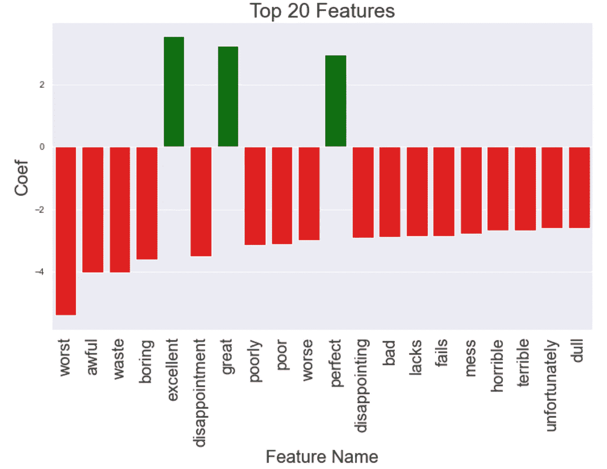
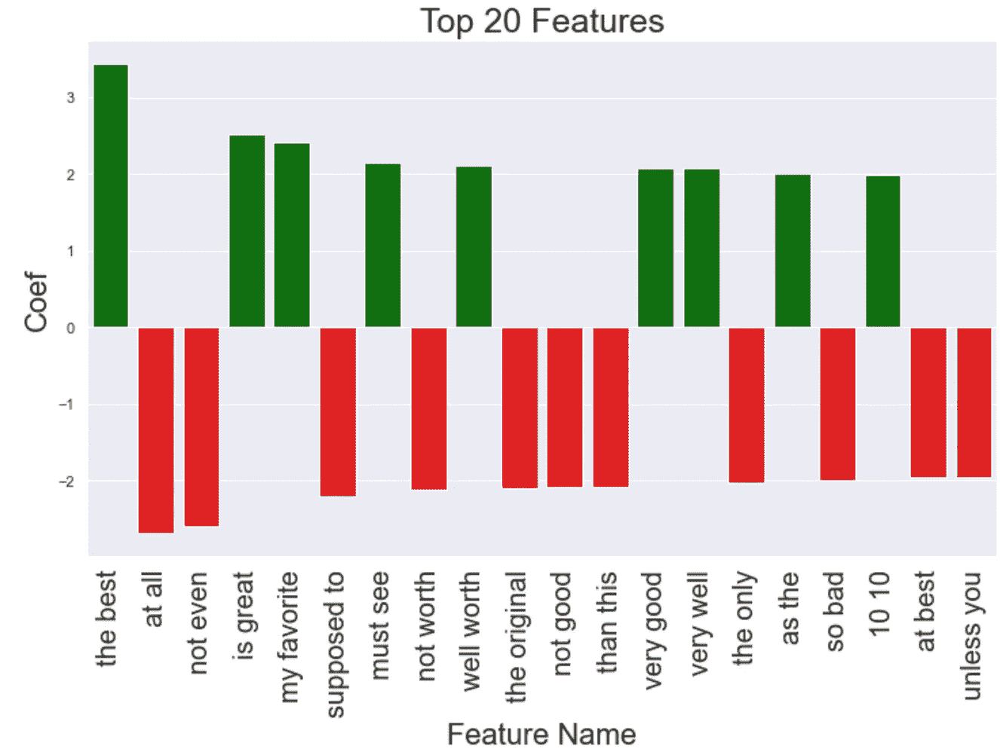

# 如何从任何 Sklearn 管道中获取特性重要性

> 原文：<https://towardsdatascience.com/how-to-get-feature-importances-from-any-sklearn-pipeline-167a19f1214?source=collection_archive---------9----------------------->

## [入门](https://towardsdatascience.com/tagged/getting-started)

## 管道可能很难导航，下面是一些通用的代码。


照片由[昆腾·德格拉夫](https://unsplash.com/@quinten149?utm_source=unsplash&utm_medium=referral&utm_content=creditCopyText)在 [Unsplash](https://unsplash.com/s/photos/pipeline?utm_source=unsplash&utm_medium=referral&utm_content=creditCopyText) 上拍摄

# 介绍

管道太神奇了！我基本上在我从事的每个数据科学项目中都使用它们。但是，轻松获得特性的重要性要比需要的困难得多。在本教程中，我将介绍如何从管道中访问单个特征名称及其系数。在那之后，我将展示一个通用的解决方案来获取几乎所有管道的特性重要性。

# 管道

让我们从一个超级简单的管道开始，它应用一个单独的特征化步骤，然后是一个分类器。

```
from datasets import list_datasets, load_dataset, list_metrics
from sklearn.pipeline import FeatureUnion, Pipeline
from sklearn.feature_extraction.text import TfidfVectorizer
from sklearn import svm# Load a dataset and print the first examples in the training set
imdb_data = load_dataset('imdb')classifier = svm.LinearSVC(C=1.0, class_weight="balanced")
model = Pipeline(
    [
        ("vectorizer", TfidfVectorizer()),
        ("classifier", classifier),
    ]
)
x_train = [x["text"]for x in imdb_data["train"]]
y_train = [x["label"]for x in imdb_data["train"]]
model.fit(x_train, y_train)
```

这里我们使用优秀的[数据集](https://pypi.org/project/datasets/) python 包来快速访问 imdb 情感数据。这个由 HuggingFace 整理的包有大量的数据集，它们都已经准备好了，所以你可以直接进入有趣的模型构建。

上面的管道在一个列表中定义了两个步骤。它首先接受输入并将其传递给 TfidfVectorizer，后者接受文本并将文本的 TF-IDF 特征作为向量返回。然后，它将该向量传递给 SVM 分类器。

注意这是如何按顺序发生的，TF-IDF 步骤，然后是分类器。您可以链接任意多的特征化步骤。例如，上述管道相当于:

```
model = Pipeline(
    [
        ("vectorizer", CountVectorizer()),
        ("transformer", TfidfTransformer()),
        ("classifier", classifier),
    ]
)
```

在这里，我们甚至更多地手动操作。首先，我们得到每个单词的计数，其次，我们应用 TF-IDF 变换，最后，我们将这个特征向量传递给分类器。TfidfVectorizer 一步就完成了这两项工作。但这说明了一点。**在原始管道中，事情按顺序执行。**稍后我们将讨论如何将特性堆叠在一起。现在，让我们努力获得第一个示例模型的特性重要性。

# 特征重要性

管道使得访问单个元素变得容易。如果您在培训后打印出模型，您将会看到:

```
Pipeline(memory=None,
         steps=[('vectorizer',
                 TfidfVectorizer(...)
                ('classifier',
                 LinearSVC(...))],
         verbose=False)
```

也就是说有两个步骤，一个叫做`vectorizer`，另一个叫做`classifier`。我们可以通过查看管道的`named_steps`参数来访问它们，如下所示:

```
model.named_steps["vectorizer"]
```

这将返回我们拟合的 This 矢量器。相当整洁！Sklearn 中的大多数特征化步骤还实现了一个`get_feature_names()`方法，我们可以通过运行该方法来获得每个特征的名称:

```
# Get the names of each feature
feature_names = model.named_steps["vectorizer"].get_feature_names()
```

这将为我们提供矢量器中每个特征名称的列表。然后我们只需要从分类器中获取系数。对于 Sklearn 中的大多数分类器来说，这就像获取`.coef_`参数一样简单。(集合方法略有不同，它们有一个`feature_importances_`参数代替)

```
# Get the coefficients of each feature
coefs = model.named_steps["classifier"].coef_.flatten()
```

现在我们有了分类器中的系数和特征名称。让我们把它们组合成一个好的情节。

```
import pandas as pd# Zip coefficients and names together and make a DataFrame
zipped = zip(feature_names, coefs)
df = pd.DataFrame(zipped, columns=["feature", "value"])# Sort the features by the absolute value of their coefficient
df["abs_value"] = df["value"].apply(lambda x: abs(x))
df["colors"] = df["value"].apply(lambda x: "green" if x > 0 else "red")
df = df.sort_values("abs_value", ascending=False)
```

想象一下:

```
import seaborn as snsfig, ax = plt.subplots(1, 1, figsize=(12, 7))
sns.barplot(x="feature",
            y="value",
            data=df.head(20),
           palette=df.head(20)["colors"])
ax.set_xticklabels(ax.get_xticklabels(), rotation=90, fontsize=20)
ax.set_title("Top 20 Features", fontsize=25)
ax.set_ylabel("Coef", fontsize=22)
ax.set_xlabel("Feature Name", fontsize=22)
```



所以我们可以看到，负面的单字似乎是最有冲击力的。那很酷。获得这些特性的重要性很容易。让我们尝试一个稍微复杂一点的例子。

# 从要素联合中获取要素重要性

在大多数真实的应用程序中，我发现我以复杂的方式将许多功能结合在一起。前面我们看到了管道如何按顺序执行每个步骤。我们如何处理多个同时发生的步骤？答案是 FeatureUnion 类。假设我们想要构建一个模型，在这个模型中，我们采用 TF-IDF 的二元模型特性，但是也有一些手工策划的二元模型。(参见我关于使用模型寻找好的 unigrams 的博文。)我们可以使用 FeatureUnion 来定义这个管道。FeatureUnion 接受一个`transformer_list`，它可以是转换器、管道、分类器等的列表。然后连接它们的结果。

```
classifier = svm.LinearSVC(C=1.0, class_weight="balanced")
vocab = {"worst": 0, "awful": 1, "waste": 2,
         "boring": 3, "excellent": 4}
model = Pipeline([
    ("union", FeatureUnion(transformer_list=[
        ("handpicked", TfidfVectorizer(vocabulary=vocab)),
        ("bigrams", TfidfVectorizer(ngram_range=(2, 2)))])
    ),
    ("classifier", classifier),
    ])
```

正如你所看到的，我们的模型有两个步骤，一个是 T4，一个是 T5。在`union`中，我们做了两个不同的特征化步骤。我们找到一组手工挑选的一元特征，然后是所有二元特征。

从这个模型中提取特征稍微复杂一些。我们必须进入联盟，然后获得所有的个人特征。让我们手动尝试一下，然后看看我们是否可以推广到任意管道。我们已经知道如何访问管道的成员，要进入 FeatureUnion 内部，我们可以直接查看`transformer_list`并遍历每个元素。所以代码应该是这样的。

```
handpicked = (model
              .named_steps["union"]
              .transformer_list[0][1]
              .get_feature_names())bigrams = (model
           .named_steps["union"]
           .transformer_list[1][1]
           .get_feature_names())feature_names = bigrams + handpicked
```

因为分类器是对单个向量进行操作的 SVM，所以系数将来自相同的地方并且处于相同的顺序。我们可以再次看到我们的结果。



看起来我们的二元模型比我们手工选择的二元模型信息量更大。

# 一般情况

因此，我们已经做了一些简单的例子，但现在我们需要一种方法来实现任何(几乎任何)管道和功能联合的组合。为此，我们求助于老朋友深度优先搜索(DFS)。我们将把管道看作一棵树。每一层都可以有任意数量的特征联合，但它们最终都会叠加成一个特征向量。遍历时大致有三种情况需要考虑。第一种是基本情况，我们在一个实际的转换器或分类器中，它将生成我们的特征。第二个是如果我们在管道中。第三种也是最后一种情况是当我们处于 FeatureUnion 内部时。让我们更深入地讨论这些。

## 案例 1:特征化步骤

这里我们想写一个函数，给定一个某种类型的特征，它将返回特征的名称。这是我们 DFS 中的基本情况。在 Sklearn 中，有许多不同类型的东西可用于生成特征。一些例子是聚类技术、降维方法、传统分类器和预处理器等等。每一种都允许您以不同的方式访问特性名称。例如，文本预处理器 TfidfVectorizer 实现了一个`get_feature_names`方法，就像我们上面看到的那样。然而，大多数聚类方法没有任何命名的特征，它们是任意的聚类，但是它们有固定数量的聚类。让我们编写一个助手函数，给定一个 Sklearn 特征化方法，它将返回一个特征列表。

在这里，我们尝试并列举一些可能发生在 Sklearn 内部的潜在情况。我们使用`hasattr`来检查所提供的模型是否有给定的属性，如果有，我们调用它来获得特性名称。如果该方法类似于聚类，并且不涉及实际命名的特征，那么我们通过使用提供的名称来构造我们自己的特征名称。例如，假设我们将这个方法应用到有两个组件的`PCA`，我们将步骤命名为`pca`，那么返回的结果特征名称将是`[pca_0, pca_1].`

## 深度优先搜索

现在我们可以实现 DFS 了。

让我们一起来解决这个问题。这个函数需要三样东西。首先是我们要分析的模型。这个模型应该是一个管道。第二个是我们想要提取的所有命名的特征化步骤的列表。在我们的上一个示例中，这是`bigrams`和`handpicked.`这是我们在模型中使用的各个步骤的名称。最后一个参数是我们正在查看的当前名称。这对于递归来说是必要的，在第一遍中并不重要。(我应该创建一个 helper 方法来对最终用户隐藏这一点，但是现在需要解释的代码较少)。

*   第 19–25 行构成了基本案例。它们处理步骤名称与我们所需名称列表中的名称匹配的情况。这对应于一个叶节点，它实际上执行特征化，我们希望从它那里获得名称。
*   第 26–30 行管理管道中的实例。当这种情况发生时，我们希望通过访问`named_steps`参数来获得每一步的名称，然后遍历它们来收集特征。我们遍历管道中的每个命名步骤，并在一个列表中获取所有的特性名称。
*   第 31–35 行管理我们在 FeatureUnion 时的实例。当这种情况发生时，我们希望从`transformer_list`参数中获得每个子转换器的名称，然后遍历它们来收集特性。

有了这些，我们现在可以使用任意嵌套的管道，比如说下面的代码，并以正确的顺序获得特性名称！

```
from sklearn.decomposition import TruncatedSVD
classifier = svm.LinearSVC(C=1.0, class_weight="balanced")
vocab = {"worst": 0, "awful": 1, "waste": 2,
         "boring": 3, "excellent": 4}
model = Pipeline([
    ("union", FeatureUnion(transformer_list=[
        ("h1", TfidfVectorizer(vocabulary={"worst": 0})),
        ("h2", TfidfVectorizer(vocabulary={"best": 0})),
        ("h3", TfidfVectorizer(vocabulary={"awful": 0})),
        ("tfidf_cls", Pipeline([
            ("vectorizer", CountVectorizer()),
            ("transformer", TfidfTransformer()),
            ("tsvd", TruncatedSVD(n_components=2))
        ]
        ))
    ])
     ),
    ("classifier", classifier),
])
```

在这个例子中，我们构造了三个手写的规则特征化器和一个子管道，该子管道执行多个步骤并导致维数减少的特征。我们可以使用一行代码从这个管道中获得所有的特性名称！

```
get_feature_names(model, ["h1", "h2", "h3", "tsvd"], None)
```

它会回来的

```
['worst', 'best', 'awful', 'tsvd_0', 'tsvd_1']
```

正如我们所料。

# 结论

有很多方法可以混合和匹配管道中的步骤，获得特性名称可能是一种痛苦。如果我们使用 DFS，我们可以按照正确的顺序提取它们。这种方法在 SciKit-Learn 的生态系统中的大多数情况下都有效，但我还没有测试所有的东西。要扩展它，你只需要查看你试图从中提取名字的任何类的文档，并用一个新的条件检查来更新`extract_feature_names`方法，如果想要的属性存在的话。我希望这有助于使管道更容易使用和探索:)。你可以在这里找到一个 Jupyter 笔记本，里面有这篇文章的一些代码示例[。和我所有的帖子一样，如果你遇到困难，请在这里评论或在 LinkedIn 上给我发消息，我总是很有兴趣听到人们的意见。编码快乐！](https://gist.github.com/nbertagnolli/bf5bd2cc7e0b142d6a862e54dd3ac871)