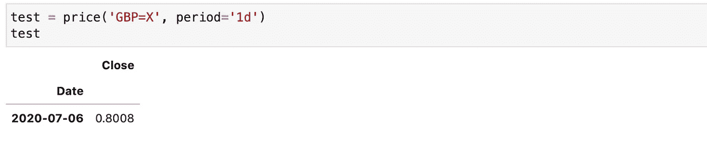
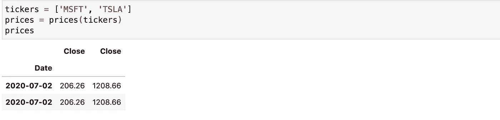
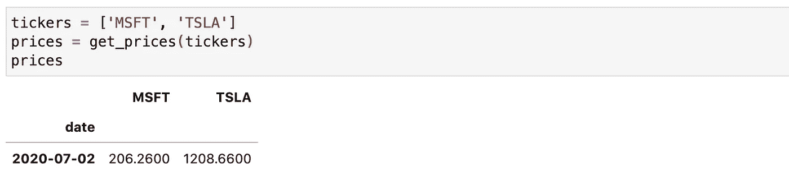
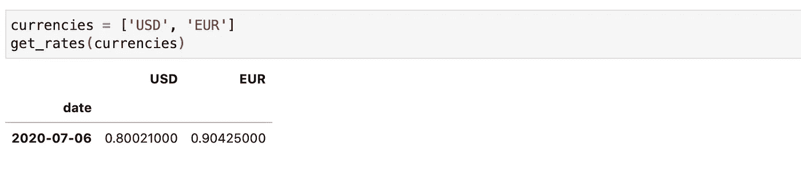

# 如何使用 Python 获得免费的历史和实时股票价格和外汇汇率

> 原文：<https://towardsdatascience.com/how-to-get-free-historical-and-live-stock-prices-and-fx-rates-using-python-part-i-a7718f0a4e4?source=collection_archive---------25----------------------->

## Python 中的股票价格

## 这是一个指南，展示了如何使用 Python 从[雅虎财经](https://finance.yahoo.com)或 [Alpha Vantage](https://www.alphavantage.co) 获得历史和实时股票价格和外汇汇率。

这两个 API 都是免费的，但是 Alpha Vantage 标准 API 限制为[每分钟 5 个请求，每天 500 个请求](https://www.alphavantage.co/premium/)。这对于一个简单的投资组合股票监控工具来说应该足够了。

克里斯·利维拉尼在 [Unsplash](https://unsplash.com?utm_source=medium&utm_medium=referral) 上的照片

# 有多少 API？

这个清单很长，而且近年来还在增加。允许免费 API 调用股市数据的提供者列表包括: [Finnhub.io](https://finnhub.io) 、 [TenQuant.io](https://www.tenquant.io) 、 [UniBit](https://unibit.ai/api/docs/V2.0/introduction) 、 [IEXCloud](https://iexcloud.io) 、 [marketstack](https://marketstack.com) 、 [Quandl](https://www.quandl.com) 、 [EOD 历史数据](https://eodhistoricaldata.com)并且是不断变化的。

# 我使用哪些市场标识符？

在金融服务行业的实践中，你会遇到 SEDOL、ISIN、CUSIP、RIC、BB Ticker、BB Full Ticker(最后两个是彭博社的标识符)，但对于免费的 API，你可以在这里查看这个 MICs(市场标识符代码)列表。

# 雅虎财经

雅虎财经 API 是免费的，但是报价器的世界是有限的。也很难确定在 API 调用中应该使用什么代码，但是上面的 ISO 列表会有所帮助。下面是一组函数，可以返回一个报价器或一组报价器的收盘价。您可以更改周期，但有些报价机的数据没有那么旧。

下面的代码使用了一个为雅虎财经 API 包装的 Python，更多细节你可以点击[这里](https://github.com/ranaroussi/yfinance)。

以下是使用美元英镑货币对的价格函数的示例:

另一个是两种股票价格:

# 阿尔法优势

Alpha Vantage 正在提供基于云的股票市场 API。用户可以访问历史和实时财务数据、技术指标和其他数据类型。这家创业公司的两位创始人都是哈佛商学院的 MBA 毕业生。

要使用 [Alpha Vantage 标准 API，你必须先注册](https://www.alphavantage.co/support/#api-key)。如果您想获得更多或其他种类的数据，有一个文档页面提供了更多 API 调用的示例。

下面的代码使用了 Alpha Vantage API 的 Python 包装器，更多细节请点击[这里](https://github.com/RomelTorres/alpha_vantage)。

下面是一个为微软公司(MSFT)和 Tesla 公司(TSLA)使用 get_prices 函数的示例:

另一个是与英镑配对的外汇汇率:

对于一个基本的股票投资组合工具，价格和利率是你计算自己的指标所需要的最低要求。