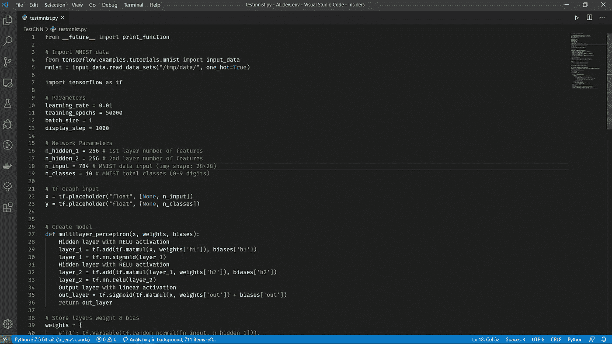

# 如何被聘为机器学习工程师

> 原文：<https://towardsdatascience.com/how-to-get-hired-as-a-machine-learning-engineer-a9d4dca34dbf?source=collection_archive---------18----------------------->

# 获得机器学习工程师工作的 7 个步骤

成为一名机器学习工程师绝不是一件容易的事情(文章开头一个积极的注解)。但是如果你有耐心和自律，这是完全可行的。坏消息是，要想在科技公司找到工作，你必须大量学习。好消息是，即使在大型科技领域，熟练的机器学习工程师也很短缺，而且薪水高得离谱。非常疯狂。值得吗？对我来说完全是。但这取决于你。

那么我该如何开始呢？

# 了解你的性别

在考虑申请之前，你必须了解一些基本知识。我说的基础不是指卷积神经网络。即使是 K- Means 也不行。我指的是基本的计算机科学原理。算法与数据结构，编程语言(最好是 Python)，调试，测试，版本控制，云计算。这个清单还在继续。

但是请记住。机器学习工程师首先是软件工程师。他不是数据科学家，也不是数据分析师。为了学习一切，我个人会选择 Coursera 的这门令人惊叹的课程，关于 [Python 编程](https://click.linksynergy.com/deeplink?id=r24KwW5qbBo&mid=40328&murl=https%3A%2F%2Fwww.coursera.org%2Fspecializations%2Fpython)，以及 Udacity 的这门课程，关于[算法和数据结构](https://www.udacity.com/course/data-structures-and-algorithms-in-python--ud513)

# 了解你的机器学习

没有第一步重要，但还是有用的。您应该熟悉基本算法，如回归、决策树、K 均值，并熟悉数据预处理和建模。还是那句话，不要太花里胡哨。一般来说，公司不会寻找能从数学上证明反向传播的人。他们寻找开发人员来编码和构建他们的机器学习管道。在这些管道中，机器学习只占了大约 5%的工作。同样，这些由 [Coursera](https://click.linksynergy.com/deeplink?id=r24KwW5qbBo&mid=40328&murl=https%3A%2F%2Fwww.coursera.org%2Flearn%2Fpython-machine-learning) 和 [Udacity](https://www.udacity.com/course/machine-learning--ud262) 开设的课程是你的朋友。

你也可以在我们的博客 [AI Summer](https://theaisummer.com/) 上找到围绕机器学习的很棒的教育内容，在那里我们分析了现实生活应用中使用的不同人工智能算法和模型。

# 得到经验

假设你知道基础知识(你应该知道)，下一个重要的步骤是获得经验。我建议开始做一些你感兴趣的个人项目(也许你可以用神经网络预测比特币价格，或者在大规模数据集中运行快速排序，我不知道)，参加一两个 Kaggle 比赛，也许可以从客户那里获得一些小型自由职业者的工作。

重要的是**从零开始建造整个东西**。从数据库和服务器到生产中部署的 API。这是真正理解整个堆栈并接触管道所有组件的唯一方法。相信我。任何课程或教训都无法与之相比。它会立刻给你一个全新的视角。

# 建立投资组合和简历

现在你感觉自信了，而且你已经参与了一些现实世界的项目，是时候建立你的简历了。但是，你的简历不仅仅是一个 pdf。这是一个展示你所有项目和课程的个人网站。这是一个 LinkedIn 账户(非常重要),里面有你所有的最新信息。这是一个 GitHub 配置文件，包含了您在过去几个月中编写的所有代码。也许是一个展示你目前所学的博客。最好是以上全部。

这就是你如何从你梦想的公司吸引招聘人员的注意。这就是招聘经理在谷歌上搜索你的名字时会发现的。

# 准备编码面试

现在到了有趣(没那么有趣)的部分。你要准备编码面试。不要假设你知道你在做什么。即使你有麻省理工的硕士学位。让我再说一遍。你得做好准备。

如果你对自己的算法和数据结构技能有信心，下面是你需要做的。拿一本[破解编码面试](https://amzn.to/39g0w51)(软件面试的圣经)，开一个 [Leetcode](https://leetcode.com/) 账号。开始练习简单的问题。试着想出一个蛮力解决方案，然后试着优化。卡住的时候，想想还有哪些数据结构可以用。或者查一下书上类似的问题。但是不要放弃。

那就再做一个。还有一个。随着你解决的问题越来越多，你开始识别模式，你可以着手解决中等甚至困难的问题。你应该解决多少问题？越多越好。如果你想在 FAANG 工作，可能要 150 英镑。否则大约 50。

还有，我的建议是，在你练习的时候，尽快尝试和模拟实际的面试体验。设置一个计时器。大声解释你的想法。

# 学习系统设计

面试中不可或缺的一部分是系统设计环节，在这一环节中，你要描述你将如何构建一个流行的架构，比如 Instagram 或网飞。它评估你所有的技术能力，你的背景和你的一般知识。因此，这不是你一夜之间就能学会的。

虽然你可以准备。你可以从 10 个最流行的应用程序的系统设计开始，然后尝试设计一个不同的应用程序。重复这个过程，直到你感到自信。

你还应该强调机器学习架构，如推荐系统或搜索自动完成。一般来说，这一轮公司会测试你的 ML 背景。但请记住，这是一个非常高层次的谈话。

# 应用

最后一步是开始申请。当然，你可以在公司的在线平台上提交申请。但是不要期待任何结果。为了加快这一过程，我将重点关注三件事:

*   在 LinkedIn 上找到招聘人员，向他们发送好友请求，表达你对某个职位的兴趣，让你的简历/ GitHub 账户/网站为你做所有的工作。但是要巧妙的做。表达你对这家公司的兴趣，打电话询问信息，等等。
*   向一位在科技公司工作的朋友寻求推荐(50%的人是通过推荐被雇佣的)。
*   参加招聘会和社交活动

就这样吗？就这么简单？Lol。可以说这是一个漫长的过程，在被拒绝后继续下去需要勇气和决心。但是不要气馁。没有一个人没有被拒绝过。你也应该知道，不幸的是，这也是一个时机和运气的问题。

但最终，你所有的努力都会有回报。这不是时机或运气的问题。这是必然的。

> ***如果你有兴趣阅读更多关于人工智能的帖子，请不要不看我们的博客就离开*** [***艾夏***](https://theaisummer.com/)

*原载于 2020 年 2 月 8 日 https://theaisummer.com***。**