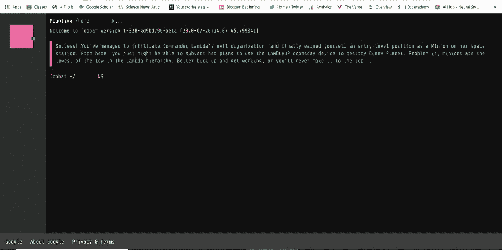
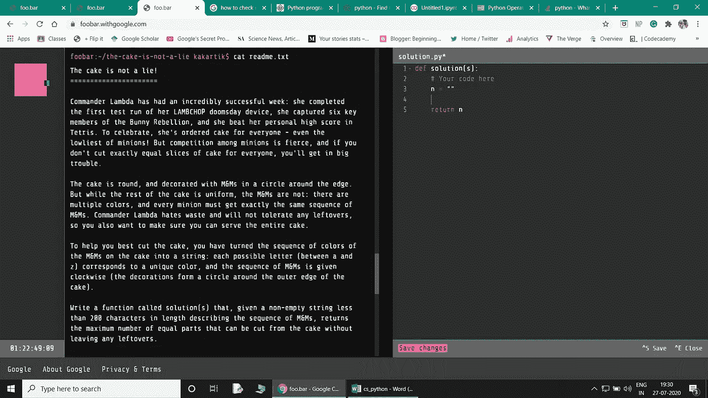
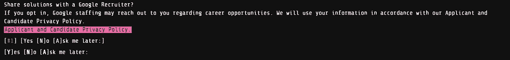
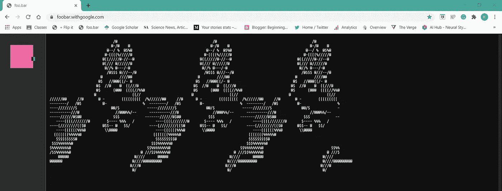
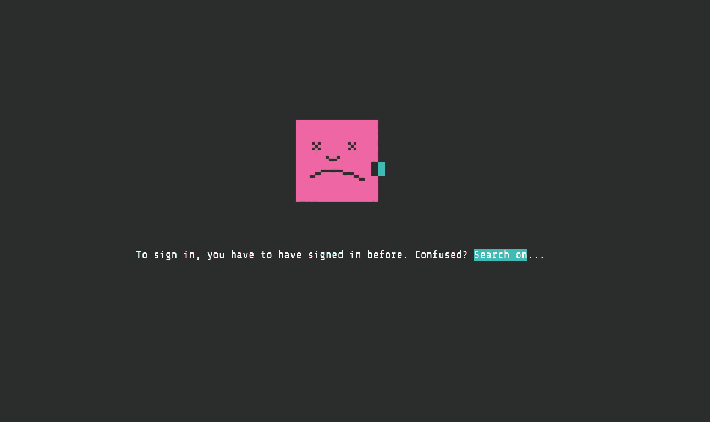
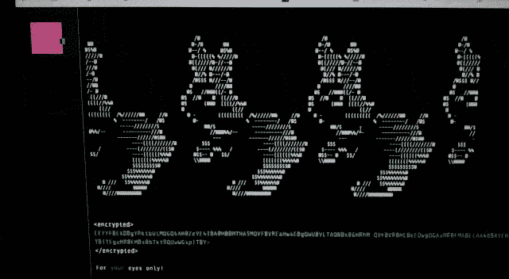

# Foobar 挑战:谷歌的秘密招聘过程

> 原文：<https://towardsdatascience.com/how-to-get-hired-by-google-b19806ad3c62?source=collection_archive---------3----------------------->


Google Foobar 招聘挑战(图片由[作者](https://medium.com/@beginningofthefuture)提供)

## 终极指南

## 关于谷歌桌面挑战赛你需要知道的一切

最近，当我在谷歌上搜索关键词“无头浏览器”时，我的窗口出现了一个不寻常的弹出窗口，上面有一条信息:

> 众所周知，好奇的开发人员会寻求有趣的问题。从谷歌解一个？

我很惊讶地看到谷歌给我发送了一个挑战，我立即接受了！点击“我想玩”,我进入了谷歌的 Foobar 页面。

> 这是谷歌足球挑战赛！

## Google Foobar Challenge 到底是什么？

Google Foobar challenge 是该公司在全球招募顶级程序员和开发者的秘密招聘程序。众所周知，谷歌的一些开发人员就是通过这种方式被聘用的。

挑战包括**五关**共**九题**，每关难度递增。

## 得到挑战后怎么办？

选择“我想玩”选项后，你进入 Foobar 的网站，它有一个类似 Unix 的外壳界面，包括一些标准的 Unix 命令，如`help, cd, ls, cat and etcetera.`



(图片由[作者](https://medium.com/@beginningofthefuture)提供)

所以，挑战从一个科幻冒险故事情节开始(在上面的蓝色文字中)。要开始限时挑战，我们必须在 shell 中输入一个`request`命令。

请求挑战后，命令行文件夹中添加了四个文件:`solution.java`、`solution.py`、`readme.txt`和`constraints.txt` ，我们必须使用`cat and ls`命令访问它们(列于`help`)。

> 在`***java***` 或`***python 2.7***` 中，我们有一个**选择来解决**问题。

要开始编写代码，我们必须运行命令`edit file.py`或`edit file.java`，一个代码编辑器将在同一个网页上打开(并使用快捷键`save`代码)。我们可以通过运行`verify file`命令随时验证我们的代码。代码将通过在几个测试用例上运行来验证，其中两个是可见的，其余的是隐藏的测试用例。一旦代码准确地通过了所有的测试用例，我们就可以通过运行`submit file`命令来提交我们对那个问题的解决方案。



(图片由[作者](https://medium.com/@beginningofthefuture)提供)

## 五个层次的足球挑战

随着挑战的深入，难度会不断增加。

第一关:这一关只有一个问题，简单明了，很容易解决。它不需要任何特殊的算法来解决它。给 48 小时来解决这个问题。

**第二关:**本阶段有两个问题，每个问题的解决时间为七十二小时。这两个问题都是基于线性代数和数学的基本原理。

> 在解决了这两个问题后，我们会得到一个推荐链接，也就是说，我们可以邀请我们的一个朋友参加 Google Foobar 挑战赛！

**第三关:**这是挑战开始变得有点**棘手**的地方。要通过这一关，我们必须解决三个问题，每个问题的时间为七天。

要解决这些问题，需要很好的数学知识和编程概念，如动态编程、马尔可夫链等。

但是如果你不知道这些概念，你也不需要担心，你可以随时在网上学习这些概念。挑战给你足够的时间来理解概念，并在给定的编程问题中实现它们。在其中一个问题中，我用最直观的方法解决了问题，但是对于大值来说不够理想，需要执行**动态编程**才能得到结果。

[](/beginners-guide-to-dynamic-programming-8eff07195667) [## 动态编程初学者指南

### 使用一些简单的技术优化你的代码

towardsdatascience.com](/beginners-guide-to-dynamic-programming-8eff07195667) 

> **完成第 3 级后，我们被要求填写我们的详细信息，以便与 Google 招聘人员联系！**

他们会询问你的基本信息:姓名、电话号码、电子邮件地址、国家、简历(可选)，以及你是学生还是专业人士。



(图片由[作者](https://medium.com/@beginningofthefuture) ) **Foobar 招聘表**

第四级:我发现这一级是五级中最难的。它需要实现几个概念来解决一个问题。这一级总共有两个问题，每个问题有两个星期的时间来解决。

> 在这一级需要广泛的算法和数据结构知识。

第一个问题是基于数论和图形的概念。为了解决这个问题，我必须实现贝尔曼-福特算法。

我花了很多时间去理解这些概念，并实现它们来解决这些问题。但是我能够按时解决这两个问题。

> 成功完成第 4 级后，您将获得另一个推荐链接，邀请您的另一位朋友尝试这项挑战！

**第五关:**这是整个挑战中第二难的问题，完全基于数学概念。最后一关只有一个问题，给了 22 天的时间来解决这个问题！

该题要求理解排列组合和实施[**【pólya】计数定理**](https://en.wikipedia.org/wiki/P%C3%B3lya_enumeration_theorem) 和 [**伯恩赛德引理**](https://en.wikipedia.org/wiki/Burnside%27s_lemma) 。理解了这两个定理后，编码部分就简单多了。

> 随着这个问题的提交，Google Foobar 挑战就完成了！



(图片由[作者](https://medium.com/@beginningofthefuture) ) **Foobar 挑战完成**

结束挑战后，我得到了一个加密的字符串，使用`base64`很容易解密。

```
import base64encrypted="THE ENCRYPTED MESSAGE"my_eyes=str.encode("MY USER NAME")decoded=base64.b64decode(encrypted)decrypted=""for i in range(0,len(decoded)):decrypted+=chr((my_eyes[i%len(my_eyes)] ^ decoded[i]))print(decrypted)
```

这是我用来解密信息的代码。解密的消息是:

```
{'success' : 'great', 'colleague' : 'esteemed', 'efforts' : 'incredible', 'achievement' : 'unlocked', 'rabbits' : 'safe', 'foo' : 'win!'}
```

## 完成挑战后会发生什么？

在成功完成所有五关之后，**谷歌的招聘人员很可能会联系你进行面试。**

> 你可能会收到一封电子邮件或一个电话，如果你通过了面试，那么你就可以被谷歌录用。

## 如何获得 Foobar 挑战？

不幸的是，这一挑战并不是每个人都可以获得的，谷歌只向特定的开发人员发送(这可能是基于他们的搜索历史——技术关键词)。

如果你没有收到邀请，不要担心，这不是在谷歌找到工作的唯一途径。

> **不要找 Foobar，让 Foobar 找你！**



(图片由[作者](https://medium.com/@beginningofthefuture)提供)

## 结论

我想说这是一个很好的学习机会，如果你收到邀请，我会建议你解决这些问题。

在解决问题的同时，不要把目标放在被谷歌录用上，而是要学习新的技术，体验最好的编码挑战之一。

> **Foobar 更多的是学习和执行，而不是之前什么都知道！**

如果您有任何疑问或意见，请发表在评论区。

要改进你的代码，请点击这里查看我们的[文章](https://patataeater.blogspot.com/2020/08/how-to-write-efficient-and-faster-code.html)。



(图片由[作者](https://medium.com/@beginningofthefuture)提供)

**看看这个:**[**https://www.fiverr.com/share/LDDp34**](https://www.fiverr.com/share/LDDp34)

***最初发表于:***[***www.patataeater.blogspot.com***](http://www.patataeater.blogspot.com/)

```
Resources:
[https://foobar.withgoogle.com/](https://foobar.withgoogle.com/)
[https://www.freecodecamp.org/news/the-foobar-challenge-googles-hidden-test-for-developers-ed8027c1184/](https://www.freecodecamp.org/news/the-foobar-challenge-googles-hidden-test-for-developers-ed8027c1184/)
```