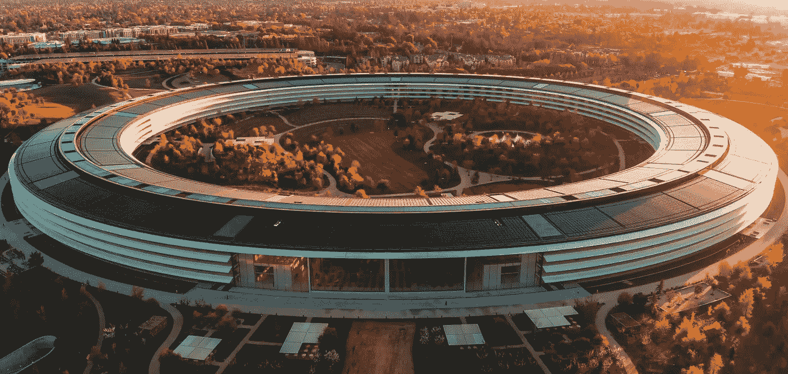

# 没有学位如何进入数据科学

> 原文：<https://towardsdatascience.com/how-to-get-into-data-science-without-a-degree-2f84516f1afd?source=collection_archive---------4----------------------->

## 来自同一职位的数据科学家的建议

照片由[卡莱斯·拉巴达](https://unsplash.com/@carlesrgm?utm_source=unsplash&utm_medium=referral&utm_content=creditCopyText)在 [Unsplash](https://unsplash.com/s/photos/hq?utm_source=unsplash&utm_medium=referral&utm_content=creditCopyText) 上拍摄

# 介绍

这篇文章是为那些属于下列类别之一的人而写的:

1.  你没有大专学位，但你对数据科学感兴趣。
2.  你没有 STEM 相关的学位，但是你对数据科学感兴趣。
3.  你在一个与数据科学完全无关的领域工作，但你对数据科学感兴趣。
4.  你只是对数据科学感兴趣，想了解更多。

你可能在想，“我还有机会吗？”

> **答案是，“是的，有可能。”**

好消息是你已经通过了第一步，那就是**你对数据科学感兴趣。现在，这不会是一个轻松的旅程，因为你处于劣势，但要以此为燃料，每天激励自己。**

最重要的是，我要给你我的建议，我希望我在开始的时候就有。

## 首先，简单介绍一下我自己…

我有商科学位，但我从大学二年级开始就对机器学习感兴趣。因此，我自学了今天我所知道的大部分知识，并且我很幸运地在一些数据分析师/数据科学工作中工作过。

我为什么要告诉你这些？我想说清楚，我也曾经和你有过类似的处境！

请记住，这是一个长期目标，因此你应该期待长期结果。如果你愿意投入 100%的精力，我会给你至少一年的时间来决定是否继续。

说完这些，让我们深入探讨一下:

# 没有学位如何进入数据科学

进入数据科学归结为两件事，**成长**和**展示**你的技能。

# 1)提高您的数据科学技能

不久前，我写了一篇文章，“[如果可以重来，我会如何学习数据科学。](/how-id-learn-data-science-if-i-could-start-over-2-years-in-b821d8a4876c)“在这篇文章中，我按科目划分了要学的内容，即统计&数学、编程基础和机器学习。

在这篇文章中，我将根据你的理解水平来划分你应该学什么。

## 0 级:基础

你必须从最基本的开始，构建模块，不管你想叫它什么。但是相信我这么说，你的基本面越好，你的数据科学之旅就会越顺利。

特别是，我建议你在以下主题上建立你的基础:统计与概率、数学和编程。

**统计和概率:**如果你读过我以前的文章，那么你可能已经听过无数次了，但是数据科学家实际上只是一个现代统计学家。

*   如果你很少或者没有接触过统计和数学，我推荐 [**可汗学院的统计和概率课程**](https://www.khanacademy.org/math/statistics-probability) 。
*   但是，如果你有一些微积分和积分方面的知识，我强烈推荐你去上乔治亚理工学院的课程，叫做“ [**统计方法**](https://mediaspace.gatech.edu/playlist/dedicated/74258101/1_g5xwvbde/1_iw8fk73m) ”。当它通过更多的证明时，会有一点困难，但是它会帮助你理解每个想法的复杂性。

**数学**:取决于你在高中的注意力有多集中，将决定你需要花多少时间学习基础数学。你应该学习三个领域:**微积分、积分和线性代数:**

*   当涉及到与优化相关的任何事情时，微积分是必不可少的(这在数据科学中非常相关)。为此我推荐 [**可汗学院的微积分课程**](https://www.khanacademy.org/math/calculus-1) 。
*   当涉及到概率分布和假设检验时，积分是必不可少的。我推荐 [**可汗学院的积分课程**](https://www.khanacademy.org/math/integral-calculus) 。
*   如果你想进入深度学习，线性代数尤其重要，但即使如此，了解其他基本的机器学习概念也是很好的，如主成分分析和推荐系统。惊喜惊喜，你能猜到我为此推荐什么课程。此处 提供了 [**的链接。**](https://www.khanacademy.org/math/linear-algebra)

正如对数学和统计学有一个基本的了解很重要一样，了解编程的核心基础知识会让你的生活变得容易得多，尤其是在实现方面。所以，我建议你在一头扎进机器学习算法之前，先花时间学习基本的 **SQL** 和 **Python** 。

*   如果你完全不熟悉 SQL，我推荐你去浏览一下[**Mode 的 SQL 教程**](https://mode.com/sql-tutorial/introduction-to-sql/) ，因为它非常简洁透彻。
*   同样，如果你完全不熟悉 Python， [**Codecademy**](https://www.codecademy.com/catalog/language/python) 是熟悉 Python 的好资源。

## 第一级:专业化

一旦你学会了基础知识，你就可以专攻了。此时，是否要专注于机器学习算法、深度学习、自然语言处理、计算机视觉等，就看你自己了……

*   如果你想了解更多关于机器学习算法和实现的知识，我可以查看一下 [**Kaggle 的《机器学习入门》**](https://www.kaggle.com/learn/intro-to-machine-learning) **，** [**斯坦福大学的《机器学习教程》**](https://www.coursera.org/learn/machine-learning) ，或者 Udemy 上的 [**机器学习 A-Z。看看他们，看看什么最适合你的喜好！**](https://www.udemy.com/course/machinelearning/)
*   如果你想了解更多关于深度学习的知识，可以在这里查看 [**deeplearning.ai 的专精**](https://www.coursera.org/specializations/deep-learning) 。这钱花得值！
*   如果你想了解更多关于 NLP 的知识，这里有来自顶尖大学的 [**5 门免费自然语言处理课程，像斯坦福和牛津**](/here-are-5-free-natural-language-processing-courses-from-top-universities-f108e2456dce) 。

你可以专攻的东西太多了，所以请你在做决定之前多探索一下！

## 第二级:实践

像任何事情一样，你必须练习你所学的东西，因为你失去了你不用的东西！这里有 3 个我推荐的资源来练习和完善你的技能。

1.  **leet code 是一个很棒的资源，它帮助我学会了我从来不认为是可能的技能和巧妙的技巧。这是我在找工作时充分利用的东西，也是我会经常回去查阅的资源。最好的部分是，他们通常有推荐的解决方案和讨论板，因此您可以了解更有效的解决方案和技术。**
2.  **熊猫练习题: [**这个资源**](https://github.com/guipsamora/pandas_exercises) 是一个装满了专门为熊猫准备的练习题的资源库。通过完成这些练习题，你将知道如何:过滤和排序数据，汇总数据，使用。apply()操作数据等等。**
3.  **[**Kaggle**](https://www.kaggle.com/) 是世界上最大的数据科学社区之一，有数百个数据集可供您选择。有了 Kaggle，你可以在比赛中竞争，或者只是利用可用的数据集来创建自己的机器学习模型。**

# **2)展示您的数据科学技能**

**学习数据科学是一回事，但人们通常忘记的是营销自己——你最终会想要展示你所学到的东西。如果你没有数据科学相关的学位，这对你来说**尤其重要**。**

**一旦你完成了几个个人数据科学项目，以下是你展示它们和推销自己的几种方式:**

## **你的简历**

**首先，利用你的简历展示你的数据科学项目。我建议创建一个名为“个人项目”的部分，在那里你可以列出两到三个你已经完成的项目。**

**同样，你可以在 LinkedIn 上的“项目”部分添加这些项目。**

## **Github 知识库**

**如果您还没有创建 Github 库，我强烈建议您创建一个。*当我们谈到 Github 时，学习 Git 将是一个好主意。*在这里，你可以包含你所有的数据科学项目，更重要的是，你可以把你的代码分享给别人看。**

**如果你有一个 Kaggle 帐户，并在 Kaggle 上创建笔记本，这也是一个不错的选择。**

**一旦你有了一个有效的 Kaggle 或 Github 帐户，确保你的帐户网址可以在你的简历、LinkedIn 和你的网站(如果有的话)上找到。**

## ****个人网站****

**说到网站，我强烈建议以网站的形式建立一个数据科学作品集。HTML 和 CSS 很容易学习，这将是一个有趣的项目！如果你没有时间，像 Squarespace 这样的东西也可以。**

## **在媒体上写博客**

**我有偏见，因为这对我很有效，但这并不意味着我不能推荐博客！有了 Medium 这样的平台，你就可以写项目走查了，就像我在 [**葡萄酒品质预测**](/predicting-wine-quality-with-several-classification-techniques-179038ea6434) 上写的。**

## **非营利机会**

**最后，利用非营利数据科学机会。我偶然看到苏珊·柯里·西维克、写的一篇足智多谋的文章，文章提供了几个组织，你可以在那里获得从事现实生活中的数据科学项目的机会。**

# **感谢阅读！**

**我希望这能为您的数据科学事业提供一些指导和帮助。没有一成不变的方法来处理这个问题，所以请放心地持保留态度。尽管如此，我还是希望你在数据科学的努力中一切顺利！**

****不确定接下来要读什么？我为你挑选了另一篇文章:****

** [## 你不应该成为数据科学家的 4 个理由

### 为什么数据科学工作可能不适合你

towardsdatascience.com](/4-reasons-why-you-shouldnt-be-a-data-scientist-e3cc6c1d50e) 

# 特伦斯·申

*   *如果你喜欢这个，* [*关注我的 Medium*](https://medium.com/@terenceshin) *了解更多*
*   *报名我的邮箱列表* [*这里*](https://forms.gle/tprRyQxDC5UjhXpN6) *！*
*   *我们连线上*[*LinkedIn*](https://www.linkedin.com/in/terenceshin/)
*   *有兴趣合作？查看我的* [*网站*](http://want%20to%20collaborate/?) *。***