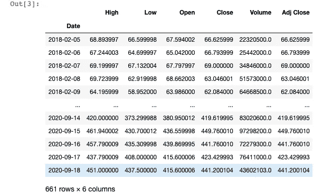

# 如何从纽交所获取不到 3 行的市场数据(Python)。

> 原文：<https://towardsdatascience.com/how-to-get-market-data-from-the-nyse-in-less-than-3-lines-python-41791212709c?source=collection_archive---------5----------------------->

## 在本文中，您将学习使用 Python 包获取股票市场数据，如价格、交易量和基本面数据。(*不到 3 行代码*)


由 [Aditya Vyas](https://unsplash.com/@aditya1702?utm_source=medium&utm_medium=referral) 在 [Unsplash](https://unsplash.com?utm_source=medium&utm_medium=referral) 上拍摄的照片

***来自《走向数据科学》编辑的提示:*** *虽然我们允许独立作者根据我们的* [*规则和指南*](/questions-96667b06af5) *发表文章，但我们并不认可每个作者的贡献。你不应该在没有寻求专业建议的情况下依赖一个作者的作品。详见我们的* [*读者术语*](/readers-terms-b5d780a700a4) *。*

在本文中，您将学习使用 Python 包获取股票市场数据，如价格、交易量和基本面数据。(*中不到 3 行代码*)

首先，在开始之前，您需要安装 Python 3 版本和以下软件包:

*   熊猫
*   熊猫 _datareader
*   日期时间

如果这些软件包中的任何一个尚未安装，您可以使用如下所示的 pip 命令。

```
pip install pandas-datareader
pip install DateTime
```

一旦您确保安装了以下软件包，我们就可以开始了。

> 如果你已经有了使用 Python 的经验，你可以跳到第三步。第一步和第二步包括导入数据并转换为日期格式。

## 一、进口包装

第一步将包括导入必要的包。

首先，您将使用以下代码行导入先前安装的软件包:

上面的代码行用于导入 python 库。

*从 pandas_datareader 库中，我准备只导入数据和 wb 模块***。**

*一旦我们设置好了，让我们进行下一步。*

*现在库已经导入，第二步**将由**将**日期转换成**日期时间格式**组成。***

## *二。将日期转换为日期时间格式*

*如果您之前已经转换过日期，则此步骤不是强制性的。但是，如果您没有，我建议您使用下面的代码行:*

*在上面的代码行中，Python 将日期从字符串格式转换为日期时间格式。*

*你会注意到，关于结束日期，我故意用今天作为结束日期。这是 DateTime 模块的优点之一。它将不断地让你的笔记本保持最新的日期。*

> *例如，如果您在 3 个月后重新运行您的内核，您的数据框架和图表将会用最新的市场数据进行更新。*

*设置好开始和结束日期后，我们现在可以导入市场数据。*

## *三。使用 Yahoo Finance 或 Alpha Vantage API 导入数据*

*既然我们已经以正确的格式转换了开始和结束日期。我们将使用 **Tesla** 作为例子来设置我们的导入。*

*Pandas DataReader API 将需要 4 个强制参数，顺序如下:*

*   *心脏*
*   *特定的 API(雅虎、AlphaVantage、sooq……)*
*   *开始日期*
*   *结束日期*
*   **和潜在的 API 密钥**

*对于我们的例子，股票代码将是 **TSLA** ，API 将是**雅虎**，开始和结束日期已经在上面定义了(从 2020 年 2 月 4 日**到今天**)。快速提醒一下，特斯拉的股票代码是 **TSLA** 。*

*因此，让我们通过使用下面的代码行来尝试这种组合:*

*让我们检查一下输出…*

# *输出:*

**

*嘣！！！*

*你得到的市场数据包括成交量、最高价、最低价、开盘价和调整收盘价。*

*我希望你喜欢这篇文章，如果你有任何问题或使用不同的方式，评论如下。*

*赛义德·莱萨尼*

# *完整的 Python 代码:*

## *来源:*

*(1)一天学会算法交易:*

*[](https://www.udemy.com/course/learn-algorithmic-trading-in-one-day/?couponCode=TOWARDSCIENCE) [## 一天学会算法交易(美国大选更新)

### 交易 707 是数据科学家和交易员的结合。我们都在伦敦工作和生活。我们觉得累了…

www.udemy.com](https://www.udemy.com/course/learn-algorithmic-trading-in-one-day/?couponCode=TOWARDSCIENCE)*