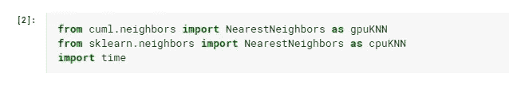
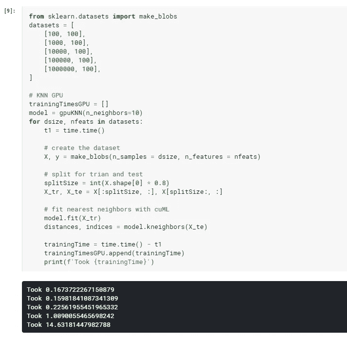
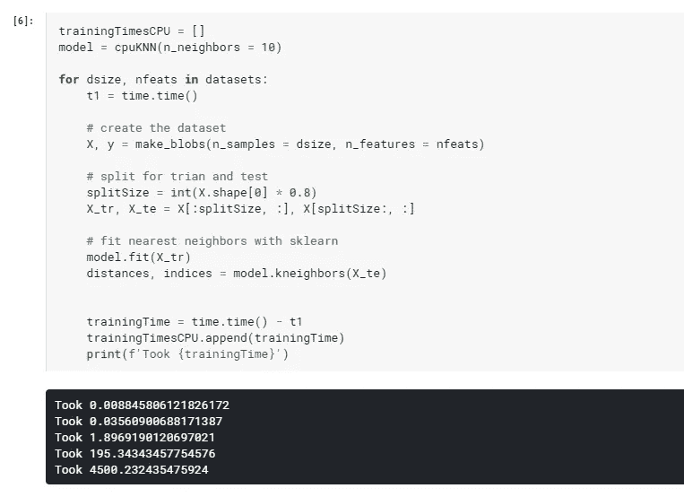
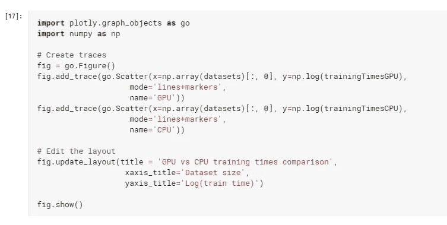
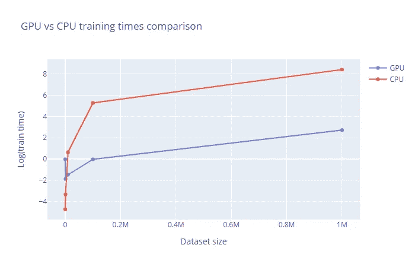

# 借助 RapidsAI，将您的机器学习管道速度提高 300 倍

> 原文：<https://towardsdatascience.com/how-to-get-more-then-300x-speed-up-of-your-machine-learning-pipeline-with-rapids-cuml-library-cbed4c4be6a0?source=collection_archive---------46----------------------->

## 你有没有在 GPU 卡上运行过最近邻！没有吗？那你为什么还不读书？

[https://unsplash.com/photos/9HI8UJMSdZA](https://unsplash.com/photos/9HI8UJMSdZA)

当在大型数据集上使用简单的机器学习算法(如最近邻算法)时，找到好的模型超参数甚至建立强大的交叉验证框架往往会变得很困难，因为即使使用简单的训练测试分割，也需要模型时间来完成训练！克服这个问题的一种方法是使用 Dask 或 PySpark 在 CPU 上进行分配。但是今天我想向您展示另一种方法——使用您的 GPU 能力来拟合模型。以前从 sklearn 库中没有好的方法可以做到这一点，但是现在你可以使用 [Rapids](https://github.com/rapidsai) AI cuML 库来适应绝大多数 Sklearn 模型！在这篇文章中，我想给你看一个 Rapids cuML 和 Sklearn 在近邻算法上的快速比较。如果你对安装过程感兴趣，在 Rapids github 页面上有很好的描述。我们开始吧！

## 代码

我将使用 [Kaggle](https://www.kaggle.com/) 平台，该平台每周提供 30 小时的免费 K-80 GPU 使用(TPU 也可用)。

首先，让我们从两个库中导入最近邻算法。这两个库中的 API 调用看起来是一样的。

现在，我将使用[sk learn . datasets . make _ blobs](https://scikit-learn.org/stable/modules/generated/sklearn.datasets.make_blobs.html)方法创建一个虚拟数据集。我将创建 5 个不同大小的数据集:从小到大。在每个数据集上，我将使用 10 个邻居来拟合最近邻居模型，然后计算测试集中每个点的最近邻居。让我们先来拟合 Rapids GPU 最近邻。

如你所见，它运行得非常快。现在，是时候适合 Sklearn 了。

哇！这真的很长。正如你在小数据集上看到的，sklearn 优于 rapids，但在最大数据集上，我们获得了 300 倍的速度提升。

让我们也使用 Plotly 构建一个小的比较图(我将使用 log 转换，以便更好地显示结果)

哇，我有时候还是不相信会有这么大的速度提升，cuML 库绝对值得一试！将 Rapids 与 Dask 之类的东西进行比较也很有趣，但这是另一篇文章的想法。

感谢您的阅读！

**你可以在我的** [**网站**](http://artkulakov.com) 上查看其他帖子