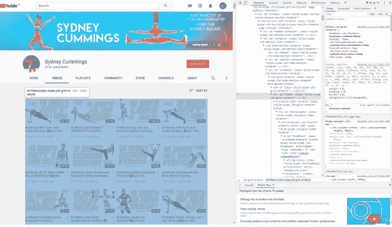
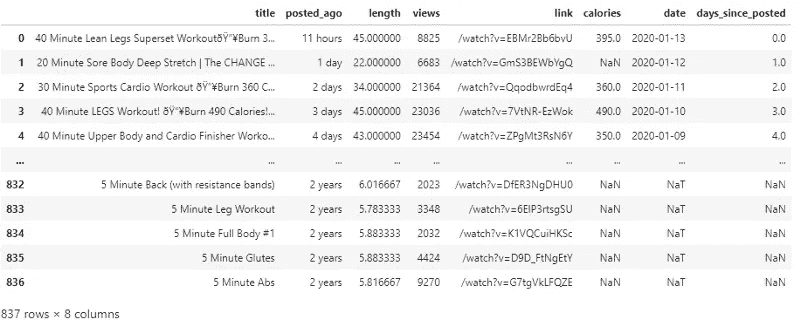
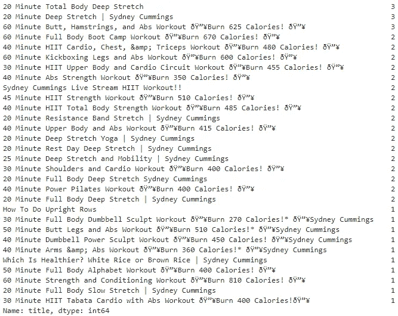
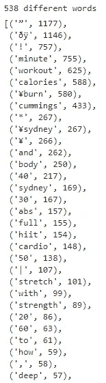
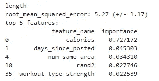
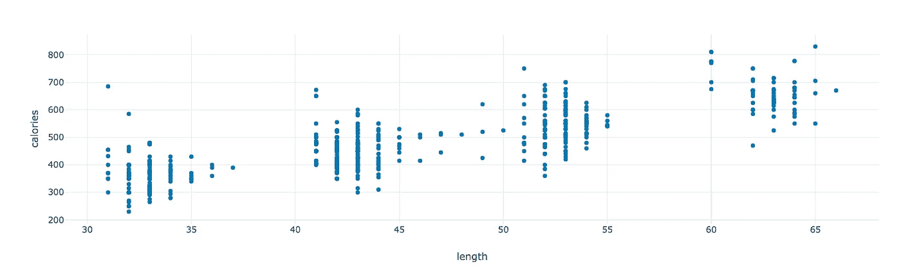
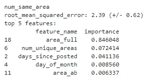
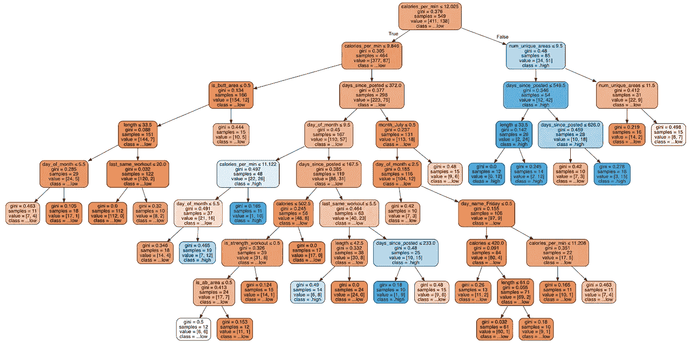

# 如何用机器学习技术获得更多的 YouTube 浏览量

> 原文：<https://towardsdatascience.com/how-to-get-more-youtube-views-with-machine-learning-techniques-9e7000f6fcf7?source=collection_archive---------12----------------------->

## Python 中流行健身频道的循序渐进过程

来源: [Pixabay](https://pixabay.com/illustrations/space-rocket-night-cartoon-3262811/)

在本帖中，我们将**机器学习算法**应用于 YouTube 数据，就如何获得更多浏览量提出建议。

我们将包括*端到端*流程

*   抓取 YouTube 数据
*   在视频标题上使用自然语言处理
*   特征工程
*   构建预测决策树
*   更多

尽在 **Python** 。

如果你想知道数据科学如何帮助 YouTube 频道获得更多的浏览量/收入，那就看看吧。

让我们开始吧。

我们正在分析的 YouTube 频道是[Sydney Cummings](https://www.youtube.com/channel/UCVQJZE_on7It_pEv6tn-jdA)——我们最喜欢的教练。她发展很快，最近已经超过了 20 万用户。

此外，Sydney 每天都会发布各种锻炼视频，这是一个很好的分析数据量。

今天没健身吗？下面是她最近的一个视频。

[30 分钟手臂撕裂和强健臀肌锻炼！🔥燃烧 310 卡路里！* 🔥](https://www.youtube.com/watch?v=Nrzk6YT3zrs&t=83s)

你可能已经注意到她的视频的标题都遵循标准格式。它们通常包括长度、身体部位、消耗的卡路里和其他关于锻炼的描述性词语。在我点击这个视频之前，我会知道:

*   30 分钟——我将在 30 分钟内完成整个锻炼。
*   手臂和臀大肌——我会在手臂和臀大肌上下功夫，重点是力量。
*   燃烧 310 卡路里——我会燃烧相当多的卡路里。

我们将分析这些关键信息。

让我们看看是否可以向 Sydney 推荐任何新的内容创作策略来进一步改进*甚至*！

# 准备:收集数据

抓取 YouTube 数据有不同的方法。由于这只是一个一次性项目，我们用最简单的方法来做，这需要手工操作，但是不需要额外的工具。

以下是*逐步*程序:

1.  将*向下滚动到频道的[视频页面](https://www.youtube.com/channel/UCVQJZE_on7It_pEv6tn-jdA/videos)，直到所有视频都出现。*
2.  右击最新的视频，选择“检查*”。*
3.  将光标悬停在每行上，找到 HTML 代码/元素的最低*级别*，突出显示所有视频。
    例如，我们使用 Chrome 浏览器，它看起来是这样的:

来源:[悉尼的 YouTube 视频页面](https://www.youtube.com/channel/UCVQJZE_on7It_pEv6tn-jdA/videos)

4.右键单击元素并选择“复制”，然后选择“复制元素”。
5。将复制的元素粘贴到文本文件中并保存。我们使用 JupyterLab 文本文件，并将其保存为 *sydney.txt* 。
6。使用 Python 提取信息和清理数据。我们不解释细节，因为每个案例都不一样。为了您的方便，这里的代码是。

现在我们可以开始有趣的部分了！

我们将从该数据集中提取特征，并研究影响视图数量的特征。

# 步骤 1:观察数据

将数据加载到 Python 是在最后一节完成的；让我们来看看我们的数据集 *df_videos* 。

df_videos 有 8 个描述每个视频细节的特征，包括:

*   *标题*
*   时间*发布 _ 之前*
*   *长度*
*   *视图*
*   *链接*
*   *卡路里*
*   *发布日期*
*   *天 _ 自 _ 贴*

还有 837 个视频。

此外，我们发现数据中存在重复，因为 Sydney 多次上传了相同的视频。但是我们会忽略它，因为重复的很少。

# 第二步:用自然语言处理技术对视频进行分类

在这一步中，我们着重于根据标题中的关键字对视频进行分类。

我们希望根据以下内容对视频进行分组:

*   这段视频关注的是身体的哪些部位？
*   这个视频到底是在帮我们增力还是减脂？
*   其他关键词？

我们使用自然语言处理技术和自然语言工具包来处理标题。

在这篇文章中，我们不会解释这些技术的所有细节。如果你不熟悉的话，可以看看这篇文章([如何在 Python 中使用 NLP:一个实用的分步示例](https://www.justintodata.com/use-nlp-in-python-practical-step-by-step-example/))。

## 形成关键词列表

首先，我们[标记](https://en.wikipedia.org/wiki/Lexical_analysis#Tokenization)视频的标题。

此过程使用空格(" ")等分隔符将标题文本字符串显式拆分为不同的标记(单词)。这样，计算机程序可以更好地理解文本。

这些标题中有 538 个不同的单词。列表的顶部在下面。

很多词使用频率很高。这再次证明悉尼确实使用标准格式的视频标题。

通过查看上面的列表，我们创建了 3 个关键字列表，可用于在未来的步骤中对视频进行分类。

*   *body_keywords* —标识视频关注的身体部位，如“丰满”的身体、“腹肌”、“双腿”。
*   *健身程序 _ 类型 _ 关键词* —显示健身程序类型，如“有氧”、“拉伸”、“力量”。
*   *other_keywords* —包括经常使用但难以归类的关键词，如“训练营”、“倦怠”、“调色”。

## 对关键字列表进行词干分析

在形成这些关键字列表后，我们还[提取](https://en.wikipedia.org/wiki/Stemming)它们。词干提取过程确保计算机程序能够匹配具有相同意思的单词。

比如“abs”和“ab”这两个词，词干“ab”是一样的。

## 标记和词干化 YouTube 标题

除了关键词，我们还需要对标题进行分词和词干处理。

这些过程为进一步匹配准备了关键字和标题列表。

**相关文章:**

现在我们已经准备好构建特性了！

# 步骤#3:设计特性

经过头脑风暴，我们提出了与 Sydney 的 YouTube 视图相关的两种主要类型的功能——基于关键字和基于时间。我们一个一个来看。

## 基于关键字的功能

## **-指示器特征**

感谢上一步的辛勤工作，我们有了 3 个关键词列表和精简的标题。我们现在可以匹配它们来对视频进行分类。

对于 **body_keywords** 和 **workout_type_keywords** ，一个视频中可能有多个关键字。所以在匹配之前，我们还要创建 2 个特征*区域*和*健身类型*。这些功能将一个视频的所有身体部位和锻炼类型连接成一个字符串。
例如，一个健身视频可以同时做“ab”和“leg”，或者同时做“cardio”和“strength”。该视频的功能区域为“ab+腿部”，锻炼类型为“有氧+力量”。

同时，我们还识别出“总”和“全”、“核心”、“ab”等相似的关键词，并进行分组。

最后，我们创建三种不同类型的虚拟特征:

*   *is_{}_area* 用于识别视频中是否包含特定的身体部位。
*   *是 _ { } _ 健身程序*用于识别健身程序类型。
*   *title_contains_{}* 查看健身程序标题是否包含其他关键字。

明确地说，“腿部力量耗尽锻炼”的视频标题将具有 is_leg_area = True、is_strength_workout = True 和 title _ contains _ burnout = True 而所有其他指标都是假的。

请阅读下面的 Python 代码了解详细信息。

## **-频率特性**

除了这些指标，我们还创建了三个功能，称为 *num_body_areas* 、 *num_workout_types* 和 *num_other_keywords* 。他们计算一个视频标题中提到的关键词的数量。

举个例子，标题“腹肌和腿部有氧力量锻炼”的 num_body_areas 和 num_workout_types 都是 2。

这些功能有助于我们确定视频中应包含的最佳身体部位数量或锻炼类型。

## **-费率特性**

最后但同样重要的是，我们创建一个功能*卡路里每分钟*查看卡路里燃烧率。

毕竟，我们都想要一些明确的(可量化的)锻炼目标。

资料来源: [Giphy](https://giphy.com/gifs/good-burning-calories-IT4fLZjxyDu24)

在进入基于时间的功能之前，我们还修复了几个分类错误的视频。该过程是手动的，所以我们在这里不包括它们。

## 基于时间序列的特征

通过上述基于关键词的特征，我们已经可以找到特定的流行类型的视频。但这是否意味着悉尼应该总是发布相同类型的视频？

为了回答这个问题，我们还创建了一些基于时间序列的功能:

*   *num_same_area* —过去 30 天内关注同一区域的视频(包括当前视频)数量。
    例如，当当前视频关注上身时，此功能= 6，并且在过去 30 天内还有 5 次其他上身锻炼。
*   *num_same_workout* —此功能与 num_same_area 相似，不同之处在于计算健身程序类型。
    例如，当当前视频是一个 HIIT 健身程序，并且在过去 30 天内还有 2 个其他 HIIT 健身程序时，此功能= 3。
*   *last_same_area* —自上一个视频聚焦于与当前视频相同的身体区域以来的天数。
    比如当前视频聚焦 abs 时这个特征= 10，之前的 abs 视频是 10 天前的。
*   *last_same_workout* —该功能与 last_same_area 类似，只是比较了不同的健身程序类型。
*   *num_unique_areas* —过去 30 天内处理的唯一身体区域的数量。
*   *num_unique_workouts* —过去 30 天内发布的独特锻炼类型的数量。

这些特征有助于我们看到观众更喜欢相似的还是各种类型的视频。

下面看看特征工程的详细流程。它包括一些转换以适应熊猫的滚动功能。

我们发现 Sydney 偶尔会发布一些与锻炼无关的视频。他们获得的浏览量明显更少，表现也与锻炼视频不同。所以我们把它们从分析中剔除。

我们还过滤掉前 30 天的视频，因为它们缺乏足够的历史数据。

## 多重共线性测试

> **多重共线性**(也称**共线性**)是一种现象，在这种现象中，多元回归模型中的一个预测变量可以通过其他预测变量以相当高的准确度进行线性预测。
> 
> 多重共线性不会降低模型整体的预测能力或可靠性，至少在样本数据集内是如此；它只影响关于单个预测因子的计算。

正如维基百科解释的那样，多重共线性*确实会影响个体特征对结果的影响力。*

为什么这很重要？

假设 Sydney 只在周一发布力量训练，她的视频总是在周一获得更多的浏览量。这些视频获得更高的浏览量是因为它们发布在周一还是因为它们是力量训练？

在做推荐的时候，我们希望回答这些类型的问题。因此，我们希望确保我们的要素之间没有强烈的共线性。

既然我们已经清楚了多重共线性测试的原因。让我们看看我们应该使用哪种方法。

我们经常使用[成对相关](https://www.geeksforgeeks.org/python-pandas-dataframe-corr/)来测试共线性，但有时这是不够的。多个要素(多对)之间可能同时存在共线性。

因此，我们使用一种更复杂的方法。在高层次上，我们使用 [K 倍交叉验证](https://machinelearningmastery.com/k-fold-cross-validation/)来实现这一点。

详细过程如下:

*   **根据我们的判断选择一组关键特征来测试共线性。**

我们选择以下特征，因为它们对于预测 YouTube 视频的观看量至关重要。

可以看到，我们还添加了三个由随机数组成的特征 *rand0* 、 *rand1* 、 *rand2* 。在比较特征之间的关系时，它们充当锚。如果一个预测特征与这些随机特征相比不太重要或相似，则它不是目标特征的重要预测。

*   **为 K 倍交叉验证准备这些特征。**

在此过程中，我们转换了分类特征区域和锻炼类型。这种转换确保每个类别级别至少有 K 个值。

*   **使用其中一个特征作为目标，其余特征作为预测器，训练预测模型。**

接下来，我们遍历每个特征，并使用其他特征拟合一个模型来预测它。我们使用一个简单的模型[梯度推进模型(GBM)](https://en.wikipedia.org/wiki/Gradient_boosting) 和 K 倍验证。

根据目标特征是数值的还是分类的，我们应用不同的模型和分数(模型预测能力评估度量)。

当目标特征为数值时，我们使用[梯度推进回归器](https://scikit-learn.org/stable/modules/generated/sklearn.ensemble.GradientBoostingRegressor.html)模型和[均方根误差(RMSE)](https://en.wikipedia.org/wiki/Root-mean-square_deviation)；当目标特征是分类的，我们使用[梯度推进分类器](https://scikit-learn.org/stable/modules/generated/sklearn.ensemble.GradientBoostingClassifier.html)模型和[精确度](https://developers.google.com/machine-learning/crash-course/classification/accuracy)。

对于每个目标，我们打印出 [K 倍验证分数](https://scikit-learn.org/stable/modules/cross_validation.html)(分数的平均值)和最重要的 5 个预测值。

*   **研究每个目标特征的得分和重要预测因素。**

我们研究每个目标特征以及它们与预测因子的关系。我们不会涵盖整个过程，而只是解释下面的两个例子。

我们发现长度和卡路里特征是相关的。这一发现很直观，因为锻炼时间越长，燃烧的卡路里可能就越多。

我们也可以想象这种关系。

如你所见，长度和卡路里之间存在正相关关系。但是它不够强壮，我们不能扔掉它们。40-45 分钟的视频中燃烧的卡路里与 30-35 分钟、50-55 分钟甚至 60 多分钟的视频重叠。因此，我们保留了它们。

我们还发现 num_same_area 和 area_full 特征是相关的。这一发现有些令人惊讶。我们来探究一下原因。

下图显示了 num_same_area 和 area 之间的关系。

num_same_area 功能统计过去 30 天内发布的关注同一区域的视频(包括当前视频)的数量。特色 area_full 代表全身锻炼，是悉尼视频中最常见的类型。

因此，当 num_same_area 较大时，这些视频关注的唯一可能的区域是整个身体。

假设我们发现更高的 num_same_area (>=10)确实会导致更高的 YouTube 浏览量。我们无法知道是因为 area_full 还是 num_same_area。所以我们放弃了 num_same_area 特性来防止这种情况。

除此之外，我们还使用类似的逻辑删除了 num _ same _ outsets。

# 步骤#4:创建目标

你可能还记得，这个项目的目标是增加 YouTube 的浏览量。我们是否应该仅仅以浏览量作为我们的目标？

观点的分布是高度倾斜的。视频的平均浏览量为 27，641 次，最高浏览量为 130 万次。这种偏斜会给模型的解释带来问题。

因此，我们创建 feature *views_quartile* 作为目标，而不是视图。

我们将视频分为两类——高浏览量视频(“高”)和低浏览量视频(“低”)。“高”被定义为第 75 百分位的视图(35，578)或以上，而“低”则不然。

通过这种方式，我们使用预测模型来找到产生前 25%观看视频的特征组合。这个新目标提供了稳定的结果和更好的见解。

# 步骤#5:构建决策树

最后，我们拥有了构建模型的一切！

我们在 target views_quartile 上训练决策树模型。

为了避免过度拟合，我们将一片叶子的最小样本设置为 10。为了便于理解，我们将树的最大深度设置为 8 级。

**相关文章:** [如何可视化 5 步决策树](https://justintodata.com/how-to-visualize-a-decision-tree-in-5-steps/)

# 步骤 6:阅读决策树

在这最后一步，我们研究并总结导致高视图或低视图的“分支”。

我们发现的主要洞见是什么？

## 洞察力#1:每分钟燃烧的卡路里是最重要的特征

*是的*，卡路里每分钟是最重要的特征。

人们似乎不太关心锻炼的类型或身体的部位。

在每分钟消耗的卡路里较高(≥ 12.025)的锻炼中，51/(34+51) = 60%的视频观看率较高。

而每分钟消耗热量较少(≤ 9.846)的视频比其他视频受欢迎程度低得多。只有 12/(154+12) = 7.2%的浏览量很高。

对于每分钟消耗的卡路里中等的视频(介于 9.846 和 12.025 之间)，其他因素开始起作用。

当然，每个人都想高效地燃烧*卡路里！*

## 洞察力#2:不同身体部位的各种独特锻炼不会增加视野

这种洞察力和我们想象的有些不同。健身项目的多样性不是更好吗？

当过去一个月工作的独特身体区域的数量(num_unique_area)高(≥ 10)时，视频往往具有较低的观看率。即使每分钟燃烧的卡路里很高，这种说法也是正确的。

结合前面两种观点，42/(12+42) = 78%的视频在以下情况下获得了更多的观看次数

*   每分钟燃烧的卡路里很高(≥ 12.025) *和*
*   过去一个月中工作的独特区域的数量较少(< 10)。

最近几个月提到的太多身体部位可能会给观众造成困惑。

## 洞察力#3:臀部锻炼很受欢迎

当一个视频燃烧的卡路里较少(卡路里 _per_min ≤ 9.846)时，5/(10+5) = 33%的人只要是屁屁锻炼，仍然获得高浏览量；然而，只有 7/(144+7) = 4.6%的非屁股有高的看法。

虽然我们在树上看不到其他特定的身体部位，但悉尼的观众想找出“屁股”区域！

# 获得更多视图的可能建议

*那么*，我们可以向悉尼推荐哪些策略呢？

## 策略 1:燃烧更多卡路里[🔥](https://www.youtube.com/watch?v=Nrzk6YT3zrs&t=83s)

我们可以看到，每分钟燃烧的卡路里是最重要的特征。每分钟燃烧 12.025 卡路里似乎是*神奇的*数字。

下表是不同长度的热门视频应该燃烧多少卡路里的良好起点:

*   30 分钟锻炼:361 卡路里
*   40 分钟锻炼:481 卡路里
*   50 分钟锻炼:601 卡路里
*   60 分钟锻炼:722 卡路里

我们怀疑数字(长度和卡路里)的显示是心理作用。人们可能喜欢看到卡路里的前两位数字形成一个比长度大得多的数字。

## 策略 2:使用较少不同的身体部位关键词🔻

有时候*少*就是多。

人们不喜欢健身标题中描述的太多独特的身体部位。根据我们的模型，一个月内专注于少于 10 个身体部位组合更好。

我们注意到 Sydney 在她最近的视频中使用了更少的身体部位关键词。最明显的一个是她一直使用“手臂”或“上身”，而不是像“二头肌”或“背部”这样的词。

## 策略 3:创造更多的臀部锻炼🍑

悉尼的订户可能更多是女性，她们倾向于关注锻炼“臀部”，而不是获得肌肉发达的手臂。人们愿意牺牲燃烧更少的卡路里来获得更健美的臀部。也许悉尼应该总是包括一些燃烧更少卡路里的视频。

## 额外策略

除了上述策略，还有其他想法值得进一步研究。

例如，悉尼可以尝试:

*   在月初发起新的活动。
    月初发布的视频更容易获得较高的浏览量。也许人们喜欢设立新的目标来开始新的一个月。
*   **避免在 5 天内发布相同类型的锻炼。**

这是一个我们正在尝试开发的应用程序，用来提高 YouTube 的浏览量。有一些限制:

*   **这些建议基于过去的经验。YouTubers 倾向于尝试超越他们过去常规的创新想法。鉴于这一点，我们可以将机器学习应用于他们的既定竞争对手，以获得洞察力。**
*   我们只关注标题的分析。还有其他数据，比如可以抓取的视频标题。它们也可能包含有价值的见解。
*   **我们的数据比 YouTube 频道的所有者还少。**还有其他重要信息，如用户统计数据。可能会有更多的特性、更多的见解以及对这些见解的更好的解释。

感谢您的阅读。我们希望你觉得这篇文章很有趣。

留下评论让我们知道你的想法！

【https://www.justintodata.com】原载于 2020 年 3 月 1 日**。**

*更多来自 Lianne & Justin 的关于数据科学的文章，请在 [**网站**](https://www.justintodata.com/) 上注册我们的电子邮件简讯。我们在推特上分享它们，有时也会在媒体上发布。*

* [## Python 中的数据清理:终极指南(2020)——只进入数据

### 我们用 Python 创建了这个新的完整的分步指南。你将学习如何寻找和清理的技巧:丢失…

www.justintodata.com](https://www.justintodata.com/data-cleaning-python-ultimate-guide/)  [## 如何在 Python 中使用 NLP:一个实用的分步示例——只进入数据

### 在这篇文章中，我们展示了一个分步的 NLP 应用程序。这是对…的技术解释

www.justintodata.com](https://www.justintodata.com/use-nlp-in-python-practical-step-by-step-example/)  [## 如何提高体育博彩赔率 Python 中的一步一步指南-只是进入数据

### 体育博彩可能不仅仅是利用你的直觉。查看我用来赚 20，000 美元的数据科学策略…

www.justintodata.com](https://www.justintodata.com/improve-sports-betting-odds-guide-in-python/)*