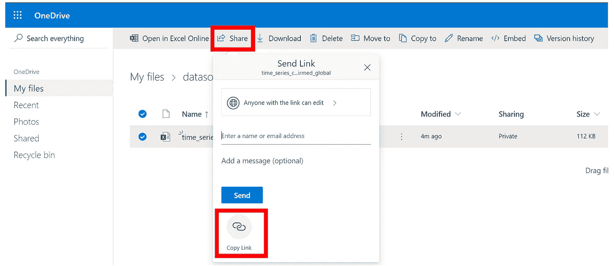
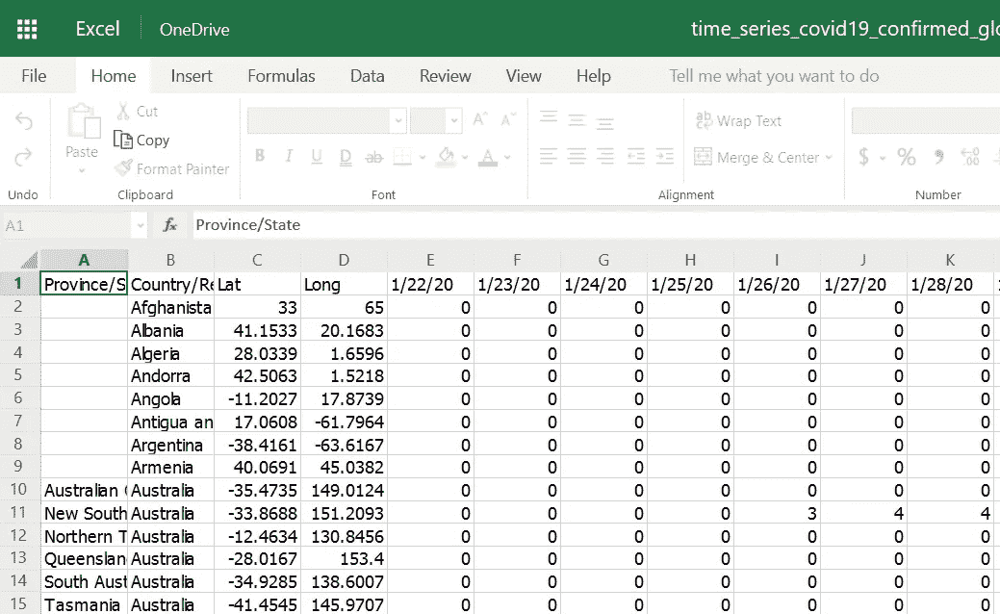
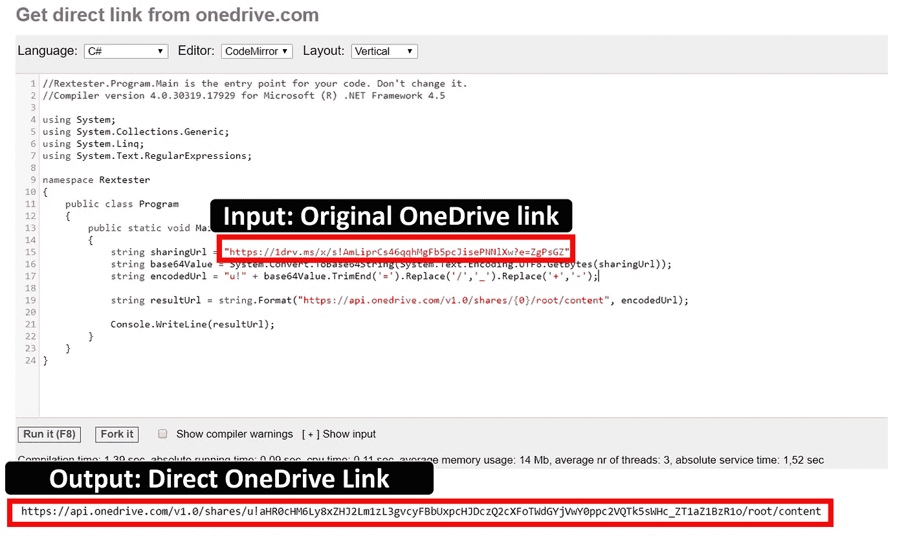
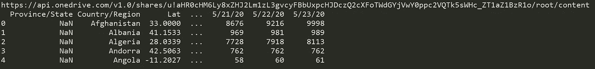

# 使用 C#或 Python 生成 OneDrive 直接下载链接

> 原文：<https://towardsdatascience.com/how-to-get-onedrive-direct-download-link-ecb52a62fee4?source=collection_archive---------17----------------------->

## 为新冠肺炎数据集生成直接下载链接并导入熊猫数据框架的示例


插图作者:金彩云

在许多项目中，您可能需要文件托管服务来共享大量数据集、脚本或任何带有直接下载选项的文件。你可能已经在使用最流行的托管服务，比如 Google Drive、微软 OneDrive、DropBox 和 iCloud。在这篇文章中，我将重点介绍如何从 OneDrive.com 的**制作直接下载链接。**

## 为什么直接下载链接？

直接下载可以让你在其他软件中灵活地使用这个文件。例如，如果您托管带有直接下载链接的 excel 或 csv 表数据集，接收者可以直接将其加载到 Python 中的 Pandas 数据框架。

## 为什么选择 OneDrive？

我想我没有必要介绍那么多关于 OneDrive 的东西。它免费提供 5 GB 的存储空间。这对任何大型数据集来说都足够了。如果您有非常大的数据集要共享，请考虑数据库。你们大多数人甚至有微软 Office 365，其中包括 1 TB 的在线空间。此外，它很容易使用，分享，在线编辑。

## 我们开始吧

# 共享你的 OneDrive 文件

您只需转到 OneDrive，拖放到那里上传任何文件，单击页面顶部的“共享”按钮，然后单击复制链接。就是这样！



**与微软 OneDrive** 共享 CSV 文件【全球新冠肺炎病例时间序列 [**CSSE**](https://github.com/CSSEGISandData/COVID-19/tree/master/csse_covid_19_data/csse_covid_19_time_series) **】(作者)**

例如，我通过 OneDrive 以 excel 表格的形式分享了来自 CSSE 的新冠肺炎时间序列数据集。当您通过您创建的链接访问该数据集时，浏览器将自动打开 Excel Online，以便您以表格格式浏览该数据集。多方便啊！



**查看可分享的 CSV 文件【全球新冠肺炎病例时间序列来自**[**CSSE**](https://github.com/CSSEGISandData/COVID-19/tree/master/csse_covid_19_data/csse_covid_19_time_series)**】来自 OneDrive 链接**(作者)

但是，不幸的是，如果您的接收者想要下载数据集，它需要几次点击或重定向。所以，如果你的目的是让你的接收者下载文件，你最好分享一个直接下载链接。

# 生成 OneDrive 直接下载链接

根据 [OneDrive API 文档](https://github.com/OneDrive/onedrive-api-docs/blob/master/shares/shares.md)，您可以使用以下逻辑轻松生成 OneDrive 直接下载链接:

1.  首先，使用 base64 编码 URL。
2.  通过删除值末尾的`=`字符，用`_`替换`/`，用`-`替换`+`，将 base64 编码的结果转换为[未填充的 base64url 格式](https://en.wikipedia.org/wiki/Base64)。)
3.  追加`u!`作为字符串的开头。

## 选项 1:用 C#生成直接下载链接

为了遵循上述逻辑，OneDrive API 文档还为您提供了一个 C#示例脚本，如下所示:

```
string sharingUrl = **"Your OneDrive Link here";**
string base64Value = System.Convert.ToBase64String(System.Text.Encoding.UTF8.GetBytes(sharingUrl));
string encodedUrl = "u!" + base64Value.TrimEnd('=').Replace('/','_').Replace('+','-');
```

您可以尝试使用以下链接在 C#中在线运行该脚本:

 [## 从 onedrive.com 获得直接链接，C# - rextester

### 用 C#从 onedrive.com 获得直接链接

rextester.com](https://rextester.com/QNSY6325) 

打开链接后，您只需将`sharingUrl`更改为您的任何一个 OneDrive 链接。等待几秒钟，然后您会在输出控制台中获得输出 direct OneDrive 下载链接。



**从 onedrive.com 获得直接链接**(作者)

## 选项 2:用 Python 生成直接下载链接

Python 在许多数据科学项目中很受欢迎。因此，在对数据集进行数据分析之前，您可能希望直接在 Python 中生成一个直接下载链接。如果有人(或您自己)共享 OneDrive 链接，您可以使用以下 Python 脚本将其转换为可下载的链接:

[**one drive _ DD _ generator . py**](https://gist.github.com/JoeThunyathep/5293f3bbdb87840b67aa027b4ee0b4d0)**(作者)**

**例如，您可以按照下面的脚本以 excel 格式从我们的新冠肺炎数据集示例中生成直接下载链接。URL:[https://1drv.ms/x/s!AmLiprCs46qqhMgFb5pcJisePNNlXw?e=ZgPsGZ](https://1drv.ms/x/s!AmLiprCs46qqhMgFb5pcJisePNNlXw?e=ZgPsGZ)然后导入到熊猫数据框:**

```
**import pandas as pd** # Input any OneDrive URL **
onedrive_url = "**[**https://1drv.ms/x/s!AmLiprCs46qqhMgFb5pcJisePNNlXw?e=ZgPsGZ**](https://1drv.ms/x/s!AmLiprCs46qqhMgFb5pcJisePNNlXw?e=ZgPsGZ)**"**# Generate Direct Download URL from above Script
**direct_download_url = create_onedrive_directdownload(onedrive_url)
print(direct_download_url)**# Load Dataset to the Dataframe
**df = pd.read_excel(direct_download_url)
print(df.head())**# Continue with your data analysis ...
```

****

****上面脚本的输出数据帧示例。**(作者)**

# **结论**

**本文介绍了如何通过 OneDrive 分享你的文件，并用 C#或 Python 将其转为可直接下载的链接。请注意，您也可以使用 apply 这个逻辑并用任何其他编程语言重写它。**

**我希望你喜欢这篇文章，并发现它对你的日常工作或项目有用。如果您有任何问题或意见，请随时给我留言。**

**关于我&查看我所有的博客内容:[链接](https://joets.medium.com/about-me-table-of-content-bc775e4f9dde)**

**祝**平安**和**健康**！💪**

****感谢您的阅读。📚****