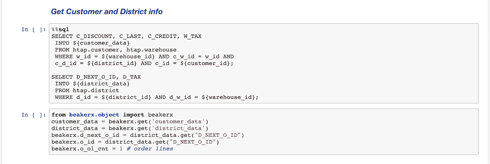
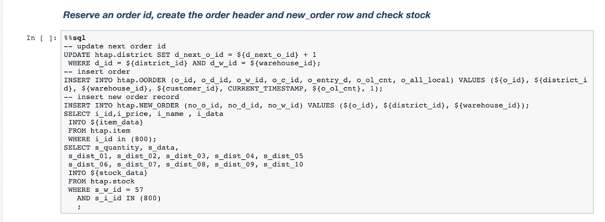
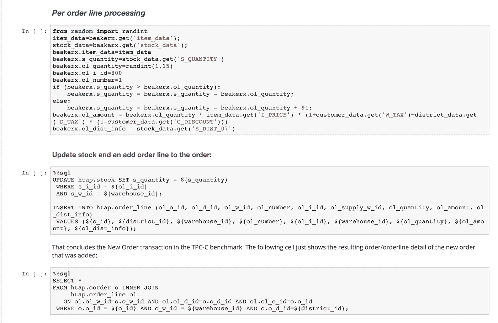
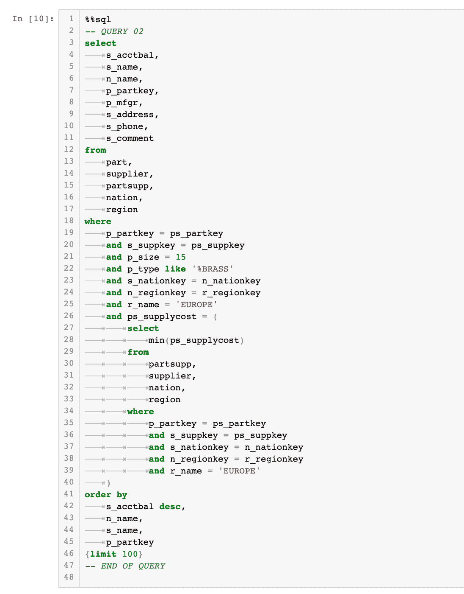
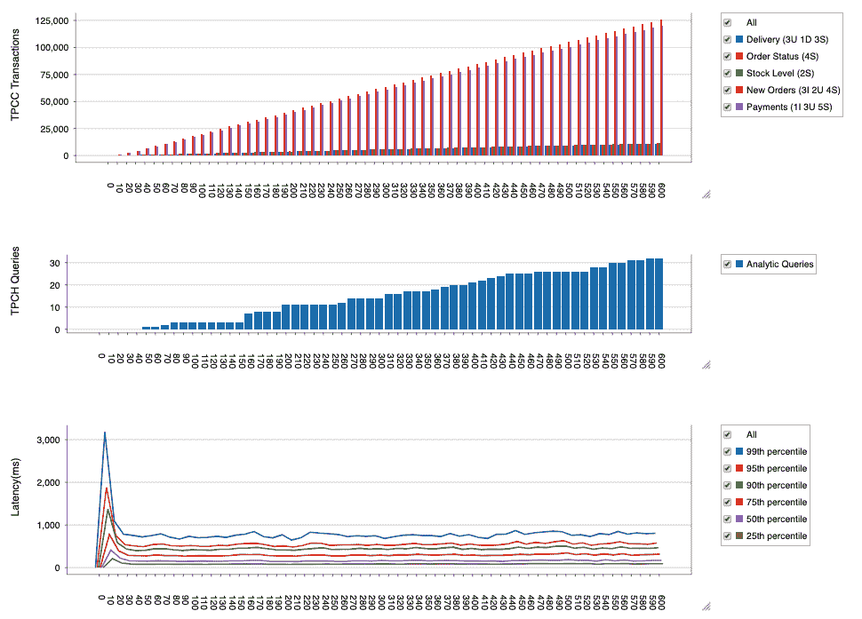
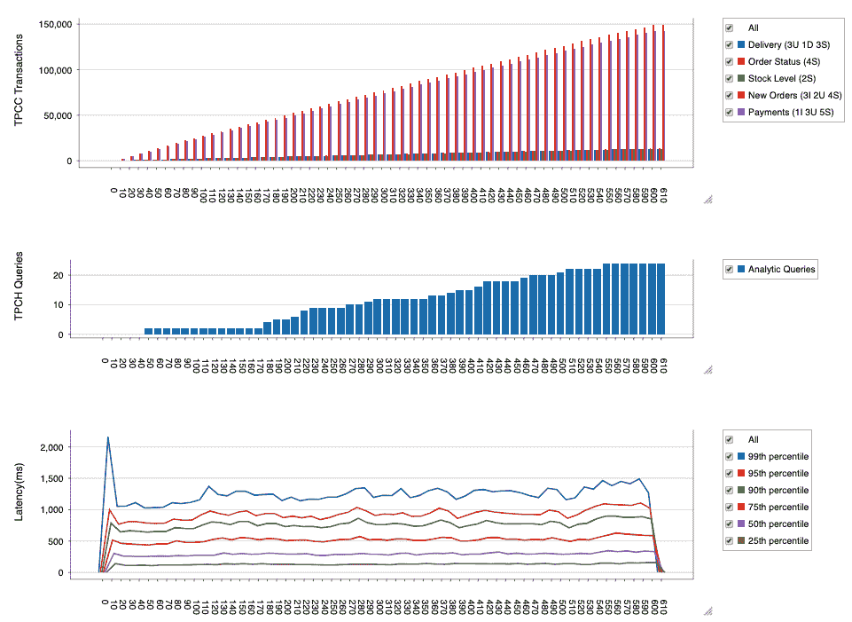

# 如何对 HTAP 数据库进行基准测试

> 原文：<https://towardsdatascience.com/how-to-get-real-time-analytics-by-consolidating-databases-85791066d20c?source=collection_archive---------46----------------------->

## 整合数据库以降低成本并变得实时

塞尔吉奥·费拉古特和蒙特·兹韦本

如何在不崩溃的情况下整合您的 RDBMS 和数据仓库(图片: [Sawitre](https://stock.adobe.com/contributor/206791252/sawitre?load_type=author&prev_url=detail)

你曾经为了昨天的销售报告等了一夜吗？或者，您可能渴望通过实时销售点和订单管理数据预测库存需求的最新需求预测。我们总是在等待我们的分析。更糟糕的是，要求修改我们的报告通常需要几周时间。雪上加霜的是，您一直在为专用分析数据库不断增加的成本缴税。

但是如果这不再是必要的呢？如果您可以整合分析，使其与运营工作负载在同一个数据库上运行，会怎么样？你的第一反应可能是，“你疯了。我们将分析从数据库中移走，因为它永远不够快。”过去是这样，但现在不是了。现在，通过将您的分析整合到一种称为混合事务分析平台(HTAP)的不同类型的 SQL RDBMS 上，可以降低您的数据库成本。一些 HTAP 数据库可以是专门的工程系统，可能花费数百万美元。但是在一个**横向扩展**架构上有一种新的 HTAP。这种架构将数据分布在多个服务器上，并在每个服务器上的不同引擎上执行计算，以实现混合工作负载的规模和性能。

HTAP 是 Gartner 创造的一个术语，用来描述新兴的数据库技术和应用程序，这些技术和应用程序可以提供在线事务处理(OLTP)和分析处理(OLAP)，从而产生更丰富的应用程序体验和更多的商业价值。Forrester 称之为 Translytical 数据平台。如果没有这种平台，企业将被迫通过利用运营数据存储、数据仓库和数据集市的复杂管道来转换数据并将其移出应用数据库，以便最终实现分析和数据科学。这非常耗时，并导致以下方面的延迟:

1.  生成报告
2.  更新已部署的机器学习模型的特征，从而对旧数据进行预测
3.  机器学习模型重新训练，导致模型不太准确。

在这篇博客中，我们展示了如何测量 HTAP 工作负载的性能。为此，我们将在同一组表上同时运行的 TPC-C 和 TPC-H 基准组合起来。TPC-C 模拟批发零售企业用户接受销售订单、处理付款、进行库存水平检查，并在大量交易数据上以高并发性记录交付。TPC-H 基准测试由 22 个复杂的分析查询组成，这些查询以相对较低的并发性扫描大量历史数据。

我们在这里使用开源基准测试项目[来驱动最初发表在](https://github.com/splicemachine/htap-benchmark/blob/master/README.md)[The mixed workload CH-benCHmark，Richard Cole 等人，db test’11，Athens，Greece](https://dl.acm.org/doi/pdf/10.1145/1988842.1988850) 中的测试。基准测试依赖于 [OLTP-Bench 中提供的代码:一个用于对关系数据库进行基准测试的可扩展测试床](http://www.vldb.org/pvldb/vol7/p277-difallah.pdf)，D. E. Difallah，A. Pavlo，C. Curino 和 P. Cudre-Mauroux 在 2014 年 VLDB 大会上。这种处理 HTAP 工作负载的方法从 TPC-C 作为基线开始，然后覆盖修改后的针对 TPC-C 模式的 TPC-H 查询。我们已经让位于[这里](https://cloud.splicemachine.io/?utm_source=medium&utm_medium=blogpost&utm_campaign=htap)的集群免费试用。

**TPC-C 新订单交易**

我们测试的工作负载运行中测量的事务不是单个 SQL 语句，而是实际上复杂的应用程序逻辑，由一系列打包在 ACID 事务中的 select、insert 和 update 语句组成，这些语句要么作为一个整体提交，要么作为一个整体回滚。每个新订单事务平均由十个不同的行项目组成，平均需要 46 条 SQL 语句来处理。

我们的实验是在 AWS 上的开源 RDBMS 平台即服务的拼接机器上进行的。(声明:两位作者都在 Splice Machine 工作，一位是 CEO)。Splice Machine 为数据工程师和数据科学家提供集成开发环境的“笔记本”。这些笔记本包括用于多语言编程的 JupyterLab 和 BeakerX，跨单元格的变量共享，以及许多其他很酷的编码和可视化 API。下面一组 Jupyter 笔记本单元格显示了构成新订单事务的 SQL 语句。为了简化这里给出的代码，我们对示例事务的一些元素进行了硬编码:我们在订单中使用了一个商品，并将订单保存在同一个仓库的本地。基准并不局限于此。

新订单交易从客户和地区查找开始，以便获得折扣、信用和税收信息，并保留订单 id，这些都是处理新订单所需要的。我们在这里使用一个 python 单元来存储 SQL 的结果，并为多语言访问设置一些 BeakerX 变量:

接下来，我们更新该地区递增的下一个订单 id，在 order 和 NEW_ORDER 表中创建一个新的订单条目，并检查所订购商品的仓库库存水平:

接下来，应用程序逻辑计算订单中每个项目的订单总数和补货需求，更新库存记录，并创建订单行记录。在示例代码中，我们只做一次，但是在实际的基准测试中，订单中的每个行项目都会发生一次，平均每个订单 10 次。

**TPC-H 查询**

TPC-H 基准旨在测试决策支持系统，为业务运营提供见解。在这里，TPC-H 查询#2 搜索欧洲的供应商，这些供应商具有尺寸为 15 的黄铜零件的最低欧洲价格:

这要求我们首先计算整个欧洲当前的最低价格，然后找到在欧洲以最低价格供应的 15 号黄铜零件。这需要跨大型数据集的多个连接和聚合。这种查询通过使用并行分布式处理进行水平扩展来实现更高的吞吐量。

拼接机 RDBMS 有单独的工作人员负责 OLTP 和 OLAP 工作负载。为了实现以下结果，我们利用了一个由 8 个 m5.2x 大型节点组成的 AWS 集群，该集群由 4 个 OLTP 工作线程和 4 个 OLAP 工作线程组成，同时运行 100 个并发 TPC-C 用户和 8 个并发 TPC-H 用户。Splice Machine 提供了一个免费的试用集群，利用相同的硬件配置和附带的 HTAP 笔记本，让您可以轻松地试验其他并发配置。我们运行了 10 分钟长的 HTAP 工作负载，按工作负载的事务类别测量总计数，并记录所有响应时间。

前两个图表是已完成交易的累计计数。X 轴以秒为单位测量经过的测试时间。在 TPC-C 图表中，计数按请求类型划分，其中测量的每个事务是许多 SQL 语句的集合；图例中的 2I 3U 4S 表示 2 次插入、3 次更新、4 次选择作为最小操作计数。在许多事务中，SQL 语句计数随着订单中项目计数的增长而增长，平均订单大小为 10 个项目。在 TPC-H 查询图表中，我们统计了已执行查询的总数。这些是复杂的查询，涉及表扫描、大型连接和聚合、子查询以及其他开销很大的查询结构。

延迟图表向我们展示了事务响应时间在整个工作负载执行过程中是如何变化的。第 99 百分位线显示，99%的事务运行时间不到一秒钟。第 50 百分位线显示 50%的查询持续运行不到一秒。

总之，在一个 4x4 拼接机数据库上，在 100 个 TPC-C 用户和 8 个 TPC-H 用户的情况下，运行 10 分钟，我们看到完成了 191，789 个 TPC-C 事务和 14 个 TPC-H 查询，99%的查询的 SLA 都在 1.085 秒内运行，但由于测试初始化开销，只有一个 3.3 秒的初始峰值。

接下来，我们想了解如果我们将资源翻倍，这将如何扩展。我们建立了一个 8 OLTP x 8 OLAP 拼接机数据库，并对 100 个 TPC-C 用户和 8 个 TPC-H 用户重新运行了 10 分钟的相同测试:

更多计算资源这导致两种工作负载的吞吐量显著增长:

*   TPC-C 交易= 279，480 (+46%)
*   TPC-H 查询= 32 次(+128%)

SLA 也更好，99%的事务运行时间不到 0.79 秒。

TPC-H 的增长似乎好于预期，而 TPC-C 没有预期的那么多，因此我们进行了另一项测试，试图更好地理解这一点。我们的理论是 100 个 TPC-C 用户不会使拼接机 OLTP 工作线程饱和，因此我们将 TPC-C 上的并发数增加到 200，并再运行 10 分钟:

该测试的结果是:

*   TPC-C 交易= 330，728(与第一次相比增加了 72%)
*   TPC-H 查询= 24 次(与第一次相比增加了 71%)
*   SLA—99%的交易在 1.3 秒内完成

确认我们仍然可以通过请求更多事务来增加 8x8 的吞吐量。

## 结论

我们能够运行并发的 TPC-C 和 TPC-H 工作负载，同时保持稳定的事务响应时间。我们还通过将 OLTP 和 OLAP 工作人员增加一倍来测试增加的资源，并看到两种工作负载都有近乎线性的提高。然而，最终测试中 TPC-H 成绩的下降促使我们调查为什么会发生这种情况。

通过检查所有服务的资源消耗，我们意识到使用 CPU 请求的默认 Kubernetes 配置(相对于 CPU 限制)允许一个服务通过抓取分配给其他服务的未使用的 CPU 来消耗超过其分配量的 CPU。

可变资源分配可能是一件好事，也可能是一件坏事，这取决于你的需求。考虑到可变的工作负载，我们可能希望动态地将 OLTP 工作线程的资源用于 OLAP 工作，就像我们在第二个测试中看到的那样，或者当我们增加 OLTP 端的工作时，回收分配给 OLAP 工作的 CPU。另一方面，为了保证 OLTP SLAs，我们可能希望为 OLAP 工作人员尝试固定的 CPU 限制。关于可用配置、如何调整它们以及它们的影响的更多信息将在以后的博客文章中进行深入探讨。

要执行您自己的测试，可以从[这里](https://cloud.splicemachine.io/?utm_source=medium&utm_medium=blogpost&utm_campaign=htap)获得基准。数据库启动后，只需点击数据库快速启动页面上的“运行 HTAP 基准”链接。