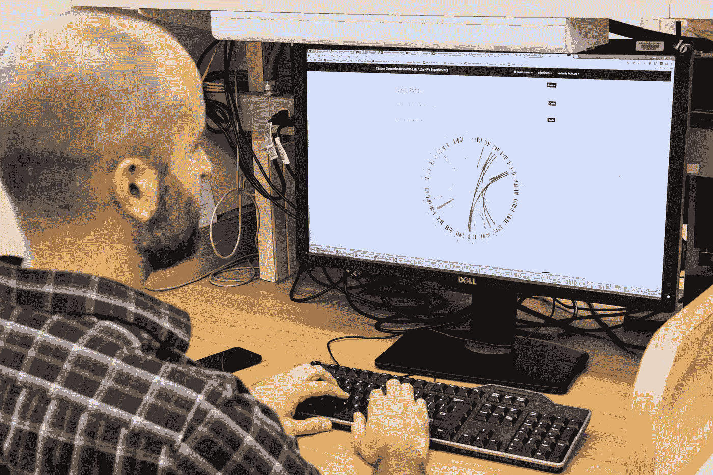

# 如何开始分析新冠肺炎数据

> 原文：<https://towardsdatascience.com/how-to-get-started-analyzing-covid-19-data-808822437c32?source=collection_archive---------18----------------------->

## Kaggle 上的新冠肺炎公开研究数据集挑战



[国家癌症研究所](https://unsplash.com/@nci?utm_source=medium&utm_medium=referral)在 [Unsplash](https://unsplash.com?utm_source=medium&utm_medium=referral) 上拍摄的照片

本月早些时候，Kaggle 发布了一项新的数据集挑战:新冠肺炎开放研究数据集挑战。这一挑战呼吁人工智能专家开发文本处理工具，以帮助医疗专业人员找到高优先级问题的答案。

为此，卡格尔与 AI2 大学、CZI 大学、MSR 大学、乔治城大学、国家卫生研究院和白宫合作，收集了一个“超过 29，000 篇学术文章的数据集，其中包括超过 13，000 篇关于新冠肺炎、新型冠状病毒和相关冠状病毒的全文。”

我相信许多数据科学家正在寻找机会来帮助对抗新冠肺炎疫情，这是一个很好的起点。Kaggle 提供数据，甚至一系列任务供您处理。例如，一项任务是:

> 我们对新冠肺炎风险因素了解多少？我们从流行病学研究中学到了什么？

为了帮助其他人开始使用这个数据集，我想我会提供一个相当简单的方法来分析数据。需要注意的是，这种方法并不旨在对数据或任务进行全面的审查。相反，只是一个想法被走过，以帮助你有希望开始你的想法。

# 元数据

我想把精力集中在提供的**CORD-19-research-challenge/2020–03–13/all _ sources _ metadata _ 2020–03–13 . CSV**文件上。您可以使用以下代码将该文件读入 Pandas 数据框:

```
meta = pd.read_csv("/kaggle/input/CORD-19-research-challenge/2020-03-13/all_sources_metadata_2020-03-13.csv")
```

以下是元数据文件的前 5 行:


我们将专门研究抽象栏。该文件中有 29，500 行数据，其中 2，947 行缺少摘要(约 10%)。以下是关于摘要长度(字符数)的一些基本统计数据:

```
count     26553.000000
mean       1462.129176
std        1063.536406
min          17.000000
25%        1087.000000
50%        1438.000000
75%        1772.000000
max      122392.000000
```

# 抽象向量

我的想法很简单:

1.  将摘要转换成**向量**
2.  计算**余弦相似度**以找到与其他摘要相似的摘要

其目标是，如果医学研究人员发现一篇有价值的论文，他或她可以提取该论文的摘要，并快速找到其他相似的摘要。

为了计算我们的抽象向量，我们将利用空间。scispaCy 是一个“Python 包，包含用于处理*生物医学*、*科学*或*临床*文本的 spaCy 模型。”我决定使用 allenai 创建的这个包，因为它是专门为生物医学文本培训的，非常容易使用。我们可以使用以下代码计算所有摘要的向量:

```
nlp = spacy.load("en_core_sci_sm")
vector_dict = {}
for sha, abstract in tqdm(meta[["sha","abstract"]].values):
    if isinstance(abstract, str):
        vector_dict[sha] = nlp(abstract).vector
```

这段代码利用了一个预先训练的单词向量模型，该模型将抽象中的每个单词转换为向量表示，希望这是该单词的良好表示。一个好的表示应该在向量空间中接近其他相似的单词(在非常高的水平上)。然后，对所有的单词向量进行平均，以将摘要表示为单个向量。

我使用 **sha** 值作为查找键，这样我们可以很容易地将向量与论文联系起来。为了快速处理所有的摘要，我还使用了小版本的模型。在 Kaggle 内核上运行上述代码大约需要 20 分钟。

# 余弦相似性

既然我们已经将所有的抽象表示为向量，那么使用 sklearn 计算所有的成对余弦相似性就很容易了。余弦相似度是一种比较两个向量相似度的方法。

```
values = list(vector_dict.values())
cosine_sim_matrix = cosine_similarity(values, values)
```

我们的余弦相似性矩阵的每个值是两个摘要之间的相似性得分(由行表示的摘要和由列表示的摘要)。值越高，抽象就越相似(假设我们的向量是好的)。因此，我们只需要选择一行(抽象的)并按照具有最大值的索引对它进行排序(忽略它自己的索引，因为它总是与自己最相似)。代码如下:

```
n_sim_articles = 5
input_sha = "e3b40cc8e0e137c416b4a2273a4dca94ae8178cc"keys = list(vector_dict.keys())
sha_index = keys.index(input_sha)
sim_indexes = np.argsort(cosine_sim_matrix[sha_index])[::-1][1:n_sim_articles+1]
sim_shas = [keys[i] for i in sim_indexes]
meta_info = meta[meta.sha.isin(sim_shas)]
```

您只需要提供您想要的类似文章的数量和您的查询摘要的输入 sha 就可以获得结果。让我们把下面的例子抽象为一个查询:

> 【2019 年 12 月，湖北武汉报告有华南海鲜市场暴露史的不明原因肺炎病例。一种新的冠状病毒，新型冠状病毒，被确定是造成这种疾病的原因。人际传播得到证实，这种疾病(被世界卫生组织(世卫组织)命名为新冠肺炎)在全国和全世界迅速传播。截至 2020 年 2 月 18 日，确诊病例数已达到 75，199 例，其中 2009 例死亡。与严重急性呼吸综合征(SARS)和中东呼吸综合征(MERS)相比，新冠肺炎导致确诊病例中的病死率低得多(约 2.67%)。在从已发布的官方报告中收集的 45 例死亡病例的症状构成中，前四位是发烧、咳嗽、气短和胸闷/疼痛。死亡病例的主要共病包括高血压、糖尿病、冠心病、脑梗塞和慢性支气管炎。病毒的来源和这种疾病的发病机理仍未得到证实。还没有发现特定的治疗药物。中国政府已经启动了一级公共卫生响应，以防止疾病的传播。与此同时，加快研制疫苗和治疗药物也至关重要，这将使我们能够尽快击败新冠肺炎。

根据我们的算法，最相似的抽象应该是:

> 背景:直到 2008 年，在法属圭亚那从未报告过人类狂犬病。2008 年 5 月 28 日，法国国家狂犬病参考中心(巴黎巴斯德研究所)根据一名圭亚那人的皮肤活检和唾液样本的半巢式聚合酶链反应，确认了狂犬病诊断，这名圭亚那人从未出国旅行，在出现临床典型脑膜脑炎后死于卡宴。方法/主要发现:病毒的分子分型鉴定出一种狂犬病毒(狂犬病毒种)，与拉丁美洲吸血蝙蝠(主要是圆齿蝙蝠)中传播的狂犬病毒密切相关。启动了一个多学科危机小组。其目标是实施一项流行病学调查和一项兽医调查，提供控制措施并建立一个交流计划。污染源尚未正式确定，但根据分离出的病毒类型，可能与蝙蝠咬伤有关。在确认 90 人暴露后，他们接种了狂犬病疫苗:42 人来自该病例的随行人员，48 名医护人员。为了应对这一突发事件和当地人口对疫苗接种的日益增长的需求，利用电视、报纸、广播等多种媒体建立了一个专门的宣传计划。结论/意义:这一事件发生在远离法国大陆的一个部门，强烈影响了当地人口、医护人员和当局，管理团队面临巨大压力。这一观察证实了在法属圭亚那感染狂犬病的风险是真实的，并对人口教育计划、控制措施、医疗诊断和暴露后预防产生了影响。

如果你看看前 5 个最相似的摘要，它似乎将查询文章与讨论狂犬病的文章联系起来。在我看来，这似乎不是一个很好的结果。也就是说，我不是医学研究者，所以我可能遗漏了一些东西。但是让我们假设第一遍是没有价值的。

# 后续步骤

我认为上述想法是合理的。我的猜测是，向量这个词并不特别适合这种研究。下一步，我会在提供的所有论文的文本中寻找训练词向量。这应该有助于向量更好地适应这一研究领域。

此外，还可以进行大量的文本处理，以潜在地改进流程。例如，删除停用词可能有助于减少某些摘要中的噪音。

LinkedIn 上的 Vinit Jain 也建议尝试一下 Biobert 或 BioSentvec，我认为这也是个好主意。尤其是以一种比平均单词向量更聪明的方式将摘要转换成向量的想法。

虽然我第一次尝试为新冠肺炎数据集提供价值时表现平平，但我希望本文实现了它的真正目标，即帮助您开始分析数据。

你可以在这里找到我的 Kaggle 内核和所有讨论过的代码。

这篇文章也可以在[这里](https://learningwithdata.com/posts/tylerfolkman/how-to-get-started-analyzing-covid-19-data-808822437c32/)找到。

有兴趣了解有关 Python 数据分析和可视化的更多信息吗？查看我的[课程](https://www.educative.io/courses/python-data-analysis-and-visualization)。