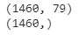

# 如何开始 Kaggle 竞赛

> 原文：<https://towardsdatascience.com/how-to-get-started-on-kaggle-competitions-68b91e3e803a?source=collection_archive---------23----------------------->

## 关于如何在 Kaggle 上构建第一个数据科学项目的分步指南

Jonathan Chng 在 [Unsplash](https://unsplash.com/) 上的照片

如果你正在开始你的数据科学和机器学习之旅，你可能听说过全球最大的数据科学社区 [Kaggle](https://www.kaggle.com/) 。随着无数的课程、书籍和教程在网上讨论这个问题，感到不知从何开始是完全正常的。

虽然在开始学习一项技能时，没有一致同意的最佳方法，但从数据科学道路的起点开始使用 Kaggle 是一个可靠的建议。

这是一个学习和分享经验的绝佳场所，所有级别的数据科学家都可以从与其他用户的协作和互动中受益。更有经验的用户可以跟上新的趋势和技术，而初学者将找到一个很好的环境来开始该领域的工作。

Kaggle 有几个[速成班](https://www.kaggle.com/learn/overview)帮助新手训练技能。有关于 python、熊猫、机器学习、深度学习的课程，仅举几例。随着你获得更多的自信，你可以参加比赛来测试你的技能。事实上，在几门课程之后，你会被鼓励加入你的第一场比赛。

在这篇文章中，我将用一种简单明了的方式向你展示如何构建你的第一个项目的一些技巧。我将参与[房价竞赛](https://www.kaggle.com/c/home-data-for-ml-course)，这是在 Kaggle 上开始的最好的动手项目之一。

# 1.了解数据

当你面对一个新的数据集时，第一步是花些时间去了解数据。在 Kaggle 比赛中，你会遇到类似下面的例子。

Kaggle 竞赛登录页面

在竞赛页面上，您可以在**概述**上查看项目描述，并在**数据**选项卡上找到关于数据集的有用信息。在 Kaggle 竞赛中，通常在单独的文件中提供训练集和测试集。在同一个选项卡上，通常会有您将使用的功能的摘要和一些基本的统计数据。理解需要解决的问题和我们手头的数据集是至关重要的。

您可以使用 Kaggle 笔记本来执行您的项目，因为它们类似于 Jupyter 笔记本。

# 2.导入必要的库和数据集

## 2.1.图书馆

这个项目中使用的库如下。

## 2.2.数据集

下一步是将数据集读入 pandas DataFrame，并获得目标向量 **y** ，这将是列`SalePrice`，以及预测值 **X** ，这将是剩余的列。

为了获得数据的概述，让我们检查第一行和数据集的大小。

数据帧的第一个样本的样本

检查 X 和 y 的大小

我们有 1460 行和 79 列。稍后，我们将检查这些列，以验证它们中的哪一个对模型有意义。

下一步，我们将把数据分成训练集和验证集。

# 3.培训和验证数据

将我们的数据分成一组用于训练模型，另一组用于验证结果，这一点至关重要。值得一提的是，我们不应该在这里使用测试数据。我们的测试集保持不变，直到我们对模型的性能感到满意。

我们要做的是将预测值 **X** 和目标向量 **y** 分成训练集和验证集。为此，我们将使用 scikit-learn 的`train_test_split`。

# 4.分析和准备数据

现在，我们开始通过检查一些关于特性的信息来分析数据。

检查 X 信息

从上面的总结中，我们可以观察到一些列缺少值。让我们仔细看看。

## 4.1.缺少值

检查缺少的值

一些要素的大部分条目都有缺失值。检查[竞赛页面](https://www.kaggle.com/c/home-data-for-ml-course/data)，我们会发现关于每个特性值的更多详细信息，这将有助于我们处理缺失的数据。

例如，在`PoolQC`、`MiscFeature`、`Alley`、`Fence`和`FireplaceQu`列中，缺少的值意味着该房屋不符合该特定特征，因此，我们将用“NA”来填充缺少的值。以`Garage`和`Bsmt`开头的列中的所有空值分别与没有车库或地下室的房屋相关。我们将用“NA”或平均值填充这些值和剩余的空值，考虑要素是分类的还是数值的。

## 4.2.预处理分类变量

大多数机器学习模型只对数值变量有效。因此，如果我们在没有对分类变量进行预处理的情况下向模型输入分类变量，我们将会得到一个错误。

有几种方法可以处理分类值。这里，我们将使用 *One-Hot Encoding* ，它将创建新的列，指示原始数据中每个值的存在或不存在。

One-Hot 编码的一个问题是处理具有许多唯一类别的变量，因为它将为每个唯一类别创建一个新列。因此，该项目将只包括不超过 15 个唯一值的分类变量。

## 4.3.创建管道

*管道*是保持数据建模和预处理更有组织、更容易理解的好方法。创建一个管道，我们将处理丢失的值和前两步中涉及的预处理。

如上所述，数值缺失条目将用平均值填充，而缺失分类变量将用“NA”填充。此外，分类列也将使用一键编码进行预处理。

我们使用*简单估算器*来填充缺失值，而*列转换器*将帮助我们在单个转换器中应用数字和分类预处理程序。

# 5.定义模型

既然我们已经在管道中捆绑了我们的预处理器，我们可以定义一个模型。在这篇文章中，我们正在与 **XGBoost** 合作，这是最有效的机器学习算法之一，在许多 Kaggle 比赛中取得了很好的结果。作为评估指标，我们使用的是**平均绝对误差**。

验证集的平均绝对误差

# 6.交叉验证

使用[交叉验证](https://scikit-learn.org/stable/modules/cross_validation.html#)可以产生更好的结果。交叉验证不是简单地使用训练集和测试集，而是在不同的数据子集上运行我们的模型，以获得模型质量的多种度量。

我们将使用默认设置中的交叉验证器 [KFold](https://scikit-learn.org/stable/modules/generated/sklearn.model_selection.KFold.html) 将训练数据分成 5 份。然后，每个折叠将被用作一次验证，而剩余的折叠将形成训练集。之后，[交叉验证](https://scikit-learn.org/stable/modules/generated/sklearn.model_selection.cross_validate.html)将评估指标。在这种情况下，我们使用平均绝对误差。

交叉验证后的平均绝对误差

通过交叉验证，我们可以提高分数，减少误差。下一步，我们将尝试进一步改进模型，优化一些超参数。

# 7.超参数调谐

**XGBoost** 在默认设置下通常会产生很好的结果，但是它也有很多可以优化的超参数来改进模型。这里，我们将使用一个名为 [GridSearchCV](https://scikit-learn.org/stable/modules/generated/sklearn.model_selection.GridSearchCV.html) 的方法，它将搜索指定的参数值并返回最佳值。我们将再次利用管道和上面定义的交叉验证器 *KFold* 。

*GridSearchCV* 将对参数进行彻底搜索，这可能需要大量的计算能力，并需要大量的时间来完成。我们可以通过将参数`n_jobs`设置为`-1`来稍微加快进程，这意味着机器将使用任务上的所有处理器。

最佳参数值为:

*   *n_estimators: 400*
*   *最大深度:3*
*   *最小 _ 子 _ 体重:0.0001*
*   *learning_rate: 0.1*

# 8.生成测试预测

在调优了一些超参数之后，是时候再次检查建模过程以对测试集进行预测了。我们将根据 *GridSearchCV* 提供的优化值定义我们的最终模型。

# 9.提交您的结果

我们快到了！机器学习建模已经完成，但是我们仍然需要提交我们的结果来记录我们的分数。

这一步相当简单。我们需要创建一个包含预测的`.csv`文件。该文件由两列数据帧组成。在这种情况下，一列用于“Id ”,另一列用于目标特征的测试预测。

# 10.参加比赛

最后，我们只需要加入竞争。请根据 Kaggle 的说明，遵循以下步骤。

*   首先进入[竞赛页面](https://www.kaggle.com/c/home-data-for-ml-course)，点击**加入竞赛**。
*   在你的 Kaggle 笔记本中，点击窗口右上角的蓝色保存版本按钮。
*   将出现一个弹出窗口。选择选项**保存并运行所有**，然后点击蓝色的保存按钮。
*   笔记本电脑运行时，左下角会出现一个新的弹出窗口。当它停止运行时，点击数字右边的**保存版本**按钮。您应该点击最新笔记本版本右侧的**省略号(…)** ，并选择**在查看器**中打开。这将使您进入同一页面的查看模式。
*   现在，点击屏幕右侧的**输出**选项卡。然后，点击蓝色的**提交**按钮，将您的结果提交至排行榜。

提交后，您可以在[排行榜](https://www.kaggle.com/c/home-data-for-ml-course/leaderboard)上查看您的分数和排名。

竞赛排行榜

# 结论

本文旨在提供指导，帮助数据科学初学者以简单的步骤构建他们在 Kaggle 上的第一个项目。通过这种简单的方法，我得到了 14，778.87 的分数，这个项目排在前 7%。

在进一步学习后，你可以回到过去的项目，并尝试使用你学到的新技能来提高他们的表现。为了改进这个项目，我们可以更仔细地调查和处理异常值，对缺失值应用不同的方法，或者进行一些特性工程。

我给初学者的建议是，一开始就保持简单。不要以“完美”的模式为目标，而是专注于完成项目，正确应用你的技能，并从你的错误中学习，了解你在哪里以及为什么把事情搞砸了。数据科学社区在不断扩张，有很多更有经验的人愿意在 Kaggle 或 Stack Overflow 这样的网站上提供帮助。试着从他们过去的错误中吸取教训！通过练习和训练，开始构建更精细的项目并在 Kaggle 的比赛中排名上升只是时间问题。