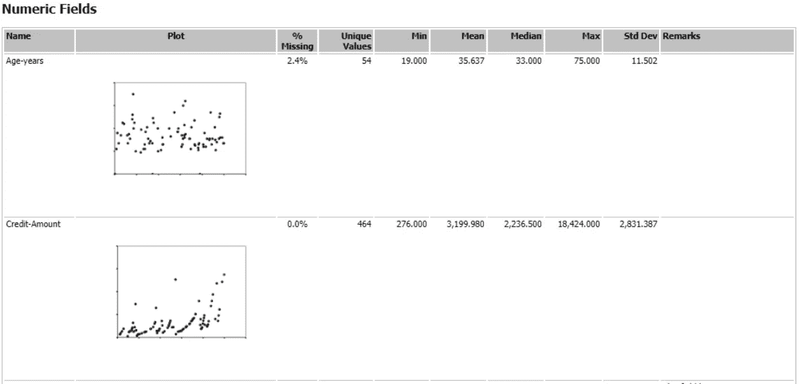
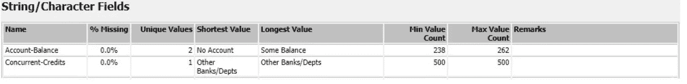
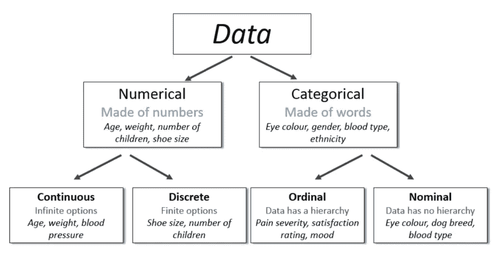
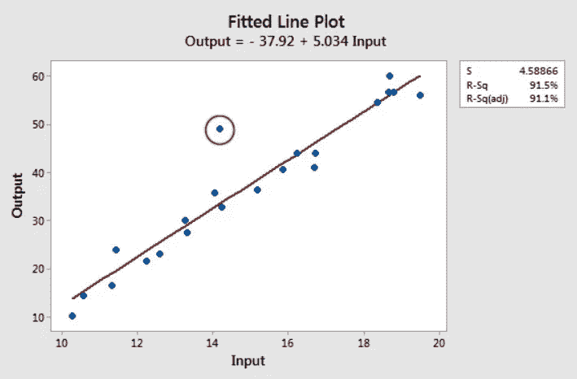

# 数据怎么入门？—第一部分

> 原文：<https://towardsdatascience.com/how-to-get-started-with-any-kind-of-data-part-1-c1746c66bc2d?source=collection_archive---------42----------------------->

## 从数据开始

## 即使你以前没有做过分析。

我的数据科学之旅始于在德国最大的汽车制造商之一的高级分析部门的一份学生工作。我很天真，还在攻读硕士学位。

我对这份工作很兴奋，因为我目前的专业是数字化。我想知道它到底是如何工作的。我也学过编程，但不是 python。我的同事都非常聪明——博士、数学家和物理学家。他们对分析的理解水平远远超出了我仅仅通过读书所能获得的！

最初几天，各种各样的项目和任务、分析和项目让我不知所措。但是，你知道什么更令人困惑吗？像什么是分析这样的问题？为什么这么做？这么多数据的这些文件都是什么？结果中的这些数字说明了什么？一个分析项目看起来像什么？他们说在分析数据是什么意思？

**势不可挡！**

我花了几天时间理解分析和工作本身。我狼吞虎咽地阅读了各种教授 python、统计学、数据科学等的书籍和在线课程。渐渐地，我对这些课题有了理解，并在同一个系成功地完成了我的论文。

我在下面为你解释了数据分析的诀窍。希望你能以此为指导，即使你的成分随着应用而改变。

让任何项目成功的最重要的一步是有一个清晰的开端。无论你的项目有多大或多小，如果你没有所需形式的配料和合适的工具，即使是一个大师级厨师的食谱也不能保证最后是一顿美味的饭菜。

先说食材，再开始准备。

来自 [Pixabay](https://pixabay.com/) 的图片由 [Seksak Kerdkanno](https://pixabay.com/users/kerdkanno-1334070/) 提供

# **配料:**

**1。问题**

你在谷歌中搜索你的查询后，有没有得到不相关的结果？那你会怎么做？重新措辞并提炼关键词，再次搜索。同样，在一开始就明确你分析的“为什么”有助于你更好地解释你的结果。

在获得所有需要的数据后，下一步是理解和定义问题陈述。这里需要解决业务案例的难点。你的目标必须与公司的商业战略相一致，这样分析才能对利益相关者证明是富有成效的。

考虑上面的商店位置示例。根据您的分析结果，您将获得分配给每个潜在位置的分数。如果你的管理策略是，只有当新地点在一个人口最少为 5000 的新城市产生超过 100，000 美元的利润时，才为项目融资。因此，您有明确的标准来根据您公司的愿景缩小分析结果的范围。

**2。数据**

对于任何一种数据分析，获取数据是毋庸置疑的。数据可以从各种相关来源获得。因此，它可能有不同的类型和格式。你的工作是根据它的类型切割和粉碎它，这样它就可以用在你的食谱上了。

在数据的表格表示中，每一列是一个数据字段，每一行是一条记录。每个记录可以用一个 ID 唯一地标记。

例如，为了预测下一个开设新店的地点，您可能必须使用
的年度销售数据、现有商店地点的销售数据、地点的人口密度、家庭总数、人口普查数据、土地面积。如果你的公司销售宠物产品，那么你需要有宠物的家庭数量。如果你的公司销售儿童产品，那么有 15 岁以下儿童的家庭数量。

最常见的输入文件类型有。csv(逗号分隔值文件)。xlsx (excel 表格文件)和。txt(文本文件)。Excel 文件在导入数据时会消耗更多内存。相反，CSV 文件速度更快，消耗的内存更少。

无论文件类型如何，您都必须清理每个文件，然后将所有文件混合到一个文件中进行分析。你可以在这里查看更多信息:

 [## 什么是数据准备？

### 数据准备是收集、清理和整合数据到一个文件或数据表中的过程，主要是…

www.datawatch.com](https://www.datawatch.com/what-is-data-preparation/) 

**3。软件**

用于分析的软件可以根据您想要的结果类型进行选择；对于那些不喜欢编程的人来说，可以简单地使用任何模块化分析软件。在这样的工具中，你只需拖放所需的功能，你就可以很好地处理结构精美的结果和演示。

流行的“无代码”分析软件包括:

*   [表格](https://www.tableau.com/products/trial) —数据可视化和报告
*   [DataRobot](https://www.datarobot.com/lp/trial/) —自动化机器学习平台
*   [RapidMiner](https://rapidminer.com/) —适用于从预测到部署的整个生命周期
*   [Alteryx](https://www.alteryx.com/) —高级分析平台
*   [MLBase](https://mlbasejl.readthedocs.io/en/latest/) —开源
*   [TriFacta](https://www.trifacta.com/) —免费

对于这些，你只需要去他们的网站，创建一个帐户并下载(有些可能只允许有限时间的试用版本)

之后，只需上传您的数据文件进行分析和运行。当你读完这篇文章的时候，你已经有结果了。

统计计算的流行 ide:

*   [PyCharm](https://www.jetbrains.com/pycharm/download/) (蟒蛇)
*   [Spyder](https://www.anaconda.com/products/individual) (Anaconda Python 发行版)
*   RStudio

 [## Python 数据分析入门

### 这篇文章最初发表在 blog.zakjost.com 上

towardsdatascience.com](/getting-started-with-python-for-data-analysis-64d6f6c256b2) 

您还可以直接在线启动您的数据分析项目，无需下载或安装任何东西！

*   [谷歌 Colab](https://colab.research.google.com/)
*   [微软 Azure 笔记本](https://docs.microsoft.com/en-us/azure/notebooks/tutorial-create-run-jupyter-notebook)

# **准备:**

不同类型的数据有不同的格式。通常来自不同来源的数据需要在下游流程中进行清理、丰富和适当整合，以形成一种可用的形式。通常使用的技术术语是数据清理、特征选择、数据转换、特征工程和降维。

> 数据清理和准备是整个分析过程中最耗时的任务。

对任何文件要做的第一件事是检查给定的路径是否正确，以及它是否正确无误地打开。将数据加载到您选择的软件中。现在，看看里面。

查看数据的一个例子是 Alteryx 中的字段汇总工具，它提供了所有字段的数据汇总。摘要如下所示:

数字域:图片来自 Alteryx 软件的 Priyanka Mane

使用统计工具分析和解释数据(即发现相关性、趋势、异常值等)。).但是，数据可能有缺失值、键入错误或不同的日期格式；为了获得更好的结果，必须首先确定并解决这个问题。

字符串字段:图片来自 Alteryx 软件的 [Priyanka Mane](https://www.medium.com/priyanka_mane)

**变数**

*分类变量*是可以取属于固定数量类别的值或标签的变量。性别是一个*名义*分类变量，有两个类别——男性和女性。这些类别没有内在的顺序。序数变量有明确的顺序。温度是一个*序数*分类变量，有三个有序类别(低、中、高)。为了便于分析，这些变量使用不同的技术进行编码。

*数量变量*代表测量和计数。它们有两种类型:连续型(可以取区间内的任何值)和离散型(可数)。

[数据类型](https://images.app.goo.gl/pHvzQk4HjeKvPQs89):数值型和分类型

下面的链接概述了对变量进行编码的方法。

 [## 什么是分类变量，如何编码？

### 初学者分类变量编码指南。

towardsdatascience.com](/what-are-categorical-variables-and-how-to-encode-them-6e77ddc263b3) 

在准备数据时，您可能必须应对以下挑战:

*   **空值/缺失数据**

空值在数据中显示为 NaN 或“非数字”值。NaN 属性与数字相同，但不是合法的数字。在 python 中，使用 isNaN()全局函数检查值是否为 NaN。在 Alteryx 软件中，运行代码后，值显示为[Null]。可以使用公式工具中的 isNull 对它们进行筛选。此外，汇总工具还可以帮助您计算空值。

当数据集中没有为某个观测值存储数据值时，在统计数据中称为缺失数据或缺失值。 [Rubin](https://www.ncbi.nlm.nih.gov/pmc/articles/PMC3701793/#CR45) 阐述了缺失数据发生的三种机制:随机缺失(MAR)、完全随机缺失(MCAR)和非随机缺失(MNAR)。

将替代值分配给缺失值的过程称为插补。如果数据的一小部分(高达 5%)缺失，那么可以使用平均值、中值或众数等方法对这些值进行估算。它使用同一列中的其他值进行插补。原则性方法，如多重插补(MI)方法、全信息最大似然(FIML)方法和期望最大化(EM)方法。

如果超过 10%的数据丢失，建议[删除](https://www.ncbi.nlm.nih.gov/pmc/articles/PMC3701793/)字段，因为这可能会增加结果的统计偏差。

在 Alteryx 中，字段汇总工具显示每个数据字段缺失记录的百分比。

请点击此链接了解在 excel 中处理缺失数据的步骤和公式。

 [## 处理缺失数据

### 收集数据时面临的另一个问题是一些数据可能会丢失。例如，在与…进行调查时

www.real-statistics.com](http://www.real-statistics.com/descriptive-statistics/missing-data/) 

*   **异构数据**

由于格式不统一，年龄、货币、日期等数字字段很有可能出错。例如，年龄可以写成 30 岁或 30.2 岁或简单地写成 30 岁。货币的千位分隔符和小数点分隔符因国家和地区而异。确保这些列的格式一致。

图片由[米莎·塞格](https://pixabay.com/users/michasager-6459346/?utm_source=link-attribution&amp;utm_medium=referral&amp;utm_campaign=image&amp;utm_content=2755908)从[皮克斯拜](https://pixabay.com/?utm_source=link-attribution&amp;utm_medium=referral&amp;utm_campaign=image&amp;utm_content=2755908)拍摄

*   **离群值**

一旦数据集被清理，就该对其运行另一个预处理机制了。异常值是数据集中可能导致计算中出现统计错误的异常值。它们异常远离数据集中的其他值，可能会严重扭曲您的输出值。

回归结果中的异常值:图片来自 Jim 的[统计](https://statisticsbyjim.com/basics/outliers/)

当您需要立即识别数据中的异常值时，散点图非常有用。使用图表简单地显示每个预测变量和目标变量之间的关系。

以下是一些链接，可以帮助您了解处理异常值的术语和方法:

 [## 7.1.6.数据中的异常值是什么？

### 7.产品和工艺比较。异常值的定义异常值是一个存在于…

www.itl.nist.gov](https://www.itl.nist.gov/div898/handbook/prc/section1/prc16.htm)  [## 四分位数、盒子和胡须

### 对于统计中的许多计算，假设您的数据点(即列表中的数字)是…

www.purplemath.com](https://www.purplemath.com/modules/boxwhisk.htm) 

以上是第 1 部分的全部内容。查看[第 2 部分，了解数据科学项目的分析和演示](/how-to-get-started-with-any-kind-of-data-part-2-c4ccdbcc8b13)阶段。敬请期待！

步入正轨的最好方法是做好准备，远离你的毒瘾。阅读以下内容，了解更多信息。

 [## 你对任何东西的上瘾——解释！

### 以及如何控制它！激励性的谈话没有帮助。引发你内心的化学反应。

medium.com](https://medium.com/illumination/why-am-i-not-motivated-enough-for-my-success-f2a0fb5735a5)  [## 毫无准备是没有借口的

### 有太多事情要做的时候该做什么。事半功倍。

medium.com](https://medium.com/age-of-awareness/there-is-no-excuse-for-being-unprepared-7725634d4f30) 

> **普里扬卡·马内|学习者|数字内容创作者**
> 
> **insta gram:**[Wanderess _ Priyanka](https://www.instagram.com/wanderess_priyanka)|**LinkedIn:**[Priyanka Mane](https://de.linkedin.com/in/priyankavmane)