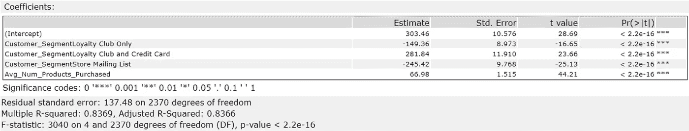
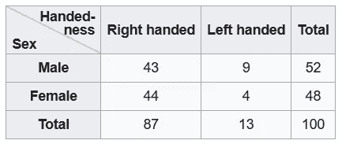
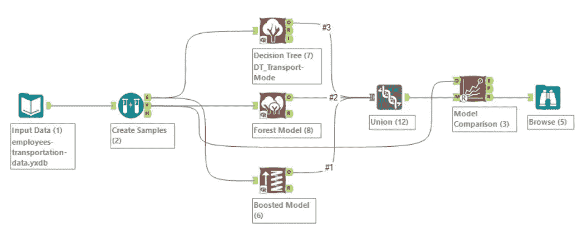
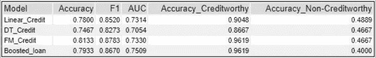
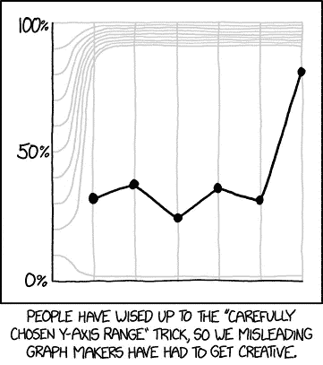

# 数据怎么入门？—第二部分

> 原文：<https://towardsdatascience.com/how-to-get-started-with-any-kind-of-data-part-2-c4ccdbcc8b13?source=collection_archive---------57----------------------->

## 从数据开始

## 业余爱好者循序渐进指南

麦克斯韦·尼尔森在 T2 的照片

数据科学是一门艺术。你需要实践来完善它。2017 年我第一次和它联系在一起。你可以[在这里阅读我的故事](/how-to-get-started-with-any-kind-of-data-part-1-c1746c66bc2d)和[到这篇文章](/how-to-get-started-with-any-kind-of-data-part-1-c1746c66bc2d)的第一部分。在本文中，我继续了数据项目的下一阶段——通过构建模型进行分析，并使用图形进行展示。

# **分析:**

> 选择正确的数据字段可以显示正确的结果。

## **优化变量选择**

*方法 1:*

为您的分析选择最佳变量会对您的结果产生巨大影响。使用回归模型时，可以通过查看模型统计结果中 p 值列的星号来衡量变量的显著性。

在下面的线性回归结果快照中，查看右边的最后一列:

每个预测变量都是重要的，因为它的 p 值<= 0.05\. A low p-value suggests that the slope is not zero, which in turn suggests that changes in the predictor variable are associated with changes in the response variable. The multiple R-squared and the adjusted R-squared values must be close to 1\. Low p-values and high R-squared value suggests that the model is highly predictive.

Selecting predictor variables from Linear Regression results using P-Value: Image by [Priyanka Mane](https://www.medium.com/priyanka_mane) 来自 Alteryx 软件

*方法二:*

使用交叉表！列联表或交叉表显示了某组数据出现的频率变化。您可以获得更好的可读性。它有助于同时对各种领域进行相互比较，以明确决定最有效的领域。

来自[维基百科](https://en.wikipedia.org/wiki/Contingency_table)的交叉表图片

如果你熟悉 Python 中的 Pandas，下面的链接很有帮助。

 [## 熊猫交叉表解释

### Pandas 提供了几个分组和汇总数据的选项，但这种多样性的选项可能是一种祝福和一个…

pbpython.com](https://pbpython.com/pandas-crosstab.html) 

## **分小块分析**

如果数据集非常大，将它分成更小的块。使用这些组块进行训练和验证。比较您的模型对这些块的整体准确性，以了解模型对不同集合的表现。

## **构建和运行“模型”**

通过比较不同模型的准确性进行分析:图片由 Alteryx 软件的[普里扬卡·马内](https://www.medium.com/priyanka_mane)提供

数据清理结束后，将清理后的数据存储在一个单独的文件中，以供分析使用。这样你的模型会看起来很瘦。它将运行得更快，因为预处理已经完成了。

将清理后的数据分成测试和验证样本。将模型应用于这两个数据样本。这一步有助于您了解您对新数据的预测有多准确。也不要过度合身。这里，您必须将定型数据集结果与验证数据集结果进行比较。总体精度是一个很好的比较参数。为最终结果选择精确度最高的模型。

在上述分析的模型比较结果中，查看“准确性”列。FM_Credit 是我给森林模型起的名字。它被认为是其他模型中精度最高的，所以我选择它进行最终分析。AUC(曲线下面积)也必须很高。

Alteryx 软件中的模型比较:图片由 Alteryx 软件中的[普里扬卡·马内](https://www.medium.com/priyanka_mane)提供

# **演示:**

> 人类大脑处理图像的速度比处理文本快 60，000 倍，传输到大脑的 90%的信息是视觉的。

你的可视化越好，你的工作就越有影响力！

***数据可视化***

以有意义的方式呈现这些数据:图表、可视化、图表、表格等。数据分析师可以向项目经理、部门主管和高级业务主管报告他们的发现，以帮助他们做出决策并发现模式和趋势。本文第 1 部分中提到的 Tableau 软件是迄今为止最好的、最用户友好的说服性可视化软件。

Mathplotlib 非常有名，但不一定是最容易使用的。它的优点是“可以从 python 的舒适中使用”。Rand python 的其他一些鲜为人知但极具影响力的选项是[plot . ly](https://plot.ly/)——它可以将 java 嵌入到网页中，也可以离线工作， [bokeh](http://bokeh.pydata.org/en/latest/) 和 [ggplot](http://ggplot.yhathq.com/) 。

来自 [xkcd](https://xkcd.com/2023/) 的网络漫画

# **作为初学者**

*   数据分析师的大部分工作时间都花在为管理层理解和解释业务案例上。因此，合理的做法是尽可能多地阅读数据科学案例。你将能够理解不同的场景和权衡。与此同时，你将获得根据问题进行结构化思考的专业知识。
*   如果你不知道从哪里开始获取数据，只需在 [Kaggle](https://www.kaggle.com) 上寻找数据科学项目和竞赛。
*   将这些项目上传到 GitHub 上，从其他用户那里获得真知灼见。
*   Stackoverflow 也是一个从别人的问题和错误中学习的好地方。

如果您觉得这个方法有用，或者您想要我在本系列文章中使用的任何项目的详细的一步一步的解释，请告诉我。

 [## 你对任何东西的上瘾——解释！

### 以及如何控制它！激励性的谈话没有帮助。引发你内心的化学反应。

medium.com](https://medium.com/illumination/why-am-i-not-motivated-enough-for-my-success-f2a0fb5735a5)  [## 毫无准备是没有借口的

### 有太多事情要做的时候该做什么。事半功倍。

medium.com](https://medium.com/age-of-awareness/there-is-no-excuse-for-being-unprepared-7725634d4f30) 

> **普里扬卡·马内|学习者|数字内容创作者**
> 
> **insta gram:**[Wanderess _ Priyanka](https://www.instagram.com/wanderess_priyanka)**| LinkedIn:**[Priyanka Mane](https://de.linkedin.com/in/priyankavmane)