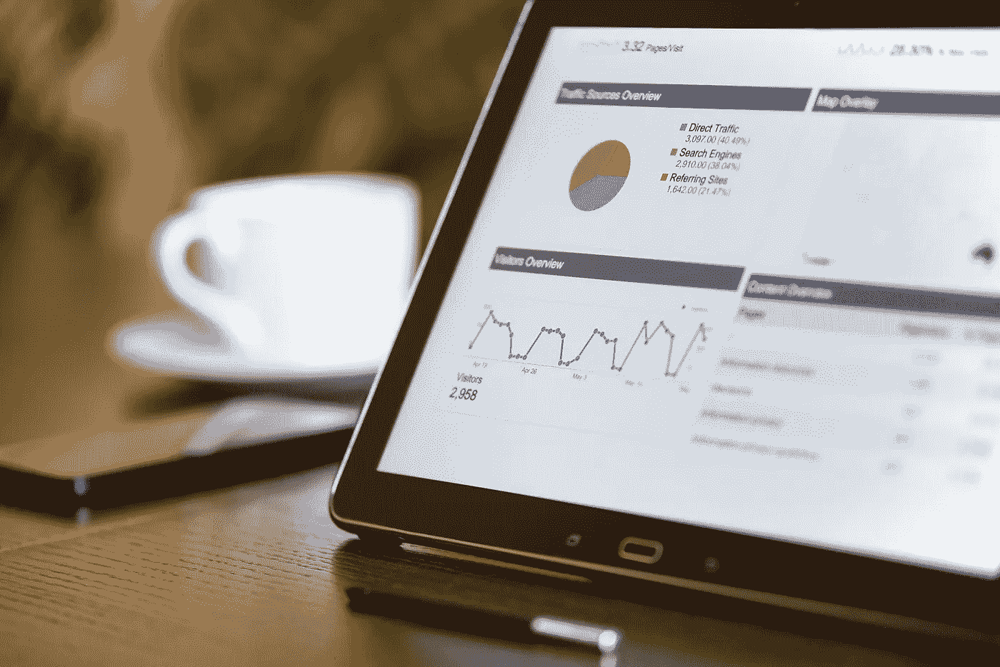

# 如何开始使用 Python 和 R 进行数据分析和数据科学——一种实用的方法

> 原文：<https://towardsdatascience.com/how-to-get-started-with-data-analysis-and-data-science-in-python-and-r-a-pragmatic-approach-a6ff498dec61?source=collection_archive---------41----------------------->

## 没有编码背景的数据分析师学习 Python 或 R 的实用方法

当使用一个软件进行数据分析时，人们经常会感到沮丧，这个软件并不特别适合某个特定的任务，但是仍然继续使用它，因为他们熟悉这个软件。例如，使用 MS Excel 处理主要由文本组成的数据。使用 Python 或 R 会使工作变得更容易，让人们工作得更有效率。然而，人们经常回避学习 Python 或 R，因为他们认为编码很难。一个常见的误解是，要成为一名优秀的程序员，你需要擅长数学(查看[这个](https://www.oxford-royale.com/articles/9-misconceptions-programming/#aId=bcfd6f65-05d6-4e6b-adeb-2b6fb86409bf)了解更多的误解)。如果你是这些人中的一员，让我向你保证这不是真的。在这篇文章中，我想为您提供一套工具，帮助您入门 Python 或 r 中的数据分析和数据科学，我已经在 2019 年在伦敦大学学院教授了一门初学者数据科学夏季课程，并将在这里分享我所有的技巧和资源(免费)。

# 如何开始

就像你学习任何新东西一样，你需要从基础开始。在这种情况下，学习基本语法。我建议至少花一个周末的时间，通过做一些简单的算术，熟悉简单的数据结构(列表、集合、字典等)，编写一些函数、if-else 语句和 for-loops，来对你想学的语言有所了解。有足够的资源让你开始。建议你去看看 Coursera、Udemy、edX、Udacity 这样的网站，找一门适合你学习风格的课程(我个人比较喜欢 IBM 关于 Coursera 的课程大纲“ [Python for Data Science 和 AI](https://www.coursera.org/learn/python-for-applied-data-science-ai/) ”)。Hackerrank 和 Leetcode 也是练习编码技能的好网站，不需要你下载任何东西到你的电脑上——你可以在浏览器中练习(尽管我更喜欢离线练习——下一节会有更多的介绍)。查看 [Hackerrank 的 Python 挑战](https://www.hackerrank.com/domains/python)和 [Datacamp 对 R](https://campus.datacamp.com/courses/free-introduction-to-r/) 的介绍。

# **下载 Anaconda(或使用 Google Colab)**

对于 Python，以及 R，建议大家下载 [Anaconda](https://www.anaconda.com/products/individual) 。Anaconda 是用于科学计算的 Python 和 R 的免费发行版，旨在简化包管理(如果您不知道什么是包，不要担心，稍后会有更多介绍)。Anaconda 附带了一个名为 Jupyter Notebook 的工具，这是一个开源的 web 应用程序，允许您创建和共享包含实时代码、等式、可视化和叙述性文本的文档。这是我最喜欢的数据分析工具。如果你想体验一下，可以去看看[谷歌实验室](https://colab.research.google.com/notebooks/welcome.ipynb)，这是一个免费的 Jupyter 笔记本环境，不需要任何设置，完全在云中运行。

# Google，百度或者 Yandex it！

在过去的几年里，我无数次告诉我的学生*“你不是第一个遇到这个问题的人——以前已经有人问过这个问题了——谷歌一下！”*。如果你得到一个你不理解的错误信息，或者你不知道如何在 python 中[将一个数字四舍五入到小数点后两位](https://stackoverflow.com/questions/20457038/how-to-round-to-2-decimals-with-python)——stack overflow 是你的朋友！我可以向你保证，不管是什么——已经有人在 stackoverflow 上回答了你的问题。所以，当你陷入困境时，不要害怕谷歌搜索。程序员一直在谷歌上搜索。(正如我告诉我的中国暑期学校学生的那样——谷歌在你们国家被禁并不是不在网上寻找答案的借口)

然而，我在教授暑期学校课程时注意到，许多人不知道如何表述他们的问题，因此很难在互联网上找到答案。知道如何把你的问题用语言表达出来，这本身就是一种技能，需要练习。以上面的舍入例子为例——谷歌搜索*“如何舍入数字”*不会给你想要的答案(试试看)。当谷歌搜索*“如何舍入数字 python”*时，上面的结果会告诉你 Python 内置的 round()函数，这将要求你通读更多不必要的文本。只有当你谷歌*“如何四舍五入数字 python 小数点后两位”*你会在 stackoverflow 上得到一个建议问题列表。这可能听起来很明显，但在处理以前没有处理过的问题时可能会很困难。

# 经历一个众所周知的问题

好了，你知道了基础知识，你已经熟悉了 Jupyter 笔记本、Rstudio、Google Colab 或任何你想使用的其他工具——现在该怎么办？现在，您要寻找一个著名的数据集，它易于理解，但具有足够的挑战性，可以用来做一些有趣的事情。一步一步地浏览教程，试着理解每一行代码和它在做什么。在我的暑期学校课程中，我使用了[泰坦尼克号数据集](https://www.kaggle.com/c/titanic)。这是一个很棒的数据集，您可以在其中应用许多数据探索和可视化技术，以及不同的分类算法。您可以将相同的原则用于您自己的数据。这里有两个分步教程，介绍如何分析泰坦尼克号数据集，以及如何训练一个分类器来预测某人在泰坦尼克号上是死是活。

[**R(我给学生们的泰坦尼克号笔记本，作为他们个人项目报告应该是什么样子的例子)**](https://github.com/lisanka93/DataScience_summer_school_2019/blob/master/day9/titanic-logisticreg_and_NB.ipynb)

[**Python**](https://www.kaggle.com/angeelee/titanic-data-exploration-in-python)

*注意:R 示例涵盖了更多的内容，所以我鼓励你去看一看，即使你想开始使用 Python。*

在阅读这样的教程时，你会遇到你可能想要研究的包/库(如 pandas 或 scikit-learn in Python)和机器学习算法，如逻辑回归、决策树、支持向量机或神经网络。这取决于您想要深入研究这些主题中的每一个，并且超出了本文的范围。我只想为您提供入门的初始工具。

# 查找与您的数据集相似的数据集

如果你想在工作中应用你的新技能，或者对特定类型的数据感兴趣，你的下一步应该是浏览一个著名的数据集，该数据集与你想要分析的数据类型相似(分析图像、声音、文本或数字数据都需要不同的方法)。在我的博士学位中，我主要分析文本数据——这一过程被称为自然语言处理(NLP)。当然，分析像电影评论这样的文本数据与分析泰坦尼克号数据集中给出的数据类型是完全不同的。如果您对如何开始使用 Python 进行文本分析感兴趣，请查看我的另一篇文章。

以下是一些著名数据集的例子(你会在互联网上找到许多关于如何分析和训练机器学习模型的资源):

**数值** : [房价预测，](https://www.kaggle.com/vikrishnan/boston-house-prices) [花型分类](https://archive.ics.uci.edu/ml/datasets/iris)

**图片** : [手写数字分类，](http://yann.lecun.com/exdb/mnist/)服装物品分类

**文本** : [文本分类(火腿/垃圾)](https://www.kaggle.com/uciml/sms-spam-collection-dataset)，[情感分析(影评)](http://ai.stanford.edu/~amaas/data/sentiment/)

**声音** : [城市声音分类](https://urbansounddataset.weebly.com/urbansound8k.html)，[人声分类](https://www.kaggle.com/c/tensorflow-speech-recognition-challenge/data)

*注意:你可以使用所有的分类数据集来训练像 k-means 这样的无监督学习算法，这超出了本文的范围。*

[点击这里阅读一篇中型文章，其中有一个更长的数据集列表](https://medium.com/towards-artificial-intelligence/the-50-best-public-datasets-for-machine-learning-d80e9f030279)。

我希望这篇文章对您有所帮助，并为您提供一些关于如何开始使用 Python 或 r 进行数据分析、数据科学和机器学习的线索。如果您有任何问题或希望我写一篇类似于*“机器学习简介”*的文章，请告诉我。