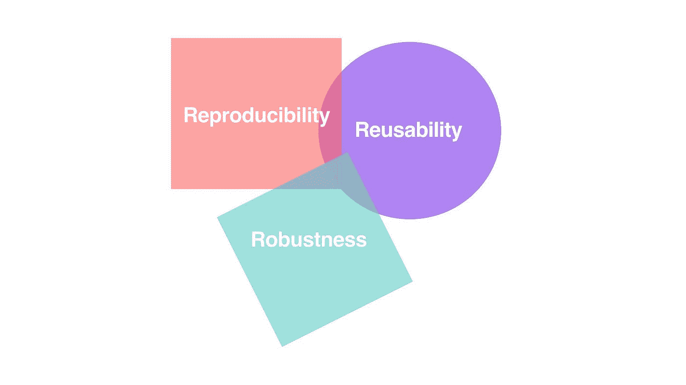
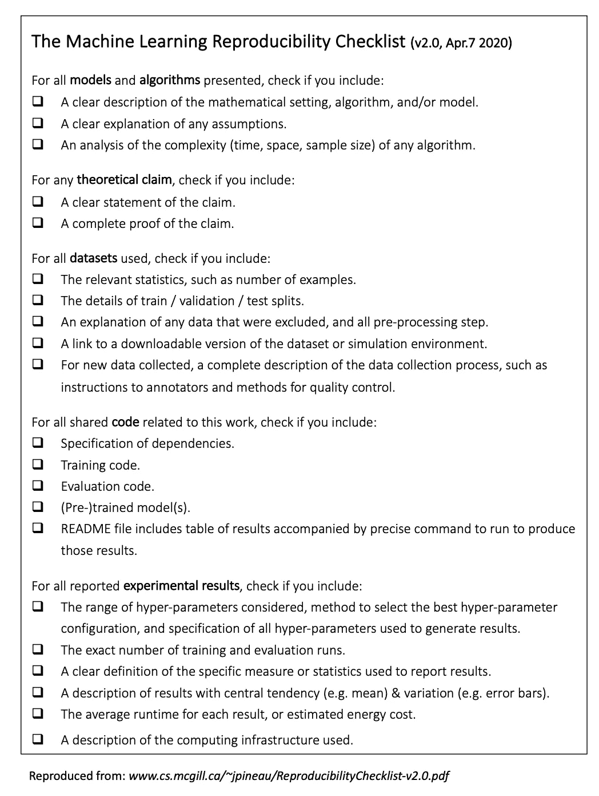
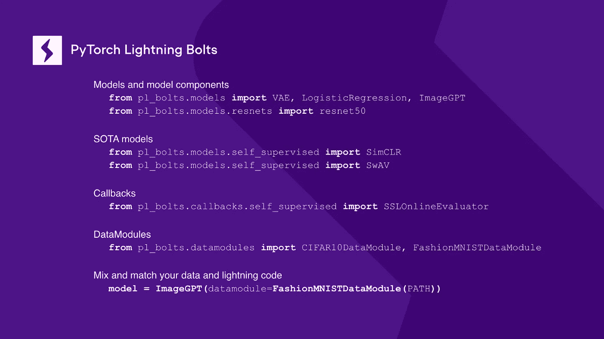
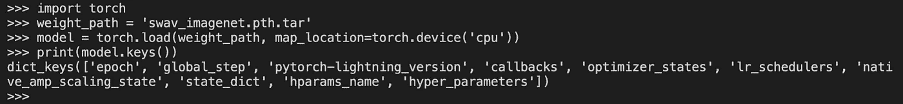
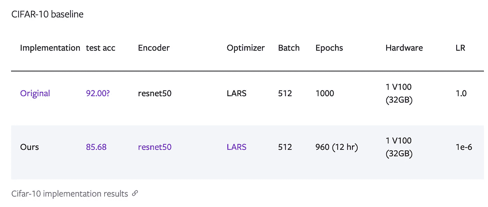
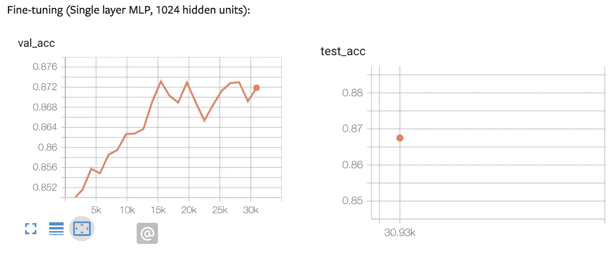

# 如何开始 ML 重现性挑战 2020

> 原文：<https://towardsdatascience.com/how-to-get-started-with-ml-reproducibility-challenge-2020-65008aa07cd7?source=collection_archive---------43----------------------->

*本文的合著者:Ananya Harsh Jha 和 Eden Afek*

***免责声明:*** *所有作者均为 PyTorch 闪电队成员*

了解如何在 PyTorch 闪电研究工具箱的帮助下，帮助缓解深度学习可重复性危机，同时提高您的技能。

灵感来自 [v1 @ NeurIPS 2018](https://media.neurips.cc/Conferences/NIPS2018/Slides/jpineau-NeurIPS-dec18-fb.pdf)

# 什么是再现性，为什么要关注再现性

复制实验结果的能力是任何科学领域的核心基础。然而，结果的可重复性一直困扰着整个机器学习领域，在很多情况下，它严重依赖于随机优化，而不能保证收敛。在深度学习中，重复性的关键往往在于最微小的细节，许多作者没有提到最关键的参数或训练程序，这些参数或训练程序使他们获得了最先进的结果。

可重复性不仅对于确定新的研究领域很重要，而且对于使它们更容易解释也很重要，这在我们试图用这种算法代替人类决策时至关重要。标准化提交的再现性并不一定意味着复制发表在主要论文中的精确结果，而是为其他研究人员提供指导，以根据他们自己的任务和计算能力得出论文中提出的相同结论。

# 再现性挑战

为了缓解这个问题，在 2017 年 ICML 机器学习研讨会的初始[再现性之后，Joelle Pineau 博士和她的同事在 2018 年 ICLR 开始了第一个版本的](https://sites.google.com/view/icml-reproducibility-workshop/icml2017)[再现性挑战](https://www.cs.mcgill.ca/~jpineau/ICLR2018-ReproducibilityChallenge.html)。这项挑战的主要目标是鼓励人们复制 ICLR 2018 年提交的结果，这些论文可以在 OpenReview 上随时获得。随后是 2019 年 ICLR 挑战赛的第二版，以及 2019 年 NeurIPS 的第三版，通过 OpenReview 可以获得被接受的论文。

在论文“改善机器学习研究中的再现性[】中，Pineau 等人列出了机器学习中再现性差距的原因:](https://arxiv.org/pdf/2003.12206.pdf)

*   无法获得相同的培训数据/数据分布不同
*   模型或培训程序的规格错误或规格不足
*   缺少运行实验所需的代码或代码错误
*   用于报告结果的指标不规范
*   不恰当地使用统计数据来分析结果，例如在没有进行恰当的统计测试的情况下声称具有显著性，或者使用错误的统计测试
*   选择性报告结果或忽略适应性过度拟合的危险
*   对结果的过度宣称，超出了提出的证据(即实验数量不足，或者假设和宣称不匹配)

Pineau 博士还发布了再现性清单:

*   [v1 @ NeurIPS 2018](https://media.neurips.cc/Conferences/NIPS2018/Slides/jpineau-NeurIPS-dec18-fb.pdf)
*   [v1.2 @ NeurIPS 2019](https://www.cs.mcgill.ca/~jpineau/ReproducibilityChecklist-v1.2.pdf)
*   [v2.0 @ NeuIPS 2020](https://www.cs.mcgill.ca/~jpineau/ReproducibilityChecklist-v2.0.pdf)

[2.0 @ neu IPS 2020](https://www.cs.mcgill.ca/~jpineau/ReproducibilityChecklist-v2.0.pdf)

该清单的目的是为作者和审稿人提供指南，说明提交给这些会议的结果的预期重现性标准。

# ML 再现性挑战 2020

今年， [ML 再现性挑战](https://paperswithcode.com/rc2020)扩大了范围，涵盖了 2020 年横跨机器学习、自然语言处理和计算机视觉的 7 个顶级人工智能会议:NeurIPS、ICML、ICLR、ACL、EMNLP、CVPR 和 ECCV。挑战对每个人开放，你需要做的就是从列表中选择并声明一篇已发表的论文，并尝试复制其核心声明。

> 目的是评估原始论文中得出的*结论*是否可重现；对于许多论文来说，完全复制所展示的结果*是不可能的，因此本次挑战的重点是遵循论文中描述的过程，并尝试得出相同的结论。*

— [杰西·道奇](https://medium.com/paperswithcode/the-reproducibility-challenge-as-an-educational-tool-cd1596e3716c)、[作为教育工具的再现性挑战](https://medium.com/paperswithcode/the-reproducibility-challenge-as-an-educational-tool-cd1596e3716c)

# 闪电再现性

显然，复制结果的一些障碍取决于研究科学家组织他们的项目的方式，然而对于其他人，你可以使用 PyTorch Lightning 来缩小这种差距。

[PyTorch Lightning](https://github.com/PyTorchLightning/pytorch-lightning) 的创造者和核心贡献者一直是机器学习和深度学习研究中可复制性的倡导者。事实上，NeurIPS 2019 上的[再现性挑战](https://reproducibility-challenge.github.io/neurips2019/)的 v3 正式推荐使用 PyTorch Lightning 提交挑战。

Lightning 的主要理念是将工程与研究分离，从而使代码更具可读性。我们在 Lightning 的团队努力提供一种编写深度学习知识库的标准，让任何人都更容易知道你的代码在做什么，以及研究的有趣部分在哪里。

为了使研究更具可重复性，我们创建了 [PyTorch 闪电](https://github.com/PyTorchLightning/pytorch-lightning-bolts)，这是我们最先进的模型、数据模块和模型组件的工具箱。Bolts 的想法是让你能够在预先构建的组件上开始你的项目，并快速迭代你的研究，而不是担心如何设置项目或试图复制以前发布的结果。

作者图片

例如，如果您正致力于改进标准的 ImageGPT，只需对现有的实现进行子类化，并开始您令人敬畏的新研究:

作者图片

## 1.数据

如果您的工作涉及一些用于研究的标准数据集，请利用可用的 [LightningDataModules](https://pytorch-lightning.readthedocs.io/en/stable/datamodules.html) ，并使用种子值来指定您进行实验的确切分割！

DataModule 封装了 PyTorch 中数据处理涉及的五个步骤:

1.  下载/令牌化/处理。
2.  清理并(可能)保存到磁盘。
3.  在`[Dataset](https://pytorch.org/docs/stable/data.html#torch.utils.data.Dataset)`内装载。
4.  应用变换(旋转、标记化等)。
5.  包在一个`[DataLoader](https://pytorch.org/docs/stable/data.html#torch.utils.data.DataLoader)`里面。

这个类可以在任何地方共享和使用:

作者图片

在 Bolts 中，您可以找到以下实现:

*   [MNIST](https://github.com/PyTorchLightning/pytorch-lightning-bolts/blob/master/pl_bolts/datamodules/mnist_datamodule.py)
*   [时尚 MNIST](https://github.com/PyTorchLightning/pytorch-lightning-bolts/blob/master/pl_bolts/datamodules/fashion_mnist_datamodule.py)
*   [CIFAR-10](https://github.com/PyTorchLightning/pytorch-lightning-bolts/blob/master/pl_bolts/datamodules/cifar10_datamodule.py)
*   [ImageNet](https://github.com/PyTorchLightning/pytorch-lightning-bolts/blob/master/pl_bolts/datamodules/imagenet_datamodule.py)
*   [城市景观](https://github.com/PyTorchLightning/pytorch-lightning-bolts/blob/master/pl_bolts/datamodules/cityscapes_datamodule.py)
*   还有[更](https://github.com/PyTorchLightning/pytorch-lightning-bolts/tree/master/pl_bolts/datamodules)！

## 2.模型检查点

Lightning 提供自动检查点，因此您可以随时恢复训练。当您使用 PyTorch Lightning 创建和保存模型时，我们会自动保存 Lightning 模块中定义的超参数。该检查点还包括优化器、LR 调度器、回调和其他任何需要的东西，以完美地重建您刚刚运行的实验的结果，从而发布一个新的艺术状态！

作者图片

我们的模型检查点不仅仅包含 state_dict！图片作者。

阅读更多关于[检查点](https://pytorch-lightning.readthedocs.io/en/stable/weights_loading.html)的信息。

## 3.预先训练的重量和实验记录

对于 Bolts，我们提供了一组预先训练好的重量以及用于实现某个结果的实验日志。我们提供经过验证的结果，因此您可以为您希望复制的不同论文提供一个经过测试的起点，而不是花费时间试图从一篇论文中复制一个声明。在接下来的几个月里，我们将努力在 Bolts 中添加更多的模型检查点和可复制的结果。

下面，我们展示了 CIFAR-10 上的 [SimCLR 预训练实验](https://pytorch-lightning-bolts.readthedocs.io/en/latest/self_supervised_models.html#cifar-10-baseline)的结果，这些结果是我们基于原始论文复制的。

该表概述了螺栓中存在的模型所实现的结果！图片作者。

这是来自 Bolts 文档的[日志的一个例子，在这种情况下，它代表了在自我监督学习模型被预训练之后的微调过程。通过数据模块中的种子分割，任何人都可以复制我们在这里展示的相同结果！](https://pytorch-lightning-bolts.readthedocs.io/en/latest/self_supervised_models.html#simclr)

作者图片

这些文档还包含我们得出结果所使用的精确超参数。

作者图片

# 祝你好运！

参加再现性挑战是加深你在深度学习中的知识的一个很好的方式，也是对整个科学界的贡献。我们邀请大家参与并考虑[将您的模型贡献给 bolts](https://pytorch-lightning-bolts.readthedocs.io/en/stable/models.html) 以增加可见性，并根据我们强大的测试套件对其进行测试。如果你想提问、反馈或寻找合作者，请查看我们的[休闲频道](https://join.slack.com/t/pytorch-lightning/shared_invite/zt-f6bl2l0l-JYMK3tbAgAmGRrlNr00f1A)。

编码快乐！