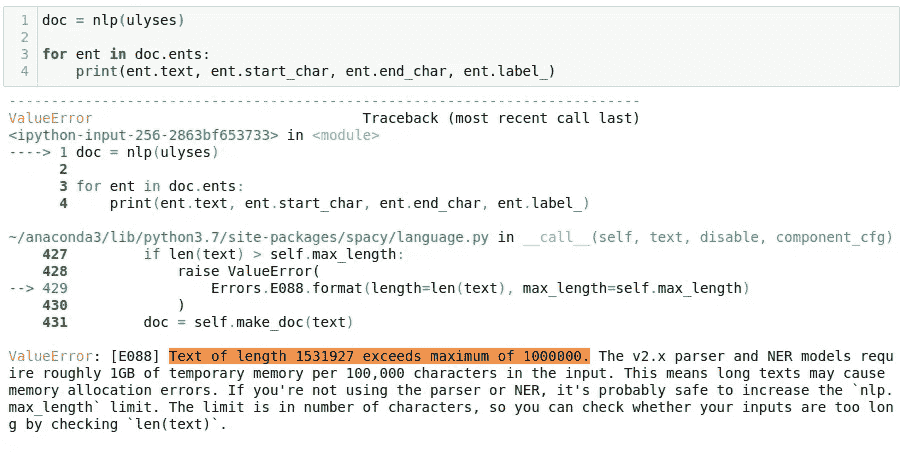
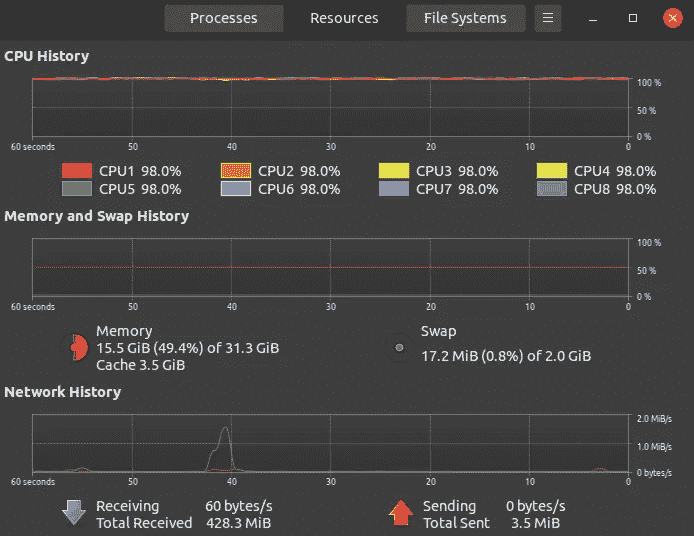
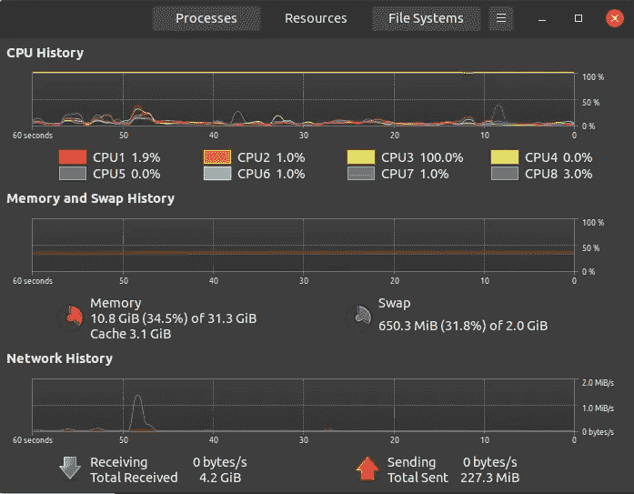
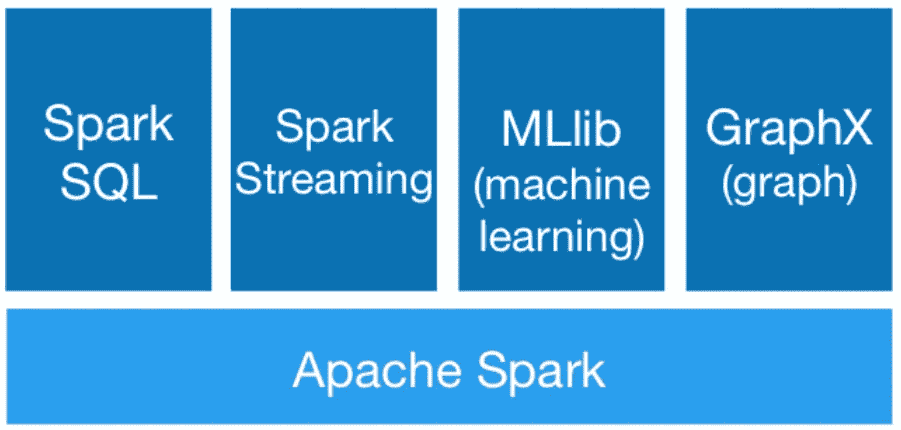
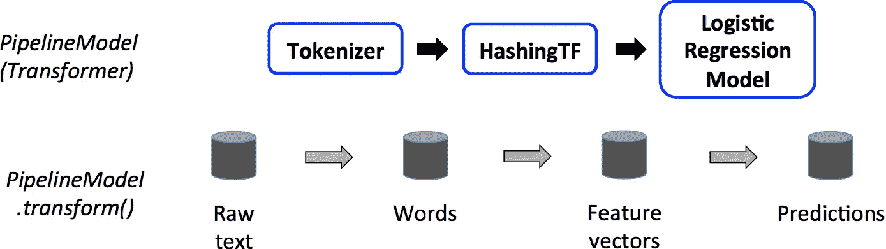

# 如何在两周内开始使用 Spark NLP 第一部分

> 原文：<https://towardsdatascience.com/how-to-get-started-with-sparknlp-in-2-weeks-cb47b2ba994d?source=collection_archive---------29----------------------->

## *良好的开端是成功的一半……*


[摄影:鲍里斯拉夫·克鲁采夫](https://www.pexels.com/photo/green-mountain-surrounded-by-body-of-water-photo-225203/)

如果您想在企业 NLP 中有一个良好的开端，但是对 Spark 毫无头绪，那么这篇文章就是为您准备的。我见过许多同事想要进入这个领域，但是由于 Spark 带来的初始学习开销而灰心丧气。乍一看，这似乎并不明显，因为 Spark 代码与常规的 Python 脚本有些不同。然而，Spark 和 Spark NLP 基础并不难学。如果你理所当然地接受这个断言，我将向你展示基础是多么简单，并将提供一个路线图来为学习关键元素铺平道路，这将满足中级从业者的大多数用例。由于 Spark NLP 管道所带来的无可挑剔的模块化，对于一个普通的学习者来说，记住我的话，两周的时间足以构建基本的模型。卷起袖子，我们开始吧！

**为什么 Spark NLP？**
供需就是答案:是企业使用最广泛的库！这里有几个原因。如今常见的 NLP 包是由学者设计的，他们更喜欢原型的简易性，而不是运行时性能、可伸缩性、错误处理、目标节约内存消耗和代码重用。虽然一些像“工业级 NLP 库— spaCy”这样的库可能被认为是一个例外(因为它们被设计成完成事情而不是进行研究)，但当涉及到处理大量数据时，它们可能达不到企业目标。



*无法方便地使用为研究和小规模任务设计的工具*

这里我们将有 ***一个不同的策略*** 。我们将使用基本库来温习“基础知识”,然后直接跳到企业领域，而不是按常规随大流。我们的最终目标是通过建设大陆管道来瞄准利基市场，这是不可能用标准库解决的，尽管它们的容量在他们的联盟中。

如果你还不相信，请阅读这篇关于[基准测试](https://analyticsindiamag.com/5-reasons-why-spark-nlp-is-the-most-widely-used-library-in-enterprises/)和与 spaCy 比较的文章，它会给你五个开始使用 Spark NLP 的好理由。首先，Spark NLP 具有与生俱来的特性**可伸缩性**它继承了 Spark，Spark 主要用于分布式应用，它被设计成*可伸缩性*。Spark NLP 从中受益，因为它可以在任何 Spark 集群以及内部和任何云提供商上扩展。此外，Spark NLP 优化的方式使得它的运行速度比传统库的固有设计限制要快**个数量级。它提供了注释器的概念，并且包含了比其他 NLP 库更多的内容。它包括句子检测、标记化、词干化、词条化、词性标注、NER、依存解析、文本匹配器、日期匹配器、组块、上下文感知拼写检查、情感检测器、预训练模型，以及根据学术同行评审结果具有**非常高准确度**的训练模型。Spark NLP 还包括用于命名实体识别的 BERT 嵌入的生产就绪实现。例如，与 spaCy 相比，它在 NER 上犯的错误要少得多，我们在本文的第二部分测试了 spaCy。此外，值得注意的是，Spark NLP 包括提供完整 Python API 的功能，支持 GPU、用户定义的深度学习网络、Spark 和 Hadoop 上的培训。**

该库提供了 BERT 嵌入的生产就绪实现，并使用迁移学习进行数据提取。迁移学习是一种高效的提取数据的方法，甚至可以利用少量的数据。因此，没有必要收集大量数据来训练 SOTA 模型。

此外，John Snow labs Slack channel 提供了有益的顶级支持，因为开发人员和新学习者倾向于团结在一起，创建每个人都可以从中受益的资源。你将从开发者那里得到你的问题的答案。我去过那里几次，可以证明他们的反应迅速而准确。此外，任何发现自己陷入困境的人都可以通过堆栈溢出或类似平台快速获得有类似问题的人的帮助。

**关于 Spark 的著名“事实”是错误的**

- *Spark 是集群计算，所以它不能在本地机器上运行*

不对！你可以在你的本地机器上运行 Spark，每个 CPU 核心都会用到核心！这就是 Spark NLP 运行时的样子:



Spark NLP 正在运行…我为所有这些 CPU 内核支付了费用，我很高兴看到它们都在运行。



虽然可以使用 [Joblib 进行多重处理](https://spacy.io/usage/examples#multi-processing)，但这是 spaCy 进程的典型情况。

更重要的是，你可以在 GPU 上运行 Spark。

- *Spark 又是一门需要学习的语言！*

好吧，如果你了解 SQL，PySpark 和 Spark NLP 根本不会让人觉得是另一种语言。SQL 和 Regex 本身都是语言，但是学习它们的基础知识并不难，对吗？

- *Spark 是为大数据打造的，所以 Spark NLP 只对大数据有好处。*

是的，Spark 内部使用了大量开销，但是 Spark NLP 为较小的数据集引入了一个“轻管道”。

起初，Spark 似乎是另一种具有挑战性的语言。Spark 不是最容易理解的库，但是我们将在 NLP 领域中做的事情已经在 Spark NLP 的基础设施中被巧妙的处理了，该基础设施由一个简单的 API 提供，可以很容易地与它交互。

虽然熊猫是数据科学家工具箱中最锋利的铅笔之一，但它只使用一个 CPU 内核，本质上，它的速度不够快，也不够强大，无法处理更大的数据集。Spark 被设计成使用集群计算来克服这些缺陷，**你甚至可以在你的本地机器上运行它**，分配任意多的 CPU 核心！遗憾的是，即使在本地机器上运行，pip install Pyspark 也不足以设置好，必须在 PC 和 Mac 上安装一系列的依赖项。对于那些想尽快投入行动的人，我推荐使用 Google Colab。

1)在 Mac 或 Linux 上设置使用 Spark NLP，必须安装 Apache Spark 版本 2.4.3 和更高版本。假设你还没有安装 Apache Spark，我们先从 Java 安装开始。只需进入[官网](https://www.oracle.com/technetwork/java/javase/downloads/jdk8-downloads-2133151.html)并从*“Java SE 开发套件 8u 191”*，安装 **JDK 8** 。必要的命令行脚本可以在[这里](https://medium.com/spark-nlp/introduction-to-spark-nlp-installation-and-getting-started-part-ii-d009f7a177f3)找到。

2)在 PC 上设置 Spark 可能有点棘手。试过很多方法后，我发现这篇文章是唯一有效的。还包括一段清晰简洁的视频。除了提供的文档，这个[博客页面](https://changhsinlee.com/install-pyspark-windows-jupyter/)也帮助了我。

3) *除非你必须在本地机器上运行 Spark，否则开始使用 PySpark 最简单的方法就是使用 Google Colab。*由于它本质上是一个运行在谷歌服务器上的 Jupyter 笔记本，所以你不需要在我们的系统中本地安装任何东西。

要在 Colab 中运行 spark，首先，我们需要安装 Colab 环境中的所有依赖项，如 Apache Spark 2.3.2 with Hadoop 2.7、Java 8 和 Findspark，以便在系统中定位 Spark。详情请参见[这篇文章](/pyspark-in-google-colab-6821c2faf41c)。

```
**import** **os***# Install java*
! apt-get install -y openjdk-8-jdk-headless -qq > /dev/null
os.environ["JAVA_HOME"] = "/usr/lib/jvm/java-8-openjdk-amd64"
os.environ["PATH"] = os.environ["JAVA_HOME"] + "/bin:" + os.environ["PATH"]
! java -version*# Install pyspark*
! pip install --ignore-installed -q pyspark==2.4.4*# Install Spark NLP*
! pip install --ignore-installed -q spark-nlp==2.4.5
```

对于不想在 Colab 上运行笔记本的 PC 用户，我推荐在双引导 Linux 系统上安装 Spark NLP，或者使用 [WSL 2](/dual-boot-is-dead-windows-and-linux-are-now-one-27555902a128) ，然而，[这篇基准测试文章](https://www.phoronix.com/scan.php?page=article&item=windows-10-wsl2&num=2)反映了 WSL 2 的一些性能损失。更准确地说，我在双启动 Ubuntu 20.04 安装后获得了我最好的 Spark NLP 体验。

**第 2 天:Spark 基础知识、RDD 结构和使用 Spark 的 NLP 婴儿步骤**

如前所述，Apache Spark 是一个分布式集群计算框架，对于大型数据集来说非常高效，它使用内存计算来进行闪电般的数据处理。对于在磁盘上运行的复杂应用程序，它也被认为比 MapReduce 更高效。

**虽然像 pandas 这样的库足以满足大多数日常操作，但由于** *容量、多样性和速度*，大数据需要集群计算框架，这是**大数据**的三个定义属性或维度。



Spark 的核心是 Spark 核心——整个项目的基础，其余的 Spark 库都是在它的基础上构建的。Spark SQL 允许您使用 SQL 或熟悉的 [DataFrame API](https://spark.apache.org/docs/latest/sql-programming-guide.html) 查询 Spark 程序中的结构化数据。

MLlib 适合于 [Spark](https://spark.apache.org/) 的 API，并在 Python 和 R 库中与 [NumPy](http://www.numpy.org/) 互操作。您可以使用任何 Hadoop 数据源，从而轻松插入 Hadoop 工作流。Spark 擅长迭代计算，使 MLlib 能够快速运行——比 MapReduce 快 100 倍。

**Spark Mllib** 包含构建在 rdd 之上的遗留 API。虽然我发现作为 Python 实践者，Spark Mllib 和 RDD 结构更容易使用，但是从 Spark 2.0 开始，Spark 中基于 RDD 的 API。MLlib 包已进入维护模式。Spark 的主要机器学习 API 现在是 Spark ML 包中基于数据帧的 API。

转换创建新的 rdd 和操作来执行计算。Lambda、Map 和 Filter 是一些基本功能。真实数据集通常是键、值对，类似于 Python 字典，但表示为元组。请观察下面创建二元模型和字数的代码，看看它与 Python 代码有多相似。我强烈推荐[这门课程](https://learn.datacamp.com/courses/big-data-fundamentals-with-pyspark)了解更多详情。

```
import resentences = sc.textFile(“ulyses.txt”) \
 .glom() \
 .map(lambda x: “ “.join(x)) \
 .flatMap(lambda x: x.split(“.”)).map(lambda x: re.sub(‘[^a-zA-Z\s]’,’’,x))bigrams = sentences.map(lambda x:x.split()) \
 .flatMap(lambda x: [((x[i],x[i+1]),1) for i in range(0,len(x)-1) \
 if all([x[i].lower() not in stop_words,x[i+1].lower() not in stop_words])])freq_bigrams = bigrams.reduceByKey(lambda x,y:x+y) \
 .map(lambda x:(x[1],x[0])) \
 .sortByKey(False)In [1]:freq_bigrams.take(10)Out[1]:(1, ('Author', 'James')),
       (1, ('Joyce', 'Release')),
       (1, ('EBook', 'Last')),
       (1, ('Last', 'Updated')),
       (1, ('December', 'Language')),
       (1, ('English', 'Character')),
       (1, ('Character', 'set')),
       (1, ('set', 'encoding')),
       (1, ('UTF', 'START')),
       (1, ('II', 'III'))]
```

```
# word count exampletext_file = sc.textFile(“example_text1.txt”)
counts_rdd = text_file.flatMap(lambda line: line.split(“ “)) \
 .map(lambda word: (word, 1)) \
 .reduceByKey(lambda a, b: a + b)# print the word frequencies in descending ordercounts_rdd.map(lambda x: (x[1], x[0])) \
 .sortByKey(ascending=False)\
 .collect()[:10]
```

输出

```
Out [3]: [(988, 'the'),
          (693, 'and'),
          (623, 'of'),
          (604, 'to'),
          (513, 'I'),
          (450, 'a'),
          (441, 'my'),
          (387, 'in'),
          (378, 'HAMLET'),
          (356, 'you')]
```

**第 3/4 天:Pyspark 的特征工程/清洁数据**

**Spark ML** 提供构建在数据帧之上的更高级 API，用于构建 ML 管道，标准化机器学习算法的 API，从而更容易将多种算法结合到单个工作流中。这里我们将介绍 Spark ML API 引入的关键概念。

机器学习步骤可以应用到 from Spark SQL，在统一的数据集概念下支持多种数据类型。可以从常规的`RDD`中隐式或显式地创建一个`SchemaRDD`。

一个`[Transformer](https://spark.apache.org/docs/1.2.2/api/scala/index.html#org.apache.spark.ml.Transformer)`是一个抽象，包括特性转换器和学习模型，实现一个方法`transform()`，将一个`SchemaRDD`转换成另一个【】，通常通过附加一个或多个列。

An `[Estimator](https://spark.apache.org/docs/1.2.2/api/scala/index.html#org.apache.spark.ml.Estimator)`抽象了学习算法或任何适合或训练数据的算法的概念，实现了接受一个`SchemaRDD`并产生一个`Transformer`的方法`fit()`。比如`LogisticRegression`这样的学习算法是一个`Estimator`，调用`fit()`训练一个`LogisticRegressionModel`，是一个`Transformer`。

在机器学习中，通常运行一系列算法来处理和学习数据，例如将每个文档文本分割成单词，将单词转换成数字特征向量，以及使用特征向量和标签来训练预测模型。Spark ML 表示像`[Pipeline](https://spark.apache.org/docs/1.2.2/api/scala/index.html#org.apache.spark.ml.Pipeline)s`这样的工作流，它由一系列按照特定顺序运行的`Transformers`和`Estimators`组成，分别调用`transform()`和`fit()`方法，产生一个`Transformer`(它成为`PipelineModel`的一部分，或者被拟合为`Pipeline`)，并且在数据集上调用`Transformer`的`transform()`方法。

一个`Pipeline`就是一个`Estimator`。因此，在一个`Pipeline`的`fit()`方法运行之后，它会产生一个`PipelineModel`，也就是一个`Transformer`。一旦在测试数据集上调用了`PipelineModel`的`transform()`方法，数据就按顺序通过`Pipeline`，随着每个阶段的`transform()`方法更新数据集并将其传递给下一个阶段，数据集也随之更新。



和`PipelineModel`帮助确保训练和测试数据经过相同的特征处理步骤。下面是一个管道模型的例子。请注意，数据预处理是在熊猫数据框架上进行的。

```
#define regex pattern for preprocessing
pat1 = r’@[A-Za-z0–9_]+’
pat2 = r’https?://[^ ]+’
combined_pat = r’|’.join((pat1,pat2))
www_pat = r’[www.[](http://www.[)^ ]+’
negations_dic = {“isn’t”:”is not”, “aren’t”:”are not”, “wasn’t”:”was not”, “weren’t”:”were not”,
 “haven’t”:”have not”,”hasn’t”:”has not”,”hadn’t”:”had not”,”won’t”:”will not”,
 “wouldn’t”:”would not”, “don’t”:”do not”, “doesn’t”:”does not”,”didn’t”:”did not”,
 “can’t”:”can not”,”couldn’t”:”could not”,”shouldn’t”:”should not”,”mightn’t”:”might not”,
 “mustn’t”:”must not”}
neg_pattern = re.compile(r’\b(‘ + ‘|’.join(negations_dic.keys()) + r’)\b’)def pre_processing(column):
   first_process = re.sub(combined_pat, ‘’, column)
   second_process = re.sub(www_pat, ‘’, first_process)
   third_process = second_process.lower()
   fourth_process = neg_pattern.sub(lambda x:\
    negations_dic[x.group()], third_process)
   result = re.sub(r’[^A-Za-z ]’,’’,fourth_process)
   return result.strip()df[‘text’]=df.iloc[:,:].text.apply(lambda x: pre_processing(x))
df=df[~(df[‘text’]==’’)]# shuffle the data
df = df.sample(frac=1).reset_index(drop=True)
# set the random seed and split train and test with 99 to 1 ratio
np.random.seed(777)
msk = np.random.rand(len(df)) < 0.99
train = df[msk].reset_index(drop=True)
test = df[~msk].reset_index(drop=True)
# save both train and test as CSV files
train.to_csv(‘pyspark_train_data.csv’)
test.to_csv(‘pyspark_test_data.csv’)
```

```
tokenizer = [Tokenizer(inputCol='text',outputCol='words')]ngrams = [NGram(n=i, inputCol='words', 
outputCol='{}_grams'.format(i)) for i in range(1,4)]cv =[CountVectorizer(vocabSize=5460,inputCol='{}_grams'.format(i),\ 
          outputCol='{}_tf'.format(i)) for i in range(1,4)]idf = [IDF(inputCol='{}_tf'.format(i),\
        outputCol='{}_tfidf'.format(i), minDocFreq=5) \
        for i in range(1,4)]assembler = [VectorAssembler(inputCols=['{}_tfidf'.format(i)\
            for i  in range(1,4)], outputCol='features')]label_stringIdx = [StringIndexer(inputCol='sentiment', \  
                  outputCol='label')]lr = [LogisticRegression()]pipeline = Pipeline(stages=tokenizer+ngrams+cv+idf+assembler+\
           label_stringIdx+lr)model = pipeline.fit(train_set)predictions = model.transform(test_set)
```

在 PySpark 中，通过 DataFrame API 和 SQL 查询与 SparkSQL 的交互是需要优先学习的科目。为了更好地理解基本操作，必须仔细阅读 Pyspark.sql 模块。以编程方式构造数据帧转换和操作并不太难，而且对数据帧的操作也可以使用 SQL 查询来完成。如果你只有一门课的时间，请花在约翰·霍格的[特色工程和 Pyspark](https://learn.datacamp.com/courses/feature-engineering-with-pyspark) 课程上。[如果时间允许(第五天)，也推荐本课程](https://learn.datacamp.com/courses/cleaning-data-with-pyspark)。

第 6/7 天:熟能生巧

学习的最好方法是实践。下周你将需要一套强化技能。尝试深入 Pyspark 模块，因为您将广泛使用它们。要重复*“PySpark 和大数据处理的第一步”*，请遵循[这些练习](https://hackersandslackers.com/transforming-pyspark-dataframes/)。建议从 [Kaggle](https://www.kaggle.com/) 或 [Project Gutenberg](https://www.gutenberg.org/) 下载一些数据集，并解决预处理问题以及其他问题。请跟随这款来自 Spark NLP 创作者的优秀[笔记本](https://github.com/vkocaman/PySpark_Essentials_March_2019/blob/master/PySpark%20-%20From%20Zero%20to%20Hero%20(Sept%202019).ipynb)。如需更多资源，请查看[本笔记本](https://github.com/changhsinlee/changhsinlee.github.io/blob/master/notebook/2018-03-04-pyspark-dataframe-basics/dataframe-basics.ipynb)和[本文章](https://github.com/changhsinlee/changhsinlee.github.io/blob/master/notebook/2018-03-04-pyspark-dataframe-basics/dataframe-basics.ipynb)。

接下来:[第二部分——如何把你的头缠在 Spark NLP 上](/how-to-wrap-your-head-around-spark-nlp-a6f6a968b7e8)。在这一部分中，我们将理解“Spark NLP 中的注释器/转换器”，并使用大量笔记本强调“使用 Spark 进行文本预处理”、“预训练模型”和“文本分类器”。此外，我们将使用 spaCy 和 SparkNLP 运行完整的管道，并比较结果。