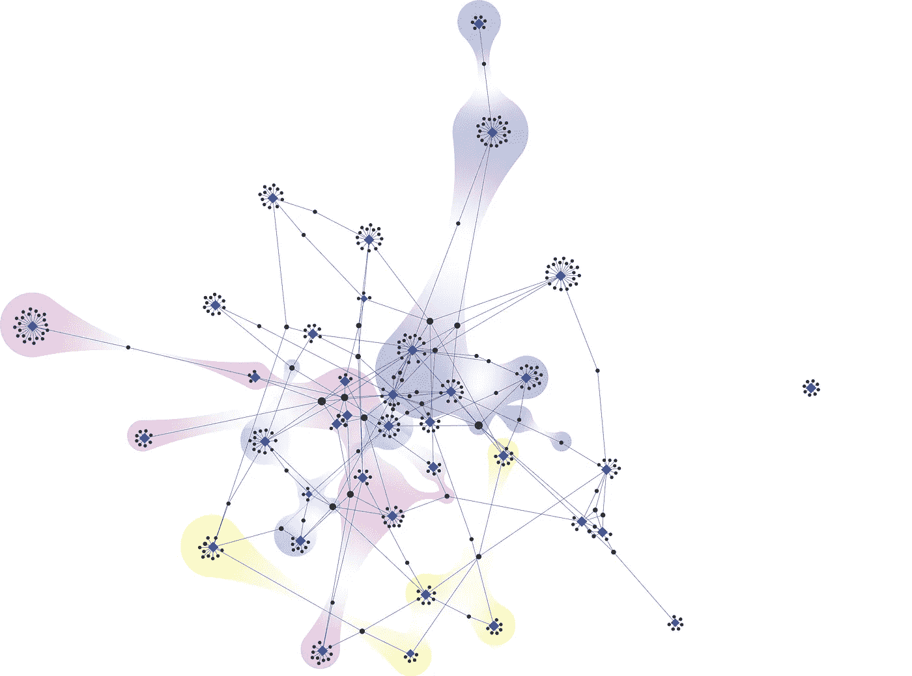

# 如何入门 Neo4j 的图形数据科学库

> 原文：<https://towardsdatascience.com/how-to-get-started-with-the-new-graph-data-science-library-of-neo4j-3c8fff6107b?source=collection_archive---------13----------------------->

## [入门](https://towardsdatascience.com/tagged/getting-started)

## Neo4j 中图形数据科学管理方式的巨大变化带来了巨大的机遇



图片来自 Ecpp，CC BY-SA 4.0【https://creativecommons.org/licenses/by-sa/4.0>】T2，转自维基共享。我没有改变这个形象。

图形分析领域已经存在很长时间了。总的想法是创建一个*事物连接到其他事物*的数据库。这些事情可能是人们在社交媒体上与其他人联系，或者可能是城市之间的航班或任何其他数量的例子。图形通常用于增强搜索能力，向电子商务网站上的购物者推荐产品，检测欺诈，或者绘制从 A 点到 b 点的最短路线。

长久以来，Neo4j 一直是图形数据库领域的重要参与者。历史上，它使用[密码查询语言](https://en.wikipedia.org/wiki/Cypher_(query_language))与数据库进行交互。有很多关于如何分析图表或使用密码的初级读本。相反，这篇文章旨在介绍如何使用新的 [Neo4j 图形数据科学库](https://neo4j.com/docs/graph-data-science/current/) (GDS)来完成数据科学中的任务，这是对原始 [Neo4j 图形算法库](https://neo4j.com/developer/graph-data-science/graph-algorithms/)(现已废弃)的重大增强。从图算法到 GDS 有一些根本性的转变，但对于那些使用前者的人来说，一旦你掌握了新的使用方式，它将成为第二天性。出于本文的目的，没有必要使用任何一种来开始用数据科学方法解决图形问题。

我们将从你有一个正在运行的 Neo4j 服务器的前提开始。如果你还没有这个，你可以在这里下载开源社区版[。](https://neo4j.com/download-center/?ref=web-product-database/#community)需要注意的是，为了访问 GDS 图书馆，您需要下载 Neo4j 的 v4 版本。当前版本永远是最好的，并提供了 GDS 的最新功能(他们总是添加伟大的新功能！).

# 使用。图形数据的 csv 文件

一旦 Neo4j 服务器启动并运行，您将需要一些图形数据来填充它。虽然 Neo4j 中内置了一些示例图，但是介绍一下如何导入您自己的数据可能会有所帮助。

图形数据通常以边列表和节点列表的形式出现，它们通常是独立的文件。Neo4j 使导入这些文件变得容易。csv 格式，我们将讨论一种最容易导入的格式。让我们分别讨论一下这些文件。

**节点列表:**在此。csv 文件我们提供关于节点的信息——它们的标签。可以有许多类型的标签，或者您可以只提供一个通用的节点 ID。这些标签将用作上述`node1`和`node2`中的标识符。可以有任意数量的标签与节点相关联。好的选择是像唯一标识符、已知的名称(如果已知的话)和节点的一般类型(想想像“这个节点是一个人”或“这个节点是一个地方”，这可以用来给出像“人”或“地方”这样的节点类型)。格式看起来像这样

```
node1, label1, label2, …
```

**边缘列表:**在此。csv 文件中，您有关于哪些节点连接到哪些其他节点的信息。它还可以指定关系的类型。所以格式遵循典型的

```
node1, node2, relationship_type, weight
```

其中，`node1`是起始节点，`node2`是终止节点，`relationship_type`指定边标签(可选)，而`weight`表示该关系的强度(可选)。

请注意，为每个文件设置一个标题行通常是一个好习惯(尽管不是必需的),这样您就可以跟踪哪些列是什么。一旦你有了这些文件，我们就可以把它们载入 Neo4j。出于本教程的考虑，我们将使用《权力的游戏》(GoT)中的角色图。GoT out 上的图形数据有几个来源，但我特别喜欢 Andrew Beveridge 在 [this repo](https://github.com/mathbeveridge/gameofthrones) 中维护的那个，因为它简单、有条理且易于使用。

数据被方便地分解成。节点和边的 csv 文件，每个季节一个文件。在本教程中，我将 repo 克隆到我的本地机器上以读取文件，但是您也可以选择从 web 上读取它们。

***警告！！！图形分析是一个强大的工具，当我们进入 GoT 时，它将揭示一些严重的破坏者！所以如果你不想让系列剧透，现在就回头吧！***

# 将数据加载到 Neo4j

使用内置的`LOAD CSV`命令将数据加载到数据库非常简单。因为我们在装货。csv 文件，您将希望确保进入 neo4j.conf 文件并注释掉行`dbms.directories.import=import`,以便允许我们从您本地机器上的任何地方加载文件。加载方式有很多种。csv 数据到数据库中，我挑了下面我觉得最简单的。

我们将从使用以下命令加载节点列表开始:

```
WITH "file:///Users/cj2001/gameofthrones/data/got-s1-nodes.csv" AS uri
LOAD CSV WITH HEADERS FROM uri AS row
MERGE (c:Character {id:row.Id})
SET c.name = row.Label
```

(这是加载到第一季文件中的命令，您可以重复这个命令来加载任何您想要的季节。我已经对从`s1`到`s8`的每个文件执行了这个命令。*注意:*第五季的文件名有轻微的错别字。)

使用上面的命令，我现在有了一系列类型为`Character`的节点，这些节点具有名为`id`和`name`的属性。注意，我们已经用标题行中可用的列名对应的`Id`和`Label`逐行加载了这个文件。

接下来，我们将使用以下命令加载边列表:

```
WITH "file:///Users/cj2001/gameofthrones/data/got-s1-edges.csv" AS uri
LOAD CSV WITH HEADERS FROM uri AS row
MATCH (source:Character {id: row.Source})
MATCH (target:Character {id: row.Target})
MERGE (source)-[:SEASON1 {weight: toInteger(row.Weight)}]-(target)
```

(同样，我们将对每个想要合并的边缘文件重复上述步骤。)

上面的命令创建了边缘类型为`:SEASON1`的字符之间的关系。我发现给每个季节赋予它自己的边类型是很方便的，这样可以探索不同季节之间图形的变化。边缘本身由源角色和目标角色交互的次数加权。注意，在导入时，Neo4j 认为所有的列都是字符串，但是对于我们将来的计算，我们希望 Neo4j 知道`Weight`实际上是一个整数，所以我们必须将其重新转换。还要注意我们使用了格式`(source)-[edge_type]-(target)`。因为在这个关系中没有指示方向的箭头，所以我们创建了一个无向图。如果我们想做其他的事情，这种关系应该看起来像`(source)-[edge_type]->(target)`。

# 内存中的图形:转移到 GDS 图书馆的大问题和简单的 PageRank 计算

内存图形的创建代表了 Neo4j 的革命性进步。基本上，它允许我们做的是创建不同的图或子图进行分析。我们可以在部分数据库上运行命令，而不是整个数据库。例如，在得到的数据中，我们可能关心对整个图表进行的计算，或者我们可能只想对单个季节进行计算。这种新的哲学方法为数据科学和图形上的机器学习打开了许多大门，我怎么强调都不为过！

我们将从创建整个 8 个赛季的内存图开始。在 GDS 有两种主要的方法可以做到这一点:使用 Cypher 投影或“本地”投影。我将在这里使用前者，因为这是一组非常直接的命令，很容易理解发生了什么。虽然原生投影非常快速和强大，但是超出了本教程的范围。为了用 Cypher 投影创建内存中的图形，我们使用命令

```
CALL gds.graph.create.cypher(
    'full_graph',
    'MATCH (n) RETURN id(n) AS id',
    'MATCH (n)-[e]-(m) RETURN id(n) AS source, e.weight AS weight, id(m) AS target'
)
```

图形创建需要三样东西:

1.  一个图形名称(`full_graph`)
2.  一个节点查询(`MATCH (n) RETURN id(n) AS id`
3.  一个边缘查询(`MATCH (n)-[e]-(m) RETURN id(n) AS source, e.weight AS weight, id(m) AS target`

图形名称非常清楚。但是节点和边查询需要一点解释。出于速度原因，Neo4j 处理节点 id，而不是实际的节点信息。通常，这些 id 除了与我们拥有的任何节点或边标签无关的一组整数之外，不会映射到任何东西。但是当你看到`id(n)`时，这就是 GDS 与这些数据的实际关联。我们在节点查询中获得这些 id，然后在边查询中返回它们。

现在我们有了一个图表，我们可以在上面做一些数学运算。我们可以做的最基本的事情之一是计算图表中每个字符的 PageRank。我们可以用两种不同的方式来查看和使用这些结果。为了理解其中的区别，我们认为大部分 GDS 函数可以调用`stream`或`write`方法。前者将计算结果输出到屏幕上。例如，为了计算这个图表上的 PageRank 并将其输出到屏幕上，我们应该这样做

```
CALL gds.pageRank.stream('full_graph', {
  maxIterations: 20,
  dampingFactor: 0.85,
  relationshipWeightProperty: 'weight'
})
YIELD nodeId, score
RETURN gds.util.asNode(nodeId).id AS id,      gds.util.asNode(nodeId).name as name, score as full_pagerank
ORDER BY full_pagerank DESC
```

(我只是使用了`maxIterations`和`dampingFactor`的默认值。)注意，我们使用的是之前的节点 id，我们通过`gds.util.asNode(nodeId)`命令将它们从各自的 id 转换成我们识别的属性，比如`id`和`name`。

如果我们在所有 8 个季节的图表上这样做，我们会发现一些不令人惊讶的结果。各季排名最高的五个角色依次是提利昂、琼恩、丹妮莉丝、瑟曦和珊莎。(别担心……艾莉亚是 6 号。)

这个结果并不令人惊讶，也许我们真的想把它作为一个节点属性，用于内存图之外的未来分析。为此，我们想使用`write`方法，该方法将计算结果作为属性写入节点。为了做到这一点，我们做到了

```
CALL gds.pageRank.write('full_graph', {
    maxIterations: 20,
    dampingFactor: 0.85,
    relationshipWeightProperty: 'weight',
    writeProperty: 'full_pagerank'})
```

我们现在可以做一个简单的`MATCH (c:Character RETURN c.name ORDER BY c.full_pagerank DESC`来看看上面的结果。然而，我们可以看到，在这种情况下，PageRank 被添加为一个名为`full_pagerank`的节点属性。

这很有趣，但是如果我们了解《GoT》的话，我们会认为 PageRank 会随着每一季角色的增加和减少或者死亡而改变。为了探索这一理论，我将创建两个额外的内存中图表—一个用于第 1 季，一个用于第 8 季。对于第一季，这看起来会像

```
CALL gds.graph.create.cypher(
    's1_graph',
    'MATCH (n) RETURN id(n) AS id',
    'MATCH (n)-[e:SEASON1]-(m) RETURN id(n) AS source, e.weight AS weight, id(m) AS target'
)
```

第八季也差不多。您可以使用`CALL gds.graph.list()`来检查图表。

现在，如果我对第一季进行同样的 PageRank 计算，我会得到奈德、提利昂、凯特琳、琼恩和丹妮莉丝是最具影响力的前五个角色。第八季再重复一遍，我得到前五名分别是提利昂、琼恩、丹妮莉丝、詹姆和珊莎。再说一次，如果你了解这部剧，这些都不会让人感到惊讶。

# 通过 Louvain 方法的社区检测

GDS 库中包含的一个强大工具是在内存图形上运行 [Louvain 聚类](https://en.wikipedia.org/wiki/Louvain_method)的能力。要在所有 8 个季节的完整图表上这样做，并将计算的社区作为属性写入每个节点，我们将运行

```
CALL gds.louvain.write('full_graph', 
    {relationshipWeightProperty: 'weight', 
     writeProperty: 'full_community_id'
})
```

(注意，这样做不会得到很好的模块化，但是为 Louvain 调优参数超出了本教程的范围。)如果我想获得提利昂所有 8 个赛季的检测到的社区，我们将首先获得 ID 值(`MATCH (c:Character {name: ‘Tyrion’}) RETURN c.name, c.full_community_id` ，它给了我社区 143，但你的可能会不同)，然后在同一个社区中找到排名最高的人物。就我而言，我会做`MATCH (c:Character {full_community_id: 143}) RETURN c.name, c.full_community_id ORDER BY c.full_pagerank DESC`，我会得到 8 季中对提利昂生活影响最大的 5 个角色是瑟曦、詹姆、瓦里斯、乔佛里和泰温。不奇怪。我把它作为一个练习留给读者，让他们探索其他角色，或者看看探测到的社区是如何随季节变化的。

# 最后的想法

Neo4j 从基本的查询转向形式化的图表处理，使数据科学和机器学习成为可能，这给我留下了深刻的印象。这里有很多功能，我在本教程中只触及了皮毛。我希望在未来撰写其他文章，讨论诸如本机投影和 node2vec 和 GraphSAGE 的矢量嵌入所提供的全部可能性之类的事情，在 GDS 库的最新版本中，它们已经从 alpha 版本中移除。

[1] M. Needham 和 A. Hodler，[图算法:Apache Spark 和 Neo4j 中的实际例子](https://neo4j.com/lp/book-graph-algorithms/?utm_source=google&utm_medium=cpc&utm_campaign=na-search-graph-algorithms&utm_adgroup=graph-algorithms&gclid=Cj0KCQjwufn8BRCwARIsAKzP697HaYt3oOY7a3XV-y1NeqJdjIFSRrKUhd7J95k0KANvkdi2Shv2dz4aAkEREALw_wcB) (2020)，奥赖利媒体。