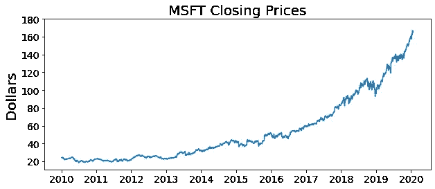

# 如何使用 Python 获取股票数据

> 原文：<https://towardsdatascience.com/how-to-get-stock-data-using-python-c0de1df17e75?source=collection_archive---------1----------------------->

## 用于获取股票价格数据和公司数据的 Python 一行程序

莎伦·麦卡琴在 [Unsplash](https://unsplash.com/s/photos/finance?utm_source=unsplash&utm_medium=referral&utm_content=creditCopyText) 上的照片

我最近对股票数据非常感兴趣；看看我是否能精心挑选出能够在中期带来适度回报的股票。我希望写一整篇关于我想出的策略的文章，但首先，我想分享如何首先获得股票价格数据，这样你就可以为自己进行类似的分析！

事实证明，使用名为 ***yfinance*** 的非常方便的 Python 库，这个任务变得非常容易。

为了解决这个问题，假设我们对获得微软(股票代号 MSFT)过去 10 年的股价数据感兴趣。

首先，我们将安装 yfinance 库:

*   打开 Anaconda 提示符或其他命令提示符，键入:***pip install y finance***

下面是为微软收集历史股票数据所需的基本代码:

这里的关键论点是:

*   **周期**:采集数据的频率；常见选项包括“1d”(每天)、“1mo”(每月)、“1y”(每年)
*   **开始**:开始收集数据的日期。例如“2010 年 1 月 1 日”
*   **结束**:结束收集数据的日期。例如“2020 年 1 月 25 日”

您的结果应该是一个包含微软每日历史股票价格数据的 Pandas dataframe。关键字段包括:

*   **开盘**:当日/月/年初的股票价格
*   **收盘**:当日/月/年末的股票价格
*   **高点**:当日/月/年股票达到的最高价格
*   **低点**:股票当日/月/年的最低价格
*   交易量:当天/月/年交易了多少股票

您可以使用生成的数据框架创建如下图表:

虽然*history**是 yfinance 库最常见的函数，但我还想提到一些其他函数。*

## *信息*

*对许多 tickers 来说，你可以从公司整体上获得有价值的信息，如地理位置、网站、业务摘要等。*

## *日历*

*您还可以使用 yfinance 库来获取关于公司的即将到来的收益事件。*

## *推荐*

*最后，您可以使用建议属性来查看分析师是如何对这只股票进行评级的。*

*仅此而已！希望这能帮助你开始进行自己的股票数据分析。*

****感谢阅读，下次再见！~****