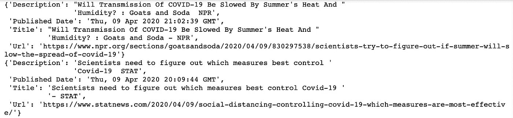

# 如何使用谷歌新闻订阅获取最新的新冠肺炎新闻

> 原文：<https://towardsdatascience.com/how-to-get-the-latest-covid-19-news-using-google-news-feed-950d9deb18f1?source=collection_archive---------16----------------------->

## 通过 RSS 源检索实时数据


照片由 [Pexels](https://www.pexels.com/photo/iphone-on-brown-wooden-table-1369476/?utm_content=attributionCopyText&utm_medium=referral&utm_source=pexels) 的 [Lisa Fotios](https://www.pexels.com/@fotios-photos?utm_content=attributionCopyText&utm_medium=referral&utm_source=pexels) 拍摄

由于目前的在家政策，我在家工作。当我浏览互联网，寻找新冠肺炎相关的新闻文章时，我很好奇一些网站是如何获取最新的新闻或文章的。这些网站可以从各种网站检索新闻或文章。

我在想，太棒了！他们会在各个网站上建立多个爬虫来获取最新消息吗？但是这需要大量的工作。

或者可能存在一些免费检索新闻的 API？然而，我发现这些 API 提供者只跟踪某些网站。

我在想，有没有更简单的方法来获取最新的谷歌新闻？由于谷歌机器人正在抓取大多数网站，这应该是一个好的开始。尽管如此，谷歌在限制机器人方面的效率是出了名的。

经过数小时的研究，我发现有一种方法可以检索最新的谷歌新闻，那就是搜索谷歌 RSS 新闻源。

如果你有兴趣知道如何建立一个网站，将显示最新消息？或者也许你正试图将现场新闻整合到你的网站上？或者您可能只是想知道如何检索新闻？

这篇文章是给你的。

# 什么是 RSS？

RSS 代表**【丰富的网站摘要】**或**【真正简单的联合】**，它是**一种提供定期变化的网络内容的格式**。它允许用户在一个**单一**新闻聚合器中跟踪**许多不同的网站**。因此，许多与新闻相关的网站、博客和其他在线出版商将他们的内容作为 **RSS 提要**提供给任何想要的人。

所以，你对什么是 RSS 有了更好的理解，让我们从抓取开始吧！

# 我们需要搜集的确切网址是什么？

```
BASE URL: http://news.google.com/news?
```

以下是我认为对检索英语相关的新冠肺炎新闻有用的参数列表。如果您有兴趣了解更多信息，请随意点击[此处](https://developers.google.com/custom-search/docs/xml_results)获取 google 官方 XML API 文档。

查询术语:

1.  问:这代表我想要请求的查询词，在本例中，它是新冠肺炎。
2.  hl:你正在使用的用户界面的宿主语言。我更喜欢用 en-US。
3.  sort:这个参数是可选的。我将希望根据日期对新闻进行排序，因此值是日期。
4.  gl:这是原产国与参数值匹配的增强搜索结果。该值是美国，因为这是我的 web 浏览器的默认值。
5.  num:您希望获得的新闻数量。我会选择最大值 100。
6.  输出:你想要的输出格式。我会选择 RSS。

这是我将向其发送请求的最后一个字符串。

```
URL: http://news.google.com/news?q=covid-19&hl=en-US&sort=date&gl=US&num=100&output=rss
```

恭喜，你现在只剩下代码部分了。

# 编码部分

我使用的编程语言是 Python。在测试代码之前，一定要安装这两个库— [bs4](https://www.crummy.com/software/BeautifulSoup/) 和 [feedparser](https://github.com/kurtmckee/feedparser) 。

您会注意到我创建了一个名为 ParseFeed 的类，有两个方法`clean` 和`parse`。clean 函数将从 HTML 文档中提取所有文本，并用空格字符替换字符`\xa0`。

此外，`parse`函数将解析 HTML 并打印一些我认为重要的字段。例如，新闻的标题、描述、发布日期和 URL。

下面是在 Jupyter 笔记本上运行上述代码后的输出快照。



# 最终想法


吉尔·威灵顿摄于 [Pexels](https://www.pexels.com/photo/sunset-beach-people-sunrise-40815/?utm_content=attributionCopyText&utm_medium=referral&utm_source=pexels)

正如你可能注意到的，你可以通过 RSS 以一种更方便的方式检索新闻。如果你有兴趣追踪其他种类的新闻，你可以调整参数来得到你想要的。但是，请注意，有些参数是有限制的。

非常感谢你一直读到最后。如果你有任何你想让我讨论的话题，欢迎在下面评论。

大家待在家里，注意安全！

***编者按:*** [*走向数据科学*](http://towardsdatascience.com/) *是一份以数据科学和机器学习研究为主的中型刊物。我们不是健康专家或流行病学家，本文的观点不应被解释为专业建议。想了解更多关于疫情冠状病毒的信息，可以点击* [*这里*](https://www.who.int/emergencies/diseases/novel-coronavirus-2019/situation-reports) *。*

# 关于作者

[低魏宏](https://www.linkedin.com/in/lowweihong/?source=post_page---------------------------)是 Shopee 的数据科学家。他的经验更多地涉及抓取网站，创建数据管道，以及实施机器学习模型来解决业务问题。

他提供爬行服务，可以为你提供你需要的准确和干净的数据。你可以访问[这个网站](https://www.thedataknight.com/)查看他的作品集，也可以联系他获取**抓取服务**。

你可以在 [LinkedIn](https://www.linkedin.com/in/lowweihong/?source=post_page---------------------------) 和 [Medium](https://medium.com/@lowweihong?source=post_page---------------------------) 上和他联系。

[](https://medium.com/@lowweihong) [## ●伟鸿-中等

### 在媒体上阅读低纬鸿的作品。数据科学家|网络抓取服务:https://www.thedataknight.com/.每…

medium.com](https://medium.com/@lowweihong)