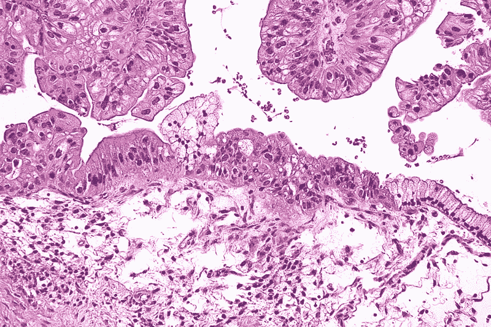
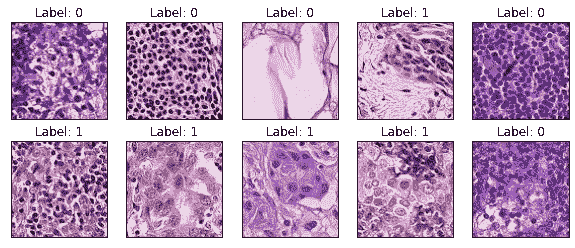
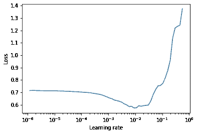
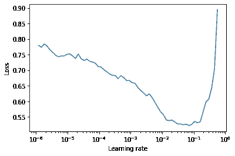

# 如何在 Kaggle 上获得前 1%并帮助进行组织病理学癌症检测

> 原文：<https://towardsdatascience.com/how-to-get-top-1-on-kaggle-and-help-with-histopathologic-cancer-detection-af729dc3e6f7?source=collection_archive---------50----------------------->

## 一个关于我第一次 Kaggle 比赛的故事，以及我在那次比赛中学到的东西。此外，大量的代码、模型权重以及可能对其他研究人员有帮助的想法。



肾单位通过维基共享资源

大约一年前，我参加了第一次关于癌症分类的 Kaggle 竞赛。从那以后，我参加了更多的比赛，甚至和我的团队一起发表了一篇关于 CVPR 的论文。但是，我觉得我们在一场比赛结束后失去了大部分知识，所以我想分享一下我的方法以及 [**发布代码**](https://github.com/ivanpanshin/hist_canser)[**模型权重**](https://www.kaggle.com/ivanpan/histopathologic-cancer-detection-weights) (迟到总比不到好吧？).

我希望我的想法(+实现它们的 PyTorch 解决方案)对研究人员、Kaggle 爱好者以及希望在计算机视觉方面做得更好的普通人有所帮助。

**免责声明:**我不是医学专业人士，只是个 ML 工程师。也就是说，对我所有与医疗相关的声明都要持保留态度。然而，我乐于接受批评，所以如果你在我的陈述或一般方法中发现了错误，请随时联系我，我会尽最大努力纠正它。

# 什么是组织病理学癌症，为什么它很重要


neverov 通过 memepedia

简而言之，你需要一个大型的数字病理扫描，裁剪它的碎片(补丁),并试图在这些作物中找到转移组织。在这种特殊情况下，我们有来自淋巴结大扫描的补丁(PatchCamelyon 数据集)。请记住，转移是癌细胞扩散到身体的新部位。通常，它是通过淋巴系统的血流来完成的。

这项工作的重要性非常简单:构建机器学习驱动的系统可能也应该帮助那些无法获得准确诊断的人。也许他们没有好的专家，或者只是想再次检查他们的诊断。

*然而，请记住自我治疗并不是一个明智的想法，而且许多 ML 医疗系统都是有缺陷的(* [*最近的例子*](/detecting-covid-19-with-97-accuracy-beware-of-the-ai-hype-9074248af3e1) *)。*

# 引擎盖下是什么

## 目标

主要的挑战是解决斑块是否包含转移组织的分类问题。阳性标签表示补片的中心 32×32 像素区域包含至少一个肿瘤组织像素。贴片外部区域的肿瘤组织不影响标记。

所有解决方案都在预测概率和观察目标之间的 ROC 曲线下的面积上进行评估。

## 电子设计自动化(Electronic Design Automation)

在任何 ML 项目中，首先要做的是探索性数据分析。

```
Train/Test images: 220025/57458Value counts: 
0    130908
1     89117Image size: (96, 96)
```



## 确认

毫无疑问，对于构建 ML 模型来说，最重要的事情是验证。有人可能会认为，简单地将数据随机分成 80/20 的比例进行训练和验证，或者以分层的方式进行，或者应用 k 倍验证，都是可以的。但实际上，验证这种模型的最好方法是分组折叠。我们如何建立组，为什么在这种情况下它是最好的验证技术？让我们后退一点。

正如我之前所说，我们处理的补丁是一些更大图像(扫描)的一部分。也就是说，我们不能将扫描的一部分发送给培训，而将剩余部分发送给验证，因为这将导致泄漏。因此，每次扫描都应该是训练或完全验证。这就是我们构造组的原因，这样组与组之间就没有扫描的交集。

为了做到这一点，我们需要将每个补丁与其对应的扫描相匹配。我们这样做是 Kaggle challenge 的一部分，你可以在 GitHub repo 中找到文件 *(patch_id_wsi_full.csv)* 的完整匹配。

## 数据准备

关键的一步是调整大小，因为在原始大小上训练产生的结果一般。更糟糕的是，只对中心作物进行训练。*文章末尾附有完整的表格和模型比较。*

基于对手工训练集的检查，我认为把我的增强集中在翻转和颜色变化上是个好主意。请注意，我没有使用白蛋白，而是使用默认 pytorch 变换。这只是遗产，因为我大约一年前写了这部分代码，不想在转移到 albumentations 时破坏它。

## 模型和优化细节

模型的主干是 EfficientNet-B3 或 SE_ResNet-50，其头部经过修改，具有自适应平均池化和最大池化的串联+具有密集压差的附加 FC 层(3 层，压差为 0.8)。使用 EfficientNet 和 SE_ResNet 的主要原因是，它们是非常适合这个特定数据集的默认主干。

优化器是没有任何权重衰减的 Adam+ReduceLROnPlateau(因子= 0.5，耐心= 2，度量=验证 AUROC)，用于调度，训练分两部分完成:微调头部(2 个时期)，然后解冻网络的其余部分，并微调整个事情(15-20 个时期)。两个阶段的学习率都是 0.01，并使用 LR 范围测试进行计算(学习率以指数方式增加，计算训练集的损失):



阶段 1 的学习率范围测试



阶段 2 的学习率范围测试

请记住，实际上使用莱斯利·史密斯提出的[原始想法](https://arxiv.org/pdf/1803.09820)更好，在那里您线性增加学习率并计算验证集上的损失。这样，你会得到更可靠的结果，但只是需要更长的时间来完成。

训练是使用常规的 BCEWithLogitsLoss 完成的，没有任何类权重(原因很简单，它是有效的)。

## 附加技巧(增加的东西+不起作用的东西)


[托弗麦卡洛克](https://www.flickr.com/photos/tofu_mugwump/)通过 flickr

为了获得更好的性能，应用了 TTA。特别是 4-TTA(所有旋转 90 度+原始),用于使用平均平均值进行验证和测试。此外，所有倍的高效网-B3 和 SE_ResNet-50 是混合在一起的一个简单的手段。

如果你想进一步提高最终模型的质量，并且不想被原创的想法所困扰(比如高级的预处理和后处理)，你可以很容易地应用 SWA。为了做到这一点，回购支持 SWA(这不消耗内存，因为 EfficientNet-B3 的权重需要大约 60 Mb 的空间，SE_ResNet-50 的权重需要 40 Mb 的空间)，这使得平均模型权重变得容易(请记住，SWA 不是平均模型预测，而是平均其权重)。

我试图为最后阶段的训练增加更复杂的损失(像 FocalLoss 和 Lovasz 铰链损失)，但改善是微不足道的。还有，我实现了渐进式学习(训练时增加图像大小)，但出于某种原因，这并没有帮助。也许，我的实现是有缺陷的，因为这通常是提高模型性能的一种相当安全的方法。

# 模型比较

请注意，合奏没有 CV 分数。这样做的原因是，基于单倍分数比较单个模型很容易(但你需要冻结种子)，但为了比较整体(如混合、堆叠等)。)您需要一个额外的维持集。换句话说，例如，您将所有数据的 20%用于维持，其余的 80%照常分成多个部分。这很简单，也是我没有在这个解决方案中实现它的唯一原因——我没有计算资源从头开始重新训练 10 次折叠。

这也是我不公布加权综合得分的原因:你需要根据验证的坚持来微调权重。

# 最后的想法


Mememaster 通过 memepedia

这个比赛已经结束一年了，所以很明显，很多新的想法已经浮出水面，这应该会提高这个模型的质量。个人可以推荐以下。

如果您的资源不低，只需训练更多具有不同主干(重点是 SE_ResNet、SE_ResNeXt 等模型)和不同预处理(主要是图像大小+添加图像裁剪)的模型，并将它们与更密集的 TTA(添加关于颜色的变换)混合，因为集成对于这个特定的数据集非常有用。但请记住，为了评估整体(并可靠地比较折叠)，有必要从折叠中单独分离出一个坚持。

如果你想要比混合神经网络更具原创性的东西，我当然会建议在领域知识方面研究更复杂的数据增强技术(也就是说，与领域专家合作，并征求如何增强图像的想法，以便它们仍然有意义)。此外，很明显，我使用了预先训练的 EfficientNets 和 ResNets，它们是在 ImageNet 上训练的。在类似于这个数据集的一些医疗相关数据集上运行额外的预训练(甚至从头开始训练)应该是一种有利可图的方法。

# 联系人

如果你对这个解决方案有任何问题，请随时在评论、GitHub 问题或我的电子邮件地址 ivan.panshin@protonmail.com 联系我