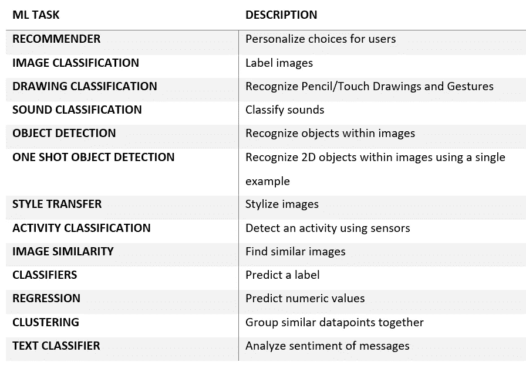
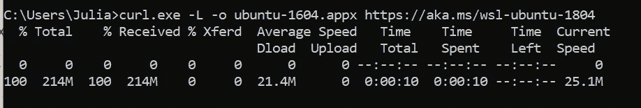
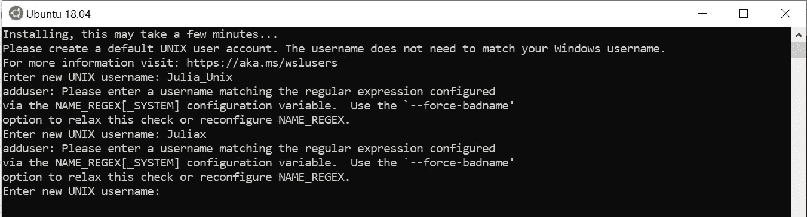
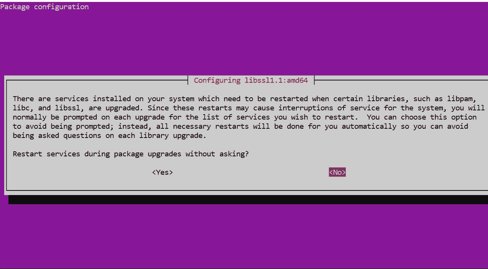
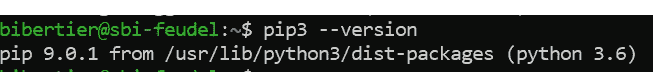
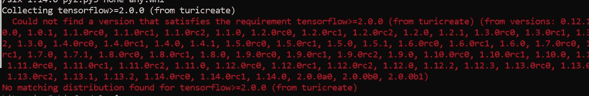

# 如何让 Turi Create 在 Windows 上运行

> 原文：<https://towardsdatascience.com/how-to-get-turi-create-running-on-windows-261b68027bc0?source=collection_archive---------11----------------------->

## 很有可能，你正在学习一门在线课程，并对所有这些错误信息感到沮丧。这是一个关于如何做到这一点的教程。

沙哈达特·拉赫曼在 [Unsplash](https://unsplash.com?utm_source=medium&utm_medium=referral) 上拍摄的照片

**受众**:机器学习初学者，命令行初学者，windows 用户，Python 3，Anaconda

我一直在学习机器学习基础在线课程，但在建立所需的库时已经失败了，这让我彻底疯了。让我们省点挫折吧。这个简短的教程旨在帮助你更容易地完成第一步

**为什么我们要用** [**Turi 创建**](https://github.com/apple/turicreate) **？**

Python 中有很多机器学习库，其中大部分都不容易扩展到大型数据集。Turi Create 使我们能够创建各种各样的 ML 模型，而不必安装额外的软件包。它易于使用，包含有用的绘图选项，并且对于您可能想要使用的数据是灵活的。

Turi Create 可以完成许多 [ML 任务](https://apple.github.io/turicreate/docs/userguide/)，大多数不需要额外的库。

**要求:**

*   Python 2.7、3.5、3.6
*   x86_64 架构
*   至少 4 GB 内存

**支持的平台:**

*   macOS 10.12 以上
*   Linux(带有 glibc 2.10 以上版本)
*   Windows 10 (WSL)

这就是我的问题开始的地方。就像我经常做的那样，我只看了手册的一半就开始打字…并且面对一条又一条的错误信息。

> 评论:你将不能简单地在 Windows 10 平台上安装/运行 Turi Create。你必须先为 Linux(WSL)安装一个**W**windows**S**子系统。

**安装** [**WSL**](https://docs.microsoft.com/en-us/windows/wsl/install-win10)

为了安装任何 WSL，必须启用“用于 Linux 的 Windows 子系统可选功能”。

*   按照以下命令以管理员安润身份打开 PowerShell:

*   出现提示时，重新启动计算机
*   [安装](https://docs.microsoft.com/en-us/windows/wsl/install-win10)您选择的 linux 发行版。在这个例子中，我们使用的是 Ubuntu 16.04

> 评论:Ubuntu 16.04 不是最新版本，以后还得更新。如果找到最新版本，直接安装，跳过“更新”这一步。

*   以管理员身份打开命令行，并使用以下代码

结果应该是这样的:

现在我们需要使用 PowerShell 安装我们的发行版。运行以下命令，而“app_name”是您的 distro.appx 文件的名称

> 评论:这个也可以手动完成，不赘述。它基本上是寻找 distro.appx 文件并点击**安装**。

如果你不小心下载了一个过时的版本(像我一样)，你会被提示更新(我已经更新了)

您的发行版命令终端会被自动提示，并要求您输入一个新的 Unix 用户名:遵循正则表达式

**规则:**

*   以小写字母或下划线开始
*   后跟小写字母、数字、下划线、破折号
*   regex:I .[a-z _][a-z0–9 _-]*[$]？

> 评论:我试过各种各样的名字，但都被拒绝了。最后我选择了一个简单的名字，全部小写，没有特殊字母。

**安装 pip**

使用 *pip 安装 turicreate。如果你已经安装了 Ubuntu，你可以使用这个教程。确保您使用的是 sudo 权限。*

*   将提示您批准使用额外的磁盘空间—按“Y”
*   然后会要求您重新启动。我选了<yes>。不过这取决于你</yes>

*   安装完成后，验证是否安装了 pip3
*   尽管版本号可能会有所不同，但看起来应该是这样的:

*   一旦安装了 Turi Create，您将得到以下错误(除非您已经安装了 T [ensorflow](https://www.tensorflow.org/)

使用 pip 安装 Tensorflow

*   打开您的 Ubuntu(或首选发行版)控制台，使用以下命令:

差不多就是这样。我还安装了 [Sframe](https://github.com/turi-code/SFrame) 来处理大数据集，但这是个人喜好的问题。该社区已经开始提供直观的教程供进一步使用，并提供鼓舞人心的文章。你现在可以开始玩 Turi Create 和机器学习了。玩得开心！