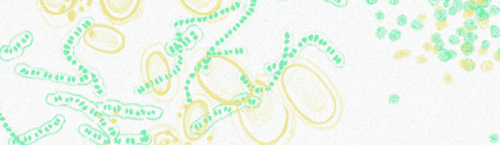
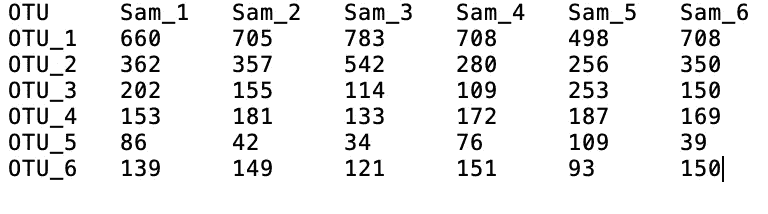
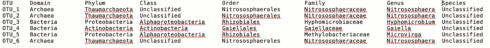

# 如何赋予您的微生物组数据生命？

> 原文：<https://towardsdatascience.com/how-to-give-life-to-your-microbiome-data-using-plotly-r-1892281183cf?source=collection_archive---------15----------------------->

## 关于如何使用 Plotly 的 R graphing library 进行微生物组数据分析和可视化的教程。



从人类占 50%的艺术科学项目中移走微生物。信用:索尼娅·布梅尔。

我是一名微生物生态学家，这意味着我研究微生物如何相互作用及其环境。最近，我跳进了数据科学的世界，这要感谢我从 [Mitacs](https://www.mitacs.ca/en) 获得的研究员资格，与数据分析&可视化公司 [Plotly](https://plotly.com/) 一起工作。Plotly 是关于构建交互式数据科学 web 应用程序的，在这篇文章中，我想分享一些背景知识，介绍如何使用 Plotly 的 R graphing library 通过我的研究中的一些数据实现微生物组数据的交互式可视化。您可以使用提供的代码和链接复制所有图形。你甚至可以自己点击“编辑图表”按钮进入编辑器，对它进行修改或提出改进建议！

在直接进入可视化部分之前，让我先给你一个我们正在处理的数据类型的概述。如果你已经熟悉微生物组数据，你可以跳过下一节。

*什么是扩增子或鸟枪数据？*

它们本质上是通过 [DNA 测序](https://en.wikipedia.org/wiki/DNA_sequencing)方法获得的数据，这些方法识别关于 DNA 片段或整个基因组的信息。这些序列被[组装](https://en.wikipedia.org/wiki/Sequence_assembly)和[注释](https://en.wikipedia.org/wiki/DNA_annotation#:~:text=DNA%20annotation%20or%20genome%20annotation,way%20of%20explanation%20or%20commentary.)，使用生物信息学工具提取关于给定环境中微生物身份或基因丰度的生物信息。这种分析的输出是所谓的 OTU(操作分类单位)表或基因丰度表。



包含样本信息和原始计数的 OTU 表。图片由作者提供。



包含与 OTU ID 相关的分类单元信息的分类表。图片由作者提供。

这个表以及关于分类法和元数据的信息可以用于统计分析和可视化。我选择的编程语言是 R，因为已经开发了许多用于微生物组分析的软件包(例如， [phyloseq](https://joey711.github.io/phyloseq/) 、 [microbiomeSeq](http://userweb.eng.gla.ac.uk/umer.ijaz/projects/microbiomeSeq_Tutorial.html) 、 [microbiome](https://microbiome.github.io/tutorials/) 、 [picante](https://cran.r-project.org/web/packages/picante/picante.pdf) )，也因为这种语言的统计特性。

*先说交互数据可视化(还有一些统计)！*

作为评估样品或环境差异的第一个概述，通常查看α多样性。阿尔法多样性描述了特定样本或环境中的多样性(有关阿尔法多样性统计的更多信息，请查看 Amy D. Willis [的论文](https://www.frontiersin.org/articles/10.3389/fmicb.2019.02407/full))。使用具有以下代码的盒状图可以很容易地绘制多样性指数，并通过将鼠标悬停在图上或单击图例以隔离轨迹的方式进行交互式探索(有关特征的说明，请参见右上角的工具)。

```
# load libraries 
library(dplyr)
library(data.table)
library(plotly)# load file
df <- fread("[https://raw.githubusercontent.com/ruthlys/files_plotlyr/master/alphadf.csv](https://raw.githubusercontent.com/ruthlys/files_plotlyr/master/alphadf.csv)")# create annotations for y axis
y_p1 <- list(
  title = "Shannon")
y_p2 <- list(
  title = "Phylogenetic Diversity")# filter variable and plot first subplot 
p1 <- df %>% filter(variable == "Shannon") %>% 
plot_ly(
x = ~Compartment, 
y = ~value, 
color = ~Treatment,
colors = "Dark2",
type = "box",
legendgroup = ~Treatment,
showlegend = TRUE) %>% 
  subplot(nrows = 1, shareX = TRUE, shareY =TRUE, titleX = FALSE) %>% layout(boxmode = "group", yaxis = y_p1)# filter variable and plot second subplot
p2 <- df%>% filter(variable == "Phylogenetic Diversity") %>% plot_ly(
x = ~Compartment, 
y = ~value, 
color = ~Treatment,                                                                  colors = "Dark2",                                                                type = "box",                                                                  legendgroup = ~Treatment,                                                              showlegend = FALSE) %>%
  subplot(nrows = 1, shareX = TRUE, shareY =TRUE, titleX = FALSE) %>% layout(boxmode = "group", yaxis = y_p2)# combine subplots 
p_box <- subplot(nrows = 1, p1, p2, titleX = TRUE, titleY = TRUE) 
p_box# you can also update details of the graph in [chart studio](https://plotly.com/chart-studio/) (e.g. legend names) by creating a free account and api key and then upload them
Sys.setenv("plotly_username"="put your username here")
Sys.setenv("plotly_api_key"="put your api key here")chart_link = api_create(p, filename = "your file name")
chart_link
```

显示 16S rRNA 扩增子测序数据的α多样性指数的箱线图。这些只是一些常见的例子，可以选择更多的指数。

条形图的替代方法是所谓的[小提琴图](https://www.data-to-viz.com/graph/violin.html)，它是箱形图的扩展，增加了一个[内核密度图](https://en.wikipedia.org/wiki/Kernel_density_estimation)，显示数据的分布形状。小提琴越宽，该范围内的数据点越多；数据点越少越小。下面的代码生成了一个分割的 violin 图，其优点是可以直接比较多个组(这里是植物-土壤区间)。通过对其他分集指数进行过滤，并遵循上述组合图的代码，可以添加额外的子图。

```
# load libraries 
library(dplyr)
library(data.table)
library(plotly)# load file
df <- fread("[https://raw.githubusercontent.com/ruthlys/files_plotlyr/master/alphadf.csv](https://raw.githubusercontent.com/ruthlys/files_plotlyr/master/alphadf.csv)")# filter variable, assign sides of plot
p_violin <- df %>% filter(variable == "Shannon") %>%
  plot_ly(type = 'violin') 
p_violin <- p_violin %>%
  add_trace(
    x = ~Compartment[alphabac.dfmelt$Treatment == 'Control'],
    y = ~value[alphabac.dfmelt$Treatment == 'Control'],
    legendgroup = 'Control',
    scalegroup = 'Control',
    name = 'Control',
    side = 'negative',
    box = list(
      visible = T),
    meanline = list(
      visible = T),
    color = I("#1B9E77")) 
p_violin <- p_violin %>%
  add_trace(
    x = ~Compartment[alphabac.dfmelt$Treatment == 'Treatment'],
    y = ~value[alphabac.dfmelt$Treatment == 'Treatment'],
    legendgroup = 'Treatment',
    scalegroup = 'Treatment',
    name = 'Treatment',
    side = 'positive',
    box = list(
      visible = T),
    meanline = list(
      visible = T),
    color = I("#D95F02"))p_violin %>%
  layout(
    xaxis = list(
      title = ""),
    yaxis = list(
      title = "Shannon",
      zeroline = F),
    violingap = 0,
    violingroupgap = 0,
    violinmode = 'overlay')
```

显示 16S rRNA 扩增子测序数据的 Shannon alpha 多样性的分裂小提琴图。

下一步，我们可以探索基于所选的[分类等级](https://en.wikipedia.org/wiki/Taxonomic_rank)给出微生物种类信息的分类法。通常，选择门(用于更广泛的概述)和属(用于更深入的概述)的等级。*提示*:这有助于根据平均丰度从最丰富到最不丰富的分类群对数据进行排序，以便于解释(阅读更多关于为什么排序数据对清晰解释很重要的信息[此处](https://www.data-to-viz.com/caveat/order_data.html))。

```
# load libraries 
library(dplyr)
library(data.table)
library(plotly)# load data (already normalized)
df <- fread("[https://raw.githubusercontent.com/ruthlys/files_plotlyr/master/psbac.df.csv](https://raw.githubusercontent.com/ruthlys/files_plotlyr/master/psbac.df.csv)")# annotate plots (for more on annotation check out this [link](https://plotly.com/r/text-and-annotations/)) 
a <- list(
  text = sprintf("Bulk"),
  font = list(size = 14),
  xref = "paper",
  yref = "paper",
  yanchor = "bottom",
  xanchor = "center",
  align = "center",
  x = 0.5,
  y = 1,
  showarrow = FALSE)b <- list(
  text = sprintf("Rhizosphere"),
  font = list(size = 14),
  xref = "paper",
  yref = "paper",
  yanchor = "bottom",
  xanchor = "center",
  align = "center",
  x = 0.5,
  y = 1,
  showarrow = FALSE)# order based on decreasing mean abundance and group by Phylum, filter for desired variable (here plant compartment) and pass into plotly function
p1 <- df %>% 
  mutate(Phylum=fct_reorder(Phylum, Abundance, .fun='mean', .desc=T)) %>% 
  group_by(Phylum) %>% 
  filter(Compartment == "Bulk") %>% 
  plot_ly(x = ~Treatment, 
          y = ~Abundance, 
          color = ~Phylum, 
          colors = "Dark2",
          type = "bar", 
          legendgroup = ~Phylum, 
          showlegend = F)  %>%
  layout(barmode = "stack", legend=list(title=list(text='Phylum')), 
         annotations = a, xaxis = list(autorange = "reversed"))# repeat previous step for second variable 
p2 <- df %>% 
  mutate(Phylum=fct_reorder(Phylum, Abundance, .fun='mean', .desc=T)) %>% 
  group_by(Phylum) %>% 
  filter(Compartment == "Rhizosphere") %>% 
  plot_ly(x = ~Treatment, 
          y = ~Abundance, 
          color = ~Phylum, 
          colors = "Dark2",
          type = "bar", 
          legendgroup = ~Phylum, 
          showlegend = T)  %>%
  layout(barmode = "stack", legend=list(title=list(text='Phylum')), 
         annotations = b, xaxis = list(autorange = "reversed"))# plot subplots 
p <- subplot(nrows = 1, p1, p2, titleX = T, titleY = T, shareX = T, shareY = T, margin = 0.05) 
p
```

16S rRNA 扩增子测序数据的门水平上相对丰度以降序排列的堆积条形图。

我喜欢用气泡图来代替堆积条形图，在堆积条形图中，气泡的大小代表分类群的丰度。我将在这里用鸟枪法宏基因组学数据用下面的代码来说明这一点。

```
# load libraries 
library(dplyr)
library(data.table)
library(plotly)# read in file (already converted to df using the [psmelt](https://www.rdocumentation.org/packages/phyloseq/versions/1.16.2/topics/psmelt) function of the phyloseq package)
df <- fread("[https://raw.githubusercontent.com/ruthlys/files_plotlyr/master/meta_relative.csv](https://raw.githubusercontent.com/ruthlys/files_plotlyr/master/meta_relative.csv)")
# convert to factor
df$perc_SWHC = as.factor(df$perc_SWHC )# hide tick labels for x axis, set title (you can do this alternatively directly in the layout using lists)ax <- list(
  title = "soil history",
  zeroline = FALSE,
  showline = FALSE,
  showticklabels = FALSE,
  showgrid = FALSE
)# alternatively pass in phyloseq object and use psmelt function, order based on mean abundance, then split based on desired parameter and pass everything into a plotly functionp <- df %>% 
mutate(Phylum=fct_reorder(Phylum, Abundance, .fun='mean', .desc=T)) %>% split(.$soil_type) %>% 
lapply(function(d) {
    plot_ly(d, 
x = ~perc_SWHC, 
y = ~Phylum, 
text = ~Abundance, 
type = 'scatter', 
mode = 'markers',
size = ~Abundance, 
color = ~perc_SWHC, 
colors = "Dark2",
#Choosing the range of the bubbles' sizes:
sizes = c(10, 50),
marker = list(opacity = 1, sizemode = 'diameter')) %>% 
layout(xaxis = ax,
yaxis = list(showgrid = FALSE))}) %>%
  subplot(nrows = 1, shareX = T, shareY =T, titleX = T, titleY = T, margin = 0.01) %>% 
  layout(legend=list(title=list(text='% SWHC')))
# remove unwanted legends from plot 
for (i in seq(3, length(p[["x"]][["data"]]))) {
  p[["x"]][["data"]][[i]][["showlegend"]] <- FALSE
}
p
```

鸟枪法宏基因组学数据的相对丰度显示了以平均丰度递增顺序排列的最优势门。颜色显示了第二个类别，在这种情况下，土壤持水能力的百分比被用作模拟干旱与非干旱条件的处理。

*关于相对丰度的旁注*

关于根据数据的相对丰富程度来解释数据的缺点，一直存在争议；这是有充分理由的，因为一个分类单元丰度的每一次增加都会导致其余分类单元丰度的相应减少。正如加州大学圣地亚哥分校奈特小组的詹姆斯·莫顿所说:

> “知道生物体 A 和 B 是否以 80%和 20%的比例存在是一回事，但这些数字是来自 1 亿还是 1 亿个细胞对宿主来说有着巨大的差异。”(更多信息请查看唐磊的[评论](https://www.nature.com/articles/s41592-019-0527-3?proof=true&draft=collection%3Fproof%3Dtrue)和声明背后的[论文](https://www.ncbi.nlm.nih.gov/pmc/articles/PMC6586903/))。

这就是说，相对丰度数据应仔细解释，从这些数据中推断准确的分类转变时必须谨慎。

让我们通过观察β多样性来继续典型微生物组分析的下一步。β多样性衡量从一个环境或样本到另一个环境或样本的物种多样性变化。这通常以散点图或 PCoA/NMDS 图(主坐标分析/非公制多维标度)的形式示出，其中样本基于它们的相似性或不相似性被分离，并被排列在低维 2D 或 3D 空间中。不同的指数可用于计算相异矩阵。关于这方面的更多信息，请查看 r . com 中的 distance { phyloseq } pr design dist { vegan }文档。

```
# load libraries 
library(dplyr)
library(data.table)
library(plotly)# load file (in this case I calculated the matrix based on Bray-Curtis dissimilarity using the ordinate function of the phyloseq package and converted it to a df, then merged the df with the sample metadata)df <- fread("[https://raw.githubusercontent.com/ruthlys/files_plotlyr/master/pca_16S.csv](https://raw.githubusercontent.com/ruthlys/files_plotlyr/master/pca_16S.csv)")# create axis annotation
x <- list(
  title = "Axis 1"
)
y <- list(
  title = "Axis 2"
)# plot 2d plot with color settings and text annotations 
p1 = plot_ly(df, 
                 x= ~Axis.1, 
                 y= ~Axis.2, 
                 color = ~Compartment, 
                 colors = "Dark2", 
                 mode = "markers", 
                 type = "scatter",
                 text  = ~Compartment,
                 alpha = 0.8,
                 marker = list(size = 12)) %>%
  layout(xaxis = x, yaxis = y)
p1# plot 3d plot with color settings and text annotations 
p2 <- plot_ly(
  df, 
  x = ~Axis.1, 
  y = ~Axis.2, 
  z = ~Axis.3, 
  color = ~Compartment, 
  colors = "Dark2", 
  text = ~Treatment, 
  mode = "markers",
  type = "scatter3d")
p2 <- p2 %>% layout(scene = list(xaxis = list(title = 'Axis 1'),
                                   yaxis = list(title = 'Axis 2'),
                                   zaxis = list(title = 'Axis 3')))p2
```

基于 Bray-Curtis 指数计算相异矩阵后的 16SrRNA 扩增子测序数据的 2D 散点图(NMDS 图)。

基于 Bray-Curtis 指数计算相异矩阵后，16SrRNA 扩增子测序数据的 3D 散点图(NMDS 图)。

暂时就这样了。我希望本教程对你有用，并且对你自己的数据分析和可视化有所帮助。请继续关注更多关于如何使用 Plotly 的 R 图形库、Dash for R 和 Dash Bio 可视化组学数据的教程！