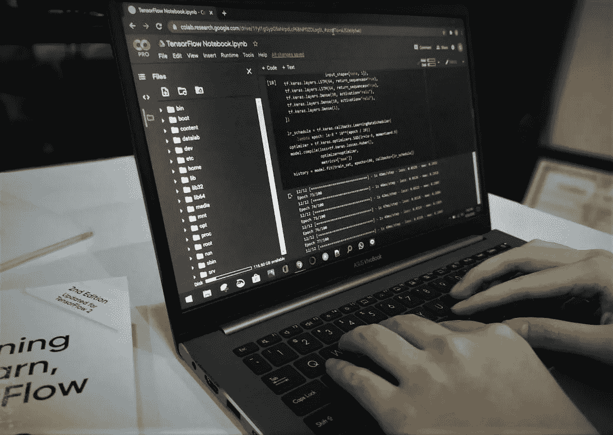
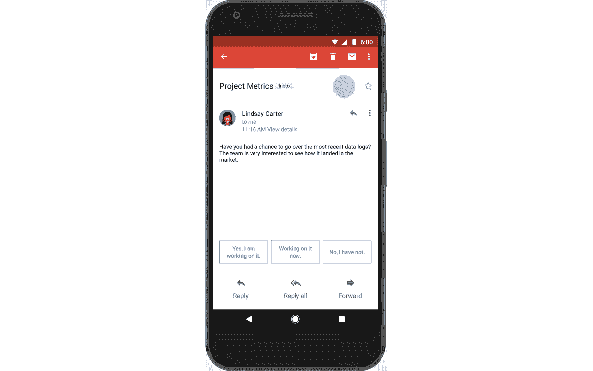
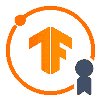

# 如何在两个月内从 Python 新手成为 Google 认证的 TensorFlow 开发者

> 原文：<https://towardsdatascience.com/how-to-go-from-a-python-newbie-to-a-google-certified-tensorflow-developer-under-two-months-3d1535432284?source=collection_archive---------0----------------------->

## 在疫情期间感到无聊，我决定挑战自己，学习 Python，并在两个月内获得 Google 认证为 TensorFlow 开发人员。下面是我的故事和我的学习之路。

作者照片。

我仍然记得我向大学提交论文的那一天。当我的学士学业接近尾声时，我如释重负地叹了口气。然而，厌倦很快征服了我。无事可做，世界被疫情吞噬，我拼命寻找新的活动来填补我空虚的日子。

在这篇文章中，我将告诉你这种疫情的无聊是如何让我在不到两个月的时间里成为谷歌认证的 TensorFlow 开发者的，尽管我以前从未用 Python 编码过。我提供了一份我用来准备这次考试的相关学习材料的清单。

# 我张量流'起源故事'

作为一个喜欢学习的人，我的好奇心促使我阅读了大量关于疫情的新闻和文章，当时我偶然发现了一篇关于一组研究人员开发一种新系统的文章，该系统可以在 X 射线图像中区分肺炎和新冠肺炎病毒。

文章提到，他们使用“人工智能”和“神经网络”来制作系统。这立刻激起了我的兴趣——他们如何训练一个可以区分 x 光扫描的系统？这个人工智能甚至没有医学学位，但它有超过 90%的准确率！就这样开始了我深入学习的兔子洞之旅。

长话短说，和一个朋友的简短对话让我对 TensorFlow(和 Keras)大开眼界。又一天的好奇浏览让我读了丹尼尔·伯克的[博客，关于他如何获得 TensorFlow 开发者认证的。](https://www.mrdbourke.com/how-i-got-tensorflow-developer-certified/)

我也挑战自己去获得认证，但我担心我没有足够的时间，因为我马上就要被雇用了，而且几乎同时开始我的硕士学位课程。再者，我对 Python 一窍不通。我真的能完成这个壮举吗？

我本科学习的是精算学的应用数学，这意味着我非常熟悉微积分、回归、时间序列和统计学。然而，我的 Python 编程技能很少，因为我知道的唯一编程语言是 R。虽然我发现 R 是一种非常通用的语言，可以满足数据相关工作的需求，但不幸的是，目前语言 R 不支持 TensorFlow 开发人员认证考试。

作为一名自称的数据和人工智能爱好者，获得这项认证将是我旅程中的一个里程碑。好了，我的故事讲完了。再说 TensorFlow。

# 什么是张量流？为什么要学？

TL；DR 版本:TensorFlow 是一个广泛可用的机器学习软件库。

略低的 TL；DR 版本:TensorFlow 是一个免费的开源框架，使用户能够开发端到端的机器学习和深度学习项目，从预处理到模型训练和部署。它最初是由谷歌大脑团队开发的，供谷歌内部使用，但现在它的使用已经非常广泛。

现在，你为什么要学习 TensorFlow？因为它能做很多事情，而且比你想象的更广泛。很有可能，你在不知情的情况下使用了 TensorFlow 提供的服务。

展示 Gmail 智能回复如何工作的 gif 图片。图片来自 Greg Bullock (2017)，来自文章“**在 Gmail 中使用智能回复节省时间**”。[https://blog . Google/products/Gmail/save-time-with-smart-reply-in-Gmail/](https://blog.google/products/gmail/save-time-with-smart-reply-in-gmail/)。来源:谷歌

你用过 Gmail 的 Smartreply 吗？它是人工智能驱动的，并根据你电子邮件上写的内容向你建议三种回答。它是使用 TensorFlow 构建的。

你的推特时间表的排序方法？WPS Office 的 OCR(图像转文本识别)？VSCO 的[为你的照片预设建议](https://support.vsco.co/hc/en-us/articles/207895053-How-to-Use-Suggested-Profiles)？张量流。

写这篇文章的时候，TensorFlow 只有 4 年的历史，它已经在我们日常使用的许多服务和产品中广泛使用。虽然没有明确写下，但开发图像识别系统以区分常规肺炎和新冠肺炎肺炎的研究人员有可能在他们的系统中使用 TensorFlow。

在未来，随着深度学习和人工智能领域的改善，我们可能会看到越来越多的产品、服务以及科学突破，这些产品、服务和科学突破都是由 TensorFlow 提供支持，以帮助他们进行深度学习。

如果这些领域的从业者熟悉这个平台，他们就会受益，这种思路也是我自己有兴趣成为认证 TensorFlow 开发者的原因。也许，你在阅读这篇文章之前或期间有类似的想法，或者也许你也有自己的理由去研究张量流。尽管如此，请继续阅读下一部分，了解更多关于考试的信息。

# 什么是 TensorFlow 开发者证书考试？这要花多少钱？

TensorFlow 数字徽章。图片摘自文章:“[介绍 TensorFlow 开发者证书！](https://blog.tensorflow.org/2020/03/introducing-tensorflow-developer-certificate.html)“阿丽娜·辛卡斯基。来源:TensorFlow

TensorFlow 开发者证书考试是笔试，必须用 Python 语言完成。在考试中，我们利用 Python 的 TensorFlow 库及其 API。每次考试费用为 100 美元。如果你第一次试用失败，你可以再次支付 100 美元，并在两周后重考。关于考试费用和规则的更多细节可以在手册[这里](https://www.tensorflow.org/site-assets/downloads/marketing/cert/TF_Certificate_Candidate_Handbook.pdf)找到。

考试大纲包括四个要点:使用 TensorFlow 建立和训练神经网络，图像分类，自然语言处理，以及时间序列。考试必须在 Pycharm IDE 中进行。

看完手册后，我开始计划我的学习路径，从学习 Python 语言本身开始，然后熟悉 TensorFlow。

# 我的学习之旅:第一个月

如果你还和我在一起，或者如果你跳过了阅读这篇文章，那么让我简单地提醒你一下。一个无聊的应用数学毕业生，无事可做，没有任何 Python 经验，突然梦想在两个月内成为 TensorFlow 开发人员。以下是我实现这一目标的历程。

在第一个月，我熟悉了 Python 语言。我如何快速地做这件事？我做的第一件事是去 [hackerrank](https://www.hackerrank.com/domains/python) ，并立即用大量的 Python 问题进行练习。当我遇到自己无法解决的问题时，我会试着在旅途中上网查找解决方案。如果这也没有帮助，我查看了解决方案，并试图理解我在这个问题中可以掌握的概念。

这就是我两个星期所做的一切，到那时，我能够回答大多数问题，甚至是那些难度更高的问题，而不需要看任何答案。

剩下的两周我做了什么？我看免费的 YouTube Python 教程。你没听错。

好吧，免责声明来了。如果你有机会以一种更结构化的方式学习正式的 Python 课程，请务必这样做。下面我列出的三个视频只是我个人的选择，加速我的 Python 学习之旅。

这些视频之所以被如此低估，仅仅是因为它们是“免费”的，而你完成它们并没有获得任何证书。以下是几个不错的选择:

*   [《Python 初学者教程》](https://www.youtube.com/watch?v=_uQrJ0TkZlc&feature=youtu.be)用 Mosh 编程。这个视频简明清晰地重述了 Python 的基本概念，从字符串、操作、函数、数据类型(列表、字典、元组)、继承开始，然后通过制作三个初学者友好的项目结束视频。第二个项目与我的道路最相关，因为它是关于机器学习的。

*   [《Python for Data Science 全教程》](https://www.youtube.com/watch?v=-6RqxhNO2yY)edu reka！本视频涵盖了 Python 中的必要包，为数据科学打下坚实的基础。在视频的最后，他们简要地谈到了使用 Keras 和 TensorFlow 在 Python 中进行深度学习，所以这让我对即将发生的事情有了一个初步的了解。

*   freeCodeCamp.org[《用 Python 分析数据》](https://www.youtube.com/watch?v=r-uOLxNrNk8)。在我们制作模型和训练它们之前，一个经常被忽视的阶段是预处理我们的数据。这个视频更多地集中在上述部分，并强调收集数据，加载它们，清理它们，以及使可视化，以得出见解。

虽然在我接下来的研究中，我会注册一个“正式”的 Python 课程，但这三个 YouTube 视频现在已经足够了。只要确保做笔记，写你自己的代码，以及在你观察的时候尝试不同的东西。

# 我的学习之旅:第二个月

我花了一个月的时间参加[深度学习。Coursera 的 AI TensorFlow 开发者专业证书](https://www.coursera.org/professional-certificates/tensorflow-in-practice)。在本课程中，我们将接受谷歌首席人工智能倡导者劳伦斯·莫罗尼和 deeplearning.ai 创始人吴恩达的辅导

这个专业有四门课程，涵盖了前面提到的考试大纲的四个要点。每门课程包括四周的课程，但我一天学了一周的课程，因为这是我那个月的首要任务。

完成每门课程后，我会休息一天，利用这一天来研究我的练习代码，或者以休闲的方式探索与课程相关的想法。

概括地说，我花五天时间完成每门课程。四天查看课资料，第五天休息复习。因此，我能够在 20 天内完成所有的课程。

每门课程都有自己的编码项目，我真的探索提供的代码。我经常发现自己花了几个小时摆弄神经网络的超参数(当你开始学习它时，你就会知道我在说什么)，以便尝试并获得最佳的验证准确性。通过这样做，你会对创建深度神经网络模型的试错过程有一种“直觉”。

有时，课程参考了外部资源，如数据集、文章和未分级的材料。这些并不是通过这门课程的必要条件，但出于好奇，我探索了许多外部资源。由于课程大多是实践性的，我们经常会看到吴恩达制作的视频链接，他在视频中解释了特定主题的更直观和理论化的方法。

# 替代材料

为了在这次考试中取得成功，你不一定要遵循我的学习路径和我的学习材料。如果你不想每月花 49 美元来学习 coursera 课程，还有其他选择，我会在这里列出来:

*   用 Scikit-Learn、Keras 和 Tensorflow(第二版)实践机器学习。这本书是我想在未来几个月内完全阅读并完成的东西，因为它的全面性真的有助于我理解关于机器学习和深度学习的关键概念。第 10-16 章包含了与考试大纲相似的材料。
*   [编码 Tensorflow Youtube 播放列表](https://www.youtube.com/playlist?list=PLQY2H8rRoyvwLbzbnKJ59NkZvQAW9wLbx)。这是一个免费的 YouTube 播放列表，包含了这次考试的材料，大部分是由劳伦斯·莫罗尼教授的。我更喜欢参加 coursera 认证，因为它有额外的评分测验和项目，但如果你敢于根据 YouTube 播放列表中的材料进一步探索，我认为你会得到很好的帮助。不要忘记在他们的官方网站上查看 Keras 和 TensorFlow 文档。

# 参加考试

我花四天时间复习功课，在完成所有课程后重读手册。第二个月 25 号，开始考试。

好了，登陆日到了。好的，这是第一个问题的答案——开玩笑的。由于显而易见的原因，我无法了解考试的详细信息，但我整理了一些关于准备和参加考试的要点:

1.  首要任务—安装所需的 Python IDE。在我的考试迭代中，我们被要求使用 [PyCharm](https://www.jetbrains.com/pycharm/download/#section=windows) 。确保下载正确的版本(参考手册)并禁用/卸载其他第三方插件。快速提示:在开始测试之前，我会先测试我的 PyCharm，运行一些 TensorFlow 模型，看看是否有任何错误需要解决。
2.  报名参加考试[这里](https://www.tensorflow.org/certificate)。完成付款并上传您的 ID(身份证/护照)。之后，你会收到另一本手册，这本手册只留给那些已经付费并注册参加考试的人。好好复习，确保你在考试开始前准备充分。
3.  考试是五个小时。明智地管理你的时间。当你的问题模型正在被训练时，你可以开始处理下一个问题。在您的模型被训练和保存后，不要忘记提交和测试您的模型(安装考试插件后，您的 IDE 将有一个“测试和提交模型”按钮)。
4.  首先集中完成所有问题，然后如果您有时间，您可以回去调整您的模型。记住，有时间限制。只要你的模型得了满分，你就可以走了。
5.  可以在 Google Colab、AWS 等外部平台上训练模型。在开始考试之前，你应该学习如何从外部平台保存你的模型，然后在 PyCharm 中加载它。您必须以“. h5”格式保存您的模型。

如果你学得很好，并且确信你已经学完了考试大纲中列出的所有东西，你应该会通过考试。我可以告诉你，手册上写的大纲没有误导，你真的可以用那里提供的列表作为你考试准备的基准。

就我个人而言，我在没有专用 GPU 的 AMD 笔记本电脑上进行考试，但我只需要在处理大型数据集的问题时使用一次 Google Colab。在你的设备上训练几个练习模型，你就会知道你的设备是否足够强大。我更关心互联网的速度和稳定性，因为你需要上传这些模型来完成考试。

# 考试成绩

结束考试后，我马上收到一封邮件，说我已经通过考试了。两周内，[我的官方数字证书](https://images.credential.net/embed/ia1rfdxo.png)发送到我的邮箱，我可以把它链接到我的 LinkedIn 个人资料。

有效期只有三年，所以我要在 2023 年再考一次认证考试。到那时，我只能对 TensorFlow 和深度学习领域的进步感到惊讶，希望我参加那个考试的旅程比第一次更顺利。

# 结论…然后下一步是什么？

这不是结束，事实上对我来说这只是开始。将这次考试作为我的第一个里程碑真的让我超级兴奋，并且是我进入数据科学世界的大门，这很奇怪——因为通常深度学习是有抱负的数据科学家的最佳选择。

我很高兴在我开始精算工作和攻读硕士学位的前几天，我设法完成了这个证书考试并写了这篇文章。通过这两个月，我对数据科学和人工智能的世界产生了新的兴趣。这个领域可能带来的解决现实世界问题的可能性似乎是无穷无尽的。

我要写一个提醒，我相信我的学习之路并不是最好的，还有很大的提升空间。对于那些不受时间限制的人来说，也许放慢速度，同时做项目是更好的学习途径。至于现在，即使我是一名认证的 TensorFlow 开发人员，我还没有在我的 GitHub 帐户上做一个项目。这就是我在这篇文章发表后的目标——通过制作真实的个人项目并把它们放到我的 GitHub 上来进一步提高我的技能。

作为一个充满创新、发现和突破的快速增长的领域，我相信人工智能、数据科学、机器学习和深度学习的世界是一个等待探索的新领域。冒险来到这个世界，你兴奋吗？因为我是。而对我来说，这一切都是从疫情期间的无聊开始的。