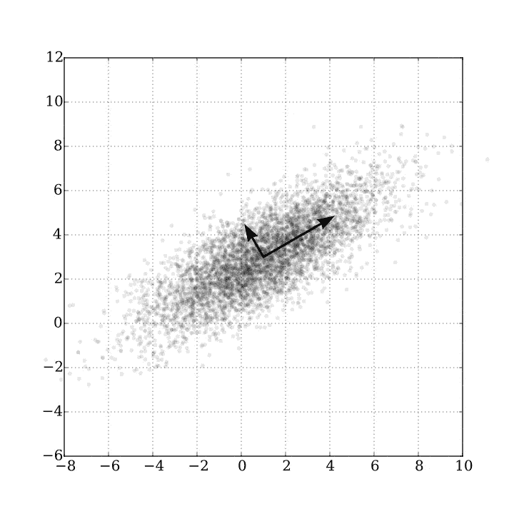

# 如何进行主成分分析

> 原文：<https://towardsdatascience.com/how-to-grok-principal-component-analysis-e7bb4510ed7?source=collection_archive---------44----------------------->

## 巨大的知识给了我们超能力。

[国家癌症研究所](https://unsplash.com/@nci?utm_source=medium&utm_medium=referral)在 [Unsplash](https://unsplash.com?utm_source=medium&utm_medium=referral) 上拍摄的照片

乔·考克在 1970 年的《疯狗和英国人现场》双张专辑的内折中，将此次巡演的音乐总监利昂·拉塞尔描述为“时空大师”那张照片给我留下了深刻的印象。

操纵数据让我觉得自己是时空大师。处理时序数据和多维数据框是对空间和时间的流畅处理。

降维是对空间和时间的终极操控。

你知道《传道书》中的那句话吗？太阳底下没有新事。机器学习和人工智能确实是天底下的新事物。

这些算法，加上个人电脑、云计算和对海量数据的访问，给了我们巨大的新力量。我们都离超级大国只有一段可以跨越的训练距离。

Grok 是科幻作家罗伯特·A·海因莱因在他 1961 年的小说《异乡客》中创造的一个词。它意味着凭直觉理解某事，并建立融洽关系。

有时障碍似乎势不可挡。在这篇文章中，我想分享我对流水线过程的一个部分的见解:主成分分析(PCA)。

PCA 是机器学习、人工智能和统计分析管道中的关键步骤。

PCA 对你来说是一个具有挑战性的课题。在这里，我描述了我灵光一现的时刻。

这篇文章不是一篇综述性技术文章；这是概念性的。一旦你有了背景知识，技术细节就更有意义了。

这里我用数量金融学作为一个应用来描述 PCA。主成分分析和降维是数量金融学的基础。

主成分分析在许多其他领域和领域中是至关重要的，在这些领域中，您试图使用已知数据来预测结果。希望这个概述对你有帮助。

一些因素解释了一个结果，我们试图找到它们。我们将这些因素建模为电子表格式矩阵中的行。为了操作它们，我们使用线性代数的向量和矩阵的数学。

在 Python 中，我们使用 Pandas 将这些数据集存储为数据帧和序列。我们使用线性代数的矩阵数学来处理熊猫的数据帧。

这些计算机文件的大小会变得很大，处理起来很麻烦。

为了使它们更易于管理，我们减小了尺寸。我们使用 PCA 来分析矩阵中的哪些向量对我们正在建模的结果贡献最大。

我们的目标是从过去的数据预测未来的结果。我们在噪音中寻找信号。我们从过去寻找对未来有预测力的信息。我们希望提取这些信息，并对其预测能力进行排名。

在 [Unsplash](https://unsplash.com?utm_source=medium&utm_medium=referral) 上由 [Austin Distel](https://unsplash.com/@austindistel?utm_source=medium&utm_medium=referral) 拍摄的照片

在量化金融中，我们要预测股票未来的价格走势。根据我们的因素进行投资。

我们称这些因素为阿尔法因素。

我们通过消除对预测能力贡献不大的因素向量来减少数据集的大小。

每行数据都是多维线性代数空间中的一个向量。有些向量增加了价值，有些向量是多余的或不重要的。我们的目标是降维。

PCA 是我们用来进行降维的工具。我们输入数据集和我们想要保留的预测能力。PCA 算法处理这些数字。它提供了一组按贡献大小排序的最有效的向量。

当我想到它像线性回归时，我第一次明白了 PCA 是如何工作的。线性回归需要两个变量，一个自变量和一个因变量。它会在所有数据点之间绘制一条最接近的直线。这是大量的迭代数字运算，但对计算机来说很容易快速完成。

线性回归直线拟合。

PCA 的工作原理类似。它绘制了前两个变量，并在它们之间拟合了一条线。

该 PCA 线与线性回归线具有不同的属性。PCA 不是针对距离进行优化，而是将点投影到直线上，并针对它们之间的距离进行优化。这个距离就是方差。

我们使用散点图来绘制所有点，并直观地估计直线可能如何倾斜。

这条线有一个斜率，就像线性回归一样。

这条新线然后成为新坐标系的 X 轴。然后 PCA 查看下一个变量，并将其绘制成与新计算的 X 轴正交(垂直)。第二次迭代成为新的 Y 轴。它运行相同的优化，并沿 Y 轴投影这些点。

散点图的 PCA 直线拟合。

对我来说，那是“啊哈”的一刻。我意识到这是一种旋转，基于通过数据创建一条线，就像线性回归一样。

X 轴和 Y 轴的旋转表示空间的变换坐标系。这个变换表示一组数字，将原始空间的 x 和 y 分量转换到这个变换后的空间。这个转换的空间是为这个特定的数据集优化和定制的。

散点图中的点仍在同一位置。但是我们用来标识它们位置的数字现在需要在新的坐标系中表示。

平移的数字和过程，以及它们所代表的向量，称为特征向量和特征值。

在运行 PCA 之前，需要对数据进行归一化处理。归一化是减去两个变量的平均值，使数据位于原点(0，0)附近。这是特征向量的标准，原点保持不变。

帮助你掌握[线性代数和特征向量的一系列精彩视频是 3Blue1Brown。](https://www.youtube.com/playlist?list=PLZHQObOWTQDPD3MizzM2xVFitgF8hE_ab)

强烈推荐按顺序看剧集。

PCA 遍历所有的数据向量，并将它们作为多维空间中的额外维度进行绘制。主成分分析给出了排名和有多少向量贡献。然后，您可以在进行因子分析时校准要使用的数量。

L 让我们更详细地探讨一下旋转在概念上代表了什么，以及这对执行 PCA 的数据科学家来说意味着什么。

自动减少数据集列数的方法称为降维。最流行的方法之一是主成分分析或简称 PCA。

数据科学中的 PCA 是流水线中的一个处理步骤。我们希望降低数据集的复杂性，为以后在管道中执行的过程做准备。

PCA 是一种降维技术，可以将高维向量映射到低维空间。

我们希望在保留信息含义的同时降低复杂性。在主成分分析的情况下，信息以方差的形式出现:数据变化的程度。降低复杂性也降低了聚合错误的脆弱性。

一个数据集可以有数百、数千或更多的列和行。每一列或每一行都可以是一个特征。一些特征在它们对目标的预测能力方面比其他特征更相关。

PCA 处理的矩阵也可以是优化约束的一部分。

从包含不相关特征的数据中构建的模型既麻烦又容易出现累积误差。这些模型也容易过度拟合训练数据。与根据最相关的数据训练的模型相比，它们的构造很差。

随着矩阵中元素的增加，矩阵中要计算的数量呈指数增长。

例如，3000 维的矩阵有大约 450 万个元素要计算和跟踪。一个 70 的矩阵大约有 2500 个量要估计。规模差别很大，引入估计误差的机会要少得多。

PCA 是降低数据集、模型和训练复杂性的优化过程。

诀窍是找出数据的哪些特征是相关的，哪些是不相关的。

主成分分析将数据压缩成保留数据核心信息的格式。核心信息是原始数据在其列或行之间的差异。

PCA 是一系列的计算，为我们的数据集提供了一个新的独特的基础。

# 那么它为什么是独一无二的呢？

PCA 计算新维度，并根据其差异内容对其进行排序。

第一个维度是数据点最分散的维度。数据点在这个维度上的差异最大。

# 那到底是什么意思？

PCA 在 2D 平面上创建一个新的轴。PCA 计算我们的数据点沿着这个新轴的坐标。它通过将它们以最短的路径投影到新轴来实现这一点。

PCA 以这样的方式选择新的轴，使得新的坐标尽可能地展开。它们有最大方差。坐标扩展最多的线也是最小化每个坐标到新轴的垂直距离的线。

该基础使重建误差最小化。最大化方差和最小化重构误差是密切相关的。

翻译使用勾股定理。

从原点到投影的距离的平方加上从投影到点的距离的平方等于从原点到点的距离的平方。

# 提取，血统

PCA 提取由数据中的方差表示的模式，并执行维数缩减。PCA 方法的核心是来自线性代数的矩阵分解方法，称为特征分解。

假设我们有一个包含 1000 列的数据集。换句话说，我们的数据集有 1000 个维度。我们需要这么多维度来捕捉数据集的方差吗？大多数时候，我们不会。

我们需要一种快速简单的方法来移除对方差没有贡献的特征。使用 PCA，我们可以在更少数量的转换维度中捕获 1000 个维度的数据的本质。

# 差异

由列或行表示的 1000 个特征中的每一个都包含一定量的差异。有些值高于平均值，有些值低于平均值。

随着时间的推移保持不变的特性无法提供洞察力或预测能力。

一个特性包含的差异越多，这个特性就越重要。该特征包括更多的“信息”。方差表示特定要素的值在整个数据中如何变化。PCA 根据特征的变化量对特征进行排序。

# 主成分

现在我们知道了方差，我们需要找到一个能够更有效地解释方差的转换后的特征集。PCA 使用原始的 1000 个特征进行线性组合，将方差提取为新的特征。这些变换后的特征是主成分(PCs)。

主成分与原始特征无关。转换后的特征集或主成分具有第一个 PC 中解释的最显著的变化。第二台 PC 将具有第二高的方差，依此类推。

主成分分析有助于您了解数据中是否有一小部分可以解释大部分的数据观察结果。

例如，第一个 PC 解释了数据中总方差的 60%，第二个特征解释了 25%，接下来的四个特征包含 13%的方差。在这种情况下，98%的方差仅由 6 个主成分定义。

假设接下来的 100 个特征总共解释了总方差的另外 1%。为了增加百分之一的方差而增加 100 个维度是没有意义的。通过取前 6 个主成分，我们将维数从 100 减少到 6。

PCA 按照主成分解释的方差的顺序排列主成分。我们可以选择顶部的成分来解释一个足够值的方差比。您可以选择电平作为 PCA 发生器的输入。

主成分分析能让你深入了解数据集中的差异是如何分布的。PCA 创建了简化的数据集，该数据集在矩阵数学计算中更容易处理以进行优化。PCA 在定量金融中用于建立风险因素模型。

降低维度可以减少可能聚集的误差项的影响。PCA 还通过消除多余的特征来解决过拟合问题。如果您的模型是过度拟合的数据，它将在测试数据上工作良好，但在新数据上表现不佳。PCA 有助于解决这个问题。

# 结论

PCA 是一种特征提取技术。它是特征工程的一个组成部分。

我们正在寻找更好的模型，具有更强的预测能力，但地图并不是我们的领域。我们正在创造一种失去了一些原始保真度的抽象。诀窍是使 PC 矩阵尽可能简单，但不能更简单。

预测是我们努力渐近接近的一种理想。我们无法达到完美。如果我们努力追求完美，我们就能达到卓越。

# Python 内置了 PCA。

Python 的一个很棒的特性，如果你需要更多的东西来证明它是一种强大的数据科学语言，那就是它在 Scikit-learn 中有一个易于使用的 PCA 引擎。Scikit-learn 是一个免费的 Python 软件机器学习库。从 Scikit 导入 PCA 了解并试用它！

PCA 是机器学习中的一个重要工具和组件。我希望这有助于使它更容易成为您的工具包的一部分。