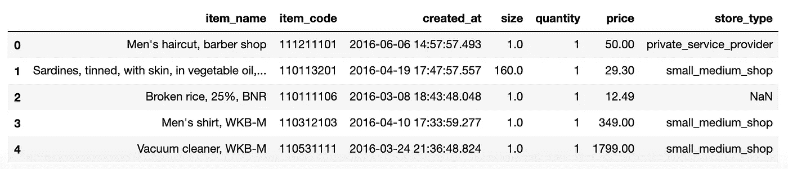
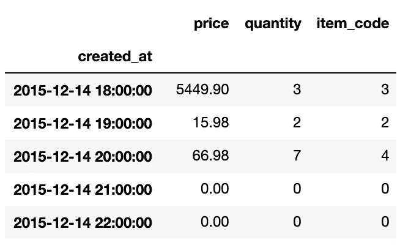
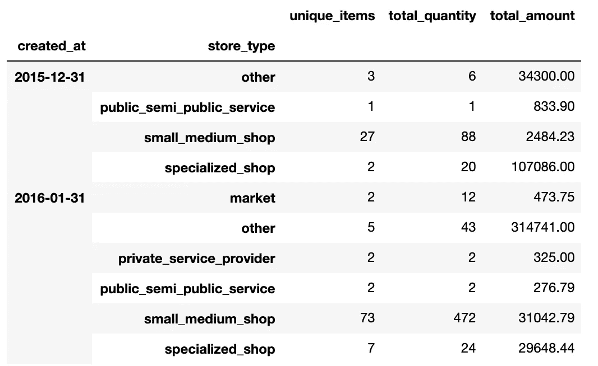

# Python 熊猫里如何按时间间隔分组数据？

> 原文：<https://towardsdatascience.com/how-to-group-data-by-different-time-intervals-using-python-pandas-eb7134f9b9b0?source=collection_archive---------1----------------------->

## 一行程序将时间序列数据组合成不同的时间间隔，例如基于每小时、每周或每月。


在 [Unsplash](https://unsplash.com?utm_source=medium&utm_medium=referral) 上由 [Aron 视觉](https://unsplash.com/@aronvisuals?utm_source=medium&utm_medium=referral)拍摄的照片

如果你曾经处理过时间序列数据分析，你肯定会遇到这些问题

1.  将数据组合成特定的间隔，如基于每天、一周或一个月。
2.  聚合时间间隔内的数据，例如，如果您正在处理价格数据，那么问题就像一小时或一天内添加的总量。
3.  基于时间间隔查找数据集中其他要素的模式。

在本文中，您将了解如何使用两个不同的 Pandas API，即 resample()和 Grouper()，通过一行代码解决这些问题。

众所周知，学习一件东西的最好方法是开始应用它。因此，我将使用由[世界银行公开数据](https://data.worldbank.org/)提供的样本时间序列数据集，并与从 15 个国家收集的众包价格数据相关。有关数据的更多详情，请参考[众包价格数据收集试点](https://datacatalog.worldbank.org/dataset/crowdsourced-price-data-collection-pilot)。在本练习中，我们将使用为阿根廷收集的数据。

> 📚资源: [Google Colab 实现](https://colab.research.google.com/drive/1Wwmz8Z9VH2r5KnoXzeLEtKNzLcAAIp2u?usp=sharing) | [Github 仓库](https://github.com/ankitgoel1602/data-science/tree/master/data-analysis/pandas-timeseries) | [数据集](https://github.com/ankitgoel1602/data-science/blob/master/data-analysis/pandas-timeseries/arg-crowdsourcedpdcpilot02_final_obs_all_clean.csv)📚

## 数据集详细信息

这些数据是由参与世界银行 2015 年调查的不同参与者收集的。调查的基本想法是收集不同国家不同商品和服务的价格。出于演示目的，我们将只使用数据集中的几列——



按作者分类的数据集示例片段。

# 基于不同的时间间隔组合数据。

Pandas 提供了一个名为 [resample()](https://pandas.pydata.org/pandas-docs/stable/reference/api/pandas.DataFrame.resample.html) 的 API，可以用来将数据重采样到不同的区间。让我们来看几个例子，看看我们如何使用它—

## 每小时添加的总量。

假设我们需要知道一个贡献者在一个小时内增加了多少，我们可以简单地使用——

```
# data re-sampled based on an hour
data.resample('H', on='created_at').price.sum()# output
created_at
2015-12-14 18:00:00     5449.90
2015-12-14 19:00:00       15.98
2015-12-14 20:00:00       66.98
2015-12-14 21:00:00        0.00
2015-12-14 22:00:00        0.00
```

这是我们正在做的事情—

1.  首先，我们为日期列(即 created_at)将数据重新采样为一个小时“H”频率。我们可以使用不同的频率，我将在本文中介绍其中几种。查看[熊猫时间频率](https://pandas.pydata.org/pandas-docs/stable/user_guide/timeseries.html#offset-aliases)获得完整的频率列表。甚至可以达到纳秒。
2.  之后，我们从重新采样的数据中选择“价格”。稍后，我们将看到如何在一个命令中聚合多个字段，即总金额、数量和唯一的项目数。
3.  计算所有价格的总和。这将给出该小时内添加的总量。

默认情况下，时间间隔从一个小时的第 0 分钟开始，如 18:00、19:00 等。我们可以改变它，从一个小时的不同分钟开始，使用偏移量属性，比如—

```
# Starting at 15 minutes 10 seconds for each hour
data.resample('H', on='created_at', offset='15Min10s').price.sum()# Output
created_at
2015-12-14 17:15:10     5370.00
2015-12-14 18:15:10       79.90
2015-12-14 19:15:10       64.56
2015-12-14 20:15:10       18.40
2015-12-14 21:15:10        0.00
```

请注意，您需要 Pandas 版本大于 1.10 才能使用上述命令。

## 每周添加的总量。

在本例中，我们将了解如何基于每周对数据进行重新采样。

```
# data re-sampled based on an each week, just change the frequency
data.resample('W', on='created_at').price.sum()# output
created_at
2015-12-20    4.305638e+04
2015-12-27    6.733851e+04
2016-01-03    4.443459e+04
2016-01-10    1.822236e+04
2016-01-17    1.908385e+05
```

默认情况下，一周从周日开始，我们可以将其更改为从不同的日期开始，也就是说，如果我们希望基于从周一开始的一周进行合并，我们可以使用—

```
# data re-sampled based on an each week, week starting Monday
data.resample('W-MON', on='created_at').price.sum()# output
created_at
2015-12-14    5.532860e+03
2015-12-21    3.850762e+04
2015-12-28    6.686329e+04
2016-01-04    5.392410e+04
2016-01-11    1.260869e+04
```

## 每月添加的总量。

这类似于我们在前面的例子中所做的。

```
# data re-sampled based on each month
data.resample('M', on='created_at').price.sum()# Output
created_at
2015-12-31    1.538769e+05
2016-01-31    4.297143e+05
2016-02-29    9.352684e+05
2016-03-31    7.425185e+06
2016-04-30    1.384351e+07
```

此处需要注意的一点是，每个月的输出标签基于该月的最后一天，我们可以使用“MS”频率从该月的第一天开始，即不是 2015-12-31，而是 2015-12-01-

```
# month frequency from start of the month
data.resample('MS', on='created_at').price.sum()created_at
2015-12-01    1.538769e+05
2016-01-01    4.297143e+05
2016-02-01    9.352684e+05
2016-03-01    7.425185e+06
2016-04-01    1.384351e+07
```

## 采样数据的多重聚合。

通常我们需要在不同的列上应用不同的聚合，就像在我们的例子中，我们可能需要找到—

1.  每小时添加的独特项目。
2.  每小时添加的总量。
3.  每小时添加的总量。

我们可以通过对重采样的数据使用 agg()在一行中实现这一点。让我们看看我们如何做到这一点—

```
# aggregating multiple fields for each hour
data.resample('H', on='created_at').agg({'price':'sum', 'quantity':'sum','item_code':'nunique'})
```



基于作者每小时的汇总数据。

# 基于不同的时间间隔对数据进行分组

在上述示例中，我们对数据进行了重新采样，并对其应用了聚合。如果除了时间间隔之外，我们还想按其他字段对数据进行分组，该怎么办？熊猫提供了一个名为 [grouper()](https://pandas.pydata.org/pandas-docs/stable/reference/api/pandas.Grouper.html) 的 API，可以帮助我们做到这一点。

在本节中，我们将了解如何对不同字段的数据进行分组，并在不同的时间间隔内对其进行分析。

## 每月每种店铺类型的新增金额。

假设我们需要根据每月的商店类型来分析数据，我们可以使用—

```
# Grouping data based on month and store type
data.groupby([pd.Grouper(key='created_at', freq='M'), 'store_type']).price.sum().head(15)# Output
created_at  store_type                
2015-12-31  other                          34300.00
            public_semi_public_service       833.90
            small_medium_shop               2484.23
            specialized_shop              107086.00
2016-01-31  market                           473.75
            other                         314741.00
            private_service_provider         325.00
            public_semi_public_service       276.79
            small_medium_shop              31042.79
            specialized_shop               29648.44
2016-02-29  market                          1974.04
            other                         527950.00
            private_service_provider        1620.00
            public_semi_public_service      1028.52
            small_medium_shop             224653.83
```

让我们来理解我是如何做到的—

1.  首先，我们将 Grouper 对象作为 groupby 语句的一部分进行传递，该语句根据月份(即“M”频率)对数据进行分组。这类似于 resample()，所以我们上面讨论的内容在这里也适用。
2.  我们将 store_type 添加到 groupby 中，这样每个月我们都可以看到不同的商店类型。
3.  对于每个组，我们选择价格，计算总和，并选择前 15 行。

## 每月根据 item_name 添加的总金额。

正如我们在上一个示例中所做的那样，我们也可以对 item_name 做类似的事情。

```
# Grouping data based on each month and item_name
data.groupby([pd.Grouper(key='created_at', freq='M'), 'item_name']).price.sum()# Output
created_at  item_name                                   
2015-12-31  Bar soap, solid, SB                                33.17
            Beer, domestic brand, single bottle, WKB           29.79
            Black tea, BL                                      12.00
            Black tea, in bags, WKB                            60.99
            Bread, white, sliced, WKB                          85.45
                                                              ...   
2016-08-31  Wheat flour, not self-rising, BL                  150.38
            White sugar, WKB                                  266.47
            Women's haircut, basic hairdresser               7730.00
            Wrist-watch, men's, CITIZEN Eco-Drive BM6060    52205.00
            Yoghurt, plain, WKB                               150.96
```

## 每月 store_type 的多重聚合。

我们可以像使用 resample()那样在多个字段上应用聚合。这里唯一不同的是，数据也将按 store_type 分组，而且，我们可以对 groupby 对象进行命名聚合(为每个聚合分配一个名称),这不适用于重新采样。

```
# grouping data and named aggregation on item_code, quantity, and price
data.groupby([pd.Grouper(key='created_at', freq='M'), 'store_type']).agg(unique_items=('item_code', 'nunique'),
         total_quantity=('quantity','sum'),
         total_amount=('price','sum'))
```



按作者基于不同字段的汇总数据

# 结论

我希望这篇文章能帮助你节省分析时间序列数据的时间。我建议你查看一下关于[重采样()](https://pandas.pydata.org/pandas-docs/stable/reference/api/pandas.DataFrame.resample.html)和[群组()](https://pandas.pydata.org/pandas-docs/stable/reference/api/pandas.Grouper.html) API 的文档，了解你可以用它们做的其他事情。

> 如果你想了解其他可以帮助你完成数据分析任务的熊猫应用编程接口，请查看文章[熊猫:收起新手数据分析师状态](/pandas-put-away-novice-data-analyst-status-part-1-7e1f0107dae0)，在那里我解释了你可以用熊猫做的不同事情。

如果你在使用熊猫或数据分析时遇到任何问题，请在评论中告诉我，或在 LinkedIn 上 ping 我。我们可以试着一起解决。目前就这些了，下篇文章再见。

干杯！！！注意安全！！！继续学习！！！