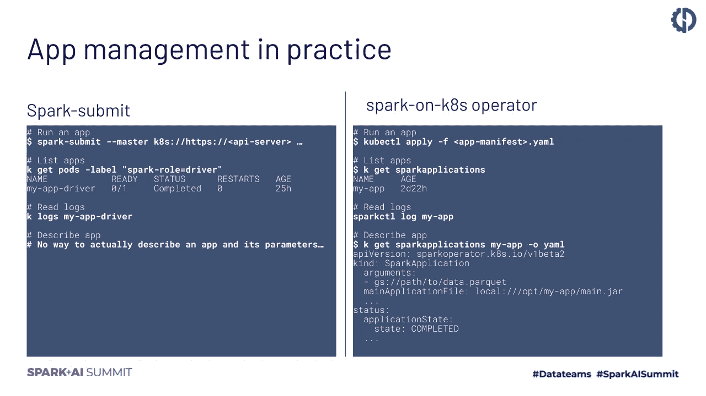
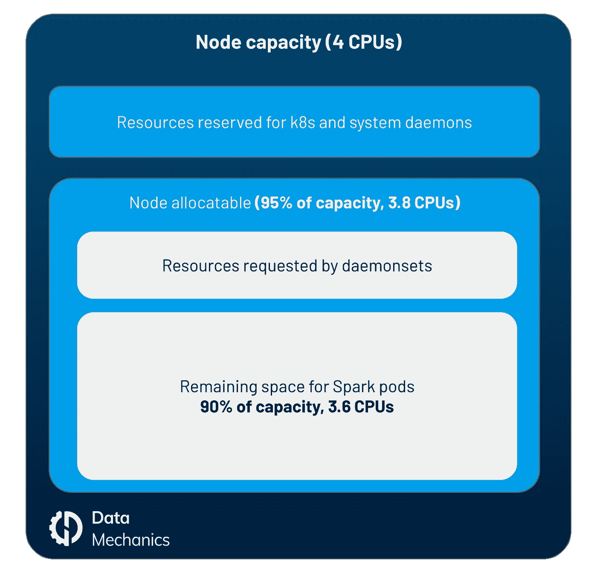
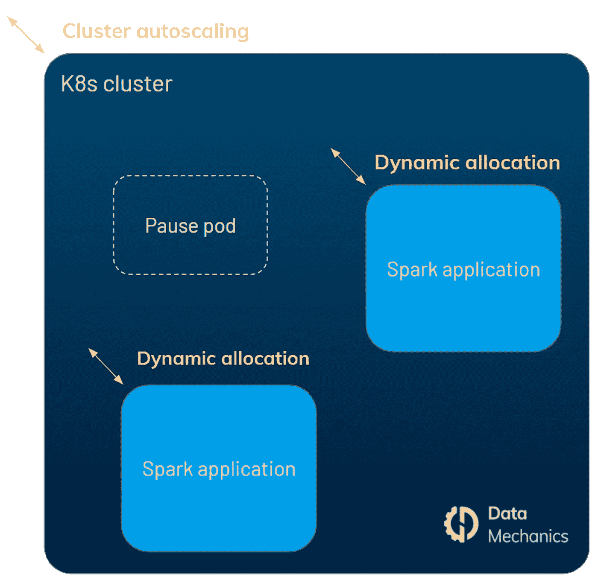
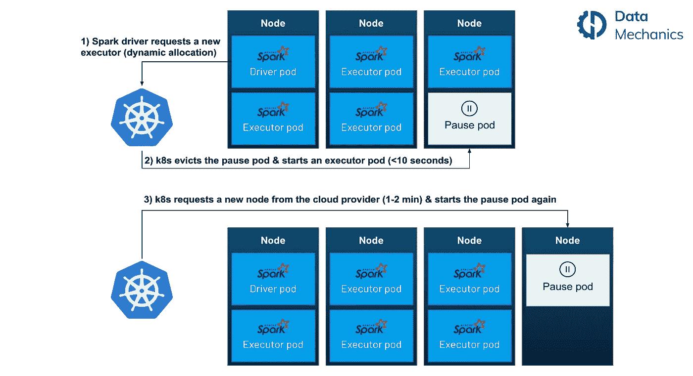
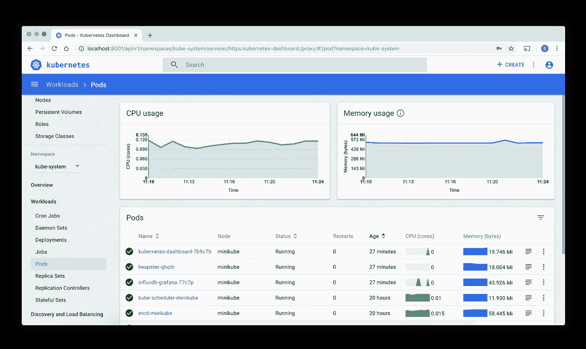
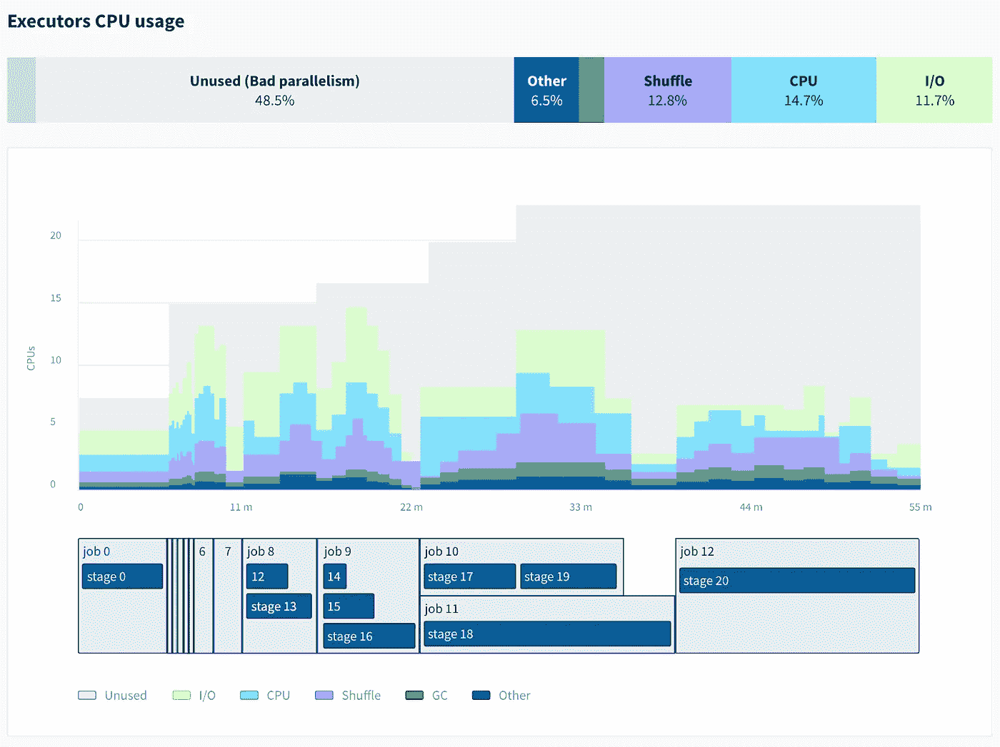
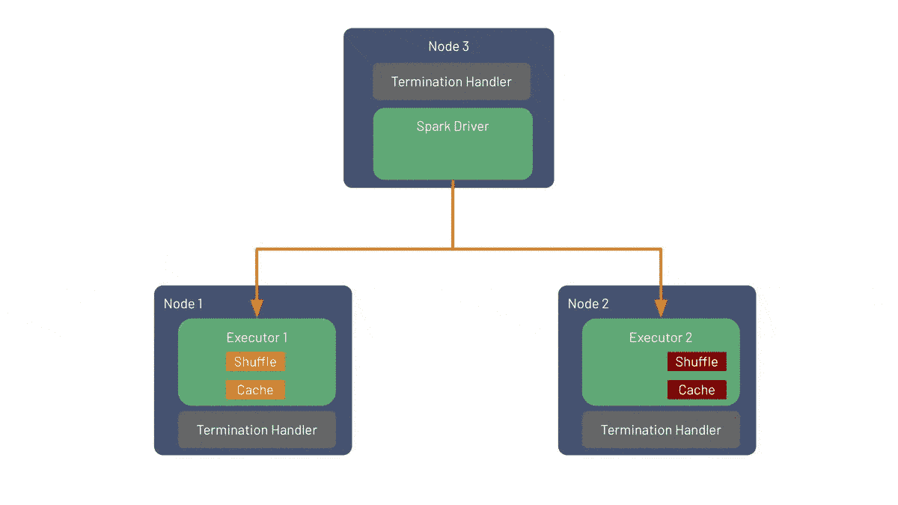

# 如何指导:在 Kubernetes 上建立、管理和监控 Spark

> 原文：<https://towardsdatascience.com/how-to-guide-set-up-manage-monitor-spark-on-kubernetes-with-code-examples-c5364ad3aba2?source=collection_archive---------10----------------------->

## 带有代码示例

在 2020 Spark + AI 峰会上，我们提出了一个关于在 Kubernetes (K8s) 上运行 Apache Spark 的[最佳实践和陷阱的会议。](https://databricks.com/session_na20/running-apache-spark-on-kubernetes-best-practices-and-pitfalls)

在本帖中，我们将对该演示进行扩展，并与您讨论:

1.  什么是 Kubernetes？
2.  为什么要在 Kubernetes 上运行 Spark？
3.  Kubernetes 上的 Spark 入门
4.  优化性能和成本
5.  在 Kubernetes 上监控您的 Spark 应用
6.  Kubernetes 上的 Spark 现已上市(**更新:2021 年 3 月**

如果你已经熟悉 k8s 以及为什么 Kubernetes 上的 [Spark](https://www.datamechanics.co/apache-spark) 可能适合你，请随意跳过前几个部分，直接进入帖子的核心部分！

# 什么是 Kubernetes (k8s)？

[Kubernetes](https://kubernetes.io/) (也称为 Kube 或 k8s)是一个开源的容器编排系统，最初由谷歌开发，[于 2014 年开源](https://www.theregister.com/2020/07/13/ibm_kubernetes_experience_job_ad/)，由云计算原生计算基金会维护。Kubernetes 用于自动化容器化应用的部署、扩展和管理——最常见的是 Docker 容器。

它提供了许多对稳定性、安全性、性能和可扩展性至关重要的功能，例如:

1.  水平可扩展性
2.  自动化推出和回滚
3.  负载平衡
4.  机密和配置管理
5.  […还有更多](https://luminousmen.com/post/kubernetes-101)

Kubernetes 已经成为传统软件开发领域基础设施管理的标准。但是 Kubernetes 在大数据领域并不那么受欢迎，因为大数据领域经常被像 [Hadoop YARN](https://hadoop.apache.org/docs/current/hadoop-yarn/hadoop-yarn-site/YARN.html) 这样的老技术所困扰。直到 Spark-on-Kubernetes 加入游戏！

# 为什么要在 Kubernetes 上打火？

当 Apache Spark 2.3 中增加了对 Kubernetes 上原生运行 Spark 的支持时，许多公司决定改用它。这种流行的主要原因包括:

*   本地集装箱化和码头支持。
*   能够在彼此完全隔离的情况下运行 Spark 应用程序(例如，在不同的 Spark 版本上)，同时享受共享基础架构的成本效益。
*   将您的整个技术基础设施统一在一个与云无关的工具下(如果您已经将 Kubernetes 用于您的非 Spark 工作负载)。

最重要的是，与 YARN 相比，在 Kubernetes 上运行没有设置损失(如[基准测试](https://www.datamechanics.co/blog-post/apache-spark-performance-benchmarks-show-kubernetes-has-caught-up-with-yarn)所示)，Spark 3.0 为 Spark-on-Kubernetes 带来了许多额外的改进，如支持动态分配。自[Spark 3.1(2021 年 3 月)以来，Kubernetes 上的 Spark 已被正式宣布为正式上市](https://datamechanics.co/blog-post/apache-spark-3-1-release-spark-on-kubernetes-is-now-ga)和生产就绪！

阅读我们之前关于在 Kubernetes 上运行 Spark 的利弊的帖子，了解关于这个主题的更多细节以及与主要替代方案的比较。

# Kubernetes 上的 Spark 入门

## 架构:当你提交一个 Spark 应用到 Kubernetes 时会发生什么

您通过直接与 Kubernetes(确切地说是主节点上的 Kubernetes API 服务器)对话来提交 Spark 应用程序，然后 Kubernetes API 服务器将为 Spark 驱动程序安排一个 pod(简单地说，一个容器)。一旦 Spark 驱动程序启动，它将直接与 Kubernetes 通信来请求 Spark 执行器，这也将在 pod 上进行调度(每个执行器一个 pod)。如果启用了动态分配，Spark 执行器的数量会根据负载动态变化，否则它是一个静态数字。

Kubernetes 参考架构上的 Apache Spark。图片作者。

# 如何提交申请:spark-submit 与 spark-operator

这是你需要尽早做的一个高层次的选择。向 Kubernetes 提交 Spark 应用程序有两种方式:

*   使用 spark 附带的 spark-submit 方法。Spark 应用程序的进一步操作将需要直接与 Kubernetes pod 对象进行交互
*   使用[火花操作器](https://github.com/GoogleCloudPlatform/spark-on-k8s-operator)。这个项目是由 GCP 开发的(并且是开源的)，但是它在任何地方都可以工作。它需要在集群上运行一个(单个)pod，但会将 Spark 应用程序转变为[自定义 Kubernetes 资源](https://kubernetes.io/docs/concepts/extend-kubernetes/api-extension/custom-resources/)，可以像其他 Kubernetes 对象一样对其进行定义、配置和描述。它增加了其他细节，比如支持直接从 Spark 应用程序配置中挂载配置图和卷。

Spark 提交与 Kubernetes 运营商应用管理上的 Spark。图片作者。

我们建议使用 spark-operator，因为它更容易使用。

# 设置清单

根据您当前的基础架构和云提供商(或内部设置)，以下步骤会有所不同。但是在高层次上，这里是你完全自己开始使用 Kubernetes 上的 Spark 所需要设置的主要内容:

*   创建一个 Kubernetes 集群
*   根据您的工作负载要求定义您想要的节点池
*   根据您的网络需求加强安全性(我们建议将 Kubernetes 集群设为私有)
*   为您的 Spark docker 映像创建 docker 注册表，并开始构建您自己的映像([更新:截至 2021 年 4 月，我们已经公开发布了我们针对 Spark](https://www.datamechanics.co/blog-post/optimized-spark-docker-images-now-available) 优化的 docker 映像。
*   安装[火花操作器](https://github.com/GoogleCloudPlatform/spark-on-k8s-operator)
*   安装 Kubernetes [集群自动缩放器](https://github.com/kubernetes/autoscaler/tree/master/cluster-autoscaler)
*   将 Spark 驱动程序日志和 Spark 事件日志的集合设置到永久存储器中
*   安装 Spark 历史服务器([掌舵图](https://github.com/helm/charts/tree/master/stable/spark-history-server)，或者使用我们的[开源监控工具 Delight](https://www.datamechanics.co/blog-post/delight-the-new-improved-spark-ui-spark-history-server-is-now-ga) 。
*   设置节点和火花指标(CPU、内存、I/O、磁盘)的收集

如您所见，如果您在内部完成这项工作，这需要做大量的工作，并且需要维护大量移动的开源项目。

这就是我们构建托管 Spark 平台([数据机制](https://www.datamechanics.co/blog-post/video-tour-of-data-mechanics-the-serverless-spark-platform))的原因，目的是让 Kubernetes 上的 Spark 尽可能地简单易用。我们的平台负责这一设置，并提供额外的集成(如 Jupyter、Airflow、IDEs)以及强大的优化，以使您的 Spark 应用程序更快，并降低您的云成本。

# 优化性能和成本

## 尽可能使用固态硬盘或大磁盘，以获得 Spark-on-Kubernetes 的最佳洗牌性能

洗牌是 Spark 中经常出现的昂贵的全对全数据交换步骤。它们会占据你整个 Spark 工作的很大一部分，因此优化 Spark shuffle 性能很重要。我们已经在我们的 [YARN vs Kubernetes 性能指标评测](https://www.datamechanics.co/blog-post/apache-spark-performance-benchmarks-show-kubernetes-has-caught-up-with-yarn)文章(阅读“如何在 Kubernetes 上使用 Spark 优化 shuffle”)中讨论了这个主题，所以我们在这里只给出我们的高级技巧:

*   尽可能使用本地 SSD 磁盘
*   当它们不可用时，增加磁盘的大小以提高其带宽

## 优化您的火花舱尺寸，以避免浪费容量

我们来看一个例子。假设:

*   您的 Kubernetes 节点有 4 个 CPU
*   您想在每个 Kubernetes 节点上安装一个 Spark executor pod

然后，您将提交配置为***Spark . executor . cores = 4***的 Spark 应用程序，对吗？不对。你的 Spark app 会卡死，因为 executors 装不下你的节点。您应该考虑下图中描述的开销。

来自 Kubernetes 和 Daemonsets 的 Apache Spark 节点的开销。图片作者。

通常，可分配的节点表示 95%的节点容量。为[daemonset](https://kubernetes.io/docs/concepts/workloads/controllers/daemonset/)保留的资源取决于您的设置，但是请注意，daemonset 在日志和指标收集、网络和安全性方面很受欢迎。让我们假设这为您的 Spark 执行器留下了 90%的可用节点容量，即 3.6 个 CPU。

这意味着您可以使用配置***Spark . executor . cores = 3****提交 Spark 应用程序。*但是这将仅保留 3 个 CPU，并且会浪费一些容量。

因此，在这种情况下，我们建议采用以下配置:

**spark . executor . cores = 4
spark . kubernetes . executor . request . cores = 3600m**

这意味着您的 Spark 执行器将请求正好 3.6 个可用的 CPU，Spark 将在这个执行器上并行调度多达 4 个任务。

> 高级提示:
> 将 **spark.executor.cores** 设置为比**spark . kubernetes . executor . request . cores**大 2 倍(通常为**2 倍**或 3 倍)称为超额预订，可以显著提升 CPU 使用率较低的工作负载的性能。

在这个例子中，我们已经向您展示了如何调整 Spark executor pods 的大小，使它们紧密地适合您的节点(每个节点一个 pod)。公司还通常选择使用更大的节点，并在每个节点上安装多个 pod。在这种情况下，您仍然应该关注 Spark CPU 和内存请求，以确保节点上执行器的装箱是高效的。这是由[数据机制](https://www.datamechanics.co/)平台提供的动态优化之一。

## 支持应用级动态分配和集群级自动扩展

如果您在云中运行，并且希望让您的数据基础架构具有反应能力和成本效益，这是绝对必要的。有两个级别动态缩放:

*   App 级动态分配。这是每个 Spark 应用程序在运行时请求 Spark 执行器(当有未决任务时)和删除它们(当它们空闲时)的能力。从 Spark 3.0 开始，通过设置以下配置，动态分配在 Kubernetes 上可用:
*   ‍**spark . dynamic allocation . enabled = true
    spark . dynamic allocation . shuffle tracking . enabled = true**
*   集群级自动伸缩。这意味着当 Kubernetes 集群需要更多的容量来调度 pods 时，它可以向云提供商请求更多的节点，反之亦然，当节点变得不可用时，就将其删除。

针对 Apache Spark 的 Kubernetes 集群动态分配和自动缩放。图片作者。

这两项设置将使您的整个数据基础设施在 Spark 应用能够从新资源中受益时动态扩展，并在这些资源未被使用时缩减规模。实际上，当集群中有容量时，启动 Spark pod 只需要几秒钟。如果必须首先从云提供商处获取新节点，您通常需要等待 1-2 分钟(取决于云提供商、地区和实例类型)。

如果您想保证您的应用程序总是在几秒钟内启动，您可以通过在 Kubernetes 集群上安排所谓的“暂停单元”来增加集群的规模。这些是低优先级的吊舱，基本上什么也不做。当 Spark 应用程序需要空间来运行时，Kubernetes 将删除这些优先级较低的 pods，然后重新安排它们(导致集群在后台扩大规模)。

应用级动态分配和集群级自动扩展的说明。图片作者。

## 使用点节点降低云成本

Spot(也称为 preemptible)节点的成本通常比随需应变的机器低 75%左右，换来的是较低的可用性(当您请求 Spot 节点时，不保证您会得到它们)和不可预测的中断(这些节点可能随时消失)。

Spark 工作负载在 spot 节点上工作得非常好，只要您确保只有 Spark 执行器被放置在 spot 上，而 Spark 驱动程序在按需机器上运行。事实上，Spark 可以从失去执行器(一个新的执行器将被放置在一个按需节点上，并重新运行丢失的计算)中恢复，但不能从失去驱动程序中恢复。

要在 Kubernetes 中启用 spot 节点，您应该创建多个节点池(一些是按需节点，一些是 spot 节点)，然后使用节点选择器和节点关联将驱动程序放在按需节点上，执行器最好放在 spot 节点上。

# 在 Kubernetes 上监控您的 Spark 应用

## 使用 Kubernetes 仪表板监控 pod 资源使用情况

Kubernetes 仪表板是一个开源的基于 web 的通用监控 UI。它将为您提供集群上运行的应用的可见性，以及对其性能进行故障排除的基本指标，如内存使用、CPU 利用率、I/O、磁盘等。

Kubernetes 仪表板上的 Pod 资源使用监控。来源: [Kubernetes.io](https://kubernetes.io/docs/tasks/access-application-cluster/web-ui-dashboard/)

这个项目的主要问题是，将这些指标与实际的 Spark 工作/阶段协调起来很麻烦，而且当 Spark 应用程序结束时，这些指标中的大部分都会丢失。保持这些指标有点挑战性，但也是可能的，例如使用[普罗米修斯](https://www.slideshare.net/databricks/native-support-of-prometheus-monitoring-in-apache-spark-30)(从 Spark 3.0 开始内置 servlet)或 [InfluxDB](https://github.com/cerndb/spark-dashboard) 。

## 如何访问 Spark 用户界面

Spark UI 是 Spark 内置的重要监控工具。无论应用程序是否是实时的，访问它的方式都是不同的:

*   当应用程序运行时，Spark UI 由 Spark 驱动程序直接在端口 4040 上提供服务。要访问它，您应该通过运行以下命令[port-forward](https://kubernetesbyexample.com/pf/):
    $ ku bectl port-forward<driver-pod-name>4040:4040
    然后您可以在 [http://localhost:4040/](http://localhost:4040/) 打开 Spark UI
*   当应用程序完成时，您可以通过运行 Spark 历史服务器并将其配置为从持久存储中读取 Spark 事件日志来重放 Spark UI。你应该首先使用配置***spark . event log . dir***将这些事件日志写到你选择的存储后端。然后，您应该按照这个[文档](https://github.com/helm/charts/tree/master/stable/spark-history-server)从一个 Helm 图表安装 Spark 历史服务器，并将其指向您的存储后端。

Spark UI 的主要问题是很难找到您正在寻找的信息，并且它缺乏以前工具的系统指标(CPU、内存、IO 使用)。

数据力学用户界面概述。图片作者。

**更新**:

*   截至 2020 年 11 月，[我们已经发布了一个免费的、托管的、跨平台的 Spark 历史服务器](https://www.datamechanics.co/blog-post/setting-up-managing-monitoring-spark-on-kubernetes)。这比自己托管 Spark 历史服务器更简单！
*   截至 2021 年 4 月，这个免费的监控工具 [Delight](https://www.datamechanics.co/delight) 还显示了你的 Spark 作业&阶段之上的 CPU &内存指标。查看我们的[博客文章](https://www.datamechanics.co/blog-post/delight-the-new-improved-spark-ui-spark-history-server-is-now-ga) & [github 页面](https://github.com/datamechanics/delight)了解更多信息。

# Kubernetes 上的 Spark 现已正式发布(Spark 3.1 更新)

自 2021 年 3 月和 Apache Spark 3.1 发布以来，Kubernetes 上的 Spark 已被正式宣布为生产就绪和正式可用。

最令人兴奋的功能是 Spark 能够预测执行程序点杀(通过收听云提供商提前发出的终止通知),并将 shuffle 文件和缓存数据从即将死亡的执行程序迁移到将存活的执行程序。该功能被称为[【SPARK-20624】更好地处理节点关闭](https://issues.apache.org/jira/browse/SPARK-20624)。并且在下面的 GIF 中有图解。

优雅的节点退役 Spark 3.1 的一个新特性，使 Apache Spark 对定点清除更加健壮。目前仅在 Kubernetes &独立模式下可用。

第二个主要改进是能够在 Kubernetes(一个网络支持的存储，可以由所有 Spark 应用程序共享，并预先填充数据)中装载共享的 NFS 卷，以及动态提供 PersistentVolumeClaims(而不是静态)的能力，如果您试图在启用动态分配的情况下运行 Spark 应用程序，这尤其有用。

查看我们关于 Spark 3.1 发布的[博客文章](https://datamechanics.co/blog-post/apache-spark-3-1-release-spark-on-kubernetes-is-now-ga)以深入了解这些改进，并对 Spark 3.1 的新特性进行概述。

# 结论

我们希望这篇文章能让你对 Spark-on-Kubernetes 以及如何成功使用它有所了解。

如果您想以最简单的方式开始使用 Spark-on-Kubernetes，[与我们预约时间](https://calendly.com/datamechanics/demo)，我们的数据力学团队将非常乐意帮助您交付您的用例。如果你想更好地了解我们的平台与 Spark-on-Kubernetes 开源平台相比如何，[查看这篇文章](https://www.datamechanics.co/blog-post/spark-on-kubernetes-made-easy-how-data-mechanics-improves-on-spark-on-k8s-open-source)。

这篇文章的最初版本发表在[数据力学博客](https://www.datamechanics.co/blog-post/setting-up-managing-monitoring-spark-on-kubernetes)上