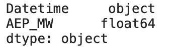

# 机器学习中如何处理循环数据

> 原文：<https://towardsdatascience.com/how-to-handle-cyclical-data-in-machine-learning-3e0336f7f97c?source=collection_archive---------42----------------------->

## 不要一次性编码日期信息。改为这样做。

今天，我们将探讨数据科学中一个常见但鲜为人知的话题——周期性数据。它是许多数据集的一部分，很容易被发现——日期信息是最常见的形式。有很多方法可以将日期信息编码成机器学习友好的东西，但有些方法比其他方法更好。


照片由[奥斯汀·尼尔](https://unsplash.com/@arstyy?utm_source=unsplash&utm_medium=referral&utm_content=creditCopyText)在 [Unsplash](https://unsplash.com/s/photos/circle?utm_source=unsplash&utm_medium=referral&utm_content=creditCopyText) 拍摄

以下是我被教导如何处理日期值的方法— *将它们视为分类*。不同的月/日/小时可以被视为单独的类别，因此为了对它们进行编码，可以创建一组虚拟变量。例如，在处理月度数据时，我们可以创建 11 个虚拟列(one-hot)，它们采用`Is_January`、`Is_February`等形式，其中一行中只有一列可以有非零值。

**那就不对了。**

当然，你可以这样做，机器学习模型不会抱怨，但这并不意味着这是正确的方法。时间数据是循环的，一小时有 60 分钟，一天有 24 小时。当一个小时结束时，下一个小时开始从零开始计时。

它使一个小时的第 1 分钟和第 2 分钟紧密相连，但也使第 59 分钟和第 1 分钟相连，因为只有一分钟的差异，**而不是模型假设的** 59。

这就是我们想要的行为。下一节将使前面的观点更加清楚。

# 数据集介绍和加载

我们需要一个带有日期或其他循环属性的数据集——这是显而易见的。快速的 Kaggle 搜索产生了这个[小时能耗](https://www.kaggle.com/robikscube/hourly-energy-consumption)数据集，我们将使用其中的第一个`AEP_hourly.csv`文件。它有几兆的大小，所以把它下载到你的机器上。

一旦加载了`Pandas`，前几行看起来是这样的:

```
import pandas as pd

df = pd.read_csv('data/AEP_hourly.csv.zip')
df.head()
```


很好——我们有一些日期信息，但它是实际的日期还是字符串？

```
df.dtypes
```



果然不出所料，所以我们来做个换算。我们还将从日期中提取小时信息，因为这是我们要处理的内容。

```
df['Datetime'] = pd.to_datetime(df['Datetime'])
df['Hour'] = df['Datetime'].dt.hour

df.head()
```


现在情况好多了。让我们分离出上周的数据(最后 168 条记录),来形象化地说明为什么一次性编码不是一件好事情。

```
last_week = df.iloc[-168:]
import matplotlib.pyplot as plt

plt.title('Individual hours', size=20)
plt.plot(range(len(last_week)), last_week['Hour'])
```


预期行为。这是一个重复七次(7 天)的循环，在第 23 个小时之后每天都有一个粗略的切断。我认为您可以很容易地推理出为什么这种类型的行为对于周期性数据不是最佳的。

但是我们能做些什么呢？幸运的是，很多。

# 编码循环数据

在这种情况下，一键编码不是明智之举。我们最终会得到 23 个附加属性(n-1)，这很糟糕，原因有二:

1.  维度的巨大跳跃——从 2 到 24
2.  属性之间没有连通性-23 小时不知道它后面是 0 小时

那么，我们能做什么呢？

**使用正弦和余弦变换。**以下是我们将使用的公式:


或者，在 Python 中:

```
import numpy as np last_week['Sin_Hour'] = np.sin(2 * np.pi * last_week['Hour'] / max(last_week['Hour'])) last_week['Cos_Hour'] = np.cos(2 * np.pi * last_week['Hour'] / max(last_week['Hour']))
```

厉害！以下是上周的数据:


这些转换使我们能够以更有意义和简洁的方式来表示时间数据。看一下最后两行。正弦值几乎相同，但仍有一点不同。这同样适用于接下来的每一个小时，因为它现在遵循一个波形。

**太好了，但是为什么我们需要这两种功能呢？**

在我给你答案之前，让我们先用图形来研究一下这些函数。


一次看一张图。有一个问题。这些值重复。看看正弦函数，在 x 轴的 24 到 48 之间。如果你要画一条直线，它将与同一天的两个点相交。这不是我们想要的行为。

为了进一步证明这一点，如果我们绘制正弦和余弦柱的散点图，会发生以下情况:


没错；我们得到了一个完美的循环。只有用周期来表示周期性数据才有意义，你不同意吗？

你应该知道的就这些。让我们在下一部分总结一下。

# 在你走之前

这是一篇相对简短且切中要点的文章，但是我仍然希望我能够让您相信一键编码并不是所有问题的解决方案。当然，当分类属性不以任何方式“连接”时，它就像一种魅力，但这是任何周期性数据的首选方法。

有人可能会说我们引入了两个新的维度，这并不理想。我同意，但是 2 比 23 好，23 是一次性编码方法的结果。

感谢阅读。

[**加入我的私人邮件列表，获取更多有用的见解。**](https://mailchi.mp/46a3d2989d9b/bdssubscribe)

*喜欢这篇文章吗？成为* [*中等会员*](https://medium.com/@radecicdario/membership) *继续无限制学习。如果你使用下面的链接，我会收到你的一部分会员费，不需要你额外付费。*

[](https://medium.com/@radecicdario/membership) [## 通过我的推荐链接加入 Medium-Dario rade ci

### 作为一个媒体会员，你的会员费的一部分会给你阅读的作家，你可以完全接触到每一个故事…

medium.com](https://medium.com/@radecicdario/membership) 

*原载于 2020 年 10 月 12 日*[*【https://betterdatascience.com】*](https://betterdatascience.com/cyclical-data-machine-learning/)*。*