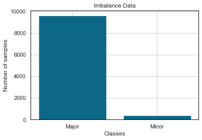
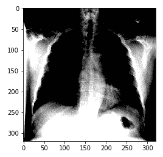

# 如何处理 ML 中的不平衡数据和小训练集

> 原文：<https://towardsdatascience.com/how-to-handle-imbalance-data-and-small-training-sets-in-ml-989f8053531d?source=collection_archive---------6----------------------->

不平衡数据是指每个类的观察值数量分布不均，通常有一个主要类占数据集的比例较大，而次要类没有足够的示例。



按作者分类的图表

小的训练集也苦于没有足够的例子。这两个问题在现实应用中非常普遍，但幸运的是有几种方法可以克服这个问题。本文将通过许多不同的技术和视角来应对不平衡数据。特别是，您将了解到:

*   采样技术(上采样和下采样)
*   加权损失
*   数据扩充技术
*   迁移学习

# 不平衡的数据如何影响你的模型？

不平衡数据是数据科学中常见的问题。从图像分类到欺诈检测或医疗诊断，数据科学家面临不平衡的数据集。不平衡的数据集会降低模型对少数类的敏感度。让我们用简单的数学来解释一下:

想象一下，你有 10000 张肺部 x 光图像，其中只有 100 张被诊断为肺炎，这是一种传染病，会使一个或两个肺部的气囊发炎，并使它们充满液体。如果你训练一个模型，预测每个例子都是健康的，你会得到 99%的准确率。哇，多棒啊？**错了**，你刚刚用你的模型杀了很多人。



作者图片

通常，我们通过准确性来衡量模型的表现，但是不平衡的数据会误导我们，就像上面的例子一样。这篇文章的重点是如何处理这些情况，我不会详细介绍如何衡量您的模型，但请记住，要将衡量指标从准确性改为**精确度、召回、F1** 分数。但是即使他们实际上也没有那么伟大。在处理不平衡数据时，我建议选择: **AUC 曲线、** **平均精度**。这是一个令人惊叹的 github 知识库，它通过谈论一个特定的不平衡数据集示例来深入研究这些指标的细节:[信用卡欺诈](https://fraud-detection-handbook.github.io/fraud-detection-handbook/Chapter_4_PerformanceMetrics/Introduction.html)。

比方说，我们有一个不平衡的数据集，我们无法访问更多的数据。所以我们应该创建自己的数据。下一章将在高抽象层次上介绍这些技术，我还添加了一些用 Python 实现这些技术的参考资料。

# 取样技术

您可以通过重采样来平衡数据。以下是两种不同的重采样技术:

*   向上采样(增加你的少数类)
*   向下采样(减少多数类)

对于这两者，我们将使用 Sklearn 重采样函数。让我们导入库并将我们的数据定义为`df`:

```
# Importing the libraries
import numpy as np
import pandas as pd
from sklearn.utils import resample# Importing the dataset
# Read dataset
df= pd.read_csv('data.csv')
```

在本例中，我们有一个二元分类问题，其中多数类表示为 1，少数类表示为 0。让我们把它们分开:

```
# Separate majority and minority classes
df_majority = df[df.iloc[:,4608]==1]
df_minority = df[df.iloc[:,4608]==0]
```

我们可以对多数类进行下采样，对少数类进行上采样，或者两者兼而有之。你应该试一试，看看哪一款最适合你。您可以调整的另一个超参数是`n_samples`，它是您重新采样的样本数。

```
# Separate majority and minority classes
df_majority = df[df.iloc[:,4608]==1]
df_minority = df[df.iloc[:,4608]==0]

# Downsample majority class
df_majority_downsampled = resample(df_majority, 
                                 replace=False,    
                                 n_samples=1000)#Upsample minority class
df_minority_upsampled = resample(df_minority, 
                                 replace=True,     
                                 n_samples=1000)# Combine minority class with downsampled majority class
df_up_down_sampled = pd.concat([df_majority_downsampled, df_minority_upsampled])
```

最后显示新的班级人数:

```
df_downsampled.prediction.value_counts()
```

恭喜你，你给权力带来了平衡。🎉

**编辑:我最近被问到的一个面试问题:** *你如何确保你的上采样&下采样数据来自良好的分布/你如何衡量这些方法的性能？*

衡量这些方法性能的一个简单方法是获取用这些额外数据训练的新模型的测试结果。大多数情况下，进行上采样时，您可能会先看到性能有所提高，然后趋于平稳，甚至有所下降。我会选择数量最少、性能最高的上采样数据。

但是有时候重采样本身是不够的。本文继续介绍更高级的技术。

# 加权损失

避免阶级失衡的另一个方法是用不同的方式来衡量损失。要选择权重，首先需要计算类别频率。

```
*# Count up the number of instances of each class (drop non-class columns from the counts)*
class_counts = df_classes.sum()#print the class frequencies **for** column **in** class_counts.keys():
    print(f"The class **{**column**}** has **{**df_classes[column].sum()**}** samples")
```

通过更改损失函数中的权重，数据科学家可以平衡每个类别的贡献。一种方法是将每个类中的每个例子乘以一个特定于类的权重因子，这样每个类的总体贡献是相同的。

感谢 Sklearn，在大多数 ML 算法中有一个内置的参数 class_weight，它可以帮助你平衡每个类的贡献。例如，在 Sklearn 的 [RandomForestClassifier](https://scikit-learn.org/stable/modules/generated/sklearn.ensemble.RandomForestClassifier.html) 中，您可以选择 balanced、balanced_subsample，或者您可以手动给每个类一个字典的权重。

```
#Fitting RandomForestClassifier
from sklearn.ensemble import RandomForestClassifiermodel = RandomForestClassifier(n_estimators=1000, class_weight={0:0.10, 1:0.90})
```

Amazing🥳，现在你学会了一个非常普通的技术，你可以用每一种最大似然算法应用几乎每一种数据。让我们深入了解更先进的技术。

# 数据扩充

从现在开始，我将要提到的技术主要适用于计算机视觉和图像。使用图像时，有多种方法可以生成数据。

众所周知，数据扩充是一种非常强大的技术，用于在现有图像中人工创建变化，以扩展现有图像数据集。这从代表可能图像的综合集合的现有图像数据集中创建新的和不同的图像。以下是增加数据集的几种方法。

*   轻弹
*   一款云视频会议软件
*   轮流
*   剪羊毛
*   种植
*   最后用生成性对抗网络生成新图像。

注意:有时候使用这些技术对你的模型有害无益。让我们假设相同的肺部 X 射线数据集情况，其中我们有许多不同的 X 射线。如果你翻转图片，你会在右边看到一颗心，它可以被看作是一个 cist。你又杀了人=(所以要小心使用这些增强技术。

[你可以在这里了解更多信息](/data-augmentation-techniques-in-python-f216ef5eed69)

# 迁移学习

如果您没有足够的数据来概括您的模型，您可以使用预先训练的模型，并针对您自己的任务调整它们。这被称为迁移学习，在计算机视觉领域非常普遍。自从培训以来，庞大的模型需要花费如此多的时间和资源，人们正在获得像 DenseNet 这样的预培训模型并使用它们。方法如下:

*   找到符合你要求的型号
*   重用模型。这可能涉及使用模型的全部或部分或神经网络的第一层。由于要素的复杂性随着层数的增加而增加，因此第一层总是具有更多可以成功使用的通用要素。
*   微调:通过深入，神经网络在任务上变得专业化，所以你可能想要为你自己的任务调整最后几层，这被称为微调。

[你可以从这里了解更多信息](https://machinelearningmastery.com/transfer-learning-for-deep-learning/)

# 摘要

我们学习了 4 种不同的技术，您可以将其应用于不平衡的数据/小型训练集。现在，您知道如何通过以下方式提高模型的性能:

*   使用取样技术
*   改变损失函数的类权重
*   使用数据增强技术
*   利用迁移学习

其中最后两个更专门针对计算机视觉。我希望这篇文章能帮助你理解如何用不同的技术克服不平衡数据问题。祝贺你完成这篇文章，感谢你一直以来的阅读。

# 参考资料:

*   [https://machine learning mastery . com/resample-interpolate-time-series-data-python/](https://machinelearningmastery.com/resample-interpolate-time-series-data-python/)
*   [https://towards data science . com/data-augmentation-techniques-in-python-f 216 ef 5 eed 69](/data-augmentation-techniques-in-python-f216ef5eed69)
*   [https://machine learning mastery . com/transfer-learning-for-deep-learning/](https://machinelearningmastery.com/transfer-learning-for-deep-learning/)
*   [https://machine learning mastery . com/tactics-to-combat-unbalanced-classes-in-your-machine-learning-dataset/](https://machinelearningmastery.com/tactics-to-combat-imbalanced-classes-in-your-machine-learning-dataset/)