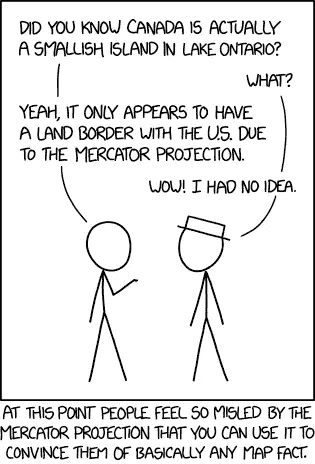
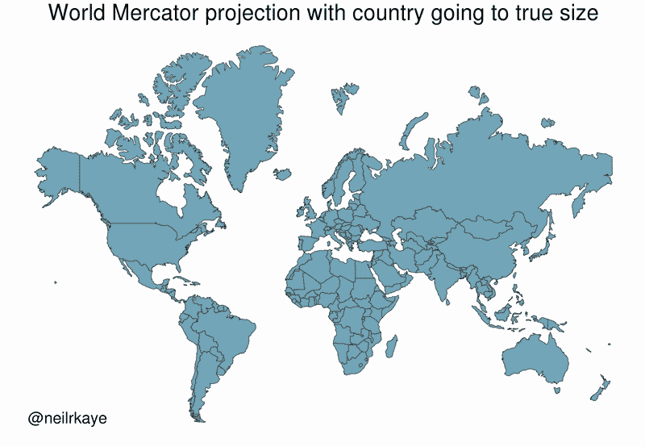
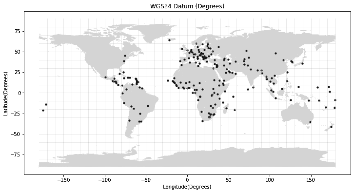
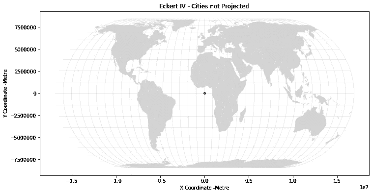
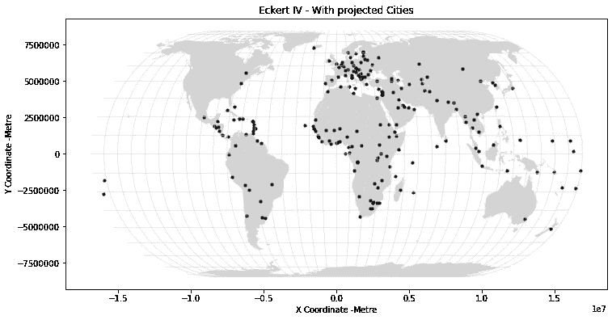
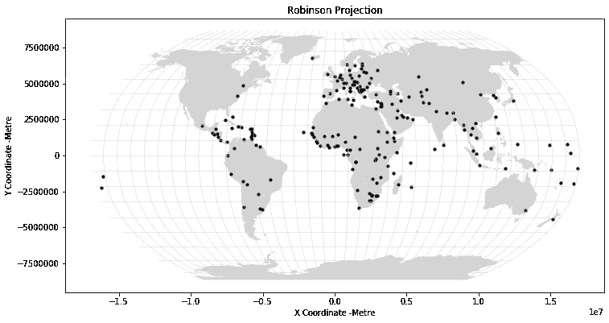
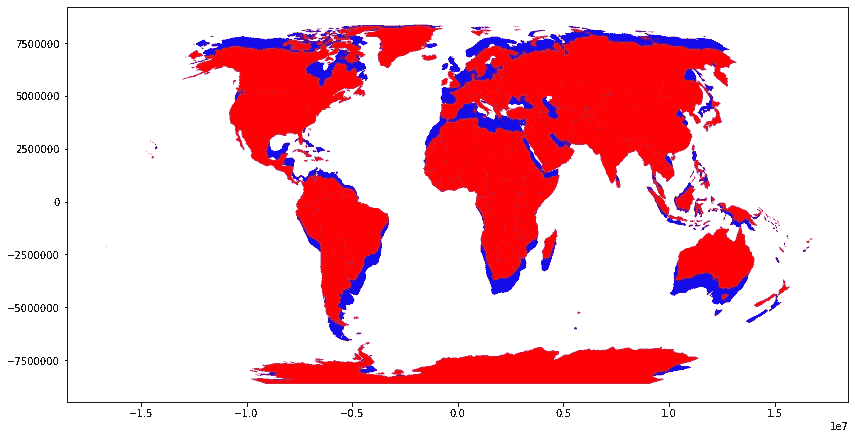

# 如何在 Python 中正确处理地图投影

> 原文：<https://towardsdatascience.com/how-to-handle-map-projections-properly-in-python-bcbff78895c4?source=collection_archive---------16----------------------->

## Python 中概念和代码的演练


西蒙·米加吉在 [Unsplash](https://unsplash.com?utm_source=medium&utm_medium=referral) 上的照片

如果您曾经尝试叠加地理空间数据，结果发现它们没有正确对齐，那么您很可能遇到了令人烦恼的坐标参考系统问题。在本教程中，我们首先阐明坐标参考系统(CRS)的概念和术语，然后介绍如何使用地理空间数据在 Python 中处理 CRS。

## 嘿，墨卡托——非洲比北美大

M 无论是纸上的还是屏幕上的，AP 大多是平面的，二维的。然而，地球不是二维的。因此，地图总是会说谎——在某种程度上。为了表现地球的大部分，你必须在大小、角度、形状或方向之间进行权衡。你不可能全部答对。那么在平面上表现地球的最好方式是什么呢？



[xkcd](https://imgs.xkcd.com/comics/mercator_projection.png)

嗯，看情况吧！这就是为什么我们今天在大多数网络地图上使用墨卡托投影。墨卡托投影保持所有角度的正确形状，这意味着如果您使用该投影测量角度，您将获得真实世界中的正确方向，这对地图导航非常有用。

但是，您不能在 web Mercator 中比较不同国家的大小，因为它不保留大小。非洲大陆比它看起来要大得多，加拿大和俄罗斯占据了很大的面积，而实际上，它们只占地球表面的 5%。



[来源](https://www.reddit.com/r/dataisbeautiful/comments/cq91dc/world_mercator_map_projection_with_true_country/)

## 地理与预测

这里有两个密切相关的概念需要澄清。我们有**地理坐标系，**主要用于全球制图。地理坐标系通常使用纬度和经度。相比之下，有多个局部投影会带来视觉失真，称为**投影坐标系**。通用横轴墨卡托坐标系、国家平面和罗宾逊投影是最广泛使用的投影。

在地理坐标系中，测量单位是十进制度，这有助于定位地球上的位置。然而，要用米或英尺等其他单位来测量距离，我们需要投影。

## 带 Geopandas 的 CRS

由于 Geopandas 的存在，只要对坐标参考系统和投影有一个基本的了解，就可以很容易地在 Python 中正确处理它们。让我们阅读三个不同的数据集来说明正确处理投影的重要性。

```
import geopandas as gpd
import matplotlib.pyplot as plt# Read world Countries
world = gpd.read_file(
gpd.datasets.get_path(“naturalearth_lowres”)
)# Read world cities
cities = gpd.read_file(
 gpd.datasets.get_path(“naturalearth_cities”)
)# Read Graticules 
graticules = gpd.read_file(
 “ne_110m_graticules_10/ne_110m_graticules_10.shp”
)
```

要知道数据是哪个坐标参考系，Geopandas 有`.crs()`，可以提供数据及其参考系的信息。

```
world.crs
```

让我们看看并理解这个方法的输出。

```
<Geographic 2D CRS: EPSG:4326>
Name: WGS 84
Axis Info [ellipsoidal]:
- Lat[north]: Geodetic latitude (degree)
- Lon[east]: Geodetic longitude (degree)
Area of Use:
- name: World
- bounds: (-180.0, -90.0, 180.0, 90.0)
Datum: World Geodetic System 1984
- Ellipsoid: WGS 84
- Prime Meridian: Greenwich
```

首先，数据位于地理 2D CRS 和世界大地测量系统(WGS84)中。我们通常使用不同坐标系的代码。WGS84 的代码是 EPSG:4326。你可以从 [EPSG.io 网站](https://epsg.io/?q=)找到这些代码，或者在[空间参考组织](https://spatialreference.org/)中搜索。

我们需要检查所有的数据集是否有相同的 CRS，然后将它们绘制在一起。

```
cities.crs == world.crs == graticules.crs
```

这将返回 True，因为所有数据集都具有相同的坐标系。因此，让我们继续在地图上绘制数据。

```
fig, ax = plt.subplots(figsize=(12,10))
world.plot(ax=ax, color=”lightgray”)
cities.plot(ax=ax, color=”black”, markersize=10, marker =”o”)
graticules.plot(ax=ax, color=”lightgray”, linewidth=0.5)
ax.set(xlabel=”Longitude(Degrees)”,
 ylabel=”Latitude(Degrees)”,
 title=”WGS84 Datum (Degrees)”)plt.show()
```



WGS84 中的世界地图

还要注意 x 轴和 y 轴，它们有十进制度数。

## 预测

为了投影任何地理数据，Geopandas 也有采用投影代码的`.to_crs()`方法。让我们重新投影数据。让我们从埃克特四号投影开始。

> 埃克特 IV 投影是一个[等面积](https://en.wikipedia.org/wiki/Map_projection#Equal-area) [伪圆柱地图投影](https://en.wikipedia.org/wiki/Pseudocylindrical_map_projection)。极线的长度是赤道的一半，经线是半椭圆，或者说是[椭圆](https://en.wikipedia.org/wiki/Ellipse)的一部分。— [维基百科](https://en.wikipedia.org/wiki/Eckert_IV_projection)

```
world_eckert = world.to_crs(“ESRI:54012”)
graticules_eckert = graticules.to_crs(“ESRI:54012”)
```

现在，让我们打印出这些投影数据集的 CRS。世界埃克特投影数据集具有以下参数。

```
<Projected CRS: ESRI:54012>
Name: World_Eckert_IV
Axis Info [cartesian]:
- E[east]: Easting (metre)
- N[north]: Northing (metre)
Area of Use:
- name: World
- bounds: (-180.0, -90.0, 180.0, 90.0)
Coordinate Operation:
- name: World_Eckert_IV
- method: Eckert IV
Datum: World Geodetic System 1984
- Ellipsoid: WGS 84
- Prime Meridian: Greenwich
```

请注意世界数据集和世界埃克特投影数据集之间的差异。后者有投影 CRS，而前者有地理 2D CRS。第一个数据集的轴是以度为计量单位的椭球体，而后一个数据集的轴是以米为计量单位的笛卡尔坐标。

现在，让我们尝试绘制这两个投影数据集和未受保护的城市数据集。由于我们将多次绘制这些地图，所以让我们创建一个函数并绘制它们。

```
def plot_map(gdf1, gdf2, gdf3, name,unit):
     fig, ax = plt.subplots(figsize=(12,10))
     gdf1.plot(ax=ax, color=”lightgray”)
     gdf2.plot(ax=ax, color=”black”, markersize=10, marker =”o”)
     gdf3.plot(ax=ax, color=”lightgray”, linewidth=0.5)
     ax.set(xlabel=”X Coordinate -”+unit,
            ylabel=”Y Coordinate -” +unit,
            title=name
            )plt.show()plot_map(world_eckert, cities, graticules_eckert, "Eckert IV - Cities not Projected", "Metre")
```

城市点数据集在哪里？



不匹配的投影图

这些城市聚集在一个地方。大多数情况下，GIS 世界中的未对齐图层问题是由不匹配的 CRS 和投影造成的。我们可以通过将城市数据集投影到埃克特四投影来解决这个问题。

```
cities_eckert = cities.to_crs(“ESRI:54012”)
plot_map(world_eckert, cities_eckert, graticules_eckert, “Eckert IV — With projected Cities”, “Metre”)
```



正确匹配的世界地图-埃克特投影。

最后，让我们展示另一个投影，并展示任何投影之间的差异。让我们用罗宾逊投影。

```
world_robinson = world.to_crs(“ESRI:54030”)
graticules_robinson = graticules.to_crs(“ESRI:54030”)
cities_robinson = cities.to_crs(“ESRI:54030”)plot_map(world_robinson, cities_robinson, graticules_robinson, "Robinson Projection", "Metre")
```



世界罗宾逊投影

上面两个投影乍看起来可能是一样的，但它们是不同的。我们可以看到两个投影的重叠图。



埃克特投影(蓝色)和世界罗宾逊投影(红色)

对不同投影进行的任何计算都会产生不同的结果，例如，面积大小或距离。

## 结论

在本文中，我们解释了地理坐标参考系统(CRS)和投影坐标的基本概念。我们还看到了如何使用 Geopandas 在 Python 中正确处理它们。