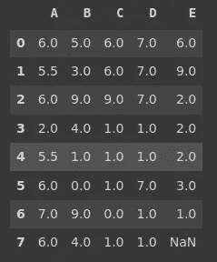
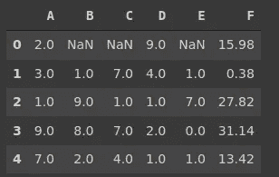

# 如何处理交叉验证中的缺失值

> 原文：<https://towardsdatascience.com/how-to-handle-missing-values-in-cross-validation-96fd569821d0?source=collection_archive---------33----------------------->

## 为什么我们不应该用熊猫


[伊琳娜](https://unsplash.com/@sofiameli?utm_source=unsplash&utm_medium=referral&utm_content=creditCopyText)在 [Unsplash](https://unsplash.com/s/photos/missing?utm_source=unsplash&utm_medium=referral&utm_content=creditCopyText) 上的照片

处理缺失值是机器学习流水线中一个重要的数据预处理步骤。

Pandas 在检测和处理缺失值方面是通用的。然而，当涉及到交叉验证的模型训练和评估时，有一种更好的方法。

scikit-learn 的估算器以及管道提供了一种更实用的方法来处理交叉验证过程中的缺失值..

在本帖中，我们将首先做几个例子，展示处理熊猫缺失值的不同方法。之后，我将解释为什么我们需要不同的方法来处理交叉验证中的缺失值。

最后，我们将使用 scikit-learn 的缺失值估算器和管道来做一个示例。

先说熊猫吧。这是一个简单的数据框架，有几个缺失值。

```
import numpy as np
import pandas as pddf = pd.DataFrame(np.random.randint(10, size=(8,5)), columns=list('ABCDE'))df.iloc[[1,4],[0,3]] = np.nan
df.iloc[[3,7],[1,2,4]] = np.nandf
```


isna 函数返回布尔值，指示缺少值的单元格。isna()。sum()给出了每一列中缺失值的数量。

```
df.isna().sum()
A    2
B    2
C    2
D    2
E    2
dtype: int64
```

fillna 函数用于处理缺失值。它提供了许多选项来填写。让我们对每一列使用不同的方法。

```
df['A'].fillna(df['A'].mean(), inplace=True)df['B'].fillna(df['B'].median(), inplace=True)df['C'].fillna(df['C'].mode()[0], inplace=True)df['D'].fillna(method='ffill', inplace=True)df['E'].fillna(method='bfill', inplace=True)
```

列 A、B 和 C 中缺少的值分别用该列的平均值、中值和众数填充。对于 D 列，我们使用“ffill”方法，该方法使用该列中的前一个值来填充缺失的值。“bfill”的作用正好相反。

以下是数据框架的更新版本:



我们在 D 列中仍然缺少一个值，因为我们对该列使用了“bfill”方法。使用这种方法，丢失的值应该用后面的值来填充。由于最后一个值是一个缺失值，因此未对其进行更改。

fillna 函数也接受常数值。让我们用一个常量替换最后一个缺失的值。

```
df['E'].fillna(4, inplace=True)
```

如您所见，fillna 函数非常灵活。然而，当涉及到训练机器学习模型时，我们需要小心处理丢失的值。

除非我们使用常量值，否则需要在拆分训练集和测试集后处理缺失值。否则，模型将被给予关于导致数据泄漏的测试集的信息。

数据泄露是机器学习中的一个严重问题。不应该给机器学习模型任何关于测试集的信息。测试集中的数据点需要是以前看不见的。

如果我们使用整个数据集的平均值来填充缺失值，我们会将关于测试集的信息泄露给模型。

一种解决方案是在训练测试分割后处理缺失值。这绝对是一种可以接受的方式。如果我们想做交叉验证呢？

交叉验证意味着将数据集划分为子集(即折叠)。然后，使用不同的组合运行许多迭代，以便每个示例都将在训练和测试中使用。

考虑 5 重交叉验证的情况。数据集被分成 5 个子集(即折叠)。在每次迭代中，4 个折叠用于训练，1 个折叠用于测试。经过 5 次迭代后，每个折叠都将用于训练和测试。

我们需要一种实用的方法来处理交叉验证过程中的缺失值，以防止数据泄漏。

一种方法是用 scikit-learn 创建一个管道。管道接受数据预处理功能，并可用于交叉验证过程。

让我们创建一个适合简单线性回归任务的新数据框架。

```
df = pd.DataFrame(np.random.randint(10, size=(800,5)), columns=list('ABCDE'))df['F'] = 2*df.A + 3*df.B - 1.8*df.C + 1.12*df.D - 0.5df.iloc[np.random.randint(800, size=10),[0,3]] = np.nandf.iloc[np.random.randint(800, size=10),[1,2,4]] = np.nandf.head()
```



从 A 列到 E 列有 10 个缺失值。F 列是具有附加偏差的其他列的线性组合。

让我们导入任务所需的库。

```
from sklearn.linear_model import LinearRegressionfrom sklearn.pipeline import Pipelinefrom sklearn.impute import SimpleImputer
```

简单估算器根据给定的策略填充缺失值。我们可以创建一个包含简单估算对象和线性回归模型的管道。

```
imputer = SimpleImputer(strategy='mean')regressor = Pipeline(
steps=[('imputer', imputer), ('regressor', LinearRegression())]
)
```

“回归”管道包含一个简单的估算器，用平均值填充缺失值。线性回归模型完成预测任务。

我们现在可以使用这个管道作为交叉验证的估计量。

```
X = df.drop('F', axis=1)
y = df['F']scores = cross_val_score(regressor, X, y, cv=4, scoring='r2')scores.mean()
0.9873438657209939
```

R 平方得分相当高，因为这是一个预先设计的数据集。

这里重要的一点是在分割训练集和测试集之后处理缺失值。如果我们做一个常规的训练测试分割，这在熊猫身上很容易做到。

但是如果要做交叉验证，用熊猫会很繁琐。scikit-learn 库的管道提供了一种更实用、更简单的方法。

管道的范围相当广泛。您还可以在管道中添加其他预处理技术，例如用于数值的缩放器。使用管道可以实现某些任务的自动化，从而优化流程。

感谢您的阅读。如果您有任何反馈，请告诉我。