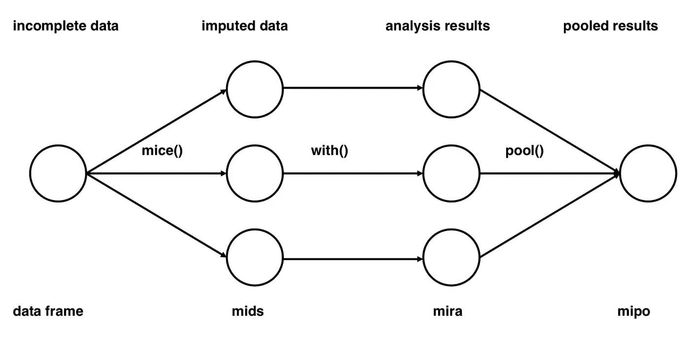

# 如何在 Python 中处理缺失值

> 原文：<https://towardsdatascience.com/how-to-handle-missing-values-in-python-23407781b2b0?source=collection_archive---------34----------------------->

## 入门指南

## 缺失值插补的简明介绍


马库斯·温克勒在 [Unsplash](https://unsplash.com/s/photos/delete?utm_source=unsplash&utm_medium=referral&utm_content=creditCopyText) 上的照片

数据科学家面临的最大挑战可能是一些听起来很平常，但对任何分析都非常重要的事情——清理脏数据。当您想到脏数据时，您可能会想到不准确或格式错误的数据。但事实是，缺失数据实际上是脏数据最常见的情况。想象一下，试图做一个客户细分分析，但 50%的数据没有地址记录。这将很难或不可能做你的分析，因为分析会显示在某些地区没有客户的偏见。

# 探索缺失的数据

*   **有多少数据丢失了？**您可以运行一个简单的探索性分析，看看您丢失数据的频率。如果百分比很小，比如说 5%或更少，并且数据完全随机丢失，那么您可以考虑忽略并删除这些情况。但是请记住，如果可能的话，分析所有数据总是更好，丢弃数据会引入偏差。因此，最好检查一下分布情况，看看丢失的数据来自哪里。
*   **分析数据是如何丢失的** (MCAR，三月，四月)。我们将在下一节中发现不同类型的缺失数据。

# 缺失数据的类型

有三种缺失数据:

*   数据完全随机丢失(MCAR)
*   数据随机丢失(MAR)
*   非随机数据丢失(MNAR)

在这篇文章中，我将通过例子回顾缺失数据的类型，并分享如何用插补来处理缺失数据。

## 数据完全随机丢失(MCAR)

当我们说数据是随机缺失的时候，我们的意思是缺失与被研究的人无关。例如，一份问卷可能在邮寄过程中丢失，或者一份血样可能在实验室中被损坏。

数据完全随机缺失的统计优势是分析保持无偏，因为数据缺失不会使估计参数产生偏差。然而，很难证明这些数据是否确实是 MCAR 的。

## 数据随机丢失(MAR)

当我们说数据随机缺失时，我们假设一个数据点缺失的倾向与缺失数据本身无关，但与一些观察到的数据有关。换句话说，缺失值的概率取决于可观测数据的特征。例如，如果你的暗恋对象拒绝了你，你可以通过观察其他变量，比如“她已经做出承诺了”，或者“她的生活目标与你不同”等，来知道原因。

随机缺失相对容易处理——只需将所有影响缺失概率的变量作为回归输入。不幸的是，我们通常不能确定数据是否真的是随机缺失的，或者缺失是否取决于未观察到的预测值或缺失的数据本身。

## **数据不是随机丢失** (MNAR)

当我们说数据不是随机丢失时，我们假设丢失的数据中有一种模式会影响您的主要因变量。例如，受教育程度最低的人错过了教育，病情最严重的人最有可能退出研究，或者吸毒者在调查中将药物使用字段留空。这也意味着这些丢失的值不是随机的，而是故意为空的。

如果数据不是随机丢失的，那么我们估算丢失的数据是没有意义的，因为它会使你的分析或模型的预测产生偏差。

# 诊断机制

1.  **MAR vs. MNAR** :区分 MNAR 和 MAR 的唯一真实方法是测量一些缺失的数据。我们可以比较受访者的答案和非受访者的答案。如果有很大的差异，这是数据是 MNAR 的好证据。另外，调查问题越敏感，人们回答的可能性越小。
2.  **MCAR vs .马尔**:一种技术是创建虚拟变量，判断某个变量是否缺失。然后，在该变量和数据集中的其他变量之间运行 t 检验和卡方检验，以查看该变量的缺失是否与其他变量的值相关。例如，如果女性真的比男性更不愿意告诉你她们的体重，卡方检验会告诉你女性的体重变量缺失数据的百分比高于男性。那么我们可以断定重量是有标记

# 数据插补方法

## 简单插补

用列中的平均值、中值或众数替换缺失值是一种非常基本的插补方法。这种方法速度最快，但对编码的分类要素效果不佳。此外，它没有考虑特征之间的相关性。如果我们必须使用这种简单的插补方法，考虑使用中间值而不是平均值，因为平均值会给分析带来异常值或噪声。

```
from sklearn.preprocessing import Imputerimputer = Imputer(missing_values='NaN', strategy='median')
transformed_values = imputer.fit_transform(data.values)# notice that imputation strategy can be changed to "mean", “most_frequent”, 'constant'
# read the documentation here: [https://scikit-learn.org/stable/modules/generated/sklearn.impute.SimpleImputer.html](https://scikit-learn.org/stable/modules/generated/sklearn.impute.SimpleImputer.html)
```

## KNN 插补

KNNImputer 通过使用欧几里德距离矩阵查找 k 个最近邻来帮助估算观测值中存在的缺失值。你可以在这里查看 KNNImputer 是如何工作的。这种方法比简单的插补更准确；然而，它可能计算量很大，并且对异常值很敏感。

```
import numpy as np
from sklearn.impute import KNNImputer

imputer = KNNImputer(n_neighbors=2) #define the k nearest neighbors   
imputer.fit_transform(data)# read the documentation here: [https://scikit-learn.org/stable/modules/generated/sklearn.impute.KNNImputer.html](https://scikit-learn.org/stable/modules/generated/sklearn.impute.KNNImputer.html)
```

## 多元插补

多元插补通过考虑数据中的其他变量来解决噪音增加的问题。链式方程的基本多重插补(MICE)假设数据随机缺失。我们可以通过查看其他数据样本，对其真实价值做出有根据的猜测。

以下是三个主要步骤:

1.  使用带有随机成分的插补流程为缺失值创建 *m* 组插补。
2.  分析每个完整的数据集。每组参数估计值都会略有不同，因为数据略有不同。
3.  将 *m* 个分析结果整合成最终结果。

如果你有兴趣了解它是如何工作的，请看这个视频[这里](https://www.youtube.com/watch?v=WPiYOS3qK70)。请注意，当我们对测量因缺失值导致的不确定性不感兴趣时，单变量与多变量插补在预测和分类中的有用性仍是一个未解决的问题。



图片作者 [stefvanbuuren](https://stefvanbuuren.name/publication/2011-01-01_vanbuuren2011a/)

```
import numpy as np
from sklearn.experimental import enable_iterative_imputer
from sklearn.impute import IterativeImputer
imp = IterativeImputer(max_iter=10, random_state=0)
imp.fit(X_train)
imp.transform(X_test)# read the documentation here: [https://scikit-learn.org/stable/modules/impute.html](https://scikit-learn.org/stable/modules/impute.html)
```

# **结论**

任何分析都不能忽略缺失数据。作为数据科学家或数据分析师，我们不能简单地丢弃缺失的值。我们需要了解数据是如何丢失的，并相应地处理 NaN 值。

# 参考

1.  [https://www.statisticssolutions.com/missing-values-in-data/](https://www.statisticssolutions.com/missing-values-in-data/)
2.  [https://measuringu.com/handle-missing-data/](https://measuringu.com/handle-missing-data/)
3.  [https://www.theanalysisfactor.com/missing-data-mechanism/](https://www.theanalysisfactor.com/missing-data-mechanism/)
4.  [https://www . analyticsvidhya . com/blog/2020/07/knnimputer-a-robust-way-to-imput-missing-values-using-scikit-learn/](https://www.analyticsvidhya.com/blog/2020/07/knnimputer-a-robust-way-to-impute-missing-values-using-scikit-learn/)
5.  [https://scikit-learn.org/stable/modules/impute.html](https://scikit-learn.org/stable/modules/impute.html)
6.  [https://www4 . stat . ncsu . edu/~ post/suchit/Bayesian-methods-completed . pdf](https://www4.stat.ncsu.edu/~post/suchit/bayesian-methods-incomplete.pdf)

如果你觉得这很有帮助，请关注我，看看我在❤️的其他博客

下次见，快乐学习！[👩🏻‍💻](https://emojipedia.org/woman-technologist-light-skin-tone/)

[](/understanding-and-choosing-the-right-probability-distributions-with-examples-5051b59b5211) [## 用例子理解和选择正确的概率分布

### 举例说明最常见的离散概率分布

towardsdatascience.com](/understanding-and-choosing-the-right-probability-distributions-with-examples-5051b59b5211) [](/how-to-prepare-for-business-case-interview-as-an-analyst-6e9d68ce2fd8) [## 作为分析师如何准备商业案例面试？

### 作为数据分析师或数据科学家，我们不仅需要知道概率和统计，机器学习算法…

towardsdatascience.com](/how-to-prepare-for-business-case-interview-as-an-analyst-6e9d68ce2fd8) [](https://medium.com/@kessiezhang/building-a-product-recommendation-system-for-e-commerce-part-i-web-scraping-798b6251ab51) [## 为电子商务建立一个产品推荐系统:第一部分——网络搜集

### 今天，如果我们想到机器学习在商业中最成功和最广泛的应用，推荐者…

medium.com](https://medium.com/@kessiezhang/building-a-product-recommendation-system-for-e-commerce-part-i-web-scraping-798b6251ab51) [](/how-to-convert-jupyter-notebooks-into-pdf-5accaef3758) [## 如何将 Jupyter 笔记本转换成 PDF

### 用几行代码将 Jupyter 笔记本转换为 pdf(调试“500:内部服务器错误”)

towardsdatascience.com](/how-to-convert-jupyter-notebooks-into-pdf-5accaef3758)