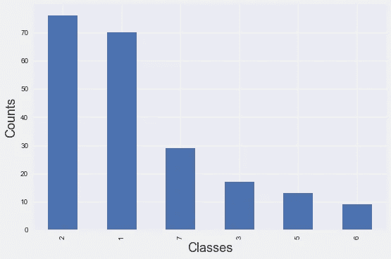
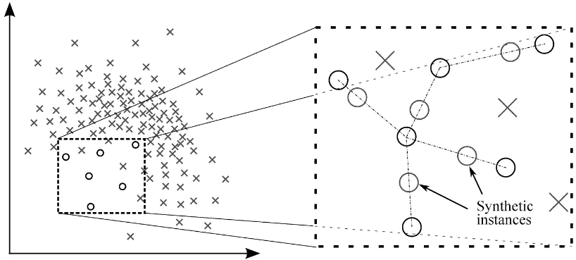

# 如何处理多类不平衡数据？-对 SMOTE 说不

> 原文：<https://towardsdatascience.com/how-to-handle-multiclass-imbalanced-data-say-no-to-smote-e9a7f393c310?source=collection_archive---------8----------------------->

## 不需要再打了。



机器学习中的一个常见问题是处理不平衡数据，其中目标类中存在高度不相称的数据。

你好，世界，这是我为数据科学社区写的第二篇博客。在这篇博客中，我们将看到如何处理多类不平衡数据问题。

# 什么是多类不平衡数据？

当分类问题的目标类(两个或两个以上)不是均匀分布时，那么我们称之为不平衡数据。如果我们不能处理这个问题，那么这个模型将会变成一场灾难，因为使用阶级不平衡数据的模型偏向于大多数阶级。

处理不平衡数据有不同的方法，最常用的方法是过采样和创建合成样本。

# 什么是 SMOTE？

SMOTE 是一种过采样技术，它从数据集生成合成样本，从而提高少数类的预测能力。尽管没有信息丢失，但它有一些限制。



合成样品

***局限性:***

1.  SMOTE 对于高维数据不是很好
2.  可能会发生类的重叠，这会给数据带来更多的噪声。

因此，为了跳过这个问题，我们可以用' **class_weight** '参数为类手动分配权重。

# 为什么使用类权重？

类权重通过给具有不同权重的类一个惩罚来直接修改损失函数。它意味着有目的地增加少数阶级的权力，减少多数阶级的权力。因此，它比 SMOTE 给出更好的结果。

# 概述:

我的目标是让这个博客非常简单。我们有一些最常用的技术来获得数据的权重，这些技术对我不平衡的学习问题有效。

1.  Sklearn utils。
2.  计数到长度。
3.  平滑重量。
4.  样本权重策略。

# 1.Sklearn 实用程序:

我们可以使用 sklearn 计算类权重来获得类权重。通过在训练模型时将那些权重添加到少数类，可以在分类类时帮助性能。

```
from sklearn.utils import class_weightclass_weight = class_weight.compute_class_weight('balanced,
                                                np.unique(target_Y),
                                                target_Y)model = LogisticRegression(class_weight = class_weight)
model.fit(X,target_Y)# ['balanced', 'calculated balanced', 'normalized'] are hyperpaameters whic we can play with.
```

从逻辑回归到 Catboost，几乎所有的分类算法都有一个 class_weight 参数。但是 XGboost 有针对二元分类的 scale_pos_weight 和针对二元和多类问题的 sample_weights(参考 4)。

# 2.计数与长度之比:

非常简单直白！将每类的计数除以行数。然后

```
weights = df[target_Y].value_counts()/len(df)
model = LGBMClassifier(class_weight = weights)
model.fit(X,target_Y)
```

# 3.平滑权重技术:

这是选择权重的优选方法之一。

labels_dict 是包含每个类的计数的字典对象。

log 函数平滑不平衡类的权重。

```
def class_weight(labels_dict,mu=0.15):
    total = np.sum(labels_dict.values())
    keys = labels_dict.keys()
    weight = dict()for i in keys:
        score = np.log(mu*total/float(labels_dict[i]))
        weight[i] = score if score > 1 else 1return weight# random labels_dict
labels_dict = df[target_Y].value_counts().to_dict()weights = class_weight(labels_dict)model = RandomForestClassifier(class_weight = weights)
model.fit(X,target_Y)
```

# 4.样品重量策略:

以下函数不同于 class_weight 参数，该参数用于获取 XGboost 算法的样本权重。它为每个训练样本返回不同的权重。

> Sample_weight 是一个与数据长度相同的数组，包含应用于每个样本的模型损失的权重。

```
def BalancedSampleWeights(y_train,class_weight_coef):
    classes = np.unique(y_train, axis = 0)
    classes.sort()
    class_samples = np.bincount(y_train)
    total_samples = class_samples.sum()
    n_classes = len(class_samples)
    weights = total_samples / (n_classes * class_samples * 1.0)
    class_weight_dict = {key : value for (key, value) in              zip(classes, weights)}
    class_weight_dict[classes[1]] = class_weight_dict[classes[1]] * 
    class_weight_coef
    sample_weights = [class_weight_dict[i] for i in y_train]
    return sample_weights#Usage
weight=BalancedSampleWeights(target_Y,class_weight_coef)
model = XGBClassifier(sample_weight = weight)
model.fit(X, target_Y)
```

***类 _ 权重 vs 样本 _ 权重:***

`sample_weights`用于给出每个训练样本的权重。这意味着您应该传递一个一维数组，其中的元素数量与您的训练样本完全相同。

`class_weights`用于为每个目标类赋予权重。这意味着你应该为你要分类的每个类传递一个权重。

# 结论:

以上是为你的分类器寻找类权重和样本权重的几种方法。我提到了几乎所有对我的项目有效的技术。

我请求读者尝试一下这些可以帮助你的技术，如果不是把它当作学习的话😄下次可能会对你有帮助😜

通过 LinkedIn 联系我😍