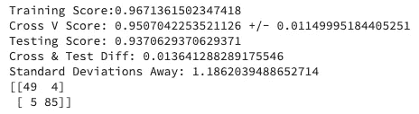
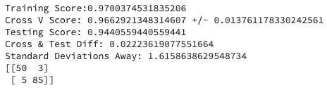
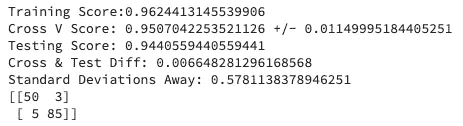

# 不平衡分类问题中 SMOTE 数据的处理

> 原文：<https://towardsdatascience.com/how-to-handle-smote-data-in-imbalanced-classification-problems-cf4b86e8c6a1?source=collection_archive---------17----------------------->

## 知道陷阱在哪里以及如何避免它们


照片由盖蒂图片社提供

分类问题在数据科学领域非常普遍。无论是欺诈检测、情绪分析还是疾病测试，能够预测特定数据点属于哪个组都是非常强大的。

通常，重点是检测少数群体中的数据点，这可能会出现一些常见问题。通常在这种情况下，您收集的数据是不平衡的，这意味着您感兴趣的目标比其他组的数据量小得多。数据中的这种不平衡会导致你的模型偏向于选择多数群体。在处理不平衡数据集时，有三种常用的技术来平衡数据:

1.  欠采样多数类
2.  对少数民族阶层进行过度采样
3.  多数类欠采样和少数类过采样的组合

这篇博文将介绍一种叫做 SMOTE 方法的过采样技术。

SMOTE(合成少数过采样技术)是一种用于校正组中不平衡的过采样过程。这种技术通过复制现有的少数民族实例并对其进行小的修改来创建少数民族的新数据实例。这使得 SMOTE 非常擅长放大已经存在于少数群体中的信号，但不会为这些群体创造新的信号。

我们来看看一些还没有用 SMOTE 平衡的分类数据。我们将使用 sci-kit 学习库中的[乳腺癌数据集](https://scikit-learn.org/stable/modules/generated/sklearn.datasets.load_breast_cancer.html)。让我们导入必要的包，导入我们的数据，并创建一个可以评估我们的模型的函数。

```
import pandas as pd
from sklearn import datasets
from sklearn.model_selection import cross_val_score
from sklearn.metrics import confusion_matrix def evaluate_model(X_train, y_train, model): model.fit(X_train, y_train)
    preds = model.predict(X_test)
    scores = cross_val_score(model, X_train, y_train, cv=3, scoring="accuracy")
    diff = scores.mean() - model.score(X_test, y_test)
    SD = diff / scores.std()

    print(f"Training Score:{model.score(X_train, y_train)}")
    print(f"Cross V Score: {scores.mean()} +/- {scores.std()}")
    print(f"Testing Score: {model.score(X_test, y_test)}")
    print(f"Cross & Test Diff: {diff}")
    print(f"Standard Deviations Away: {SD}")
    print(confusion_matrix(y_test, preds))cancer = datasets.load_breast_cancer()
X = cancer.data
y = cancer.target
```

从这里开始，我们将对我们的数据执行训练测试分割，并初始化我们的基本模型。

```
from sklearn.model_selection import train_test_split
from sklearn.linear_model import LogisticRegressionX_train, X_test, y_train, y_test = train_test_split(X, y, stratify=y, random_state=0)clf = LogisticRegression(random_state=0, solver='newton-cg', max_iter=1000)
```

提醒:在训练-测试分割函数中设置随机状态非常重要，这样可以确保模型性能的任何变化都是由于您所做的更改，而不是由于随机种子。分层参数根据输入参数分割数据，在本例中是 *y* 。这意味着每组的训练集和测试集将具有相同的样本百分比。

现在让我们看看我们的基本模型表现如何。

```
evaluate_model(X_train, y_train, clf)
```



基本模型结果

总的来说，我们看到我们的基本模型在建模数据方面做得不错，但是让我们看看是否可以使用 SMOTE 来提高性能。

现在，当处理合成数据时，第一条规则是:

> 不要把合成数据放在你的测试数据里！

我们想在实时数据上实现我们的模型，所以我们想看看我们的模型在真实数据上的表现，而不是我们创建的合成数据。这意味着我们只能将合成数据添加到训练集中。我们可以用下面的代码做到这一点:

```
from imblearn.over_sampling import SMOTE
smt = SMOTE(random_state=0)
X_train_SMOTE, y_train_SMOTE = smt.fit_sample(X_train, y_train)
```

从这里，我们可以使用包含 SMOTE 的训练数据来训练我们的模型。

```
evaluate_model(X_train_SMOTE, y_train_SMOTE, clf)
```



使用 SMOTE 数据的模型结果

正如我们所看到的，我们的模型能够更准确地预测包含 SMOTE 数据的测试数据。然而，引起关注的一个问题是我们的交叉验证分数。交叉验证分数用于评估有限数据集上的模型，以预测模型在真实世界数据中的表现。理想情况下，我们希望交叉验证分数与测试分数相同或接近。在这种情况下，我们的分数出现了分歧，因为我们违反了处理合成数据的第二条规则，即:

> 不要把合成数据放在你的验证数据里！

就像我们的测试数据一样，我们希望只使用真实数据来验证我们的模型。这意味着我们只希望我们的 SMOTE 数据在训练折叠中，而不是在验证折叠中。在 sci-kit learn [文档](https://scikit-learn.org/stable/modules/generated/sklearn.model_selection.StratifiedKFold.html)中可以找到如何使用 StratifiedKFold 函数将合成数据添加到每个单独折叠的示例。

幸运的是，有一个不平衡学习模块可以为我们处理所有的数据，即管道模块。只需将 SMOTE 流程和您的模型包含到管道中，模块就会处理剩下的工作。对于此任务，您可以使用 Pipeline 或 make_pipeline 函数。

```
from imblearn.pipeline import make_pipeline
pipeline = make_pipeline(smt, clf)evaluate_model(X_train, y_train, pipeline)
```



使用 imblearn 管道模拟性能

正如我们可以看到的，我们的交叉验证分数现在更准确地反映了我们可以从现实世界中的模型中预期的实际性能。希望这篇博客能帮助你在现实世界中实现你的模型。