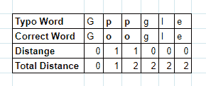

# 如何使用模糊查询处理弹性搜索中的错别字

> 原文：<https://towardsdatascience.com/how-to-handle-typos-in-elasticsearch-using-fuzzy-query-8d3843a8cff3?source=collection_archive---------9----------------------->

## [实践教程](https://towardsdatascience.com/tagged/hands-on-tutorials)

## 使用 Elasticsearch 轻松处理错别字，改善用户体验

由 [Ksenia Makagonova](https://unsplash.com/@dearseymour?utm_source=medium&utm_medium=referral) 在 [Unsplash](https://unsplash.com?utm_source=medium&utm_medium=referral) 上拍摄的照片

错别字是经常发生的事情，会降低用户的体验，幸运的是，Elasticsearch 可以通过模糊查询轻松处理它。

如果你正在用 Elasticsearch 构建一个高级的自动完成系统，处理输入错误是必须的。

如果你想创建一个简单的，你可以阅读我的其他文章“[用 Elasticsearch 创建一个简单的自动完成功能](https://medium.com/better-programming/create-a-simple-autocomplete-with-elasticsearch-852c47109deb)”。

# 什么是模糊逻辑

模糊逻辑是一种数学逻辑，其中变量的真值可以是 0 到 1 之间的任何数字。这与只有真值 0 或 1 的布尔逻辑不同。

在弹性搜索中，模糊查询意味着查询中的术语不必与倒排索引中的术语完全匹配。

为了计算查询之间的距离，Elasticsearch 使用 [Levenshtein 距离算法](https://en.wikipedia.org/wiki/Levenshtein_distance)。

# 如何使用 Levenshtein 距离算法计算距离

用 Levenshtein 距离算法计算距离很容易。

你只需要把第一个和第二个单词一个字符一个字符的比较。

如果字符不同，那么你可以将单词之间的距离加一。

我们来看一个例子，如何计算常见错别字`"Gppgle"`与正确字`"Google"`的距离。

弹性搜索模糊查询:Levenshtein 距离

在我们用 Levenshtein 距离算法计算出`"Gppgle"`和`"Google"`之间的距离后，我们可以看到距离为 2。

# 弹性搜索中的模糊查询

使用模糊查询处理 Elasticsearch 中的输入错误也很简单。

让我们以错别字`"Gppgle"`为例。

当我们使用普通匹配查询时，Elasticsearch 将在搜索到 Elasticsearch 之前首先分析查询`"gppgle"`。

倒排索引中唯一的术语是`“google”`，它与术语`"gppgle"`不匹配。因此，Elasticsearch 不会返回任何结果。

现在，让我们在匹配查询中尝试 Elasticsearch 的 fuzzy。

如你所见，使用 fuzzy，Elasticsearch 返回了一个响应。

我们以前学过`"gppgle"`和`"google"`的距离是 2。

在查询中，我们插入了`"fuzziness":"AUTO"`而不是一个数字。为什么会起作用？

如果我们在`"fuzziness"`字段中使用`"AUTO"`值，Elasticsearch 将确定什么样的模糊距离是合适的。

对于 6 个字符，Elasticsearch 默认情况下将允许 2 个编辑距离。

模糊性更好，但是如果你愿意，你可以用一个精确的数字来调整它。

现在，让我们用一个确切的数字来证明`"gppgle"`和`"google"`的距离为 2。

当我们使用`"fuzziness":"1"`时，Elasticsearch 没有返回任何结果。

不过，使用`"fuzziness":"2"`，Elasticsearch 返回了文档`"google"`。

这证明了我们之前用 Levenshtein 距离算法对`"gppgle"`和`"google"`的距离计算，结果是 2。

# 弹性搜索中的两种模糊查询

在前面的例子中，我们使用模糊查询作为匹配查询中的参数。

但是还有另一种方法来使用模糊特性，即模糊查询。

好像是一样的！那么，它们有什么区别呢？

## 模糊查询

模糊查询的工作方式类似于术语查询，对 Elasticsearch 的查询不经过分析，也不用于搜索倒排索引。

例如，让我们再索引一个文档`"Hong Kong"`。

让我们看看分析器用 Elasticsearch 的 Analyze API 产生了哪些术语。

如您所见，`standard_analyzer`产生了两个术语，`"hong"`和`"kong"`。

如果你读了我的另一篇文章“[elastic search:Text vs . Keyword](https://medium.com/better-programming/elasticsearch-text-vs-keyword-2ccb99ec72ae)”，你就会知道如果我们使用一个术语查询来搜索`"Hong Kong"`，那么我们不会得到任何结果。

这是因为在 Elasticsearch 中没有与`"Hong Kong"`的编辑距离小于 2 的术语。

现在，让我们用`"Hpng"`试试模糊查询。

查询中的术语`"Hpng"`和弹性搜索中的术语`"hong"`的距离为 2。

请记住，被查询的术语和倒排索引中的术语是区分大小写的，距离“2”来自于`"Hp"`和`"ho"`之间的差值。

## 用模糊性参数匹配查询

带模糊参数的匹配查询比模糊查询更好。查询中的分析器将在将查询搜索到倒排索引之前对其进行分析。

让我们尝试与模糊查询部分相同的查询。

不出所料，两个查询都返回了结果！

第一个查询，`"Hpng Kong"`被解析为`"hpng"`和`"kong"`。术语`"hpng"`和`"kong"`都存在于倒排索引中。

`"hpng"`和`"hong"`匹配距离为 1。而`"kong"`和`"kong"`完美匹配。

如果您计划使用匹配查询，需要注意的一点是查询中的每个术语都允许模糊性。

我们可以尝试使用`"fuzziness":2`用`"hggg kggg"`查询，它与`"Hong Kong"`的编辑距离为 4。

如您所见，Elasticsearch 返回了一个结果。

这是因为分析器将查询`"hggg kggg"`分析为术语`"hggg"`和`"kggg"`。

`"hggg"`和`"kggg"`在弹性搜索中对`"hong"`和`"kong"`的编辑距离分别为 2。

# 弹性搜索中模糊查询的调整

您可以调整模糊查询来匹配您的用例。

在这一节中，我将介绍我们可以在查询中更改的参数。

## 模糊

模糊性是模糊查询的核心。

我们传递给这个参数的值是允许的最大距离。

我们可以传递两种类型的值，一个是精确最大距离的整数，另一个是`"AUTO"`。

`"AUTO"`值允许查询中的模糊性是动态的。

我们可以在`"AUTO"`值中调 2 个参数，写成`"AUTO:[low],[high]"`。如果术语长度低于下限值，查询会将模糊度设置为 0。如果术语长度介于低值和高值之间，查询会将模糊度设置为 1。最后，如果术语长度大于上限值，查询会将模糊度设置为 2。

如果未确定高低值，Elasticsearch 将使用 3 和 6 作为默认值。

让我们以一个文档“Elasticsearch 中的模糊查询允许您处理错别字”为例。

我们可以尝试一些查询来证明我们之前描述的 AUTO 机制。

*   `“tp”` : 1 编辑距离`“to”`的距离。
*   `“Fyzzy”` : 1 编辑距离`“Fuzzy”`的距离。
*   `“Fyzyy”` : 2 编辑距离`“Fuzzy”`的距离。
*   `“Elastissearcc”` : 2 编辑距离`“Fuzzy”`的距离。
*   `“Elestissearcc”` : 3 编辑距离`“Fuzzy”`的距离。

查询之后，这些查询产生了一个结果:

*   `“Fyzzy”`
*   `“Elastissearcc”`

这些查询不会:

*   `“tp”`
*   `“Fyzyy”`
*   `“Elestissearcc”`

## 换位

`transpositions`将允许您的查询将两个相邻字符(ab - > ba)的换位计算为 1 个距离。

例如，如果我们将`transpositions`设置为 true，那么用`"leasticsearcc"`查询就会得到一个结果。

但是如果我们将其设置为 false，那么弹性搜索将不会有任何结果。

弹性搜索默认`transpositions`设置为真。

我们无法将此设置设置为匹配查询。匹配查询总是将`transpositions`计算为 1 距离。

## 最大扩展

将决定您从查询中获得的最大结果。

如果您将`max_expansions`设置为 1，并且在 Elasticsearch 中有 2 个文档适合您的查询，那么 Elasticsearch 将只返回 1。

注意`max_expansions`适用于碎片级。因此，如果在 Elasticsearch 中有许多碎片，即使将`max_expansion`设置为 1，查询也可能返回更多结果。

`max_expansions`的默认值为 50。

## 前缀长度

`prefix_length`是模糊查询中不考虑的前缀字符数。

例如，如果我们将`prefix_length`设置为 1，那么查询`"llasticsearch"`将不会得到任何结果。

prefix_length 设置默认为 0。

## 重写

如果您想改变结果的得分，可以改变`rewrite`参数。

你可以在[弹性搜索文档](https://www.elastic.co/guide/en/elasticsearch/reference/current/query-dsl-multi-term-rewrite.html)中找到关于`rewrite`参数的更多信息。

# 结论

处理 Elasticsearch 中的输入错误非常容易，可以改善用户体验。

处理输入错误的最简单方法是在匹配查询中添加`"fuzziness":"AUTO"`。

如果您想调优查询，可以更改一些参数，其中`"fuzziness"`是最重要的。

谢谢你一直读到最后！