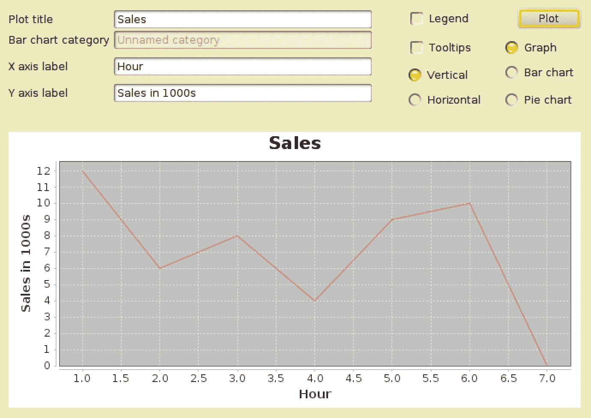
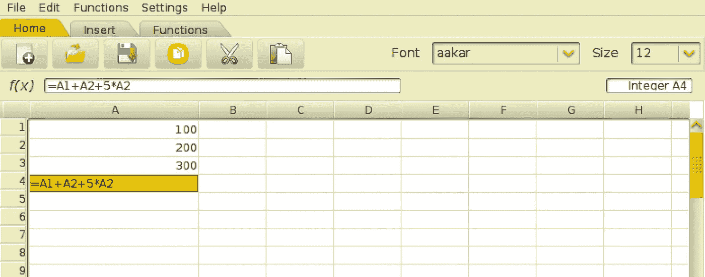
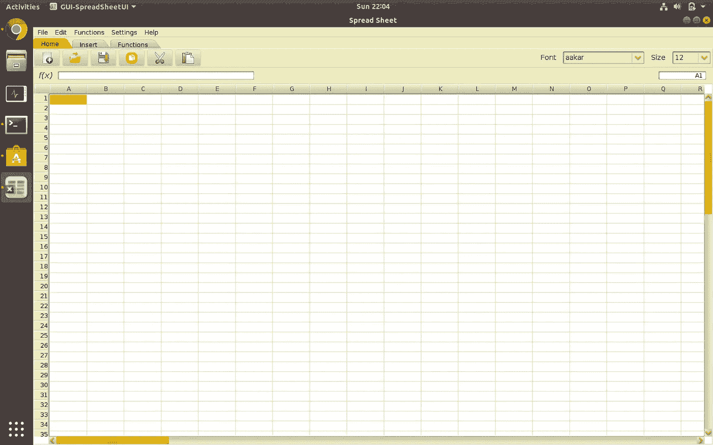
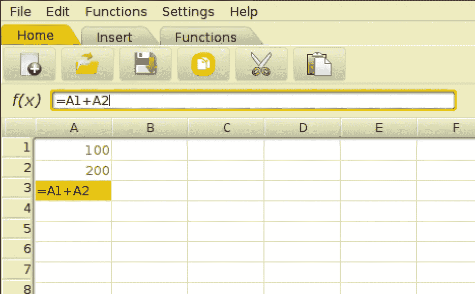
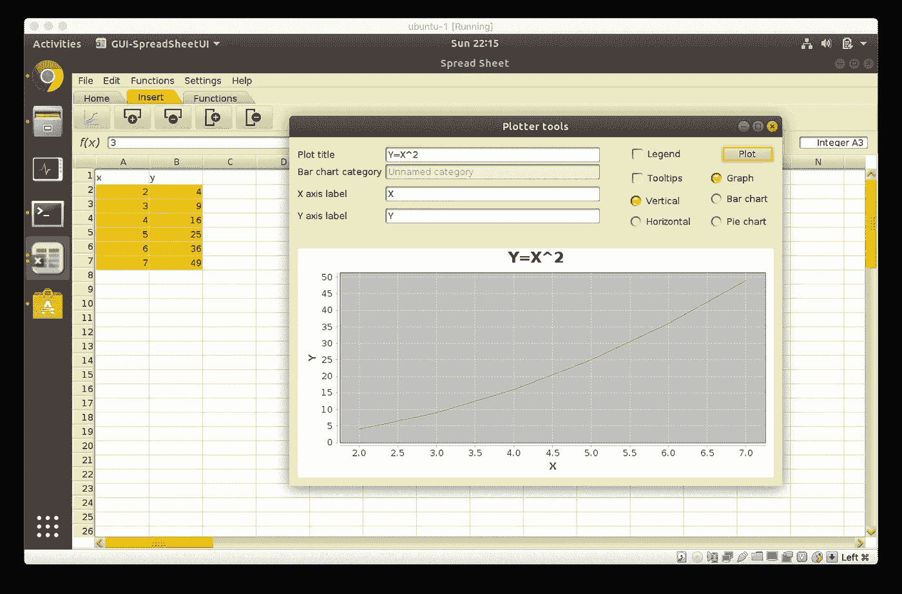
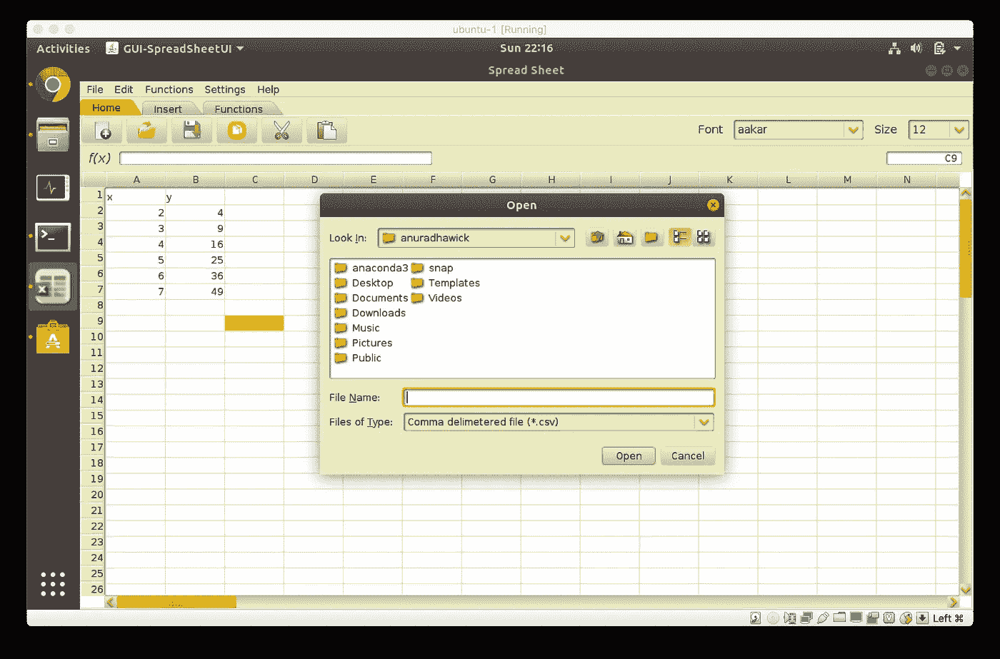

# 如何在软件工程中有一个坚实的开端

> 原文：<https://towardsdatascience.com/how-to-have-a-solid-start-in-software-engineering-158dd9aa02c8?source=collection_archive---------25----------------------->

## 我的第一个软件开发项目 A-Z 编程体验！

虽然我现在是一名研究人员，但每当我用我的软件工程知识开发我的算法时，我发现自己成为了一名更好的研究人员/科学家/无论什么。在这篇文章中，我将分享我的第一次软件开发/编程经历。这是我们在本科大学(斯里兰卡莫拉图瓦大学)计算机科学与工程系第一学期必须完成的项目。



用我的电子表格程序随机绘制

鉴于我对 JAVA(我在其中做了这个项目)的了解很少，这确实是一个非常具有挑战性的练习。编程语言的选择是自由的，然而，JAVA 是我的首选，因为它比 C/C++更容易。此外，NetBeans 是一个易于使用的 GUI 开发工具。我相信这些天真的选择可能帮助我不费吹灰之力就掌握了编程。我必须感谢**Surangika Ranathunga**(唯一课程召集人/讲师)博士(夫人)在短短 4 个月(1 个学期)内为许多新生注入如此大量的知识。这很困难，但结果是惊人的。这篇文章中任何有帮助的内容都必须反映出她教导和指导新手的能力。让我们检查一下这个项目！

# 概述

目标是开发一个具有基本数据类型、单元格引用和将单元格内容标记为数据类型的能力的电子表格程序。完整的实现必须遵循适用的 OOP 概念(继承、抽象、封装和多态)。

# 第一个任务-字符串标记器

学习编程语言的最好方法之一是在实践中使用语法。此外，作为一名程序员，你必须知道如何使用正则表达式和算法(尽管这是大学里完全不同的课程)，你必须做一个好项目。我相信实现一个简单的记号化器和一个算法来简化数学字符串可能是一种立刻学习它们的方法。

1.  标记器应识别数据类型；整数、浮点数、字符串、日期/时间、货币。
2.  如果字符串是 excel `=500*10/5`中的数学表达式，则值必须计算为`1000`。

可以使用字符串中的前缀`=`在上述情况之间切换。我在案例 1 中使用的正则表达式如下。

```
booltype = ".*?(((=?[<>])|(!=)|([<>]=?)|<>|><)|==|=).*?";
currency = "[A-Za-z$]{1,2}[ .]?[0-9][0-9]*[.]?[0-9]*";time12hr = "(1[012]|[1-9]):[0-5][0-9]?[:]?[0-5][0-9]?(am|AM|pm|PM)";            time24hr = "(2[0-4]|1[0-9]|[0-9]):[0-5][0-9]?[:]?[0-5][0-9]?";            integer = "[-]?[0-9]*";            
floating = "[-]?[0-9]*[.][0-9]*";dateformatSL = "[0-9]{2,4}[/-](1[012]|0?[0-9])[/-](1[0-9]|0?[0-9]|2[0-9]|3[01])";dateformatINTL = "(1[0-9]|0?[0-9]|2[0-9]|3[01])[/-](1[012]|0?[0-9])[/-][0-9]{2,4}";
```

我这里有我天真的实现[](https://github.com/anuradhawick/SpreadSheet/blob/master/src/expEval/StringParser.java)**。然而，简单地说，可以用一个静态类来保存函数，这些函数可以解析字符串并返回解析的部分(类型、格式化/评估的内容、原始内容)。请注意，解析后，我们必须保留类似于 excel 的原始内容。**

**对于情况 2，必须实现算法；[调车场](https://en.wikipedia.org/wiki/Shunting-yard_algorithm)这只是将左括号推入堆栈，并在遇到右括号时通过回溯来解决。如果你有一个类似于`12*(5+6)`的等式，你可以推栈直到你找到第二个右括号。然后弹出，直到第一个左括号出来，然后简化`5+6`并再次推入堆栈。最后，堆栈将没有括号，您可以使用 [BODMAS](https://en.wikipedia.org/wiki/Order_of_operations) 来简化最终的堆栈。你可以在这里看看我的实现[。](https://github.com/anuradhawick/SpreadSheet/blob/master/src/expEval/expressions.java)**

**现在这两个类都完成了。第一个类将解析条目，如果输入字符串是一个表达式，第二个类将由第一个使用。**

****

**计算表达式的单元格**

# **第二个任务-单元类**

**作为一名学徒，我的单元实现并不完美或合适。然而，理想的方法是做适当的泛型的[实现。如果你是新手(像我一样)，你可以在单独的类中使用数据类型的字符串。以下是我现在组织课程的方式:](https://www.tutorialspoint.com/java/java_generics.htm)**

```
Cell<E> <- used to render cells, a generic class
AbstractDataType <- store shared data (user input string, etc)
DataType extends AbstractDataType <- store data (an example)
FloatType extends AbstractDataType <- floating point data storage
```

**这里 E 可以是解析器找到的单元的数据类型(解析器可以返回泛型中正确数据类型的类)。我们使用**继承**来共享任何单元格都应该具有的公共属性(用户输入字符串、单元格颜色，如果有的话，以及稍后将讨论的更多内容)。AbstractDataType 类演示了**抽象**。你永远不会创建 AbstractDataType 的类，因为它毫无意义。**

**在我们的操作中，我们将使用`AbstractDatatype dataT = new DataType()`，也就是**多态性**。当单元格引用开始起作用时，这将使我们能够增加和减少单元格。单元格中的所有字段都被**封装**，并且只使用 getters 和 setters 进行变异。**

> **现在我们已经涵盖了所有主要的 OOP 概念以及如何实现一个算法！**

**对于任何一个刚接触编程的学生来说，这都不是一个简单的任务，更不用说 JAVA 了。**

# **第三项任务-用户界面**

**这是一件很难用文字来解释的事情。因此，我将分享我的实现的外观和感觉。但是，NetBeans 是一个简单的工具，可以实现正确的 GUI。我相信在实践中已经不再使用它了，因为我们已经有了类似于 Electron/Qt 的框架。**

**JAVA 有内置的 GUI 组件，一旦你阅读了文档，它们就非常简单。阅读文档是一项重要的技能，我相信我是从同一门课程中学到的。**

## **电子表格程序的关键 UI 组件**

*   **工作表视图(单元格板)**
*   **用于保存、复制、粘贴等的菜单**
*   **单元格编辑器(您可以在其中看到原始公式或单元格文本)**
*   **活动单元格指示器(显示您点击的单元格，如 A1)**

**下面是我的 GUI 实现。请注意，我使用了一个主题(显然是唯一一个在非 windows 平台上能够正确呈现的好主题)。**

****

**电子表格程序**

## **单元格引用**

****

**引用单元格以红色突出显示**

**这是我从 MS Excel 程序中抓取的一个特性。相当整洁的功能！**

**JAVA 有许多库，这些库激励我们在这个特定的项目上更进一步。我加了几张这样的截图，激励我亲爱的读者和未来的工程师们！**

## **绘图(J-free-chart 库)**

**JFreeChart 库提供了大量的绘图功能。我用了一些来使程序看起来优雅一些。**

****

**Y=X 绘图的绘图工具**

## **使用 OpenCSV 保存(序列化)**

**导出电子表格数据的最常见方式之一是使用 CSV 格式。在这个程序中，我使用 OpenCSV 库来处理 CSV 文件解析。**

****

**文件打开**

# **实现特性和有用的数据结构/设计模式**

## **单元格引用**

**这可以通过多种方式实现。**

*   **[观察者设计模式](https://en.wikipedia.org/wiki/Observer_pattern) —这里的观察者是引用其他单元格的单元格。我们将这样的细胞添加到被观察细胞内的观察细胞阵列中。更改作为更新被推送。请注意，JAVA 有一个可观察的接口，这使得实现非常流畅。**
*   **[中介模式](https://en.wikipedia.org/wiki/Mediator_pattern) —在这个实现中，我们有一个单元协调器，负责变更和更新。HashMap 对象可以用来存储可能的引用和参考。**

**特别注意——寻找循环依赖是很重要的。否则，由于永无止境的引用循环，程序可能会遇到堆栈溢出。**

## **撤消/重做**

**虽然我没有在我的程序中实现这一点，但这可以通过使用 [**纪念品设计模式**](https://en.wikipedia.org/wiki/Memento_pattern) 来实现。这可以实现为链接的对象引用，也可以实现为一堆动作。**

# **对当前时代的最后思考**

**这个项目是 2014 年 6 年前进行的！。既然时代已经让我们从桌面图形用户界面转移，一个基于网络的项目会更有意义。让我分享几个项目，它们可能有助于一个初露头角的软件工程师建立编程信心。**

*   **图书馆管理程序**
*   **办公室使用的投票程序(用于决策)**
*   **一个基于网络的婴儿监视器(适用于那些喜欢处理图像等的人)**
*   **一些商品(汽车、房屋等)的买卖程序**

**希望你喜欢读这篇文章。我展示这个项目的唯一想法是激励年轻人完成这个项目。试一试，并与我分享你的项目。干杯！**

**试一试吧！**

```
git clone [https://github.com/anuradhawick/SpreadSheet.git](https://github.com/anuradhawick/SpreadSheet.git)
cd SpreadSheet/dist/
java -jar SpreadSheet.jar
```

**:)**