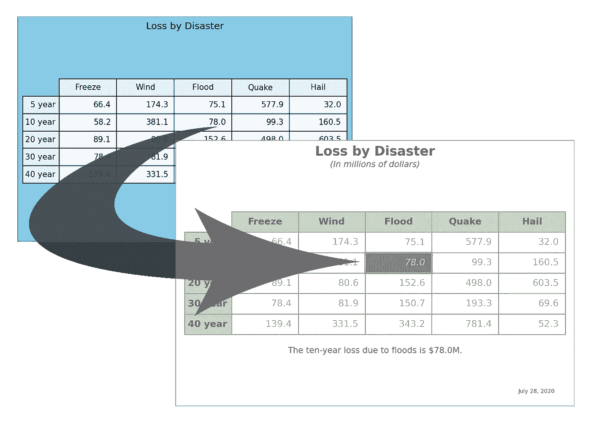
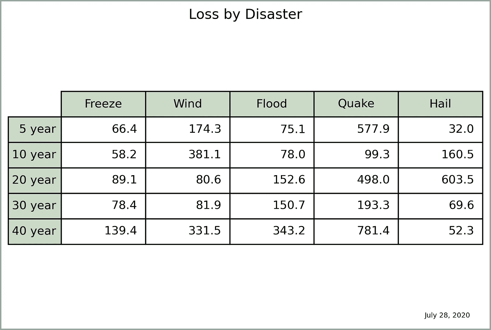
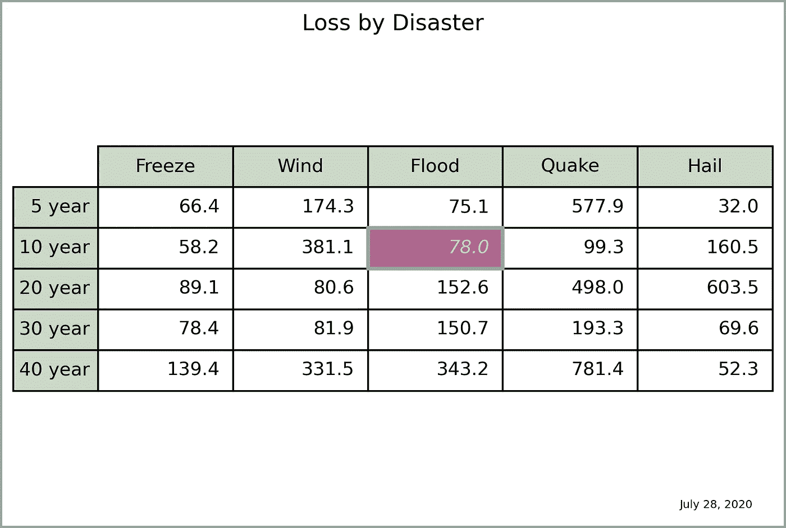
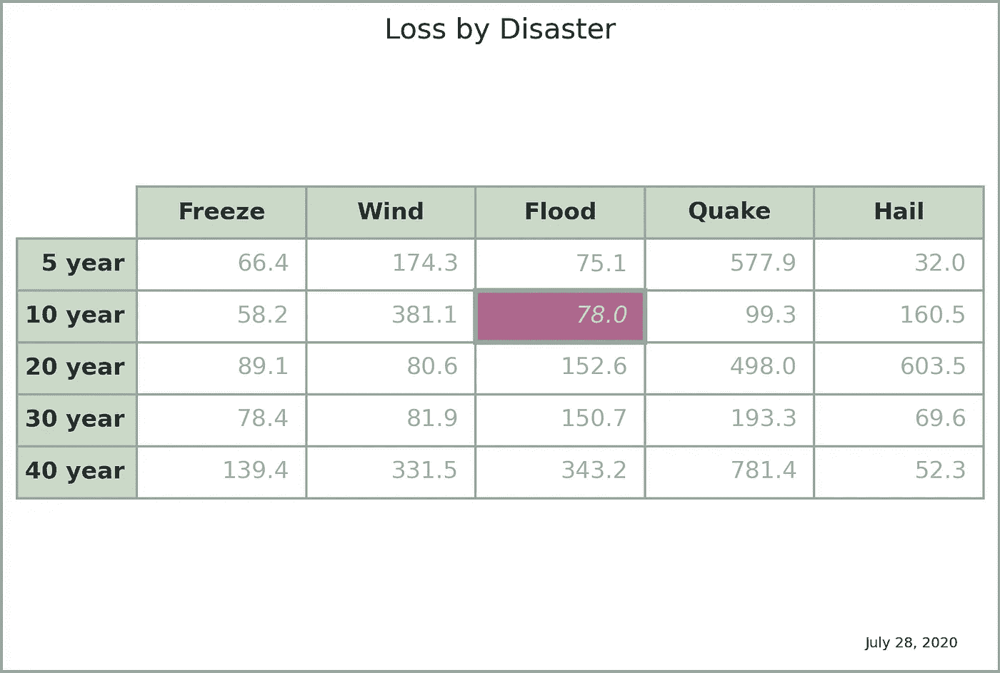
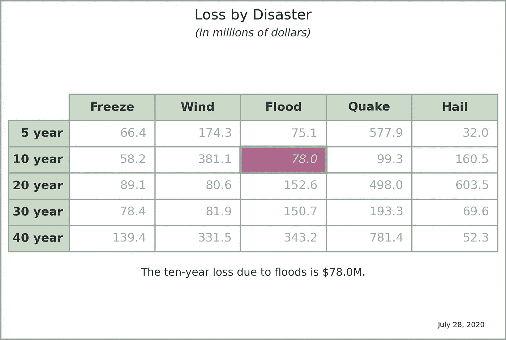

# 在简单的小表格中突出数据

> 原文：<https://towardsdatascience.com/how-to-highlight-cells-in-matplotlib-tables-bd438cd4858a?source=collection_archive---------22----------------------->

## 驯服 Matplotlib 表的更多方法



如何突出显示单元格(图片由作者提供)

当显示表格数据时，我们通常希望关注某个特定的单元格。这种关注改善了我们希望从表中获得的视觉支持，并使观众不会被包含在整个值集中的数据的广度所淹没。尽管如此，我们还是希望在整个集合的上下文中呈现关键信息。有了表格，我们可以通过使单元格在大小、粗细、颜色、形状、间距或边框上与其他单元格不同来突出显示所需的单元格。

本文对我之前的文章[“使用 Matplotlib 的简单小表格”](/simple-little-tables-with-matplotlib-9780ef5d0bc4)进行了扩展，提供了一组我们可以用来突出 Matplotlib 表格中的单元格的技术。这些技术包括改变单元格的边框宽度、背景颜色、字体粗细和字体颜色的方法。我们还将看到如何淡化未突出显示的单元格。在这个过程中，我们将发现一些相关的样式技术，比如改变表格网格线的颜色和使用开源调色板。我将注释转换的每一步，以提供对`pyplot.table`行为的洞察，我们可能会重用这些行为来完成其他任务，或者让您扩展我正在分享的发现。我会在文章的最后呈现完整的源代码，所以你不需要一行一行的拼凑。

## 起点

起点是来自[“使用 Matplotlib 的简单小表”](/simple-little-tables-with-matplotlib-9780ef5d0bc4)文章的最终代码。这些技术也应该适用于从`pyplot.table`派生的任何可能需要调整的表。

## 更改调色板

我们要做的第一件事是从继承自`pyplot.table`例子的色图中改变调色板。我使用了一个令人愉快的调色板，由 colourlovers.com 的 TaraLynn1221 命名为[“Outcomes”](https://www.colourlovers.com/palette/4751687/Outcomes)。使用来自艺术社区的开源调色板是我们设计困难的程序员可以将至少在某些情况下匹配的颜色放在一起的一种方式。

```
# colors from "Outcomes" palette by TaraLynn1221
# https://www.colourlovers.com/palette/4751687/Outcomes
cl_outcomes = {
    'white':'#FFFFFF',
    'gray': '#AAA9AD',
    'black':'#313639',
    'purple':'#AD688E',
    'orange':'#D18F77',
    'yellow':'#E8E190',
    'ltgreen':'#CCD9C7',
    'dkgreen':'#96ABA0',
    }

...

# Get some lists of color specs for row and column headers
rcolors = np.full(len(row_headers), cl_outcomes['ltgreen'])
ccolors = np.full(len(column_headers), cl_outcomes['ltgreen'])
```

我还为我们将要创建的高亮单元格和绘图中的其他组件创建了一些颜色变量。

```
grid_color = cl_outcomes['dkgreen']
fig_background_color = cl_outcomes['white']
fig_border = cl_outcomes['dkgreen']
label_text_color = cl_outcomes['black']
highlight_text_color = cl_outcomes['yellow']
faded_text_color = cl_outcomes['gray']
highlight_color = cl_outcomes['purple']
highlight_border = cl_outcomes['dkgreen']
title_text_color = cl_outcomes['black']
```

在此期间，我为文本元素更新并添加了一些变量。在本例中，我们将向图中添加文本注释和副标题。

```
title_text = 'Loss by Disaster'
subtitle_text = '(In millions of dollars)'
annotation_text = 'The ten-year loss due to floods is $78.0M.'
footer_text = 'July 28, 2020'
```



更改调色板(图片由作者提供)

## 突出显示单元格

突出显示是通过设置单元格的填充和边缘(边框)颜色实现的。如果需要，可以对几个单元格重复此过程。

表格对象由单元格对象组成。使用从表格左上角开始的`(0,0)`索引来引用单元格。列标题在这个矩阵中，所以(0，0)指的是第一个列标题。行标题确实是这个矩阵的一部分，但是被索引为列`-1`。

下面的代码将突出显示第二行第三列中的单元格。记住，我们必须考虑第 0 行是列标题行。行标题的列索引为`-1`。最上面一行的标题是`(1,-1)`。

为了突出显示，我们从表中检索单元格。然后，我们设置表面颜色，边缘颜色和线宽。为了控制字体样式，我们从单元格中获取文本对象。可以控制的文本属性是有限制的。例如，设置单个单元格的字体大小没有任何效果。数据网格中的所有单元格需要具有相同的字体大小，这是在表格级别控制的。

一旦我们完成了所有想要的高亮样式的改变，我们就调用`ax.add_patch()`来传递对单元格的引用。您可能认为简单地更改属性就足以设置样式，但这似乎并没有按 z 顺序重新定位单元格，相邻的单元格样式显示在突出显示的单元格的顶部。将单元格作为补丁添加到 Axes 对象可以解决这个问题。如果你找到了更优雅的方式，请在评论中告诉我们。

```
# Highlight the cell to draw attention to it
the_cell = the_table[2,2]
the_cell.set_facecolor(highlight_color)
the_cell.set_edgecolor(highlight_border)
the_cell.set_linewidth(2)
the_text = the_cell.get_text()
#the_text.set_weight('bold')
the_text.set_fontstyle('italic')
the_text.set_color(highlight_text_color)
ax.add_patch(the_cell)
```



突出显示单元格(作者图片)

Cell 对象是 Matplotib 矩形的子类。矩形是面片的子类。这种继承意味着您可以引用 Rectangle 和 Patches 的属性和功能，从而对格式进行更多的控制。

## 淡化未突出显示的单元格

为了将更多的注意力吸引到突出显示的单元格，我们可以淡化它们。我们将使用类似于高亮显示的技术将它们设置为较浅的颜色。我们可以调用`get_children()`来获取单元格列表并遍历它们。表格只包含单元格，因此不需要对元素进行类型检查。对于每个单元格，我们得到它的文本对象。从过程中排除标题就像检查标题标签列表中的单元格文本一样简单。当然，如果您的单元格的值与标签相匹配，您就需要想出另一种方法。这种循环技术也是我们设置表格边框颜色的方式，所以我们在这里添加`cell.set_edgecolor(grid_color)`。Table 对象上没有设置该颜色的属性，所以我们用循环的方式来设置。

```
# Fade the cells
for cell in the_table.get_children():
    cell_text = cell.get_text().get_text()
    cell.set_edgecolor(grid_color)
    if cell_text not in row_headers\
       and cell_text not in column_headers:
        cell.get_text().set_color(faded_text_color)
    else:
        cell.get_text().set_weight('bold')
        cell.get_text().set_color(label_text_color)
```

我们可以添加代码来排除突出显示的单元格。不过，更简单的方法是在突出显示之前全部淡入淡出。因此，让我们在流程的前面插入衰落代码例程。

`get_children()`的替代物是`get_celld()`。当`get_children()`返回一个艺术家对象的列表，而这些对象恰好只是这里的单元格时，`get_celld()`将返回一个单元格字典，这些单元格的关键字是行和列元组。

```
print(the_table.get_children())
[<matplotlib.table.CustomCell object at 0x7fb7b430f150>, <matplotlib.table.CustomCell object at 0x7fb7b6bf2890>, <matplotlib.table.CustomCell object at 0x7fb7b6bf26d0>,...

print(the_table.get_celld())
{(1, 0): <matplotlib.table.CustomCell object at 0x7fb7b4313390>, (1, 1): <matplotlib.table.CustomCell object at 0x7fb7b4313e50>, (1, 2): <matplotlib.table.CustomCell object at 0x7fb7b4313150>,...
```



淡化未突出显示的单元格(图片由作者提供)

**提示:** `get_celld()`可用于生成单元格文本的索引表，用于故障排除或按索引手动引用单元格。

```
for key, val in the_table.get_celld().items():
	# call get_text() on Cell and again on returned Text
    print(f'{key}\t{val.get_text().get_text()}')
(1, 0)	66.4
(1, 1)	174.3
(1, 2)	75.1
...
```

## 添加注释和副标题

如果我们要在演示或报告中使用我们的表格图像，我们可能希望向它添加文本注释，以帮助读者理解我们为什么要调出单元格值。副标题也能帮助读者理解图表。在我们的例子中，我们没有让读者知道表中的度量单位是什么，这样信息就可以成为一个好的副标题。

有几种方法可以在 Matplotlib 中创建注释。我们在表格周围有大量的空白，所以让我们在图表下面使用一行简单的图形文本。我们也会包括一些造型。

```
# Add annotation
plt.figtext(0.5, 0.2,
            annotation_text,
            horizontalalignment='center',
            size=9, weight='light',
            color=title_text_color
           )
```

Matplotlib 没有给我们一个一流的字幕函数，所以我们也将使用图形文本。不幸的是，这意味着如果我们以后更改标题或整体图形结构，我们可能需要调整它的位置。我们可以使用 heroics 来计算字幕相对于图片和标题的位置，但是我们将保持简单，并根据实验对字幕位置进行硬编码。

```
# Add subtitle
plt.figtext(0.5, 0.9,
            subtitle_text,
            horizontalalignment='center',
            size=9, style='italic',
            color=title_text_color
           )
```

**注意:**记住`suptitle()`是在图上设置标题的功能，而不是 *sub* 标题。不幸的命名。



添加注释和副标题(图片由作者提供)

## 最终来源

这是最终的源代码。我还在标题和页脚中添加了一些明确的样式。我有一个设计师朋友，他教我平面设计中最好的黑色不是纯黑，所以我们用`#313639`代替`#000000`。

这是最终产品，你可以随心所欲地裁剪。

```
import numpy as np
import matplotlib.pyplot as plt

# colors from "Outcomes" palette by TaraLynn1221
# https://www.colourlovers.com/palette/4751687/Outcomes
cl_outcomes = {
    'white':'#FFFFFF',
    'gray': '#AAA9AD',
    'black':'#313639',
    'purple':'#AD688E',
    'orange':'#D18F77',
    'yellow':'#E8E190',
    'ltgreen':'#CCD9C7',
    'dkgreen':'#96ABA0',
    }

title_text = 'Loss by Disaster'
subtitle_text = '(In millions of dollars)'
annotation_text = 'The ten-year loss due to floods is $78.0M.'
footer_text = 'July 28, 2020'

grid_color = cl_outcomes['dkgreen']
fig_background_color = cl_outcomes['white']
fig_border = cl_outcomes['dkgreen']
label_text_color = cl_outcomes['black']
highlight_text_color = cl_outcomes['yellow']
faded_text_color = cl_outcomes['gray']
highlight_color = cl_outcomes['purple']
highlight_border = cl_outcomes['dkgreen']
title_text_color = cl_outcomes['black']

data =  [
            [         'Freeze', 'Wind', 'Flood', 'Quake', 'Hail'],
            [ '5 year',  66386, 174296,   75131,  577908,  32015],
            ['10 year',  58230, 381139,   78045,   99308, 160454],
            ['20 year',  89135,  80552,  152558,  497981, 603535],
            ['30 year',  78415,  81858,  150656,  193263,  69638],
            ['40 year', 139361, 331509,  343164,  781380,  52269],
        ]

# Pop the headers from the data array
column_headers = data.pop(0)
row_headers = [x.pop(0) for x in data]

# Table data needs to be non-numeric text. Format the data
# while I'm at it.
cell_text = []
for row in data:
    cell_text.append([f'{x/1000:1.1f}' for x in row])

# Get some lists of color specs for row and column headers
rcolors = np.full(len(row_headers), cl_outcomes['ltgreen'])
ccolors = np.full(len(column_headers), cl_outcomes['ltgreen'])

# Create the figure. Setting a small pad on tight_layout
# seems to better regulate white space. Sometimes experimenting
# with an explicit figsize here can produce better outcome.
plt.figure(linewidth=1,
           edgecolor=fig_border,
           facecolor=fig_background_color,
           tight_layout={'pad':1},
           #figsize=(5,3)
          )

# Add a table at the bottom of the axes
the_table = plt.table(cellText=cell_text,
                      rowLabels=row_headers,
                      rowColours=rcolors,
                      rowLoc='right',
                      colColours=ccolors,
                      colLabels=column_headers,
                      loc='center')

# Scaling is the only influence we have over top and bottom cell padding.
# Make the rows taller (i.e., make cell y scale larger).
the_table.scale(1, 1.5)

# Hide axes
ax = plt.gca()
ax.get_xaxis().set_visible(False)
ax.get_yaxis().set_visible(False)

# Hide axes border
plt.box(on=None)

# Add title
plt.suptitle(title_text,
             weight='bold',
             size=14,
             color=title_text_color)

# Add subtitle
plt.figtext(0.5, 0.9,
            subtitle_text,
            horizontalalignment='center',
            size=9, style='italic',
            color=title_text_color
           )

# Add footer
plt.figtext(0.95, 0.05, footer_text,
            horizontalalignment='right',
            size=6,
            weight='light',
            color=title_text_color
           )

# Add annotation
plt.figtext(0.5, 0.2,
            annotation_text,
            horizontalalignment='center',
            size=9, weight='light',
            color=title_text_color
           )

# Fade the cells
for cell in the_table.get_children():
    cell_text = cell.get_text().get_text()
    cell.set_edgecolor(grid_color)
    if cell_text not in row_headers\
       and cell_text not in column_headers:
        cell.get_text().set_color(faded_text_color)
    else:
        cell.get_text().set_weight('bold')
        cell.get_text().set_color(label_text_color)

# Highlight the cell to draw attention to it
the_cell = the_table[2,2]
the_cell.set_facecolor(highlight_color)
the_cell.set_edgecolor(highlight_border)
the_cell.set_linewidth(2)
the_text = the_cell.get_text()
#the_text.set_weight('bold')
the_text.set_fontstyle('italic')
the_text.set_color(highlight_text_color)
ax.add_patch(the_cell)

# Force the figure to update, so backends center objects correctly within the figure.
# Without plt.draw() here, the title will center on the axes and not the figure.
plt.draw()

# Create image. plt.savefig ignores figure edge and face colors, so map them.
fig = plt.gcf()
plt.savefig('pyplot-table-highlight.png',
            bbox='tight',
            edgecolor=fig.get_edgecolor(),
            facecolor=fig.get_facecolor(),
            dpi=300
            )
```

## 结论

我们已经有了第一个小表格，并在单元格中添加了一些突出显示，使它对我们的观众来说更加明显。我们学习了如何从开放的设计网站上获取调色板。我们看到了基于大小、颜色、相对褪色和边框的高亮技术。我们学习了添加注释和副标题的简单方法。Matplotlib 表格是一个灵活而强大的工具，用于显示表格汇总数据。