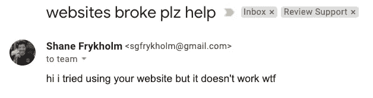
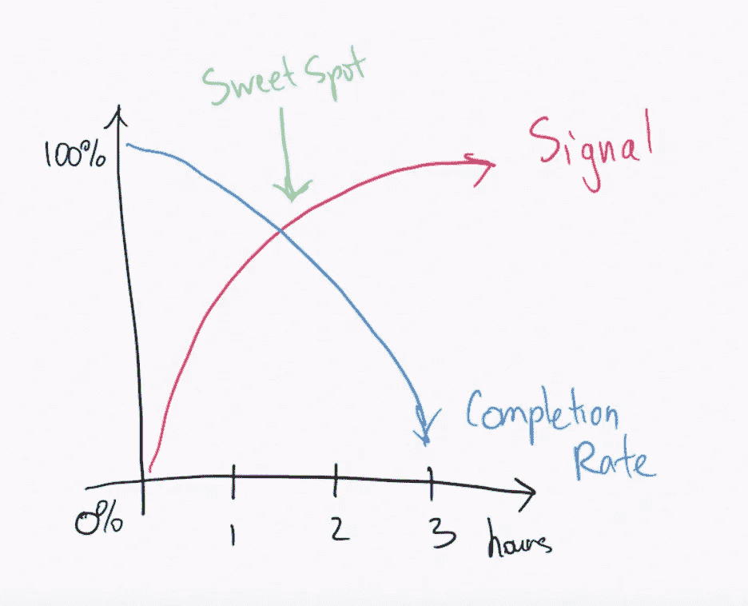
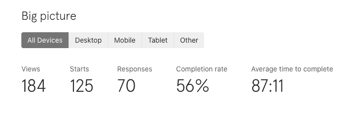
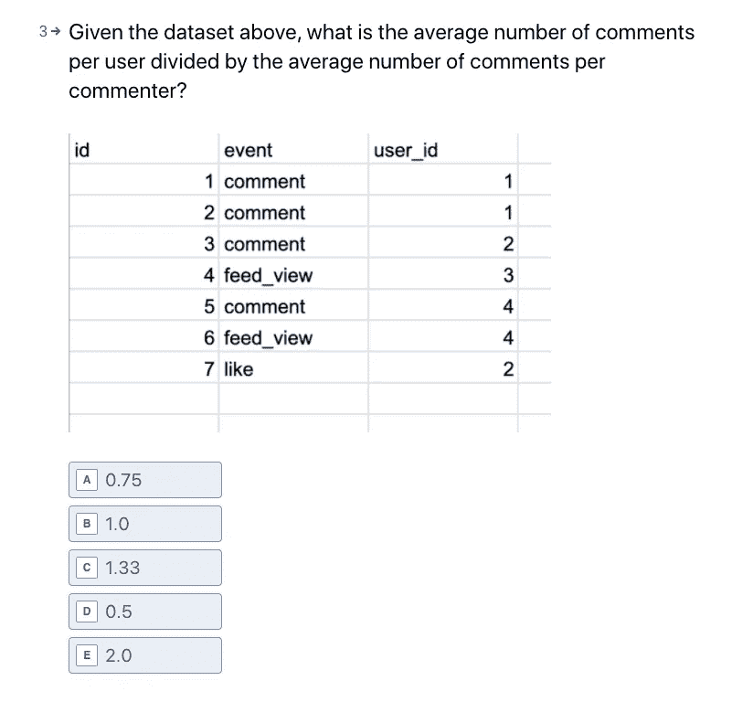
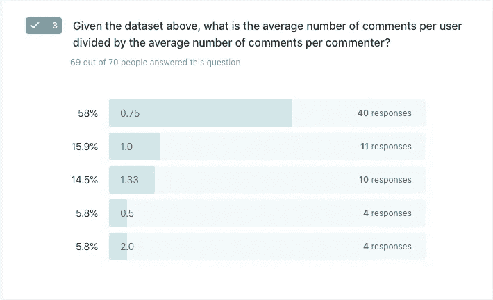
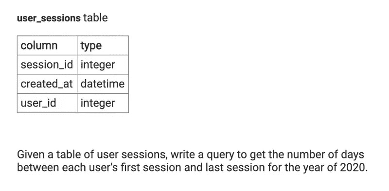

# 如何雇佣一名数据科学家

> 原文：<https://towardsdatascience.com/how-to-hire-a-data-scientist-a8f169e58773?source=collection_archive---------39----------------------->

图片来自 [Pixabay](https://pixabay.com/illustrations/career-resume-hiring-job-interview-3449422/)

今天我写的是我如何通过将数据科学应用到招聘过程中，为我的公司[招聘了一名数据科学家。我第一次雇用数据科学家，让我大开眼界，在花了几年时间作为候选人参加面试后，我坐在了桌子的另一边。](https://www.interviewquery.com/)

我想深入探讨三个要点。

1.  定义数据科学角色和职责。确切了解数据科学家将从事的工作。
2.  利用自动化测试和评分标准大规模评估候选人，而不是没完没了地查看简历和打招聘经理电话。
3.  为漏斗的所有部分创建基于指标的招聘流程。

# 首先，我们为什么需要数据科学家？

具有讽刺意味的是，一个数据科学家创立的数据科学创业公司需要另一个数据科学家。数据科学家有助于企业通过分析数据来影响产品方向，或者通过大规模实施机器学习来增加像**参与度、保留率和收入**这样的指标，从而增加收入。

这通常是在大型平台、市场、电子商务上完成的——基本上所有的事情面试查询都不是。作为一个小企业，我们当前开发新功能的首要任务是与我们的客户交谈，因为他们通常对我们应该构建什么有强烈的意见。

我们了不起的首席技术官。

但作为一个数据科学教育企业，似乎有必要将其他人的整个工作(除了我的工作)集中在应用分析和发现有趣的产品见解和功能上。除了提供面向数据科学的教育内容，我还希望将数据科学实际应用到业务中，以提高我们用户的学习目标。

# 定义数据科学角色

如果你曾经与数据科学经理或招聘人员聊天，你可能听说过招聘过程有多痛苦。他们浏览了成千上万份简历，他们面试的所有候选人都被拒绝了，有人被录用了，但在第一个月内就辞职了——随你挑。

老实说，根据我的经验，这个问题通常可以归结为**职位描述和面试过程中的期望值不一致。**你不能采访一个数据科学家，滔滔不绝地谈论产品见解，然后在 Leetcode 上钻牛角尖。

在为我们的空缺职位撰写职位描述时，我确保列出了他们将参与的几个项目- *改进我们的时事通讯，创建 AB 测试系统*等。我非常清楚地说明了为什么我们需要一名数据科学家，以及这个职位需要什么。

这个过程的第二部分包括创建你自己的招聘策略。以下是我多年来学到的一些技巧。

在漏斗的每一步，淘汰 50%的候选人。例如，如果你要招聘一个职位，并想提供两个机会，你可以根据简历或课后练习安排四次现场面试、八次技术筛选和十六次招聘经理面试。这就像一个二叉查找树，目标是优化你的面试过程，在最短的时间内找到最好的候选人。

**了解候选人中的技能分布**。一旦你为这份工作设定了要求，包括薪水、工作时间、工作风格和技能期望，你很可能会收到一大堆各种各样的候选人。要了解一个好的候选人是什么样子，你也要看看一个坏的候选人是什么样子。

换句话说，在一个被录用的候选人身上定义你的基本要求。对于面试查询，我们需要一名精通产品分析并能独立工作的数据科学实习生。作为雇主，我们的优势在于我们是一家初创公司，我可以直接指导数据科学家，但老实说，我们不确定这对应用程序有多大吸引力。

令人惊讶的是，一周后，我们有超过 500 名候选人申请！太疯狂了。

然后，我们遇到了当今招聘的经典问题——衡量和筛选所有候选人，而不是花数百个小时面试每个人。

我们如何准确地、不带偏见地、大规模地评估候选人？

我们接下来做的是…分配带回家的挑战。

# 大规模评估候选人

是的。我知道你在想什么。杰伊，[你已经写了你如何 ***讨厌*** 带回家的挑战](https://www.interviewquery.com/blog-data-science-take-home-challenges/)。我的天啊。你做了什么？

我承认:我的态度总是倾向于讨厌带回家的挑战，因为我是站在候选人一边面试的。老实说，虽然承认这一点让我很痛苦，但带回家的挑战对雇主来说是很大的，因为它们允许雇主大规模地评估候选人。你可以在同一时间内真实地回顾 50 个带回家的挑战，而不是进行五个单独的技术筛选。

此外，**我有动力去寻找被低估的候选人**。我认为，在雇佣个人贡献者时，最容易出现误判的情况是雇主过于看重简历和以往的经验，而不是实际技能。当用作过滤和分配机制，同时最小化转化率损失时，带回家的挑战是最好的。例如:

带回家挑战有效性图表。

图表上的 x 轴代表以小时为单位的带回家挑战的长度，垂直轴代表如果带回家的复杂性增加，我们理论上可以获得的数据科学技能的信号。我假设虽然信号可能随着带回家的长度而增加，但在某一点上，**它在有效性上**处于平稳状态。很多时候，数据科学家也会在带回家的挑战上花费过多的时间，这可能会混淆候选人的比较。

第二行是候选人的**转换率，这些候选人会*接受*的挑战**。正如所料，随着挑战时间的增加，完成带回家挑战的候选人数量会减少。

我们的目标是找到这两条线之间的点，最大限度地提高挑战在评估技能方面的有效性，同时保留最有潜力的合格候选人。

鉴于我之前在带回家挑战上的负面经历。我决定，这个最大化的价值应该是一个可以持续一个小时的带回家的东西，并且对于一个合格的候选人来说足够简单。

我们的目标是我们雇佣的候选人对主动性和勇气有所了解。

我在 Typeform 上主持了“带回家”项目，这样我就可以在 Indeed 上把链接发给不同的候选人，并在“带回家”项目中创造了三个不同的问题。在一天结束时，我们在做了 200 多份简历审查后，向 100 名候选人发送了带回家的简历，并收到了 70 份作业，带回家的完成率约为 70%。

来自带回家挑战的整体大图。

# 建造带回家的房子

你大概可以猜到，70 个带回家的作业仍然是很多考生要复习的。我们的问题是在评估技能时继续筛选候选人。

我们分两部分来处理这个问题，并提出了三个问题，每个问题都有不同的目的。

第一个问题是关于基础分析的。

带回家挑战的第一个问题。

对于任何曾经远程使用过分析的人来说，我认为这个问题是免费的。然而，只有 58%的候选人答对了这个问题。

带回家挑战第一题的结果。

对于那些答错这个问题的人来说，他们剩下的带回家的挑战就被丢弃了。这里的一个错误答案表明，候选人要么不够善于观察，不关心带回家的东西，要么就是不擅长分析。这里需要一种过滤机制来减少候选字段。

带回家挑战的第二个问题。

第二个问题基于 SQL。这个问题旨在测试候选人是否能够使用连接编写一个相对简单的查询。如果他们不能写出正确的 SQL，那么他们就不能从我们的数据库中提取数据。这个问题也相对容易得分。我在采访查询中已经有了示例表。我只需在我们的编辑器中运行他们的解决方案，如果返回正确的结果，那么他们就通过了这一轮 SQL。

唯一的问题是有不同的 SQL 引擎，这意味着许多人答对了问题，但遗漏了一些语法。如果答案大部分都在那里，我就给他们及格，所以大约一半的候选人答对了这部分问题。

带回家挑战的第三个问题。

最后，最后也是*最重要的*问题是产品分析案例问题。

这个问题让我能够在几个关键方面对候选人进行评估。

1.  **他们能提出对案例研究有意义的指标和分析吗？**
2.  **他们了解内容业务框架内的分析吗？**这个问题很棒，因为它涉及到一个大家都知道的产品——Youtube——的案例研究，并且是关于一个与采访查询几乎相似的情况。不，我们没有创作者，但我们有很多内容，我想知道*候选人会如何看待企业内部的内容。*
3.  最后，我想**了解他们的技术概念沟通水平**。沟通和结构都是数据科学家需要了解的最重要的技能。如果我不能和你交流，那我就不能和你一起工作。

这里有一个好答案的例子。候选人描述了他们想要使用的指标，概述并阐明了谁是业余和超级明星创作者，并了解如何建立两个时间表来比较这些指标。

> 让我们首先指定一个 6 个月到一年的时间段来分析和移除所有那些在该时间段内不活动的通道。然后，让我们将订户数量超过 100，000 的所有频道指定为超级明星 youtubers，其余频道指定为业余爱好者。
> 
> 指标 1:业余 YouTube 用户在时间段内的平均增加量/时间段开始前的用户数/超级明星 YouTube 用户的平均增加量(时间段内的用户增加量/时间段开始前的用户数)。
> 
> 第一度量应该优选地高于 1，因为较小的频道比较大的频道更容易增长，但是小于 1 的值表示只有超级明星频道在增长。
> 
> 指标 2:(比率(建议标签页中的业余频道视频/业余频道视频总数)/比率(建议标签页中的巨星频道视频/巨星频道视频总数))。
> 
> 这个指标应该更接近于 1，因为这表明 youtube 同等地推荐这两种类型的频道。
> 
> 指标 3:(比率(通过 Youtube 搜索获得的业余频道观看次数/业余频道观看总次数)/比率(通过 Youtube 搜索获得的超级明星频道视频/超级明星频道观看总次数))。
> 
> 这个指标也应该接近 1。它指示是否可以通过 youtube 搜索访问较小的频道。

这里有一个不好的答案。候选人基本上什么也没说。什么是趋势视频？什么是类别？我不会带着任何洞察力离开。

> 首先，我将采用“趋势视频”、“浏览量”和“类别”等指标。通过分析，找出每个类别中业余爱好者和超级明星的数量。如果在一段时间内进行相同的分析，我们就可以确定趋势。

正如你在上面看到的，候选人是否通过产品面试问题的一个主要因素是**基于他们的条目**的长度。这就是我们想要的！我们需要更多的想法——尽管是好的想法——最终需要有人能够思考这个问题，并找到用数据解决问题的方法。*(有关如何获得数据科学案例研究的更多信息，请点击此处查看我们的文章***！)**

*有了这个收获，我们将候选人名单从最初的 100 名候选人缩小到 10 名，在每个后续的面试问题中排除 50%的候选人。我们没有给 100 个不同的候选人打电话，也没有根据经验给前 10 名打电话，而是不与任何人交谈就找到了最合格的候选人。*

# *最终现场数据科学访谈*

*招聘过程的最后一步是面试每个候选人。对我来说，这可能是最令人惊讶的一步，因为虽然我认为我已经找到了真正合格的候选人，但他们中的许多人并没有那么优秀。*(对于数据科学新人，* [*下面是*](https://www.interviewquery.com/blog-data-science-internship-interview/) *你需要什么才能在数据科学实习面试中取得成功。)**

*一些人没有安排面试，因为他们要么找到了另一份实习工作，要么不再感兴趣了。在面对面的面试中，我会根据沟通技巧、对工作的兴趣和案例研究对每位候选人进行评分。此外，我还试图判断候选人本人是否符合从他们带回家的材料中收集的技能评估。*

*我所问的案例研究是关于改进面试查询每周发送的电子邮件简讯。这与其说是一个真正的面试问题，不如说是数据科学家应该参与的第一个项目。他们在这个面试问题上表现得越好，工作效率就越高。*

*当我和我最终面试的八个左右的候选人交谈时，他们中的大约一半人都不是很强。他们中的一些人不知道面试查询实际上是做什么的，或者甚至没有注册使用这个网站。其中一个人甚至告诉我，他爸爸帮他做了 SQL 部分。其他弱的候选人只是没有很强的沟通技巧，虽然他们可以在写作部分将想法串在一起，但我意识到面对面的沟通可能更难，因为它需要你在讨论中当场思考。*

*不过，最终我面试了一位我非常喜欢的候选人，一周后，我给了他机会，他接受了。*

# *注意事项和提示*

*以下是这一过程的要点。*

# ***在招聘时，确保你的时间得到有效利用。***

*招聘人员和招聘经理把时间浪费在给候选人发电子邮件、安排面试和安排带回家的任务上。重要的是要有一个精简的招聘流程，你可以在未来为每个候选人复制。从现在开始，无论我们何时雇佣任何人，我都将使用这一流程，因为我觉得我最大限度地有效利用了我的时间，并且仍然收到了优秀的候选人。*

# *定义角色并预先设定期望。*

*发挥你作为雇主的优势。我在面试中告诉每个候选人，与大公司相比，我们不能支付那么多，但他们会得到直接的指导，他们的贡献实际上会影响面试提问。作为一家初创公司，我们的弱点最终也成为了我们的优势，我们得到了一位出色的实习生。*

*你知道有多少无用的噪音。一开始，我在职位描述的底部添加了一段简单的文字，写道:如果你看到这段文字，请在你的简历旁边的文本框中写下“我阅读了职位描述”。只有五个人最终把它写了进去。许多候选人最终并不在乎他们申请的每一份工作。如果你付出一点点努力，你一定能脱颖而出。*

*对于雇主来说，如果你有兴趣了解更多关于有效雇用数据科学家的信息，请联系我们，了解更多关于面试查询如何提供帮助的信息。*

**感谢阅读！**

*   **如需更多独家面试解说，请查看* [***面试查询***](https://www.interviewquery.com/) ***！****
*   **查看我的* [***Youtube 频道***](https://www.youtube.com/channel/UCcQx1UnmorvmSEZef4X7-6g) *获取更多面试指南，以及解决问题的技巧&。**
*   **在面试查询博客上找到更多面试指南，如* [***罗宾汉数据科学家面试***](https://www.interviewquery.com/blog-robinhood-data-scientist-interview) *和**[***字节跳动数据科学家面试***](https://www.interviewquery.com/blog-bytedance-data-scientist-interview)**。****

***原载于 2020 年 11 月 16 日 https://blog.interviewquery.com**[*。*](https://blog.interviewquery.com/blog-how-we-hired-data-scientists/)***