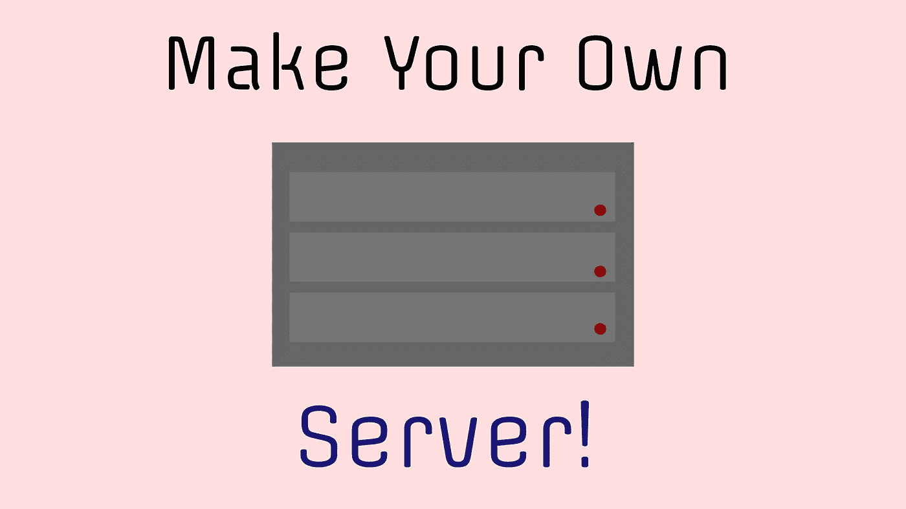
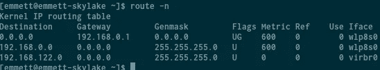
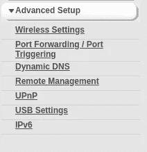

# 如何托管自己的 Python 模型

> 原文：<https://towardsdatascience.com/how-to-host-your-own-python-models-dc820081c320?source=collection_archive---------38----------------------->

## 如何设置本地私有服务器并在其上部署端点。



在使用机器学习进行部署的主题下，有许多事情需要考虑，许多不同的选项将为您提供不同的结果。首先，有很多标准的 VPS 和半共享主机可以用来部署你的模型。对于初学者来说，这些通常不是很好的选择，但是在使用什么样的应用程序以及如何安排文件系统方面允许更多的自由。当然，另一个选择是像 AWS 或 Google Cloud 这样的部署解决方案。虽然这两个都是很好的选择，但是它们都不能给你性价比和自己托管服务器的便利性。虽然自己托管服务器当然有缺点，但如果你碰巧有良好可靠的互联网和一台额外的计算机，这肯定是一个很好的选择。

# 设置

当你运行自己的服务器时，需要考虑的一件非常重要的事情是它实际上要在什么上面运行。您可能不会像许多计算狂人那样在自己的壁橱里放着一台成熟的服务器，但这没关系。对于大多数应用程序，您不太可能需要 128GB 的内存和高得离谱的内核数处理器。例如，如果您希望只部署几个端点，也许是提供一些静态文件，那么您可以选择任何内存超过 1GB 的计算机。

也就是说，你要考虑的另一件事是热量。你住的地方有多热，你有中央空调吗？保持服务器组件冷却很重要，服务器处理器会产生大量热量，需要比普通计算机更多的环境冷却。因此，您甚至可以拥有一台服务器，但由于环境温度过高而不想使用它。

你可能需要考虑的另一件事是功耗。毕竟，如果您没有使用服务器的所有功能，而是运行一个高 TDP 处理器，自己托管它甚至可能不具成本效益——您可能最终要支付比您预想的更多的电费。

当你不需要那么多能量的时候，我有一个很好的建议，那就是使用笔记本电脑。许多人在某个地方都有一台大约 4GB 内存的旧 I-7 或 I-5 笔记本电脑，对于一台可以执行大量操作的简单服务器来说，这是一个非常好的选择，而且非常便宜。与台式机处理器相比，笔记本电脑处理器的 TDP 要低得多，因此它们产生的热量和消耗的电能也少得多。

# 域、名称服务器和端口转发

为了向万维网提供任何类型的文件，你需要做的第一件事是设置端口转发。端口转发允许您到 internet 服务提供商和网络的本地连接不仅从网络传入，而且传出到网络。网页和网站总是配置为在端口 80 上运行。例如，有时端口 80 充当端口 8000 的套接字端口，这正是您的模型可能使用端口的方式。

默认网关是所有其它设备都将使用的默认设备 IP，以便通过它到达您的 ISP。换句话说，网络的默认网关是路由器的本地 IP 地址。在 Linux 上，您可以使用

```
**route -n**
```



在 Windows 上，您首先需要以管理员身份运行命令提示符。接下来，您只需输入

```
**ipconfig**
```

进入命令提示符，返回，然后在提供的值列表中搜索默认网关。获取网络的默认网关，并将其粘贴到网络浏览器中。这将把您带到路由器的登录页面，您现在当然需要登录。

登录后，您的路由器设置几乎肯定会发生变化，因此很难解释每台路由器上的端口转发位置。通常，它要么在它自己的选项卡中，要么在“高级”选项卡下。



我不太清楚为什么，但出于某种原因，您的网络可能会请求一个应用程序名称来转发您的端口。这可以是任何东西，应用程序叫什么并不重要。我想这唯一的目的是为了组织。您需要转发端口 60–82 和端口 8000–8030。至于 TCP 与 UDP 的问题，TCP 速度较慢，但占用的带宽要少得多，而 UDP 速度很快，但如果使用不当，会导致不稳定的连接。明确地说，UDP 通常用于需要高 ping 连接的东西，如视频游戏和类似的东西。所以对于托管网站来说，使用 TCP 可能是个好主意。不过，我通常只转发 TCP 和 UDP，因为该协议在这方面并不真正有效。协议是由应用程序决定的，而不是由路由器决定的，所以在这里选择 TCP 或 UDP 只会限制您使用其中一个的能力。

接下来，你当然需要一个域名。这是一个不言自明的过程—

> 购买域名。

或者，您也可以始终使用服务器的公共 IP 地址作为您的域。接下来你需要做的是把你的域名服务器从你的路由器上移除。这将让域注册表知道将传入的连接发送到哪里。你需要把它放入你选择的域名注册网站的域名服务器中。

# 设置端点

在开始实际创建和部署端点之前，测试您的服务器以查看它是否真正工作是很重要的。在这篇文章中，我将使用 Ubuntu，因为它绝对统治着服务器市场，而且与 RHEL 或 Arch 服务器相比，它对初学者来说是友好的。将我们的新服务器连接到 wifi 后，我们将需要使用 dig 或 curl 来获取我们的公共地址。dig 的问题在于它通常依赖于域名服务器，这些服务器可能会根据你的硬件地址而不是 IP 地址来识别你，所以我通常会这样做:

```
curl ifconfig.co
```

现在我们有了服务器的 IP 地址，将其复制到另一台计算机上。这是一个公共 IP 地址，所以它不能通过本地连接工作。换句话说，我们没有向本地服务器发出请求，所以我们不会得到本地服务器，所以计算机是否在同一个网络上并不重要，如果端口没有正确转发，这将不起作用。现在回到服务器上运行

```
python -im http.server
```

这将启动一个开发服务器，它将静态地提供存储在您机器上的文件。现在继续前进，导航到您的另一台计算机上的公共 IP 地址，如果您最终在您的服务器上的~/中，那么恭喜您！

为了设置你的服务器的虚拟部分，你首先需要知道你要做什么。两个最大和最常用的选项是 NGINX 和 Apache。我不久前发表了一篇文章，对这两者进行了比较，如果你想单独了解它们以做出决定的话:

[](https://medium.com/chifi-media/nginx-or-apache-a3bb7ec4ca68) [## Nginx 还是 Apache？

### 你应该使用哪个网络服务器？

medium.com](https://medium.com/chifi-media/nginx-or-apache-a3bb7ec4ca68) 

您还需要使用 Supervisor 并设置一个来运行您的服务器。我不打算在这里包括配置，因为这篇文章更多的是基于网络的，但这里有一些文章将带您了解如何使用 NGINX 和 Supervisor 部署 Gunicorn3 (Python 生产服务器)和 Genie (Julia 生产服务器):

[](/deploying-flask-with-gunicorn-3-9eaacd0f6eea) [## 用 Gunicorn 3 展开烧瓶

### 应用程序部署通常会带来意想不到的后果和错误。部署可以是制定或…

towardsdatascience.com](/deploying-flask-with-gunicorn-3-9eaacd0f6eea) [](/a-z-julia-endpoint-with-genie-a2e0c2f1c884) [## 带精灵的 A-Z Julia 端点

### 介绍如何使用 Genie web-framework 的虚拟环境设置。

towardsdatascience.com](/a-z-julia-endpoint-with-genie-a2e0c2f1c884) 

如果您想提供静态文件，我也可以满足您的要求:

[](https://medium.com/@emmettgb/how-to-serve-static-files-with-an-ubuntu-vps-81e8f3a57cc7) [## 如何用 Ubuntu VPS 服务静态文件

### 对于那些使用端点和可执行服务器的人来说，有时可能会注意到一个特定的任务不需要…

medium.com](https://medium.com/@emmettgb/how-to-serve-static-files-with-an-ubuntu-vps-81e8f3a57cc7) 

# 结论

在这个项目中，我要做的最后一步是在两台机器上安装 Openssh

```
(my daily machine runs Fedora)
sudo dnf install openssh-client(The server runs Ubuntu)
sudo apt-get install openssh-server
```

这将允许您在服务器没有连接到任何外围设备的情况下连接到服务器。这意味着你将能够登录到它，而不需要实际使用计算机本身，这是非常方便的！另一件很酷的事情是，您还可以使用 SSH 从世界任何地方登录到您的公共 IPV4 地址，只要 SSH 端口(端口 22)也被转发。

我要说的是，根据你的情况，以及你到底想用你的服务器做什么，在你的路由器上运行你自己的服务器可能是一个奇妙的和非常划算的方法。运行您自己的服务器允许您管理自己的硬件，而不是租用它。使用低 TDP 处理器确实可以为您节省一些钱，因为您可能每个月都要花费几分钱来维持网站和终端的运行。需要更多储物空间？买一个更大的硬盘。需要更多内存？多买内存。这很简单，省去了一个通常不受欢迎的中间人，他在幕后操纵你的网站，给你自由和灵活性，让你可以把你的网站带到任何地方！